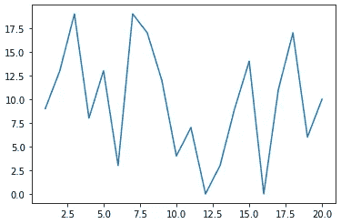
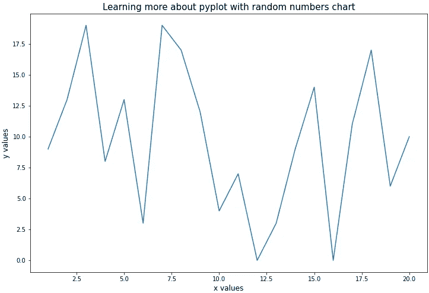
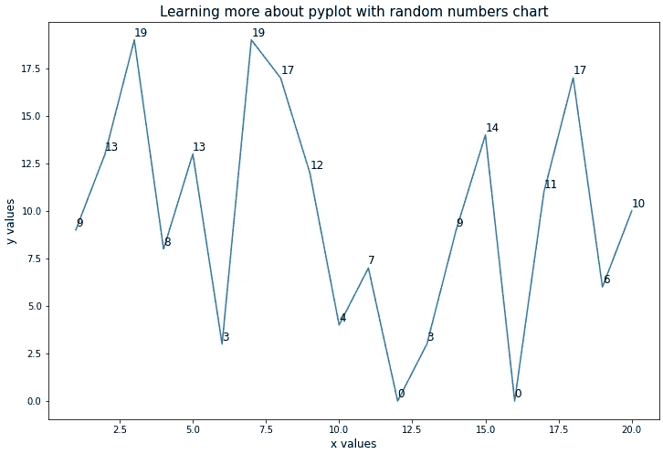
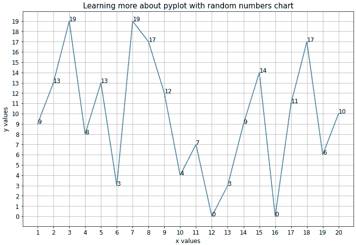

# 如何用 Matplotlib 标注图的值

> 原文：<https://towardsdatascience.com/how-to-label-the-values-plots-with-matplotlib-c9b7db0fd2e1?source=collection_archive---------1----------------------->

## 标注地块的简单指南

Matplotlib 使用起来可能有点棘手。我尤其难以在我的图上显示数据点的值。起初我认为这应该是一个简单的任务，但我发现它并不像我预期的那么简单。因此，在这篇文章中，我会解释你如何做到这一点，并且尽可能的简单易懂。

让我们从创建几个随机数据点开始。

```
import numpy as np
import matplotlib.pyplot as pltx = np.arange(1, 21)
y = np.random.randint(20, size=20)
print(x)
print(y)
>>>[1  2  3  4  5  6  7  8  9 10 11 12 13 14 15 16 17 18 19 20]
>>>[9 13 19  8 13  3 19 17 12  4  7  0  3  9 14  0 11 17  6 10]
```

创建一个从 1 到 20 的 NumPy 数组。第一个数字包含在内，最后一个数字不包含在内。

`np.random.randint(20, size=20)`生成 20 个 0 到 20 之间的随机值，(0 包含 20 不包含)。如果你自己运行代码，你会得到不同的值。

接下来，我们可以简单地绘制数据。这部分用 Matplotlib 很容易。只需调用`plot()`函数并提供你的 x 和 y 值。调用`show()`函数可视化输出图形。

```
plt.plot(x, y)
plt.show()
```



作者创作的情节

为了让它更有趣一点，让我们修改一下情节。我认为这将是一个伟大的添加一个主要标题，对坐标轴的描述，并增加大小。

```
plt.figure(figsize=(8,8))
plt.plot(x, y)
plt.xlabel("x values", size=12)
plt.ylabel("y values", size=12)
plt.title("Learning more about pyplot with random numbers chart", size=15)
plt.show()
```

可以使用`plt.figure(figsize=(12, 8))`设置地块的大小。**注意，先调用** `figure` **再调用** `plot`很重要，否则会得到不希望的结果。另外，请注意，绘图的大小是以英寸而不是像素来度量的。

轴上的标签和标题可以使用`xlabel()` `ylabel()`和`title()`简单设置。这三个函数中的 size 参数决定了标签的字体大小。

代码片段的结果如下。



作者创作的情节

我们仍然缺少数据点本身的 y 值。我们可以通过在一个循环中添加表示每个 x 坐标的 y 值的文本来引入它们。但是在这之前，我们首先需要在开头添加一行额外的代码。新添加的代码行用粗体书写。

```
**fig, ax = plt.subplots(figsize=(12,8))**
plt.plot(x, y)
plt.xlabel("x values", size=12)
plt.ylabel("y values", size=12)
plt.title("Learning more about pyplot with random numbers chart", size=15)
**for index in range(len(x)):
  ax.text(x[index], y[index], y[index], size=12)** plt.show()
```

第一行调用了`plt.subplots()`，它为我们创建了两个对象，并将它们存储在`fig`和`ax`中。`fig`对象用于修改图形，但我们不会在本文中进一步探讨。对象是一个支线剧情，我们可以用它来给剧情添加文本。

`ax.text()`允许我们在给定位置添加一个文本到绘图中。前两个参数代表文本的 x 和 y 坐标。第三个参数是文本应该具有的实际值，最后 size 参数决定了文本的字体大小。

通过循环浏览`range(len(x))`，我们创建了 20 个文本。数据中的每个 x 坐标一个。我们在下面看到上面代码片段的结果。



作者创作的情节

> 提示:如果你认为图上的值很难读取，因为它们直接在绘制线的上面，你可以简单地在`ax.text()`中的 y 位置参数上增加一点。

我认为通过增加 x 和 y 刻度的频率来匹配 x 的实际值和 y 的可能值，可以进一步提高图形的可读性。这可以通过将 x 值作为参数添加到`plt.xticks()`并将列表中的值 0 到 19 作为`plt.yticks()`的参数来实现。此外，作为情节的最后一笔，我还想添加网格线。这是通过调用如下所示的`plt.grid()`来实现的。

```
fig, ax = plt.subplots(figsize=(12,8))
plt.plot(x, y)
plt.xlabel("x values", size=12)
plt.ylabel("y values", size=12)
plt.title("Learning more about pyplot with random numbers chart", size=15)
for index in range(len(x)):  ax.text(x[index], y[index], y[index], size=12)
**plt.xticks(x, size=12)
plt.yticks([i for i in range(20)], size=12)
plt.grid()**
plt.show()
```



作者创作的情节

就是这样！现在，您知道了如何通过添加解释性标签来提高绘图的可读性。

Matplotlib 允许你用你的情节做很多事情，比我在这里提到的要多得多。在这篇文章中，我介绍了一些我一直在努力正确工作的小事情。希望你觉得有用。

感谢阅读。