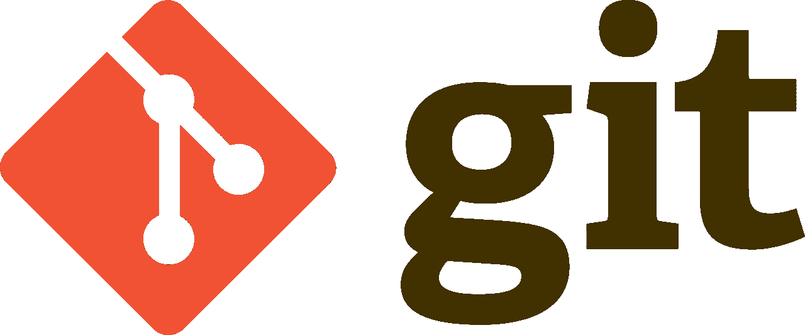
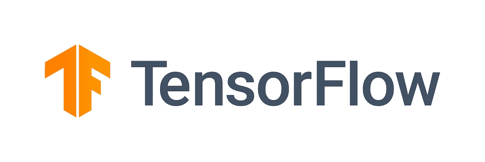

# 如何在 2022 年找到一份数据科学工作

> 原文：<https://towardsdatascience.com/how-to-land-a-data-science-job-in-2022-ebfbc506516b?source=collection_archive---------13----------------------->

## 提高数据科学职位就业能力的 7 项技能

如何在 2022 年找到一份数据科学的工作？照片由 [Unsplash](https://unsplash.com/?utm_source=unsplash&utm_medium=referral&utm_content=creditCopyText) 上的 [Prateek Katyal](https://unsplash.com/@prateekkatyal?utm_source=unsplash&utm_medium=referral&utm_content=creditCopyText) 拍摄

在本文中，我将介绍一些有助于你在 2022 年获得数据科学工作的事情。如果你满足了所有这些要求，我相信你会很快找到一份数据科学的工作。

不久前，我写了一篇类似的文章，列出了【2020 年必备的数据科学技能。我觉得我离得并不远。但是数据科学领域在不断变化，现在似乎是推出新版本的时候了。

# 但是数据科学不是已经死了吗？

我看到一些文章像病毒一样传播，说“数据科学已死”。

也许转换到数据科学的黄金时期已经过去了，但你仍然可以在 2022 年找到一份数据科学的工作。外面有很多工作，我相信进入(技术)数据工作对你的未来仍然是一个很好的选择。

最大的变化之一是现在有许多竞争的职位。数据科学职位的工作规范仍然因公司而异。

一些较新的职位头衔更多的是技术性职位:

*   **具有机器学习技能的软件工程师**
*   **机器学习工程师**
*   **ML 操作**

其他一些人正在将数据科学工作放在已经存在的位置上，例如:

*   **具有机器学习技能的数据分析师**

一些公司希望只雇佣那些精通数据工程的多才多艺的候选人，以便被考虑数据科学职位。

# 你应该什么都知道吗？

很少有人能深刻掌握所有这些话题。所以，不，你不需要知道所有这些就能找到工作。然而，如果你有时间，提高技能可以大大增加你在就业市场找到匹配的机会。

在这篇文章中，我将列出一些额外的技能，如果你还没有的话，你可以通过这些技能来训练自己。如果你想在 2022 年最大化获得数据科学工作的机会，我希望它能让你很好地理解你需要做什么。

我不包括更标准的技能，如统计学、机器学习和 Python，因为我认为它们是基本的，而且你几乎可以在任何数据科学培训中找到它们。

工作中的数据科学家。克里斯蒂娜@ wocintechchat.com 在 [Unsplash](https://unsplash.com/s/photos/software-engineer?utm_source=unsplash&utm_medium=referral&utm_content=creditCopyText) 上的照片[。](https://unsplash.com/@wocintechchat?utm_source=unsplash&utm_medium=referral&utm_content=creditCopyText)

# 1.软件工程技能

许多软件工程师已经转向数据科学专业。这增加了数据科学家掌握软件工程技能的必要性，即使你最初不是来自软件背景。

以下是一些你在申请数据科学工作时可能会被测试或质疑的技能。

## 数据结构和算法

数据结构和算法是**软件工程学位**的基础。然而，在数据科学学位中，它不一定存在，否则它可能有点多余。

数据结构和算法越来越成为数据科学家面试的技术测试的一部分。原因是越来越多的数据科学职位需要编写生产代码，并将您自己的模型发布到生产环境中。

互联网上有很多数据结构和算法的培训资源。

## 测试和编写单元测试

编写测试和单元测试曾经是开发人员和软件工程师的领域。2022 年，许多数据科学职位要求他们的候选人能够为自己的代码编写测试。

如果你还没有掌握这个，你可以**从学习** [**PyTest**](https://docs.pytest.org/en/6.2.x/) 开始，这很容易。

Pytest。来源:[https://docs.pytest.org/en/6.2.x/](https://docs.pytest.org/en/6.2.x/)

你也可以研究一下 [**测试驱动开发**](https://en.wikipedia.org/wiki/Test-driven_development) 并从现在开始使用它来提高你在这一点上的技能。

## 完美无缺

为了从事数据科学家的工作，许多公司还要求你在使用 git 时完美无瑕。该工具过去主要面向开发人员，但如今也成为许多数据科学家角色的必备工具。

你可以查阅一些资源来开始使用 git([git 简介](/all-you-need-to-know-before-starting-with-github-ada7cf62dae2)和[git 基础知识分步指南](/the-easiest-github-tutorial-ever-4a3aa0396039)，或者直接转到[高级 git](https://www.atlassian.com/git/tutorials/advanced-overview) 使用。

饭桶。来源:[http://git-scm.com/downloads/logos](http://git-scm.com/downloads/logos)

## 码头工人和集装箱

Docker 是另一种曾经被认为对数据科学家有利的技术，但它很快变得非常重要。Docker 容器允许您解决许多环境设置问题，对于任何希望在本地机器之外的任何地方使用其代码的数据科学家来说，它都是一个很好的工具。

你可以从这里的 Docker 开始。

码头工人。来源:[https://www.docker.com/company/newsroom/media-resources](https://www.docker.com/company/newsroom/media-resources)。

## 摆脱笔记本电脑环境

许多数据科学家目前正在研究笔记本电脑环境。如今，很多事情都可以在笔记本上或从笔记本上完成。但是，如果你在其他环境中没有一个坚实的环境，面试官可能会很挑剔。能够展示编写独立软件或构建 Python 包的经验对你的工作申请来说是一个巨大的附加值。

# 2.机器学习工程和 MLOps 技能

机器学习工程师的角色是数据科学家和软件工程师的结合。MLOps 是相当于 DevOps 的机器学习。

使用自动化 CI/CD 和精心设计的云架构将自己的模型投入生产的能力对于在 2022 年找到数据科学工作来说是一个真正的附加值。

## 部署

部署模型不一定很难，但这是很多数据科学家没有接触过的东西。要么他们的工作更多地停留在分析方面，要么可能他们公司中有专门的角色来做这部分工作。

我强烈建议您对部署模型所需的技能进行培训，包括架构知识、CI/CD 知识、安全性问题、模型速度/性能问题、监控等。

## API、微服务和架构

理解 API 和微服务是如何工作的是这方面的第一步。一旦您理解了如何将您的模型工件转换成服务，您就已经开始理解部署了。

像 AWS 这样的云提供商提供很好的培训和认证，可以帮助你提高这方面的技能。

## CI/CD

我建议的第二步是研究 CI/CD。一旦你理解了如何建立一个 API 并以这种方式传递你的模型的预测，将会有很多额外的工作需要去做以使它更健壮。

自动化 CI/CD 管道有助于您更好地管理部署管道。毕竟，如果您将您的模型交付到生产环境中，那么您正在为依赖它的应用程序制造风险。你必须确保一切都彻底完成。

在这些艰难的内容中加入一点动力。照片由[你好我是尼克](https://unsplash.com/@helloimnik?utm_source=unsplash&utm_medium=referral&utm_content=creditCopyText)在 [Unsplash](https://unsplash.com/?utm_source=unsplash&utm_medium=referral&utm_content=creditCopyText)

# 3.数据工程技能

数据工程是目前最受欢迎的工作之一。如果你想最大化你的就业能力，拥有数据工程技能将是你最好的选择。

随着许多公司现在拥有数据科学团队，数据质量和可访问性问题成为新的热门话题，数据湖建设和云迁移项目正在各地进行。

有大量的文章列举了数据工程技能，所以我在这里就不赘述了。我觉得[这篇文章](https://www.analyticsvidhya.com/blog/2020/12/9-must-have-skills-to-become-a-data-engineer/)给出了一个很好的列表，但是还有很多其他的列表。

# 4.使用多种编程语言

你掌握的编程语言越多，你不满足公司要求的可能性就越小。许多招聘人员只是有一个检查列表，没有任何经验的任何一个复选框会直接阻止你的申请。

您可能需要了解的一些编程语言(当然除了 Python 之外)有:

*   火花
*   斯卡拉
*   [朱丽娅](/machine-learning-in-julia-5bca700e0348)
*   锈
*   戈朗
*   [R](/is-python-faster-than-r-db06c5be5ce8)
*   斯堪的纳维亚航空公司
*   更多

不同的语言通常要求不同类型的职位。例如，Spark 和 Scala 经常被问到大数据环境中的职位，而 R 和 SAS 可能被问到更多的分析角色，而 Rust 或 Golang 则是你将编写生产代码的工作。

# 5.深度学习专业知识

在更容易的时候，只要知道如何把一个 scikit 学习管道放在一起，就可以找到一份工作。今天，这远远不够，因为招聘人员将扫描你的简历，寻找深度学习和关键词，如、 [NLP](/text-mining-for-dummies-text-classification-with-python-98e47c3a9deb) 、[声音分析](/machine-learning-on-sound-and-audio-data-3ae03bcf5095)等等。

张量流。来源:[https://www . tensor flow . org/extras/tensor flow _ brand _ guidelines . pdf](https://www.tensorflow.org/extras/tensorflow_brand_guidelines.pdf)

要想应聘很多数据科学的职位描述，掌握 **Tensorflow 和 Pytorch** 是必须的。期待接受这方面的技术测试，因为**计算机视觉**和 **NLP** 已经成为许多领域的重要用例，而几年前它们在简历上只是一个小小的加分项。

当然，这也很大程度上取决于你申请的领域。

如果你正在寻找更多关于深度学习的介绍教程，你也可以查看文章[这里](/what-is-the-difference-between-object-detection-and-image-segmentation-ee746a935cc1)或者[这里](/yolo-v5-object-detection-tutorial-2e607b9013ef)。

# 6.记得你的数学课吗

数据科学以数学为基础。拥有强大的数学背景是在数据科学领域取得成功的必备条件。

在工作面试和技术测试期间，不要惊讶于偶尔手工计算概率，或者在相对较短的时间内做代数、优化甚至更复杂的任务，而招聘人员正在观察你做什么。

如果解决数学问题不是你每天都要做的事情(很多人都是这样)，那么在参加数据科学技术面试之前练习大量的例题将是一个好主意。

# 7.成为领域专家

领域专长仍然是求职的一大优势。如果你申请的是你非常熟悉的领域的数据科学工作，你将更有可能成功。

将此作为你成为数据科学家的敲门砖是一个好主意。

布雷特·乔丹在 [Unsplash](https://unsplash.com/s/photos/follow-your-dreams?utm_source=unsplash&utm_medium=referral&utm_content=creditCopyText) 上的照片

# 结论

总之，是的，你可以在 2022 年找到一份数据科学家的工作。如果你是从零开始，或者正在进行转换，这可能需要一些工作。

如果你还在犹豫，我建议你花些时间去寻找最适合你的工作。数据科学不是工作机会的金矿:我建议只有当你真的喜欢它时才进入它。你也可以查看目前正在流行的许多其他 IT 工作的职位描述。

我希望这篇文章能给你一些启示，让你知道如何在 2022 年为数据科学工作进行培训。*感谢您的阅读，请继续关注更多数学、统计和数据科学内容！*