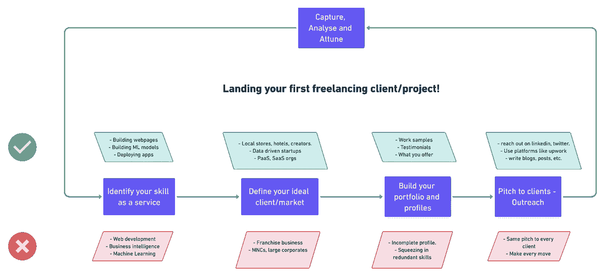

# 如何获得你的第一个自由职业客户/项目

> 原文：<https://towardsdatascience.com/how-to-land-your-first-freelancing-client-project-a0d4801b4437?source=collection_archive---------27----------------------->

## 网络和数据科学自由职业项目登陆综合指南。

自从我辞去全职数据工程师的工作，开始全职从事自由职业，已经有将近 3 年的时间了。当我忙于获得我的第一个客户或新项目时，我的职业发展出现了急剧的上升。

除了成长和金钱，我还能找到我真正感兴趣的地方。更不用说，努力实现你的想法会给你带来巨大的快乐。

关于我的职业，我经常遇到的一个问题是

> 你是如何获得你的第一个自由职业项目的？

因为每个人都知道得到第一份工作可能是最难的。这篇博文和视频(底部)只是关于建立一个策略来开始你的自由职业生涯。

## 为什么是自由职业者？

如果你有时间，谁不想建立一个副业收入？也许你想攒钱买下一辆车，或者你想休息一年。这就是自由职业的用武之地。

更不用说，你可以成为“你自己的老板”，穿着短裤在海滨别墅工作，同时，你可以赚到无限的钱。你掌控着自己的成长。

所以，给你！

# 五步迭代，直到你的第一个项目落地

正如信息图(标题图片)所示，你只需遵循这五个步骤中的每一个，直到你得到第一份工作。这里有五个步骤可以帮助你建立自由职业生涯:

1.  将您的技能确定为一项服务
2.  定义你的理想客户或市场
3.  建立您的投资组合和档案
4.  向客户推销你的服务
5.  捕捉结果/差距，分析每一步的结果，调整方法以保持增长。

# 步骤 1 —将您的技能识别为服务

简历中的技能部分简单地列出了你在技术和技巧方面的知识，但是你必须确定在现实世界中你能用这些技能做什么。

让客户明白你能为他做什么。

你的技能可能是:

*   Web 开发
*   平面设计
*   数字营销
*   数据分析

您的服务可以是:

*   构建高性能的端到端网站和 web 应用程序。
*   为网站、视频和海报创作美丽的插图和数字艺术作品。
*   帮助个人和中小企业在网上推广他们的产品和服务。
*   处理数据以发现模式并回答重要的以业务为中心的问题，从而做出明智的决策。

信息图表列出了每个步骤的注意事项。

大多数人都很难迈出第一步。他们不确定是否准备好了。我相信你永远不会准备好。开始吧！

以下是 Gumroad 创始人 Sahil Lavingia 的推文:

在本文的其余部分，我将重点关注 web 开发和数据科学服务，但是您可以将这些原则应用到您必须提供的几乎任何服务中。

**温馨提示:**

*   寻找那些从自由职业中获得成功的人。研究并复制他们的过程。
*   学会使用正确的短语——告诉他们你是做什么的，为什么你比其他人更好。

# 第二步——定义你的理想客户或市场

整篇博文基本上都试图回答**“如何获得你的第一个客户？”**

没有客户就没有自由职业，但这并不意味着你应该向任何人伸出援手或推销你的服务。这对你没有好处，反而会增加你的挫败感。

你从第一步就有了自己的定位，做一些研究，看看谁需要这种服务。

**一些客户的例子**可能包括:

*   网络开发——本地商店、健身教练、机构、酒店、创作者(现在很热门)
*   数据分析—数据驱动的初创企业/组织
*   开发 ML 模型和应用程序(DevOps)—平台即服务和软件即服务组织。

**哪些人不是理想的客户(至少对第一个客户来说):**

*   特许经营企业
*   跨国公司，为客户秘密运营的戒备森严的公司(ZS、安永、德勤等)。)

**亲提示:**

*   **寻找个人所有的网络开发企业。**
*   对于数据科学项目和机会，首先要确保你很好地掌握了你的基础知识。使用像 **codementor** 这样的平台来帮助学生完成他们的项目。

# 第三步——建立你的投资组合和简介

在确定你的定位和目标客户后，是时候建立我们的商店了，在这种情况下，可以是你的投资组合网站(强烈推荐)或 LinkedIn、Upwork、Toptal、AngelList 等平台上的个人资料。

## **作品集网站**

这里要注意的一件重要事情是，你希望有人信任你的业务。

你如何让别人信任你？

你可以从讲述你的职业故事开始。投资组合网站就是这样做的一种方式。如果你还没有故事要讲，那就为自己创作一个故事，也就是说，用网上常用的主题建立一个样本网站，或者你可以提议为一个潜在的客户免费做一个项目。

大多数人会把投资组合网站误认为是在线简历。

投资组合网站不适合你，而是适合你想要锁定的客户。它应该通过以下方式展示您的服务:

*   **工作样本—** 您创建的网站/应用、报告、会议演讲(如有)等。如果你没有任何样本，创建几个！开发仪表板/网站，托管它们，并展示你可以交付高质量的工作。
*   **推荐信/推荐信—** 让你以前的同事/老板/客户给你写一封推荐信。
    **提示:**如果你以前没有在任何地方工作过，为潜在客户做 1-2 个免费项目，然后请他们写一份推荐信。我已经做了 2-3 个免费的项目，有人把我介绍给另一方。
*   **写博客—** 这对我来说很有效。这是建立你信誉的一种方式。博客应该包含相关和真实的内容，通过这些内容，客户可以了解他们的业务。**从赠送开始！**

博客帖子的创意示例:

*   如何通过网站接触到更广泛的受众
*   您的仪表板/报告应该包含什么类型的业务指标

## 轮廓

除了拥有一个网站，你还需要在 LinkedIn 这样的专业平台上社交，寻找潜在的客户，工作想法，发布更新，宣传自己。

开发作品集网站的原则也适用于社交媒体档案。

一份好的个人资料可以增加你获得机会的几率，原因有很多:

*   这表明你对待工作有多真诚。
*   它可以显示你的工作样本和技能的熟练程度，以提供你的利基服务。
*   如果你有一位真正的同事/合伙人/前老板写的推荐信或推荐信，这会增加你的可信度。

## 自由职业平台

[向上工作轮廓](https://www.upwork.com/freelancers/~015a6822a75be60fd8?viewMode=1&s=1110580759050571776)

除了 LinkedIn，还有许多平台拥有完整的自由职业生态系统，客户可以发布他们的需求，自由职业者可以竞标这项工作。

寻找自由职业项目/工作的几个主要平台包括:

*   **向上工作**
*   **顶部总计**
*   **AngelList(针对初创公司的工作)**

那么，在这些平台上建立自由职业的成功秘诀是什么呢？

我要说的是，你必须正确理解一份档案的不止一个方面，而是多个方面。您的成功依赖于以下几点:

*   您对平台上列出的技能的熟练程度。
*   你的个人资料整理得有多好。
*   你对这份工作的提议。它告诉客户你有多适合广告上的工作。
*   最后，运气！如果你把前三个方面做对了，它的作用就很小，也很少。

**这里有一些建立有吸引力和真实的个人资料的建议**

*   回顾你有兴趣申请的项目。记下这些客户用来描述他们需求的关键词和技能。将这些技能(优势)添加到您的个人资料中，可以将您与相关项目联系起来。列出最多 10 项技能。
*   上传一张专业的图片和一份简短的简历，描述你的专长/服务。
*   突出你作品集里最好的作品。
*   如果你有的话，列出你的证书。为您的个人资料增加权重。
*   与你的技能保持一致，完成个人资料的所有部分，简洁明了，并链接校对每一部分。

# 步骤 4 —向客户推销(外展)

是时候进入正题了，销售符合客户需求和预算的服务的人赢得了机会。

但首先，你需要让客户向你求婚。这是你需要提高知名度和拓展力的地方。

有许多方法可以做到这一点:

*   在 LinkedIn 这样的平台上接触客户——这正是我的优势所在！
*   使用自由职业平台——up work(一般)、Toptal(工程师)、codementor(如果你是专家)和 AngelList。
*   如果你想领先一步，使用 [Google Adwords](https://ads.google.com/intl/en_in/home/) (为你的服务做广告)或创建一个脸书小组，在你的领域、你的实际位置(城市/州)等地方销售服务。

**我的方法(不一定对你的小众有利！):**

*   我做了大量的研究，寻找与我的定位相匹配的组织。我主要用 [LinkedIn](https://www.linkedin.com/in/tyagiharshit/) ， [Twitter](https://twitter.com/tyagi_harshit24) ，谷歌搜索(浏览)也是一样。
*   我已经**根据入围公司的领域(金融科技、医疗保健、教育科技)对它们进行了分类，并创建了一个**模板** **消息**(类似于一封求职信)，以配合他们正在进行的项目以及我自己的想法。**
*   我曾经**在每个领域发送我的作品样本**，如果没有任何东西可以展示，我会在那个领域开始一个新项目，并向他们发送我的 GitHub repo，告诉他们我在做什么。

2016 年，我通过 Udacity 找到了第一个自由职业客户。因为我是他们的校友之一，他们推出了一个新平台。我的提议符合客户的需求，我被录用了。我认为自己在这方面是幸运的。

从那以后就变得容易了:

# 步骤 5 —捕捉、分析和协调

你可能会在一天、一个月或六个月内完成你的第一个项目，这个过程中不可或缺的一部分就是不断改进。

你可能会在第一次尝试中失败，但利用这次失败来做得更好。

**捕获:**

*   你联系的项目/客户的数量。有多少人回应、感兴趣、拒绝或继续。
*   为什么你的提议被拒绝了？向客户征求意见。
*   在你所处的领域取得成功的人，他们在做什么不同的事情？
*   你所在的领域有什么新东西？大家都是怎么操作的？

**分析:**

*   项目需求和您的投资组合之间的差距——看看缺少了什么。
*   了解你获得的每个数据点，找出你有更多机会转化的客户类型。
*   创建一个单独的客户类别，你必须在他们的需求和你的专业知识之间架起一座桥梁。

**点化:**

*   开始从事新的项目来获得新的技能或者掌握你已经掌握的技能。
*   重组、润色你的个人资料，使之符合客户的需求。
*   重写建议书，强调他们的需求和您的服务，以及您的工作样本和数字/统计数据(如果适用)。

如果你每天花 2 个小时写建议书和向客户推销，那么至少花 3-4 个小时来完善你的技能。只有当你每天都有好奇心去学习和建立的时候，你的策略才会奏效。

坚持这些原则，你将会得到你的第一个自由职业客户。

你还在等什么？我们开始吧！

你也可以在我的 YouTube 频道上观看这个话题的视频:

如果您想分享您的客户登陆策略/过程，请随时回复本博客或评论视频。

你可以在[推特](https://twitter.com/tyagi_harshit24)或者 [LinkedIn](https://harshit-tyagi.medium.com/) 上和我联系！