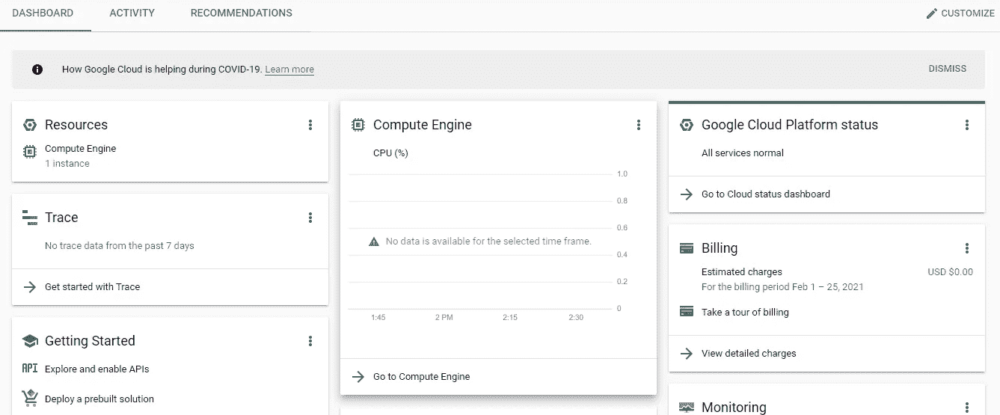
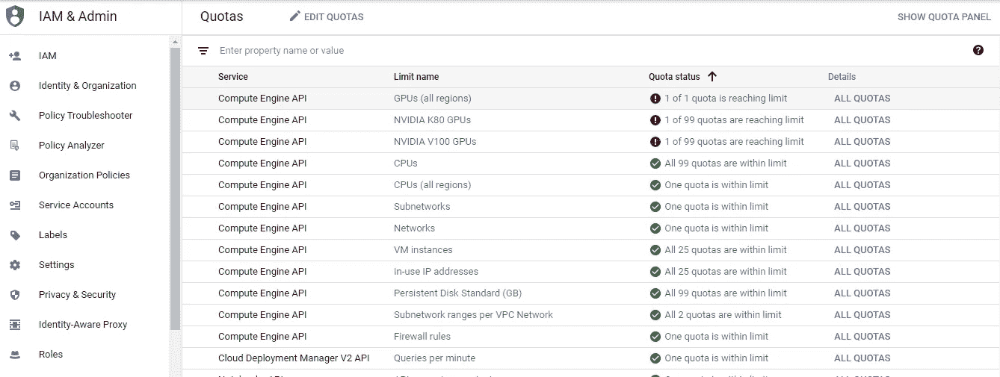
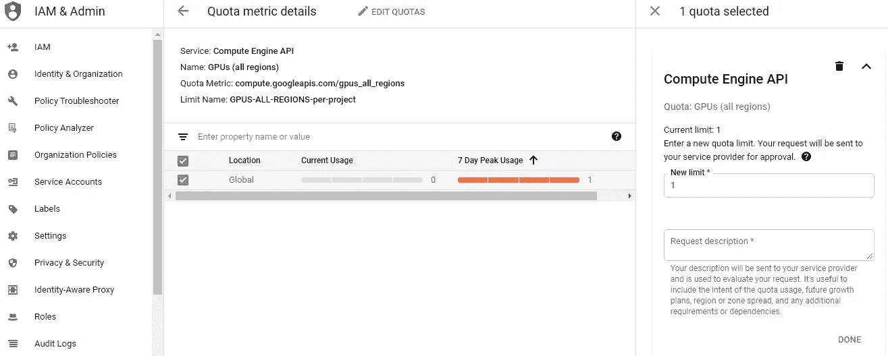
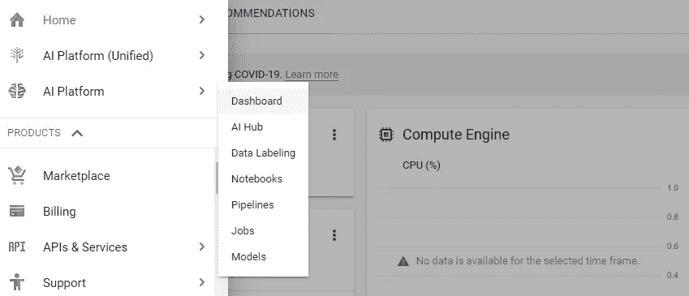
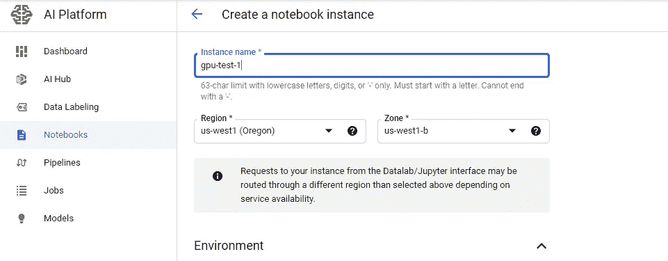
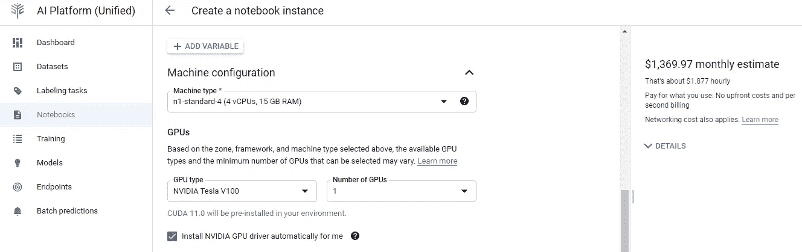
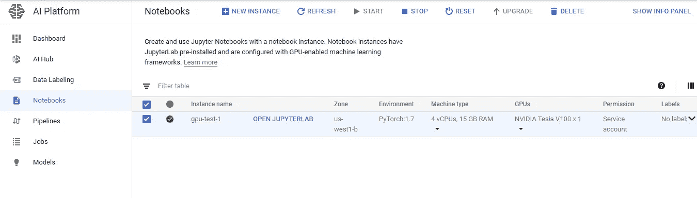

# 如何在 Google Cloud 上快速启动 GPU 实例

> 原文：<https://towardsdatascience.com/how-to-launch-a-gpu-instance-on-google-cloud-fast-4fb0be7b2a3f?source=collection_archive---------7----------------------->

## 如何在 Google Cloud 上非常快速的启动一个带有 Jupyter 笔记本界面的 GPU 实例？

汤姆·巴瑞特在 [Unsplash](https://unsplash.com?utm_source=medium&utm_medium=referral) 上的照片

在本文中，我将向您展示在 Google Cloud 上启动 GPU 实例的最快和最简单的方法。具体来说，我将演示如何在 Google Cloud 上启动一个连接到 GPU 的 Jupyter 笔记本界面。

使用和访问 GPU 进行深度学习项目是必不可少的。深度学习模型只有在 GPU 上训练，才能在合理的时间内训练出来。然而，GPU 很难获得，拥有一个也很昂贵，所以大多数人都指望基于云的 GPU 服务来训练他们的模型。对于许多初学者来说，使用 GPU 的第一个地方是 google Colab，这是一个免费的类似 Jupyter 笔记本的服务，提供免费的 Nvidia Tesla K80 GPUs 供使用。然而，Google Colab 的问题是它在免费帐户中的限制:你最多只能训练你的模型 12 个小时，并且你只能使用有限的内存。升级到 Google Colab premium 并没有提供更多的优势，除了训练模型的时间更长，训练模型的内存更多。为了获得更大更快的 GPU 和更多的内存和计算能力，人们经常使用基于云的 GPU 服务，如谷歌云、微软 Azure 和亚马逊网络服务。

谷歌云是使用 GPU 训练模型的一个很好的简单方法。在这篇文章中，我将解释如何快速建立一个 google cloud 帐户，并使用它提供的 GPU 服务。请注意，我是在 2021 年 2 月写这篇文章的，因此 Google Cloud 的早期/未来版本可能会略有不同，不一定与本文中介绍的细节一致。

第一步是创建一个谷歌云账户。你可以使用你的 Gmail/google 账户来完成这项工作。一旦你建立了你的账户，你应该像这样。

确保您激活您的帐户成为付费帐户。即使他们提供 300 美元的免费信用，你仍然必须升级你的帐户成为付费帐户，因为这是你被允许使用 GPU 的唯一方式。即使你将账户升级为付费账户，你仍然可以在付费前使用谷歌提供的 300 美元免费信用。

在您启动 GPU 实例之前，您需要确保您的配额设置为 1 或您想要使用的任意数量的 GPU。配额实际上是对您可以使用的 GPU 数量的限制。

要增加您的配额，请在搜索栏中搜索配额，然后单击所有配额。一旦你这样做了，你的屏幕应该看起来像这样。

现在，使用 filter 按钮，屏幕左上角有三个横条的那个，来过滤结果。首先，选择“限制名称”，然后选择“GPU(所有区域)”。您应该有一个这样的屏幕:

单击“所有配额”按钮，您应该会看到一个显示全球配额的页面。选择此项，然后选择编辑配额。您应该有一个这样的屏幕:

将 GPU 限制更改为您想要的 GPU 数量。我一般只需要一个 GPU。添加简短描述，并提交您的请求。你增加配额的请求通常会在几个小时内或者最多 1-2 天内得到答复。

需要记住的重要一点是你的项目需要的 GPU 内存量。如果您的模型或输入非常大，那么您可能会使用大量的 GPU 内存，在创建实例时增加 RAM 并不能解决这个问题。根据我的经验，有一种方法可以增加你的 GPU 内存:增加你使用的 GPU 数量。[这个](https://cloud.google.com/compute/docs/gpus)图表显示了每种类型的 GPU 有多少 GPU 内存。这是一个固定的数字，不能改变。不增加你的 GPU 内存将导致 CUDA 内存不足的错误，所以如果这个问题适用于你，你一定要解决它。

如果您的配额增加请求获得批准，您将收到一封电子邮件通知您。现在，你可以启动 Jupyter 笔记本了。

回到你的仪表板。选择导航菜单，并在导航菜单上选择人工智能平台->笔记本电脑。

完成后，选择 Create New Instance。您可以选择使用 Google 预先制作的笔记本，或者创建一个自定义实例。通常，我只是做一个定制的笔记本，因为它允许更多的灵活性。

您可以随意调用您的实例，并且可以选择您想要的任何区域。但是，不同的地区可能有不同的可用 GPU，因此请确保选择包含您要使用的 GPU 的地区。

现在，您可以定制您想要使用的任何环境/库(Pytorch/Tensorflow)、您想要的 RAM、您想要使用的 GPU 以及您想要使用的 GPU 数量。请确保该数字不大于您指定的配额。您将在边上看到您选择的相应 GPU 的成本。我个人喜欢使用 Nvidia V100，因为它是用于深度学习的最好的 GPU 之一，所以我的成本是每小时 1.877 美元。

选择创建实例。您现在有一个工作笔记本可以使用了！为了启动实例，请选择要使用的笔记本并启动。

从现在开始，您的 Jupyter 笔记本应该已经启动并开始工作了。您可以定期上传、下载和保存文件。

当您使用完 GPU 时，请确保停止使用，否则，您将继续被收费。

我希望你觉得这篇文章很容易理解，并学到了一些新东西。如果你有任何问题，请在评论中提出。