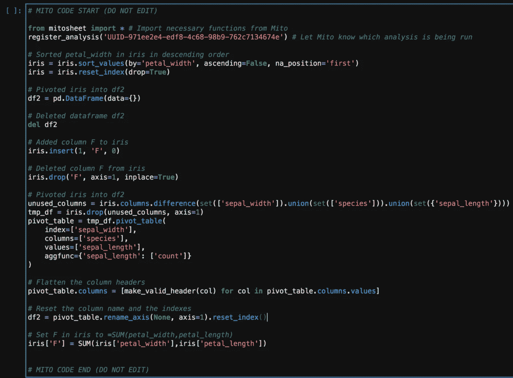
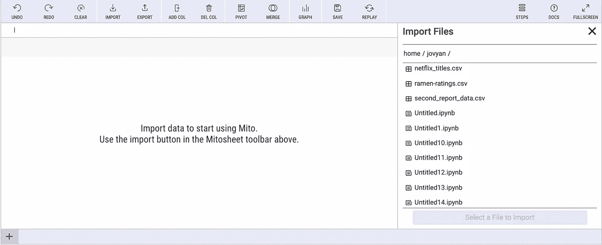
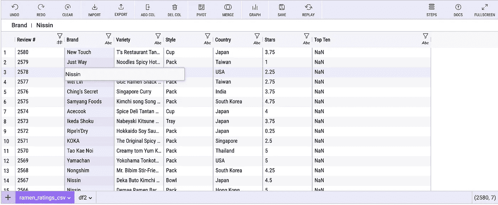
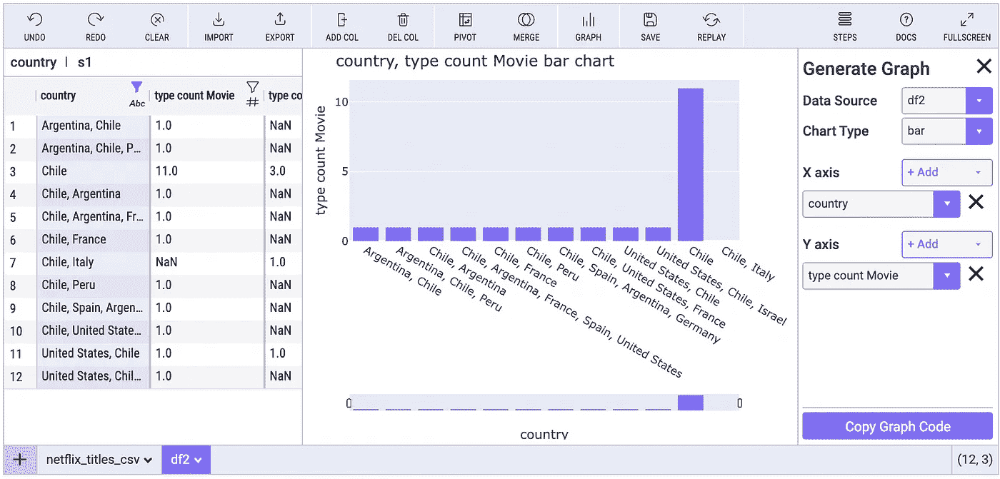

# 如何用 Python 交互学习数据科学？

> 原文：<https://towardsdatascience.com/how-to-learn-data-science-interactively-with-python-b2528e403aee?source=collection_archive---------5----------------------->

## 当您进行分析时，JupyterLab 扩展会动态生成代码。


杰米·芬恩在 [Unsplash](https://unsplash.com?utm_source=medium&utm_medium=referral) 上的照片

随着人们对数据素养需求的增长，Python 也越来越受欢迎。不管你是博士数据科学家还是刚刚开始学习，Python 的一个缺点是语法需要很长时间才能正确。人们经常花费大量的分析时间去堆栈溢出或谷歌查找正确的代码。

> 有没有更好的办法？

如果你错过了我以前写的关于米托的文章，看看这里的[](https://romanorac.medium.com/list/mito-a-spreadsheet-that-generates-python-1df29fc67dff)****。****

# **当您进行分析时，米托会动态生成代码**

****

**照片由[亚历山大·奈特](https://unsplash.com/@agk42?utm_source=medium&utm_medium=referral)在 [Unsplash](https://unsplash.com?utm_source=medium&utm_medium=referral) 上拍摄**

**米托是一个 JupyterLab 扩展，可以轻松地使用 Excel 来探索和转换数据集。**

**米托通过自动代码生成大大减少了“搜索正确代码片段”的时间。**

**使用米托，您可以将电子表格接口调用到您的 Python 环境中，并且您所做的每次编辑都会在下面的代码单元格中生成等效的 Python。**

****

**每个点击操作都会动态生成一个代码片段(作者可视化)**

**大多数 Python 用户知道他们想要如何操作他们的数据，无论是:**

*   **将数据集合并在一起**
*   **填充缺失值**
*   **创建图表**
*   **添加列等。**

**米托允许用户不需要知道完美的代码就能完成这样的任务。用户在米托完成操作，米托会为你吐出代码。**

****

**米托在运行中自动生成代码(图片由作者提供)**

# **安装米托**

**可以用这两个命令安装米托:**

```
python -m pip install mitoinstaller
python -m mitoinstaller install
```

**打开 Jupyter 笔记本后，渲染一个有丝分裂表:**

```
import mitosheet
mitosheet.sheet()
```

**以下是完整的[安装说明。](https://docs.trymito.io/getting-started/installing-mito)**

## **米托支持熊猫数据框架**

**要将数据输入米托，您可以将数据帧作为参数传入，**

```
mitosheet.sheet(df)
```

**或者，您可以使用导入选项从本地文件中选择数据集。**

****

**将数据集导入米托(图片由作者提供)**

# **米托功能**

****

**在 [Unsplash](https://unsplash.com?utm_source=medium&utm_medium=referral) 上由 [Patrick](https://unsplash.com/@pf91_photography?utm_source=medium&utm_medium=referral) 拍摄的照片**

**米托的功能侧重于数据清理、数据处理/探索和数据可视化。米托的数据清理功能包括:**

*   **填充缺失值**
*   **删除行**
*   **更改列数据类型**
*   **编辑特定值**
*   **删除列**
*   **重命名列**
*   **更多**

**米托利用 Excel 的易用性，将这些特性应用于 Python 和 pandas 数据框架。**

**例如，如果您需要更改数据帧中的特定值，只需直接在 Mitosheet 中编辑该值。**

****

**米托电子表格中数据帧值的交互式编辑(图片由作者提供)**

**此操作生成的代码如下所示:**

```
ramen_ratings_csv.at[10, 'type'] = "Nissin"
```

## **探索性数据分析**

****

**由[弗兰基·查马基](https://unsplash.com/@franki?utm_source=medium&utm_medium=referral)在 [Unsplash](https://unsplash.com?utm_source=medium&utm_medium=referral) 上拍摄的照片**

**数据探索和操作是米托的一些最突出的特点。其中包括:**

*   **连接/合并数据集**
*   **创建数据透视表**
*   **过滤数据集**
*   **排序列**
*   **查看汇总统计数据**
*   **更多**

****

**用米托创建数据透视表(图片由作者提供)**

## **形象化**

**米托还集成了 [Plotly](https://plotly.com/graphing-libraries/) ，这是一个允许交互式图表的开源图形库。Plotly 图表允许放大可视化部分、导出为 PNG 等功能。**

**米托允许用户不用写代码就能生成这些图表。可视化配置完成后，用户可以通过单击“复制图形代码”按钮导出等效代码。**

****

**生成的代码如下所示:**

```
# Import plotly and create a figure
import plotly.graph_objects as go
fig = go.Figure()# Add the bar chart traces to the graph
for column_header in ['country']:
    fig.add_trace(
        go.Bar( 
            x=df2[column_header],
            y=df2['type count Movie'],
            name=column_header
        )
    )# Update the title and stacking mode of the graph
# See Plotly documentation for customizations: [https://plotly.com/python/reference/bar/](https://plotly.com/python/reference/bar/)
fig.update_layout(
    xaxis_title='country',
    yaxis_title='type count Movie',
    title='country, type count Movie bar chart',
    barmode='group',
)
fig.show(renderer="iframe")
```

# **结论**

****

**Jason Blackeye 在 [Unsplash](https://unsplash.com?utm_source=medium&utm_medium=referral) 上拍摄的照片**

**米托是一个强大的 Jupyter 实验室扩展，用于探索性数据分析和快速生成 Python 代码。它的局限性在于它还没有涵盖所有的数据科学功能。米托仍然需要添加更全面的可视化选项，以及更多的统计和建模功能，除非他们想保持探索性的数据工具。但这是一个值得尝试的扩展。**

# **在你走之前**

***如果你喜欢看这些故事，为什么不成为* [***中等付费会员***](https://romanorac.medium.com/membership) *？每月 5 美元，你可以无限制地阅读 10000 个故事和作家。**[***如果你用我的链接***](https://romanorac.medium.com/membership)**注册，我会赚一小笔佣金。*****

********

****由[凯利·西克玛](https://unsplash.com/@kellysikkema?utm_source=medium&utm_medium=referral)在 [Unsplash](https://unsplash.com?utm_source=medium&utm_medium=referral) 上拍摄的照片****