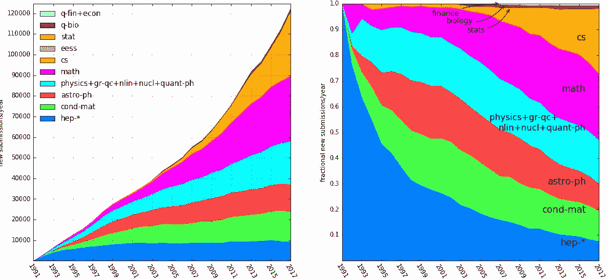
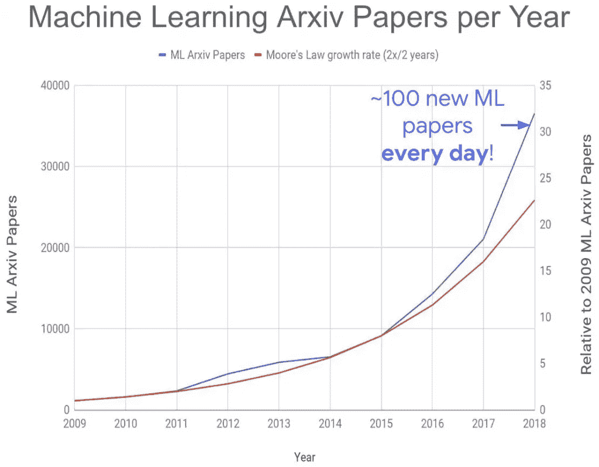

# 如何通过看论文学习深度学习

> 原文：<https://towardsdatascience.com/how-to-learn-deep-learning-by-reading-papers-c51b6025f226?source=collection_archive---------19----------------------->

## 创建一个系统，以便与深度学习研究保持同步

卡斯帕·卡米尔·鲁宾在 [Unsplash](https://unsplash.com?utm_source=medium&utm_medium=referral) 上的照片

## ⚠️读了我在⚠️博客中的[原帖](https://anebz.eu/learn-deep-learning-reading-papers)

深度学习发展如此之快，以至于跟上的唯一方法是直接从发布这些新发现的人那里阅读。如果你是一个技术人员，想在 2021 年了解深度学习，**你需要阅读论文。**

正规教育只能让你到此为止。不幸的是，一般来说，大学在将新材料纳入课程方面进展缓慢，直到几年前，它们才开始教授深度学习。这是欧洲的情况，我承认在美国可能会有所不同。

## 大学深度学习

在 AI 和深度学习的花哨名字下，大多数课程在短短一个学期的时间内挤压了经典的机器学习网络、神经网络、CNN、RNNs、LSTMs 和汽车线路检测等应用。

如果这是你第一次接触机器学习，在课程结束时，你只会知道网络的一般概念，以及一些作业的代码片段。**一个学期学不了 ML。**

而且因为教材太新，知道的人又太少，大部分课程设计很差，用花哨的名字吸引人，却只教基本的东西。除非你上了一个有完整的、专门的 ML 课程的大学，**否则你不能指望光靠大学来学习深度学习。**

## 书本上的深度学习

下一个选择是书籍，由人工智能研究人员编写。Goodfellow 和其他知名人工智能研究人员的深度学习书籍是一本非常全面的基础知识书籍。你可以免费在线阅读个别章节，也可以付费阅读整本书。

书籍的问题在于，由于它们需要花费大量的时间来制作，而且这个领域发展如此之快，到它出版的时候，有些东西可能已经过时了。你可以用书来获得基础知识，但是如果你不想让你的知识过时，你需要跟上当前的研究。

## 在线课程中的深度学习

在 Coursera、EdX 和许多其他平台上有无数的机器学习和深度学习在线课程。与书籍一样，在线课程需要大量时间来录制、编辑和发布视频和内容。你可以用它们来夯实你的知识基础，也许还可以用来练习编码，但我 2018 年在 Coursera 上做的[深度学习认证](https://www.coursera.org/specializations/deep-learning)已经 3 年没变了，这个领域肯定变了。

## 利用大学视频进行深度学习

这当然是一个富有成效的方法。许多美国大学喜欢在网上发布他们的讲座，其中一些还提供他们的作业。这些大学是唯一提供深度学习方面的最新教育的大学，以结构化的形式提供，并且拥有知道自己在说什么的人。例如，密歇根州的[计算机视觉深度学习](https://www.youtube.com/playlist?list=PL5-TkQAfAZFbzxjBHtzdVCWE0Zbhomg7r)就非常受欢迎。斯坦福也在学期结束后发表了他们的一些讲座，所以请留意他们，因为他们是最新的。

它们并不完全是最新的，因为课程也需要准备时间。等到讲师开始准备材料，直到学期开始和结束，一整年可能已经过去了。在那一年，许多新的东西将会出版。尽管如此，在观看视频前一年了解深度学习的具体领域是一个非常好的方法，如计算机视觉、自然语言处理、翻译、演讲或任何你感兴趣的东西。最后一年，你必须阅读论文。

## 用论文进行深度学习

我建议你使用结构化的方法，比如我之前提到的方法，来构建你的深度学习知识的坚实基础。一旦你学会了深度学习的一般概念，我猜你已经做到了 2016 年左右。如果你看过美国大学的视频，可能要到 2018 年。我假设你已经了解了 CNN，RNNs/lstm，一些计算机视觉和 NLP。

如果你想了解新的术语，如变形金刚、BERT、预训练模型、迁移学习、偏见、人工智能中的伦理、零短期学习、神经翻译、GANs、强化学习、多模态模型和许多其他术语，你必须求助于论文，因为这些术语还没有出现在在线课程、书籍和大学讲座中。

# 阅读报纸

arXiv 是一个论文档案库，深度学习研究人员在这里上传他们的论文。arXiv 中的论文数量逐年稳步增长。一般来说，这些领域停滞不前或略有增长，但数学和计算机科学(cs)却出现了爆炸式增长。这些是机器学习或深度学习的典型领域。

基于类别的 arXiv 累积论文

在训练深度神经网络成为可能之前，机器学习是数学的一个分支，在那之后，它被称为深度学习。2013 年左右，计算机视觉在 ImageNet 上度过了黄金时代，2015 年，NLP 在 LSTMs 上开始了自己的时代，并且随着近年来的进步，变形金刚，预训练模型和其他关于数据集和偏见的更隐藏的研究，它仍然保持强劲。

截至 2018 年，每天约有 100 篇新的 ML 论文，远高于摩尔定律，该定律表明该数量每两年翻一倍。变压器模型是在 2018 年推出的，这是一个大繁荣，所以我估计新 Arxiv 论文的数量要么增加了，要么至少保持不变。

> 值得注意的是，Arxiv 论文只是预先发表的论文，其中一些会在会议和期刊上发表，但大多数不会。但很多未发表的论文价值很高，值得考虑。

每年 ML arXiv 论文的累计数量(arXiv)

具体看机器学习，*发表数量*在加速增长。我很想写下*研究*正在加速，但不幸的是，发表的数量与该领域的进展并不相关。

如果你在过去的几年里关注了关于 ML 的出版物，你会注意到越来越多的论文被发表。对于**如何从更具体的事情中分离出相关的事情**，你可能会感到不知所措。如果你不在学术界，跟踪研究不是你的工作，这将会更加困难。

深度学习的领导者之一 Andrej Karpathy 最近[谈到](https://twitter.com/karpathy/status/1345825991600480257)跟上深度学习研究有多困难，因为有太多的论文。

我没有完美的方法，但在这篇文章中，我想分享我如何跟上深度学习和我感兴趣的子领域的相关论文:NLP，特别是讽刺检测和一些计算机视觉。

# 1.过滤相关文件

任何试图跟上当前研究的人肯定会问自己:

> 有这么多论文。
> 
> 我读哪些？
> 
> 我如何找到重要的文件？

在如此高的新论文率下，我们可以忘记手动检查和过滤。可惜的是 [arXiv](https://arxiv.org/) 没有任何排名系统，所以直接去页面很难找到感兴趣的论文。我将详细说明我获得潜在论文列表的来源。

## 1.1.推特

我有一个深度学习人员的名单，他们定期发布他们发现相关的新论文的链接。通过跟踪不同的研究领域，你将在每个领域获得大量有趣的论文。我关注的一些人是:

*   [谷歌人工智能](https://twitter.com/GoogleAI)发布谷歌在深度学习所有领域所做的研究，通常是在 arXiv 之外。可以包括计算机视觉，NLP，强化学习，GANs。
*   一般 ML/DL 研究人员:[萨拉胡克，](https://twitter.com/sarahookr)哈德曼鲁，奥马萨罗
*   NLP 研究人员:[阿凯茨·祖比亚加，](https://twitter.com/arkaitz) [贾斯米恩·巴斯廷斯，](https://twitter.com/BastingsJasmijn) [雷切尔·塔特曼](https://twitter.com/rctatman)，[米克尔·阿特塞](https://twitter.com/artetxem)
*   计算机视觉:[安德烈·卡帕西](https://twitter.com/karpathy)

这些人中的许多人会从其他人那里转发，所以你可以通过他们找到其他来源。我想特别提到 hardmaru 和 omarsar0，他们会定期发布一篇有趣论文和一个简短摘要的链接，以及许多学习 deepl 收入概念的资源。还有一点要提一下 Rachael Tatman，她定期举行论文阅读会，在阅读论文的同时，她还解释了许多概念。

如果有你感兴趣的深度学习的特定领域，你可以在 Twitter 上搜索研究人员或从业者，你会有规律的新内容为你涌入。

## 1.2. [ArXiv 理智保护者](http://www.arxiv-sanity.com/toptwtr)网页

ArXiv sanity preserver 是 Karpathy 建立的一个网站，目的是通过过滤相关论文来保持理智。你可以根据不同的标准进行排名:最近，最近热门，热门宣传(转发次数)，如果你建立一个帐户来保存你的偏好，还有其他可用的功能。

我个人喜欢**热门炒作**部分，在那里你可以看到过去一天、一周或一个月在 Twitter 上被提及最多的论文。想法是相关的或有影响力的论文将被传阅和讨论。

例如，在撰写本文时，BERT(2018 年出版)在 Twitter 上的参与度很高，位居炒作榜榜首。我们可以看到那是一篇重要的论文。如果你在列表中看到你感兴趣领域的 2-3 年前的论文，我当然会看一看。

尽管这个网站很有用，Karpathy 自己也说这个网站过滤的相关论文数量太多，跟不上，所以更多的过滤可能是必要的。

## 1.3.[论文与代码](https://paperswithcode.com/)网页

这是你可以找到趋势研究的另一种方式，在这种情况下，本网站上的所有论文都提供了论文的代码，如果你想复制它或进行更深入的研究，这真的很有用。

你可以找到一般的趋势论文，或者按章节组织:计算机视觉、NLP、医学、演讲等。还可以通过深度学习模型中使用的方法进行浏览。

## 1.4.[棒极了](https://github.com/sindresorhus/awesome) Github 仓库

在 Github 中，*牛逼的*资源库是资源的精选列表，你可以找到几乎每个主题的信息。数据科学、机器学习和深度学习都有自己的*牛逼的*仓库，里面有代码、教程、书籍和论文。[在这里](https://github.com/terryum/awesome-deep-learning-papers)你可以找到深度学习论文的精选列表，尽管它已经几年没有更新了。

对于深度学习子领域的更具体列表，您可以搜索“github awesome computer vision medical ”,例如针对您的特定用例。

## 1.5.本人[论文列表](https://github.com/anebz/papers):)

这有点自我推销的意思，但我也有自己的相关论文列表，按主题分开，按时间顺序排列，用标签标注。例如，您可以找到一个用于讽刺检测的 NLP 数据集，您可以通过查看标签#datasets 和#讥讽检测来找到它。我主要收集 NLP 的论文，但不是全部，我包括许多旧的，基本的论文，它们是当前研究的基础。

> 如果你觉得有趣，一定要启动资源库:)

## 1.6.但是，如果我刚刚开始，这些论文太难了怎么办？

这是一个现实问题。如果你从未读过一篇研究论文，试着去读任何一篇当前的论文，你很可能几乎什么都不懂。这是因为**研究是累积的，**每篇论文都引用了许多更早的论文，而这些论文又是基于以前的论文。

## 我的 NLP 研究之旅

当我开始阅读 NLP 论文时，在介绍中作者提到他们正在使用一些人介绍的一些架构。我对它不熟悉，所以我找到了报纸并开始阅读。这个架构引用了一些我也不知道的东西，所以我查了一下，并开始阅读另一篇论文。

> 我想读一篇论文，结果我有一叠 15 篇论文，这些论文反复引用了其他论文。

所以我的建议是，不要因为不理解论文中提到的大部分概念而感到难过。它可能会被引用，所以先找到那篇论文并试着理解它。

你将不得不递归地回到基础论文之前，但是一旦你这样做并开始理解基础知识，你将构建你的知识模块，并对你阅读的论文有很强的理解。

根据您之前的知识，这可能需要一些时间。但是如果你想阅读和理解论文，你需要理解参考文献。

此外，这个令人惊叹的[深度学习论文路线图存储库](https://github.com/floodsung/Deep-Learning-Papers-Reading-Roadmap)包含按时间顺序排列的论文，从更基础、更通用到更具体。你也可以用这个来指导你的学习。

# 2.组织纸质阅读

如果你遵循了第一部分的步骤，你的列表中会有很多论文。阅读论文是一项需要集中注意力至少一个小时的活动，所以除非你是一名学者，可以每天阅读论文，否则你必须在你的时间表中找出时间来阅读它们。

你可以尝试不同的策略，对我来说最有效的一个是在工作日下班后每周阅读 3 篇论文。在前一个星期天，我会选择接下来要读哪三本书，并在日历上分配时间。有时候会有其他事情发生，但是这个系统对我来说非常好。

# 3.看报纸

你有你想要阅读的论文列表，从基础论文到最新的，或者从我提到的前几个资源。我建议你一次只关注一个话题。如果你对演讲感兴趣，在转向另一个子领域之前，把你的时间集中在演讲上，直到你对自己的知识有信心为止。

但是一旦你选择了你想读的报纸，实际上该怎么做呢？

## 2.1.模拟与数字

这是个人偏好，有些人喜欢在他们的电脑上阅读 pdf，而其他人喜欢打印出来并在纸上做笔记。

## 2.2.先弄清楚论文的大意

在你开始阅读细节之前，先了解一下这篇文章的大意。是一个数据集，一个模型，一个系统？它基于什么，一般来说是如何工作的？

如果你明白这一点，那么你就可以深入研究方法论。否则我建议先看参考文献。

## 2.3.记笔记

除非你有惊人的记忆力，否则你会忘记很多你读过的东西，花这么多时间在上面是浪费时间。所以我建议你像我在我的[论文库](https://github.com/anebz/papers)那样保存你的学习成果。

如果你喜欢把笔记保存在笔记本里，那很好，只要确保它们易于搜索，并且当一篇论文引用另一篇时，你可以快速地从一篇跳到另一篇。

无论你选择哪种媒介，我认为把你理解的东西记下来并保存在某个地方是一个非常好的主意。随意复制[我的存储库](https://github.com/anebz/papers)的模板，制作你自己的列表。

# 4.跟上新的报纸

看论文是一项永无止境的任务，那么如何跟上新论文呢？

我在 Twitter 上关注许多研究人员，所以如果他们谈论一篇论文，我感兴趣，我就会把它添加到我的列表中。然后，我每周日都会提醒自己查看 arXiv sanity preserver 和带代码的论文，如果有我想看的论文的话。如果是这样，我会将它们添加到列表中。最后，我分配了三篇论文在下周阅读。

# 结论

深度学习的发展速度越来越快，尽管不可避免地会错过一些东西，但我希望在我的工作领域的研究方面保持一定的更新，我知道很多人也是如此。

我希望这篇文章帮助你创建了一个系统来跟上这种混乱的新论文速度，随时在 Github 上启动我的回购来查看我阅读的新论文的更新，[在 Twitter 上关注我](https://twitter.com/aberasategi)或者给我发消息，如果你有任何问题:)

感谢阅读！