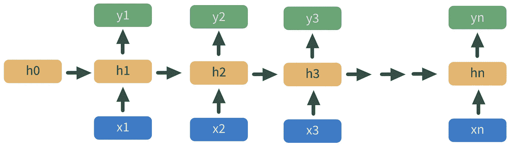
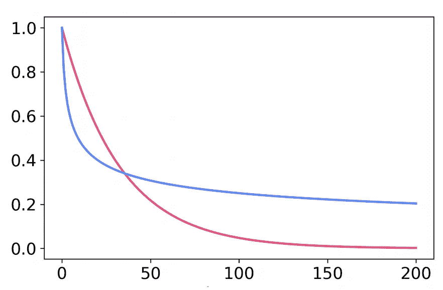
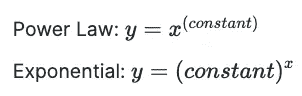
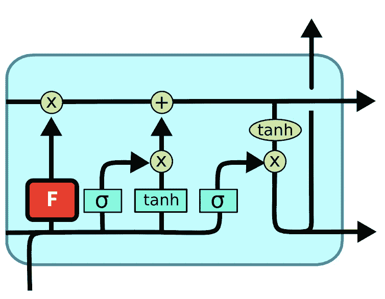
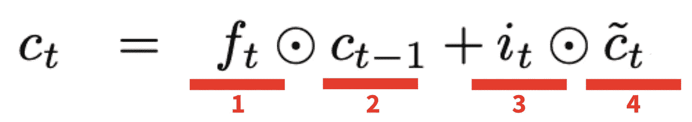
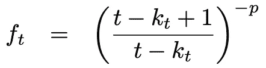
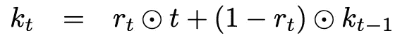

# 如何学习 LSTM 的长期趋势

> 原文：<https://towardsdatascience.com/how-to-learn-long-term-trends-with-lstm-c992d32d73be?source=collection_archive---------10----------------------->

## Intel 和 Johns Hopkins 开发的一种提高 LSTM 性能的方法

长短期记忆(LSTM)网络广泛用于语音识别、语言翻译和时间序列预测。然而，LSTMs 很难了解长期趋势。

图 1:普通递归神经网络(RNN)的示意图。图片作者。

2021 年，英特尔和约翰霍普金斯大学的研究人员合作开发了一种 LSTM 细胞，提高了准确性和速度。这个方法非常新，所以不幸的是没有任何库/包。但是，它可以使用任何基本的深度学习包手动构建。

让我们开始吧…

# 技术 TLDR

*   信息以幂律速度衰减。换句话说，随着我们沿着 LSTM 细胞链越走越远，我们会以幂律速率丢失先验信息。然而，LSTM 忘记盖茨以指数速度删除信息，这阻止了学习长期趋势。
*   **考虑到信息的幂律衰变，我们创造了一个新奇的遗忘门。**该遗忘门使用 sigmoid 复位功能，如有必要，清除先前信息，仅清除当前时间步长的参考信息。然而，当复位未被激活时，与传统的遗忘门相比，先前的信息被保留更长时间，从而允许信息的幂律衰减。

# 但是，到底是怎么回事呢？

这将是一篇非常技术性的文章，但是你不需要太多的先验知识来理解核心概念。这东西很酷，所以让我们慢下来，了解到底发生了什么…

## 什么是 rnn 和 LSTMs

从头开始，让我们定义我们的神经网络框架。处理顺序数据(NLP、时间序列等)时。)，通常的做法是使用递归神经网络(RNN)。rnn 只是一系列神经网络，其中一个的输出是下一个的输入。

然而，rnn 并不完美。训练时，存在不稳定梯度的可能性。这就是长短期记忆(LSTM)细胞的来源。

**lstm 是 RNNs 中的一个专门单元，使用 gates 来管理输入和输出信息。**

门是*激活功能*，取值在 *0* 和 *1* 之间。如果一个门取一个小值，比如说 *0.001* ，我们将其乘以输入信息，然后大幅缩小。相反，如果门取一个大值，比如说 *0.998* ，我们将它乘以输入的信息，并让它基本保持不变。

但是这个不稳定梯度问题是什么，LSTMs 是怎么解决的？

## 我们为什么需要 LSTMs

嗯，和任何神经网络一样，rnn 是通过按照所有先前节点导数的乘积成比例地更新节点权重来训练的。所以，如果网络中其他节点的导数接近于零，我们的权重更新将会非常非常小。这种现象被称为**消失梯度问题**，并阻止我们的模型学习。

同样，如果我们网络中的梯度非常大，我们的权重更新也会非常大。这被称为**爆炸梯度问题。**

现在，基本的神经网络通常不会遇到这个问题——如果你只有两三层，就没有多少小/大导数的复合。但是，如果 RNN 有许多神经网络依次堆叠在一起，会发生什么呢？

正如你可能已经猜到的，**rnn 有更多的层，因此细胞衍生物有更多的机会复合。**

这就是 LSTM 细胞的用武之地——它们有调节信息流的闸门，因此不稳定的梯度不太常见。

## LSTM 细胞结构

现在我们有了背景，让我们来理解 LSTM 细胞的解剖结构…

图 2:LSTM 电池的组件— [src](https://www.researchgate.net/figure/Structure-of-the-LSTM-cell-and-equations-that-describe-the-gates-of-an-LSTM-cell_fig5_329362532) 。图片作者。

乍一看，发生了很多事情。但是真的没那么差。

在图 2 中，带有 *σ* (sigma)的青色方框是门。它们是神经网络，决定有多少信息应该来自先前的细胞和我们的预测者。请注意，它们的编号为 1-3。

在决定保留多少信息后，gates 将这些信息传递给我们的 *tanh* 。tanh 函数负责更新节点的权重。

最后，我们输出两组信息:**单元格状态和隐藏状态。单元状态充当长期记忆，隐藏状态是短期记忆。**

快速回顾一下这些门，让我们参考下面的数字并定义它们…

1.  **遗忘门:**确定我们应该遗忘多少长期信息。被保存的信息被输入到我们的细胞状态中。
2.  **输入门:**决定我们应该忘记多少短期信息。保存的信息被输入到我们的 *tanh* 函数中进行培训。
3.  **输出门:**利用长期和短期信息，确定在我们的隐藏状态下应该输出多少信息。

通过使用这些门来调节信息流，我们能够避免计算有问题的梯度。

很好，所以我们不再有消失梯度的问题了。但是，遗憾的是，LSTMs 也不是一个完美的解决方案。让我们进入英特尔和约翰霍普金斯大学的研究人员讨论的概念。

# 问题是:信息衰减

在很多情况下，我们希望从数据中了解长期趋势。例如，如果我们在看我们最喜欢的股票价格的每日时间序列，去年的价格可以代表今天的价格。但是,“遗忘之门”倾向于删除之前许多步骤中的信息——如果它在过去的 100 天里没有用，我们为什么要保留它呢？

图 3:细胞状态的指数(红色)与幂律(蓝色)信息衰减。y 轴是保留信息的比率。x 轴是时间步长— [src](https://arxiv.org/pdf/2105.05944.pdf#page=9&zoom=100,0,0) 。图片作者。

事实证明，LSTM 细胞中的信息以指数速度衰减，如图 3 中的红线所示。因此，在这个模拟中，传统的 LSTM 单元将会删除之前 150 个时间步长的几乎所有信息。这无疑给了解年度趋势带来了问题。

那么，我们如何保存信息以便长期学习呢？

先前的研究表明 NLP 信息以幂律速率衰减，而不是指数衰减。通过判断图 3 中的曲线，我们可以看到幂律曲线在保留的信息方面有一个不太陡峭的下降。

很好，那么让我们弄清楚如何让 LSTM 细胞以幂律速度而不是指数速度忘记信息。

# 解决方案:新的遗忘之门

研究人员的贡献是一种符合幂律标准的新型遗忘门。

图 4:新的遗忘之门在 LSTM 细胞信息流中的位置— [src](https://www.researchgate.net/figure/Structure-of-the-LSTM-cell-and-equations-that-describe-the-gates-of-an-LSTM-cell_fig5_329362532) 。图片作者。

如图 4 所示，我们用一个新的遗忘门取代了 sigmoid 遗忘门，它可以更好地调节长期记忆中存储的信息。

免责声明，这可能会有点复杂，但我们会尽可能保持高水平。

## 细胞状态

让我们从定义我们的细胞状态开始，也就是我们的长期记忆。

图 5:时间步长 t 的单元状态的定义。

在图 5 中，组件 1(我们的遗忘门)和组件 2(我们的先前细胞状态)决定了保留多少长期信息**。组件 3(我们的输入门)和组件 4(我们的中间细胞状态)决定了保留多少短期信息。**

**如果你好奇的话，中间带点的奇怪圆圈是哈达玛积。它仅仅意味着我们将两个矩阵中每个索引的值相乘。**

## **新的遗忘之门**

**现在，我们来定义一下研究者提出的小说《遗忘之门》。**

****

**图 6:幂律遗忘门的定义。图片作者。**

**在图 6 中，我们有一个新的遗忘门，它控制着我们在长期记忆中回顾多远。 *t* 对应于当前时间步长的索引， *k_t* 对应于感兴趣的第一个时间戳的索引， *p* 是控制我们的信息衰减速率的可学习参数。**

**请记住，我们的遗忘之门的目的是调节长期信息的流入量。它通过将该信息乘以 0 到 1 之间的值来实现。所以，如果 *f_t* 接近 1，我们保留大部分信息。反之，如果 *f_t* 接近于 0，我们就丢失了大部分信息。**

**更具体地说，**当回溯到很远的时候，我们的遗忘门取值接近 1。这意味着我们保留了大量的长期信息。然而，如果我们着眼于短期，我们的遗忘之门会更近，我们只保留部分信息。****

## **重置门**

**最后，您可以将 *k_t* 视为一个黑盒，它输出第一个包含有用信息的索引，然后就此打住。但是，为了完整起见，让我们看一看。**

****

**图 7:幂律遗忘门复位元件的定义。图片作者。**

**在图 7 中，我们看到一个新变量: *r_t* (重置门)。复位门是一个 sigmoid 激活函数，意味着它取 0 和 1 之间的值。如果其值为 1，则 *k_t-1* 被取消并删除所有先前信息。如果其值为 0， *t* 取消，我们保留所有历史信息。**

# **摘要**

**哇哦。我们刚刚涵盖了大量的信息。**

**如果一切都不清楚，在这些方程中输入数字和/或阅读论文(链接在评论中)可能会有帮助。话虽如此，要想深入理解，这里有三个要点:**

*   **传统的 LSTM 细胞会很快丢弃有用的信息。**
*   **在这篇文章中，我们概述了一个对长期信息更明智的遗忘门——它在长期学习任务中胜过传统的 LSTM 细胞。**
*   **概述的遗忘门引用找到有用信息的最早索引。利用这个指数，它可以定制应该将多少长期记忆传递到我们的模型中。**

***感谢阅读！我将再写 40 篇文章，将“学术”研究引入 DS 行业。查看我的链接/教程的意见，建立 LSTM 的权力法。***