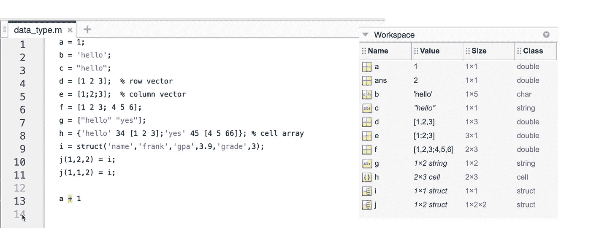
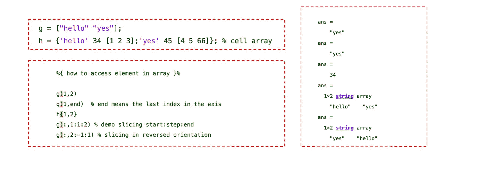
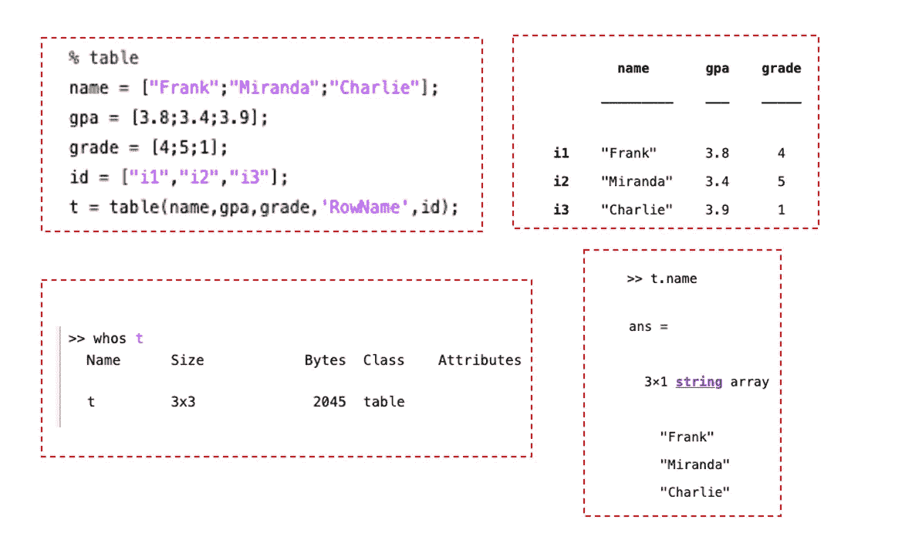
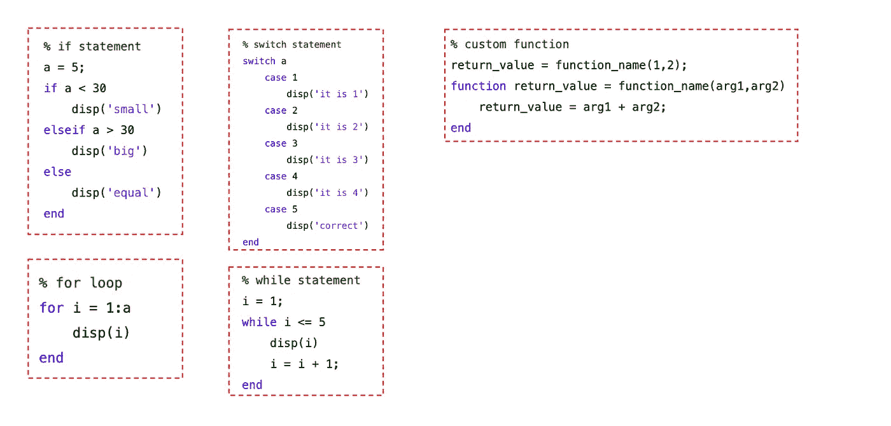

# 如何学习 Matlab

> 原文：<https://towardsdatascience.com/how-to-learn-matlab-f96160fc46b2?source=collection_archive---------11----------------------->

## 开始您的 Matlab 之旅所需要知道的一切

在 [Unsplash](https://unsplash.com?utm_source=medium&utm_medium=referral) 上由 [Rich Tervet](https://unsplash.com/@richtervet?utm_source=medium&utm_medium=referral) 拍摄的照片

与其他开源编程语言相比，Matlab 无疑拥有最全面的文档。正因为如此，我总是认为学习和进入 Matlab 世界应该是一个非常简单的过程，不管你已经是一个经验丰富的其他语言的程序员，或者这是你想开始的第一个语言。

然而，当我最近开始这段旅程时。我惊讶地发现，阅读官方文档有时并不是体验这种语言的最有效方式。正是因为它非常全面，它应该被更好地描述为参考而不是教程。有鉴于此，我决定总结一下我所学到的东西，我相信这将涵盖你需要知道的最基本的东西。

博客中使用的代码可以在我的 [Github 库](https://github.com/frankligy/exercise_codes/tree/master/matlab)中找到。

# 前言:我推荐的学习一门新语言的步骤

虽然这只是我自己的观点，但我坚信学习语言的第一步应该是熟悉它的**数据类型。最不重要的步骤是记住各种功能。我们没有人能够知道每一个功能，但是多亏了这些文档和我们的“最好的朋友”——谷歌，现在找到正确的功能已经变得容易多了。然而，如果你不了解每个变量的属性是什么，那将是一个很难前进的道路，并在此基础上发展新的知识。**

在这篇博客中，我将严格遵循这个程序，向你展示我通常是如何学习一门新语言的:

# **第一步:学习 Matlab 数据类型**

我发现理解 Matlab 很有用的一点是，

> 每个对象都是一个矩阵(数组)

让我们用下面的代码片段来说明这一点:

数据类型训练营(图片由作者提供)

我倾向于使用最愚蠢的例子来解释基本的想法，没有任何功能或逻辑语法。所以在 Matlab 控制台中，我输入了 10 多个不同的变量，它们的数据类型显示在右边的工作区窗口中。正如你所看到的，Matlab 中的一切看起来都像一个矩阵/数组(工作区窗口中的 size 列)，当你键入`a=1`，`a`时，实际上变成了一个`1*1`数组，而`class`是`double`，这是因为`double`是所有数值变量的默认类。你可以随意的将它转换成另一个类，使用相应的转换函数。如果你想知道如何做到这一点，只需[谷歌](https://www.google.com/search?q=how+to+cast+variables+in+matlab&sxsrf=ALeKk01Hjc-Q1bBdUcWSkab6HYc4L9-fzw%3A1626534315518&ei=q_HyYK3WGpeDtQaOgL7YBw&oq=how+to+cast+variables+in+matlab&gs_lcp=Cgdnd3Mtd2l6EAMyCAghEBYQHRAeMggIIRAWEB0QHjoHCAAQRxCwAzoECCMQJzoCCAA6BggAEBYQHjoFCCEQoAE6BwghEAoQoAFKBAhBGABQyxZY0yVgnydoBXACeACAAXqIAZQIkgEEMTAuMpgBAKABAaoBB2d3cy13aXrIAQjAAQE&sclient=gws-wiz&ved=0ahUKEwjt19jAsOrxAhWXQc0KHQ6AD3sQ4dUDCA4&uact=5)那个，这就是为什么我建议函数应该是最后一步学习，而不是首先要担心的事情。**现在，你只需要知道你有可能选择不同的职业，然后你就可以知道了。**

继续，我们初始化了另一个变量`b='hello'`，你可能认为它是一个字符串，但实际上，`b`恰好是一个大小为`1*5`的数组，类为`char`。如果你真的想有一个`string`变量，你需要用双引号，所以我们有`c="hello"`。现在`c`变成了一个`1*1`数组，现在类为`string`。`char array`将每个字符视为一个单元，而`string`将整个字符串/句子视为一个整体。你可以像变量`g=["hello","yes"]`一样拥有`string array`。

然后，我们有一个数值向量和矩阵。在 Matlab 中，使用`whitespace`进行水平扩展，使用`;`进行垂直扩展。所以，对于一个`2*3`矩阵`f`，应该使用`[1 2 3; 4 5 6]`来创建。同样，行向量`d`应该是`[1 2 3]`，列向量`e`应该是`[1;2;3]`。

如果我们在一个数组中有混合的类呢？我们需要使用`cell array`来存储混合类型。变量`h`是一个形状为`2*3`的单元格数组，它的类是`cell`，表示数组中每个元素的类型都是不同的，正如你所看到的，我们既有`char`、`double`，甚至还有嵌套的双数组。

下一个类类型是`struct`，它类似于 Python 中的`dictionary`，代表一个`key-value`关系，我们用变量`i`来说明`struct`的创建。同样，`i`也是一个数组，其类类型为`struct`。

到目前为止，我希望这个思路更清晰一点，你可以把 Matlab 中常见的对象都看成数组， ***一个数组也可以包含其他数组*** 。但是，类的类型是不同的。为了加强理解，让我们构建一个变量`j`，我把它做成一个三维数组，但是类的类型是`struct`。我们可以简单地将这个数组的形状指定为(1，2，2)，并将一个`struct`元素分配到一个槽中。

***Matlab 共有哪些内置类类型？*** 和大多数其他语言一样，常用的类型包括`int`，它可以进一步由`int8`、`int16` …和`uint8`等无符号语言组成。然后，`double`用于浮点数，`char`和`string`用于文本，`logical`包含值`true`或`false`，以及我们上面解释过的`struct`类类型。

最后但同样重要的是，您是否注意到在每个命令的末尾总是有一个`;`？这是为了禁止在控制台中打印这一行。默认情况下，每一行都将在控制台中执行和打印。此外，每个没有赋值变量的命令(见第 13 行`a+1`)将被赋值给一个内部变量`ans`，这就是为什么我们在工作区窗口中有一个值为 2 的`ans`对象(ans = a + 1，a = 1)。

基本数据类型的介绍到此结束。因为一切都是数组，所以知道如何访问数组中的每个元素也很有帮助:

如何访问数组中的元素？(图片由作者提供)

需要记住的三件事是:

1.  普通数组使用**圆括号**，单元数组使用**花括号**
2.  Matlab 是 **1 基索引** (Python 是 0 基索引)
3.  理解`**end**` **关键字和切片操作**(向前和向后)

除了上面的类类型，另一个有趣的类类型叫做“表”，让我们说下面的例子:

Matlab 中的表格类类型(图片由作者提供)

我们创建了一个表格，如右上角所示，在左下角，我们可以看到它的类类型是`table`，形状为 3*3。如果我们对每一列(姓名、gpa、年级)使用行向量，那么形状将变成 1 * 3。要访问每一列，我们需要使用点`.`符号。“table”类类型在常见任务中非常有用，因为它类似于其他解释语言中的`dataframe`对象。

# 第二步:循环、If、自定义函数等

我发现很多教程都着重于解释如何用每种语言编写`for loop`和`if statement`。虽然它们很重要，但是如果你已经有了至少一门语言的经验，一个简单的备忘单就足够了。因为这个教程真正的目的是说明 ***如何自己学习*** 一门新的语言，而不仅仅是灌输一些知识。我强烈建议你只要谷歌一下，一秒钟就能得到你需要的东西，但为了完整起见，让我在下面的截图中为你总结一下:

备忘单:Matlab 中的基本逻辑语句(图片由作者提供)

唯一值得注意的是，当构造一个函数时，Matlab 倾向于用一种独特的方式定义它，公式看起来像`function return_value = function_name(arg1,arg2,...)`，然后你只需通过它的`function_name.`调用函数

# 第三步:更多高级功能和各种内置功能

现在是时候探索更高级的主题了，例如，[如何在 Matlab](https://www.google.com/search?sxsrf=ALeKk00yTA0OmCqkqD2Y_2KqfFVQlyzl0Q:1626537649062&q=how+to+build+custom+class+(object+oriented+programming,+OOP)+in+Matlab&spell=1&sa=X&ved=2ahUKEwjPt6T2vOrxAhUaHc0KHVy4C_kQBSgAegQIARAw&biw=1440&bih=709&dpr=2) 中构建自定义类(面向对象编程，OOP)？或者，[什么是 Matlab 中的匿名函数](https://www.google.com/search?q=what+is+anonymous+function+in+matlab&oq=what+is+anonymous+function+in+Matlab&aqs=chrome.0.0j0i22i30l2.331j0j9&sourceid=chrome&ie=UTF-8)？你可以通过谷歌搜索它们得到你需要的东西(如果你点击链接，我已经为你做了)，我希望这可以帮助你习惯于如何深入真正的编程世界，因为这就是我们日常工作的方式。

正如我最初说的，我甚至没有在我的教程中教你一个内置函数，例如，如何连接两个字符串并进行点积或叉积。尽管如此，对基本数据类型的良好掌握将使您未来的学习更加容易。这就是我今天想与你分享的内容，我希望这篇小文章可以帮助你掌握你的特定任务所需的其他更高级的操作。

差不多就是这样！我希望你觉得这篇文章有趣和有用，感谢阅读！如果你喜欢这篇文章，请在 medium 上关注我，非常感谢你的支持。在我的 [Twitter](https://twitter.com/FrankLI55917967) 或 [LinkedIn](https://www.linkedin.com/in/guangyuan-li-399617173/) 上联系我，也请让我知道你是否有任何问题或你希望在未来看到什么样的教程！