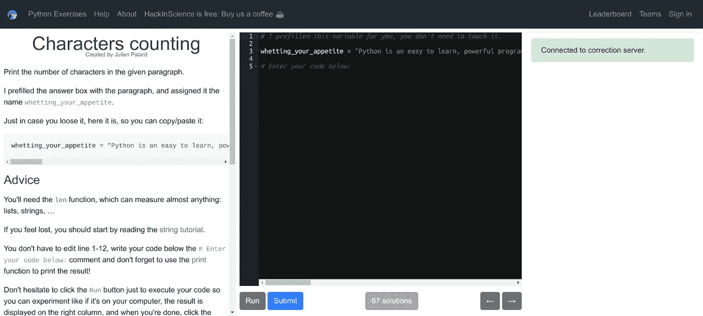

# 4 门现代互动课程，学习和提高您的 Python 编码技能。

> 原文：<https://towardsdatascience.com/how-to-learn-python-coding-9f096d70c22d?source=collection_archive---------12----------------------->

## 这里有一个免费资源的精选列表来指导你的学习过程。

如何免费学习 Python 编码——图片来自 [Pexels](https://www.pexels.com/photo/python-book-1181671/?utm_content=attributionCopyText&utm_medium=referral&utm_source=pexels) 的 [Christina Morillo](https://www.pexels.com/@divinetechygirl?utm_content=attributionCopyText&utm_medium=referral&utm_source=pexels)

互联网上充斥着大量的学习资源。虽然我钦佩他们所有人，但我不禁认为初学者很容易迷路，再也回不来了。

我是自学的 Python 程序员。我见过很多成功人士也这样做。Python 理解起来非常直观，应用程序也非常强大。

我很高兴我选择了 Python。

我第一次学习 Python 是通过 codeacademy.com 的。通过他们的互动系统学习真是太棒了。但不幸的是，它不再免费了。

虽然我仍然向我指导的大多数人推荐它，但我有一个其他免费资源的列表。

这里有一个精选的列表，以及为什么它们看起来很棒。我希望这将有助于初学者找到正确的。

我保证会告诉你[我会从哪里开始](#5a1f)并进步，如果我要重新开始的话。但在此之前，让我们看看我们拥有的现代选择。

# Scrimba:免费的交互式 Python 教程。

如何免费学习 Python 编码？截图来自[作者](https://www.the-analytics.club/)。

> ***为什么？*** *Scrimba 在互动性上更上一层楼！*

和其他平台一样，导师会指导你学习课程材料。但是你可以暂停视频，开始编辑上面的代码。

这就是你在 Scrimba 教程上看到的魔力。

当我第一次看到这个的时候，我被迷住了。它几乎把你带到了一个真实的课堂环境。

[给自己试试 **Scrimba**](https://scrimba.com/learn/python) 。

光有交互性并不能成为一个很好的学习平台。Scrimba 每周举办编码挑战，每月增加新的课程。

这就是你在编程之旅中需要帮助成长的那种社区。

# Datacamp:内置代码编辑器的高质量 Python 教程。

如何免费学习 Python 编码— Datacamp？截图来自[作者](https://www.the-analytics.club/)。

> ***为什么？*** *专攻数据科学的 Python。*

Python 对于许多应用程序来说都很棒。数据科学家喜欢它的简单性和对各种问题的适用性。正因为如此，几乎每个渴望成为数据科学家的人都会考虑学习 Python。

如果你对数据科学感兴趣，Datacamp 是你应该去的地方。

你可以在许多课程中选择适合你的课程。你将按照演示者的视频教程做一个互动练习。

除了 Python，还可以选择 R、SQL 等方面的课程。

[自己试试 **Datacamp** 。](https://campus.datacamp.com/courses/intro-to-python-for-data-science)

# Hackinscience:通过解决问题来学习 Python。

如何免费学习 Python 编码— HackInScience？截图来自[作者](https://www.the-analytics.club/)。

> ***为什么？*** *引导问题解决，逐步提高你的 Python 编码技能。*

如果你不喜欢系列讲座，你应该去看看《黑客科学》。

Hackinscience 与这份名单上的其他网站不同。这是一个由五组互动练习组成的集合；基础、训练、算法、命令行和 NumPy。

Hackinscience 是巩固你的知识的一个方便的工具，值得一试。

[亲自尝试**黑客科学**。](https://www.hackinscience.org/exercises/)

# Sololearn:学习 Python 的社区。

如何免费学习 Python 编码— Sololearn？截图来自[作者](https://www.the-analytics.club/)。

> *为什么？解决挑战，通过纠正彼此的错误来学习。*

与其名字相反，Sololearn 是一个面向初级 Python 程序员的优秀社区。

除了 Python 之外，您还指导过许多其他语言的交互式课程。您可以选择一个并完成挑战以解锁下一关。

是的，听起来像电子游戏。

此外，你还可以找到数据科学、机器学习和 web 开发的课程。

亲自尝试一下。

# 如果它们不适合你，试试 YouTube 上最好的 Python 教程。

我们也有一些非常棒的 Youtube 视频，非常适合开始 Python 编程。我很想提到其中的几个，这是我最近回顾和推荐的。

Mosh Hamedani 的 Youtube Python 教程。

我强烈推荐 Mosh Hamedani 的视频给大家。他制作了很多技术的优秀视频教程，包括 Python。

免费代码营的 Youtube Python 教程。

Freecodecamp 的 youtube 视频是那些想学习 Python 的人的另一个高质量资源。在我看来，他们组织得很好，复习得也很好。

# 最后的想法，

这是来自互联网上数千篇文章、视频和指导教程的一小部分资源列表。最棒的是，如今知识可以自由获取。

Python 对每个人都非常有帮助，不管他们的职业是什么。如果你正准备开始学习 Python，我希望这里的列表能对你有所帮助。

就像我之前承诺的，如果我必须重新开始，我会这么做。

如果我是一个完全的新手，我会从 Scrimba 开始。这是一个顺畅的互动学习过程。同时，我会做黑客科学的练习。这会让你对基本原理有一个坚实的理解。

然后，我会学习 Datacamp 上的课程，以提高我的数据科学相关的 Python 编码技能。

不管我选择了什么，我都会在 Sololearn 上学习课程，并加入他们的社区。

Youtube 视频呢？在 Python 中工作多年后，我仍然会观看这些视频。

> ***问好👋对我来说*** 在 [LinkedIn](https://www.linkedin.com/in/thuwarakesh/) 、 [Twitter](https://twitter.com/Thuwarakesh) 、 [Medium](https://thuwarakesh.medium.com/subscribe) 。看来你和我有许多共同的兴趣。
> 
> 还不是中等会员？请使用此链接 [**成为会员**](https://thuwarakesh.medium.com/membership) 因为我为你免费推荐赚取佣金。