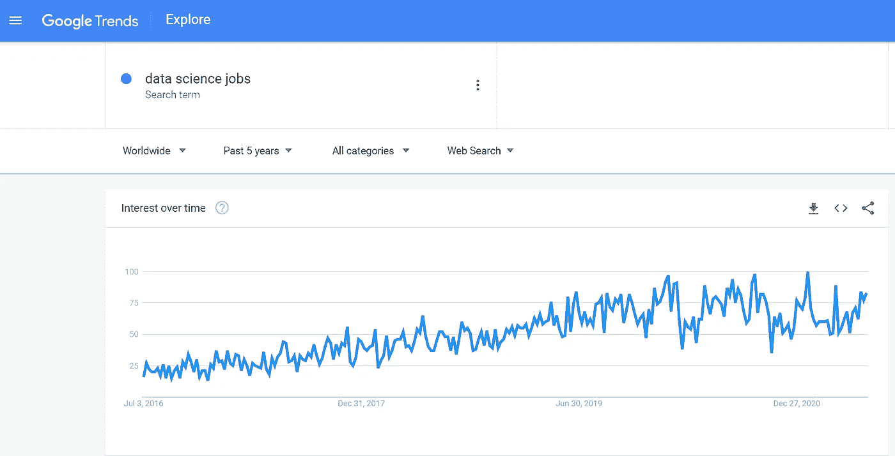
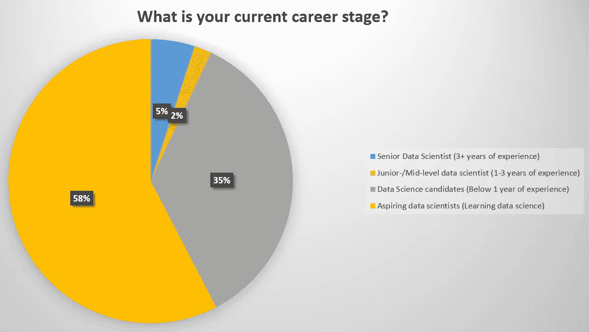
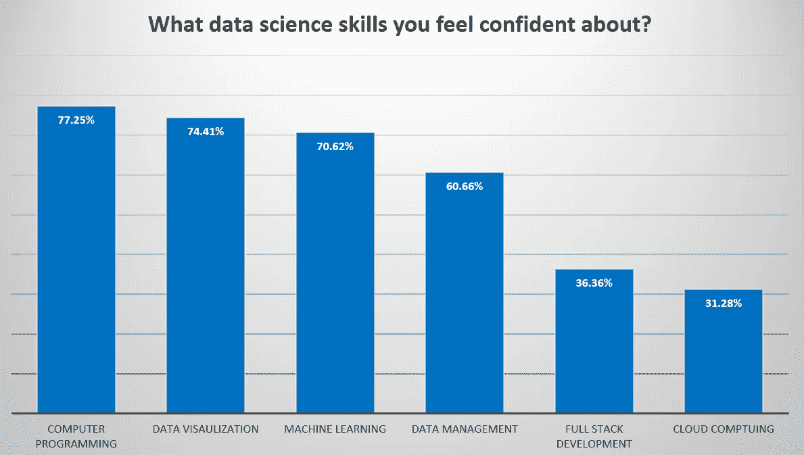

# 如何在 90 天内提升您的数据科学技能

> 原文：<https://towardsdatascience.com/how-to-level-up-your-data-science-skills-in-90-days-917c523e8dc9?source=collection_archive---------32----------------------->

## 学习数据科学技能的敏捷路线图

图片来源: [Alex Kotliarskyi @ Unsplash](https://unsplash.com/photos/QBpZGqEMsKg)

在过去几年中，数据科学一直是应届毕业生或转行者最受欢迎的领域之一。就业市场不断增长的需求是候选人数量不断增加的重要驱动力。简单看一下“数据科学工作”一词的谷歌搜索查询量就可以看出，对数据科学的需求越来越大，人才也在不断寻求加入这个蓬勃发展的行业。

随着数据科学在人才中越来越受欢迎，以及雇主推动的所需技术技能的膨胀，在过去几年中，数据科学就业市场对候选人的竞争越来越激烈，尤其是对应届毕业生。

谷歌搜索趋势搜索“数据科学工作”(谷歌趋势快照)

这些事实表明了持续学习和提升技能对于候选人和已经在该行业工作的数据科学家的重要性。虽然目前在该行业就业的数据科学家受益于在工作中学习许多新技能，但应届毕业生正在努力寻找合适的背景和路线图来学习就业市场上最受欢迎的技能。

根据我们的研究，活跃在就业市场上的超过 80%的数据科学家是有抱负的数据科学家或实习生，他们很难得到雇主的注意，即使是在全职工作的初步筛选电话中。此外，大约 30%的候选人表示对他们的机器学习技能没有完全的信心，40%的人对数据库技术没有信心，70%的人对云计算没有信心！这些统计数据表明，有抱负的数据科学家需要做大量工作来获得必要的技能，以引起雇主的注意。

Pouyan R. Fard，2021

Pouyan R. Fard，2021

# 提升数据科学技能的路线图

因为数据科学是一个非常新的领域，而且对于数据科学家的角色没有普遍的共识，所以对于有抱负的数据科学家来说，很难知道从哪里开始以及他们需要在每个主题上专注到什么程度。在这篇文章中，我展示了一个路线图，展示了有抱负的数据科学家如何在 90 天内提升他们的技术技能。在这里，我只关注候选人的技术技能，这些技能最初能引起雇主的注意。

以下是关于如何学习必要的数据科学技能以提升你在就业市场中的地位的路线图:

*   **第一周:概率&统计**
*   **第二周:Python 编程**
*   **第三周:数据争论**
*   **第 4 周:探索性数据分析**
*   **第 5 周:机器学习——监督学习**
*   **第 6 周:机器学习——无监督学习**
*   **第八周:机器学习——时间序列分析**
*   **第九周:机器学习——深度学习**
*   第 7 周:自然语言处理
*   第 10 周:数据库技术
*   **第 11 周:视觉分析**
*   **第 12 周:云计算**

**如何在 90 天内学会数据科学**

要克服在一个新领域开始学习如此多主题的最初困难和不知所措的感觉，你需要在学习上述技术技能的同时采取敏捷的心态。在职业生涯的这个阶段，你不能成为学习数据科学技能的完美主义者。请记住，对于许多雇主来说，你是监督分类等特定方法的绝对专家并不重要。相反，许多雇主需要拥有广泛技能的人来解决不同的问题，如在云上建立数据管道，设置分析仪表板，训练机器学习模型，以及与业务利益相关者交流见解。

在遵循这个路线图时，您需要记住，您需要关注您正在学习的概念和技术的实践方面。这意味着您需要专注于与路线图每周相关主题的实践学习。只要坐下来开始编码或者用编码甚至纸笔解决技术问题。像在线课程或书籍这样的资源可以非常有效地帮助你的学习之旅，但它们不能取代你亲自动手的需要。我相信通过跟随教程(尤其是在 Medium 上)或 Github 库中分享的实际例子，学习大多数技能是可能的。所以，强迫自己只在一周内学习一个新的话题，将有助于你成为最实际的，发现最重要的话题，而不是不必要的和理论上的细节，这些可以在以后学习。

数据科学是一个实用的工程领域；它不是关于理论机器学习和统计学，而是应用这些方法来解决现实世界的商业问题。因此，在您学习这些技术的同时，请始终考虑如何在现实世界中使用这些方法，尤其是解决业务问题。如果你能培养这种心态，你将成为一名成功的数据科学家，你很快就会在这个领域看到自己的成长。

**TL；DR Summary:**
在这篇文章中，我分享了如何在 90 天内提升你的数据科学职业生涯的必要技能的路线图。我相信大多数有抱负的数据科学家都在努力学习进入该领域所需的技能，或者吸引雇主的注意力以获得面试机会。对于有抱负的数据科学家来说，数据科学技能的学习需要**快速、敏捷、实用、动手，并专注于数据科学的现实问题**，而不是在每个主题的理论方面走得太深。

请注意，有许多因素决定着候选人求职的成功，包括但不限于技术技能、软技能、工作申请、社交策略、面试技巧等。因此，获得顶级数据科学职位的建议是超越技术技能，致力于软技能、行业知识和网络战略。

**更多文章来自作者:**

</the-best-time-to-kick-start-your-data-science-career-4ca5e0b56ff>  </breaking-into-data-science-in-2021-is-it-still-easy-as-before-9bb6fe313a0f>  

**关于作者:**

Pouyan R. Fard 是 Fard Consulting 的首席执行官&首席数据科学家。Pouyan 在数据科学、人工智能和营销分析方面拥有多年的公司咨询经验，从初创公司到全球公司。他曾与制药、汽车、航空、运输、金融、保险、人力资源和销售等行业的财富 500 强公司合作。

Pouyan 还积极指导活跃在大数据行业的初创公司和求职者。他的热情是通过职业培训培养下一代数据科学家，并帮助他们找到数据科学领域的顶级工作机会。

Pouyan 已经完成了关于消费者决策预测建模的博士研究工作，并对开发机器学习和人工智能领域的最先进解决方案保持兴趣。