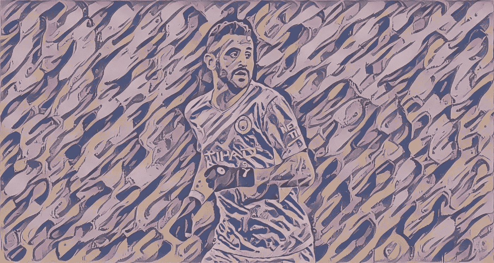
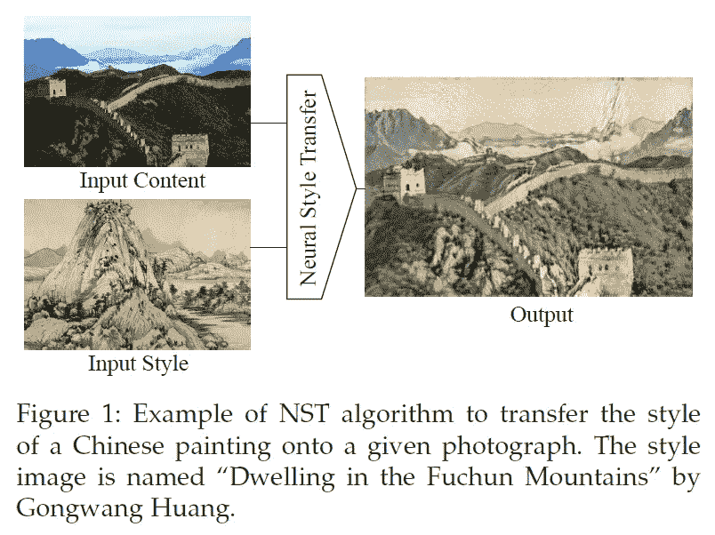
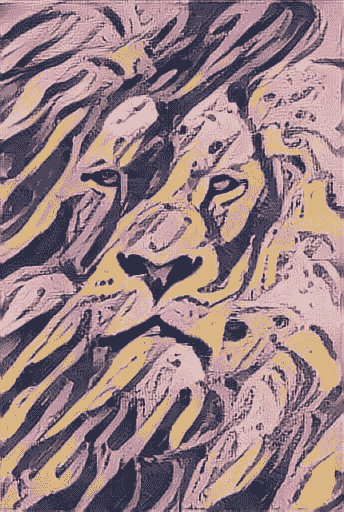

# 如何利用神经风格转移来创建令人惊叹的图像

> 原文：<https://towardsdatascience.com/how-to-leverage-neural-style-transfer-to-create-stunning-images-c30eb4a9007a?source=collection_archive---------43----------------------->

## 人工智能艺术

## 会画图像的人工智能

神经风格转移应用于阿尔及利亚足球运动员马赫雷斯的图像——由作者制作

# 图像风格转移

图片来自纸张[3]

图像样式转移是一种可以应用于图像绘画的方法，其目标是从一个图像中提取样式，并将其应用于第二个图像，同时保留第二个图像的内容，就像上面的图像所示。

为了实现这一点，需要定义图像的风格。

事实上，图像的风格与其纹理有很大关系。因此，通过使用纹理提取方法，我们本质上是在提取图像的风格。

这些方法被称为视觉纹理建模方法。这些方法有两种类型:

*   具有汇总统计的参数纹理建模
*   基于马尔可夫随机场的非参数纹理建模

为了在图像上应用这种风格，我们可以使用图像重建技术。这些技术也有两种类型:

*   基于图像优化的在线图像重建。
*   基于模型优化的离线图像重建。

卷积神经网络可用于视觉纹理建模和图像重建。

# 神经类型转移

在图像中进行风格转换的一种相当简单的方法是使用论文“ [**艺术风格的神经算法**](https://arxiv.org/abs/1508.06576) 中描述的方法。

**你需要什么:**

*   一个 CNN (VGG，盗梦空间等等)，它是在一个大的数据集(ImageNet)上预先训练的。
*   一个你想样式化但保留其内容的图片，姑且称之为“*内容图片*”。
*   一个你想提取其风格的图像，姑且称之为“*风格图像*”。

**怎么办:**

*   把这两张照片都传给 CNN。
*   从内容图像和样式图像中提取特征映射。
*   要从样式图像中获取样式，您需要使用所谓的“Gram matrix”。这是一种奇特的说法:计算不同特征地图的平均值和相关性。
*   因此，特征图将代表图像的内容，而 Gram 矩阵将代表图像的风格。
*   接下来，你需要优化一个损失函数。这个损失函数的目标是使内容图像的样式尽可能接近样式图像的样式。
*   最后，你基本上将一幅图像的风格转移到了另一幅图像上，同时保留了后一幅图像的内容。​

作者使用 NST 方法创作的狮子图像

上图是我用 Tensorflow 提供的教程中的 [**开源代码**](https://www.tensorflow.org/tutorials/generative/style_transfer) 创建的。

顺便说一句，如果你想学习如何使用 Tensorflow，那么请查看我的 [***免费 Tensorflow 课程***](https://aifee.teachable.com/p/introduction-to-tensorflow-2-for-computer-vision) ，它专注于计算机视觉的深度学习。

# 实时神经类型转移

从艺术的角度来看，前面的方法给出了一些很好的结果，但是缺点是它太长了。

每幅图像都必须经过一系列的迭代，提取两幅图像的内容和风格，然后进行优化，使一幅图像的风格接近另一幅图像的风格。

由于这个障碍，文献中提出了另一种方法[2]。通过这种方法，有两个神经网络一起工作。

一个网络从风格图像中提取风格。另一个网络有两个输入:内容图像和前一个网络的输出。

使用这种方法，整个系统在训练阶段从大数据集学习绘画风格的表示。

在测试时，网络直接从样式图像中提取样式，并将其应用于内容图像。不需要优化！

# 结论

AI 可以用于艺术造型。有一些深度学习方法可以将一幅图像的风格转移到另一幅图像，同时保留后者的内容。

有不同的方法来实现这一点，其中一些需要在线优化。这意味着无论何时你想要设计一个图像，都必须有一个优化例程，这需要一些时间。

其他方法使用离线优化，这使得神经风格转移系统能够学习如何提取图像的风格，并在训练过程中将其应用于新图像。在测试时，样式的转换很快。

# 参考

[1] Leon A. Gatys，Alexander S. Ecker，Matthias Bethge，“*一种艺术风格的神经算法*”。

[2] Golnaz Ghiasi，Honglak Lee，Manjunath Kudlur，Vincent Dumoulin，黄邦贤 Shlens，“*探索实时、任意神经艺术风格化网络的结构*”。

[3]永成静等，*神经风格迁移:综述*。

# 关于作者

我是一名机器学习工程师，致力于解决具有挑战性的计算机视觉问题。在 [**LinkedIn**](https://www.linkedin.com/in/nour-islam-mokhtari-07b521a5/) 和 [**Twitter**](https://twitter.com/NourIslamMo) 上关注我的每日内容。此外，通过加入我的 [**时事通讯**](https://nourislam.ck.page/dc3e8b7e12) **，让这样的文章直接进入你的收件箱。**