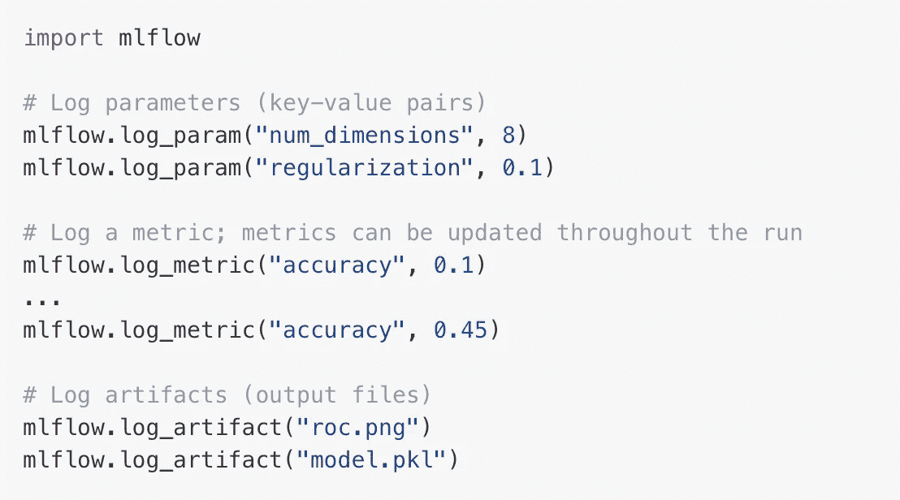
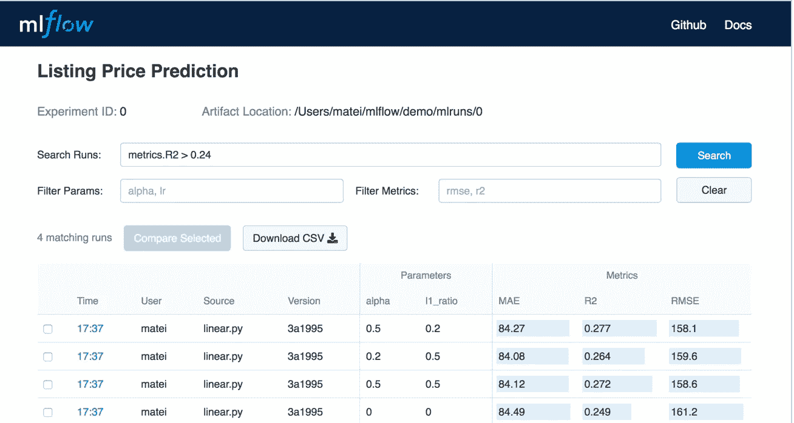
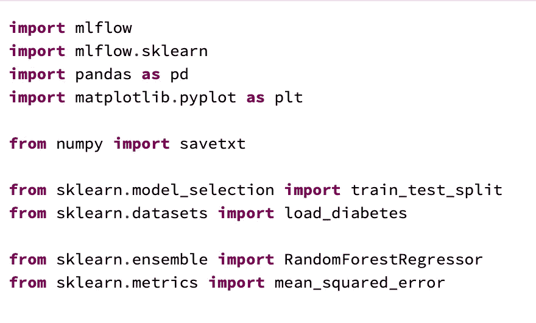
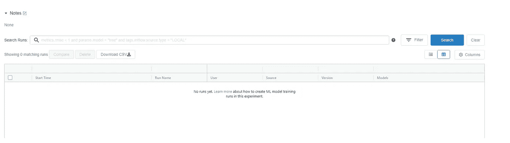
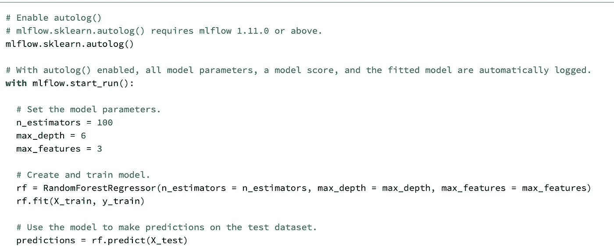
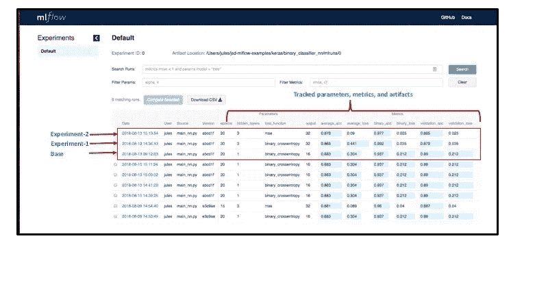
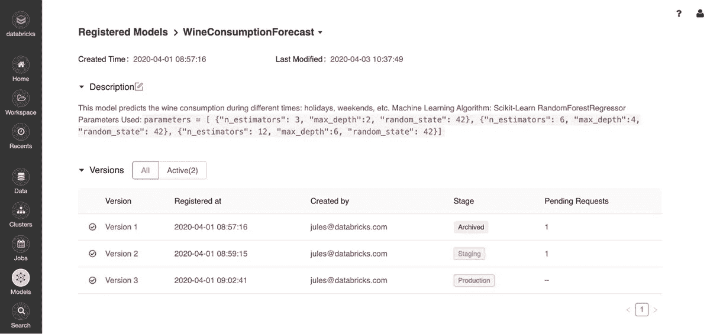
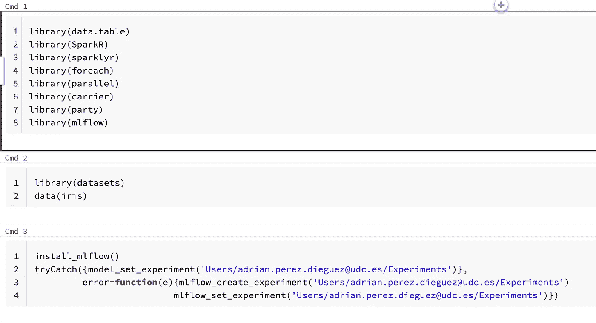
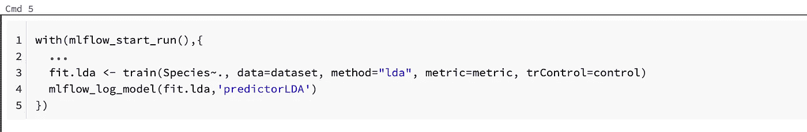
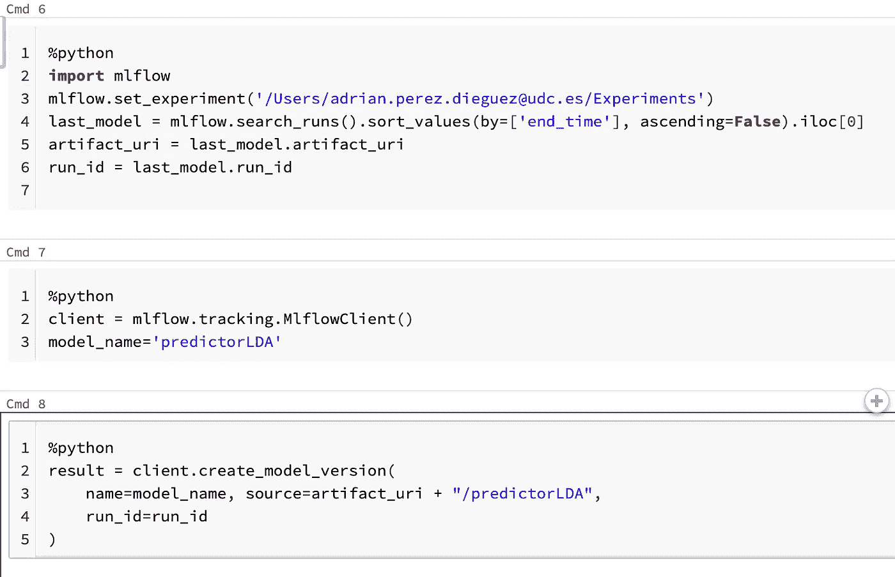

# 如何在数据块上加载和存储 R 中的 MLFlow 模型

> 原文：<https://towardsdatascience.com/how-to-load-and-store-mlflow-models-in-r-on-databricks-hacking-the-constraints-93ce458af7ff?source=collection_archive---------17----------------------->

## 破解约束

Databricks 已经成为云计算的重要组成部分，尤其是现在，在谷歌宣布在谷歌云上推出 Databricks 之后。然而，必须指出的是，它仍然是一项试验性的技术，在效率和覆盖面方面还有很长的路要走。

对于数据科学来说，r 是最强大和使用最多的语言和环境之一，年复一年，统计人员努力开发不同的库。由于这一点，你可以找到几乎所有用 R 实现的数学模型，这对于你能想象的大多数 DS 项目的成功是非常有用的。但是，R 有一个重要的缺点:大数据。在处理海量数据时，SparkR 和其他公式还远远不能提供一个庞大的 ML 库目录。大部分 BigData SaaS 和 PaaS 都专注于 Python 和 Spark，比如 Databricks，努力开发一个完整的框架，并试图定义一个 ML 工件的端到端周期，而不是关注在 r 中完全支持他们的产品

例如，当在数据块中对 R 模型使用 MLFlow 时，就会发生这种情况。诚然，Databricks 支持 R、Python 和 Scala 代码，但在使用 MLFlow 和 R 时，尤其是在尝试注册 ML 模型时，会发现不同的弱点。

# 什么是 MLFlow

MLFlow 是一个围绕 REST APIs 构建的 ML 平台，它允许记录 ML 模型的实例作为存储库。这些实例被打包，以便发送到部署工具，但是在运行您的实验时，它还注册不同的度量、模型数据、配置或代码版本。稍后，您可以将它们可视化，并比较多次运行的输出。

如果您不熟悉 MLFlow，请查看他们的文档，并尝试使用 Databticks 进行免费试用。

来自 DataBricks [网站](https://databricks.com/blog/2018/06/05/introducing-mlflow-an-open-source-machine-learning-platform.html)的一个例子

MLFlow 目前处于 alpha 阶段，这是它仍然存在弱点的原因，但在部署我们的 ML 模型时，这是一个强大的想法。

# MLFlow 如何在 Python/Spark 上工作

让我们看一个 Python 上 MLFlow 的快速例子。首先，我们必须安装并加载库:

在此之后，我们必须使用以下命令创建或设置实验:*ml flow . set _ experiment(path _ to _ experiment)。*在注册任何实验之前，我们可以转到给定的路径，我们会看到实验已经创建，但它是空的:

然后，我们可以运行我们的模型，并在我们的实验中注册执行:

使用 *autolog()* 我们可以自动记录所有参数、分数和模型本身，但是如果我们不想跟踪整个上下文，我们可以使用 *log_metric()、log_param()、log_artifact()* 或 *log_model()* 函数*选择保存什么。*实际上，我发现 *log_model* 函数非常有趣，因为它允许我们跟踪带有标签的模型，这可以帮助我们稍后从存储库中加载模型。[点击此处查看文档。](https://docs.microsoft.com/es-es/azure/databricks/applications/mlflow/quick-start-python#view-results)

在此之后，如果您现在转到实验路径，您将看到您已经记录的所有实验的记录。大概是这样的:

来自 DataBricks [网站](https://databricks.com/blog/2018/08/23/how-to-use-mlflow-to-experiment-a-keras-network-model-binary-classification-for-movie-reviews.html)的示例

一旦模型被训练和记录，它可以在模型库中从无传播到试运行和生产阶段(寻找*transition _ model _ version _ stage()*函数)。在 Databricks 中，存储库可以在“模型”选项卡中可视化:

来自 DataBricks [网站](https://databricks.com/wp-content/uploads/2020/04/databricks-adds-access-control-to-mlflow-model-registry_02.jpg)的一个例子

然后，可以很容易地从存储库中加载它，用于我们的预测。用户只需调用*ml flow . load _ model(path _ to _ model)*指令，即可在笔记本中使用所需的模型。

# 尝试在数据块中使用 MLFlow 的 R API

遵循与 Python 流相同的结构，我们首先加载库并安装 mlflow:

第一个区别出现在设置实验的时候。在 R 中，我们不能设定一个不存在的实验；因此，为了以防万一，必须使用 try-catch 来捕获错误，并在需要时创建实验。之后，让我们尝试运行执行并记录模型:

现在，如果我们检查实验路径，我们将看到实验和运行已经创建；然而，在存储库中没有跟踪到任何模型。这令人惊讶，因为没有返回任何错误。大多数人都被困在这里，MLFlow 必须解决这个问题，但原因是:

> *registered _ model _ name(‘predictor LDA’*)是在 *mlflow.log_model，*中使用的一个有用的参数，不幸的是目前在 R 库中不可用。

如果我们想在 R 笔记本中加载 MLFlow 模型，这是一个令人头疼的问题，但有一个解决方案。在任何 Databrick 笔记本中，您可以通过在单元格的开头指定语言魔术命令`%<language>`来覆盖默认语言。支持的魔法命令有:`%python`、`%r`、`%scala`、`%sql`。该解决方案通过从 R notebook 调用 python(或使用 REST API)来实现:

我们首先设置在前面的 R 命令中创建的实验，然后寻找该实验的最后一次运行。请记住，实验和运行都在 R 中注册，我们唯一无法跟踪的是模型。一旦我们找到了运行，我们就可以获得创建的工件的 URI，我们将使用这个 URI 来获得 python 中的模型并注册它。我们只是创建一个 mlflow 客户端，用 *create_model_version* 指令进行注册。这个操作可能需要 300 秒来完成创建，所以请记住这一点(在下一个命令中使用 time.sleep(300)可能会很有趣)。现在，在这个“技巧”之后，模型已经被正确地注册到模型库中，并且可以使用了。

Databricks 和 MLFlow 都是正在开发的强大而有前途的技术。尤其是 MLFlow 还是太绿了，一定要有耐心。同时，我希望这个技巧可以帮助您进行云部署。

*Adrian Perez 是一名数据科学家，拥有超级计算并行算法博士学位。你可以在他的* [*中简介*](https://adrianpd.medium.com/) *中查看更多关于他的西班牙语和英语内容。*