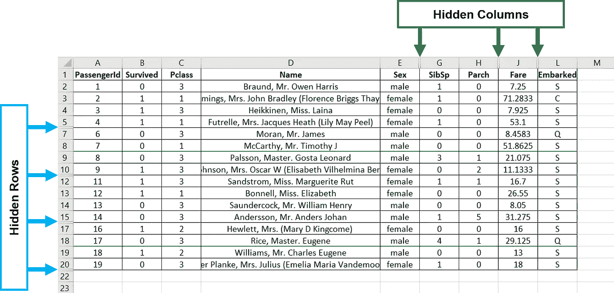
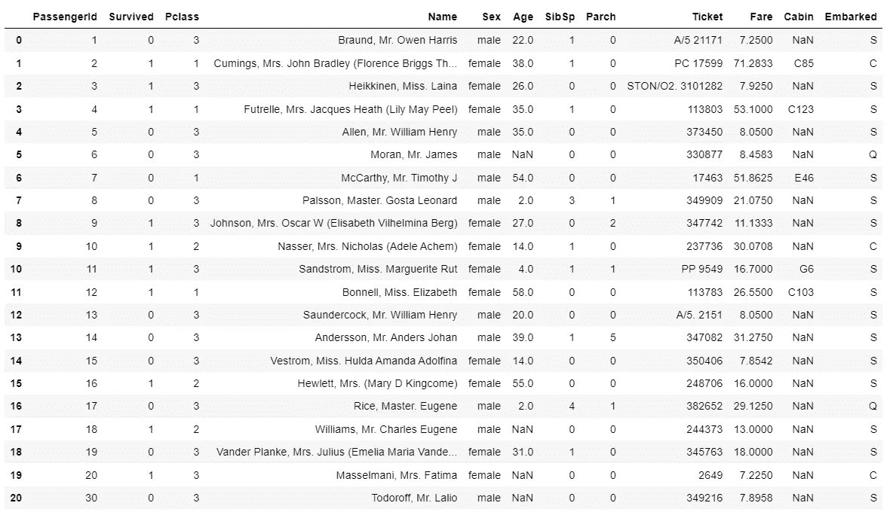
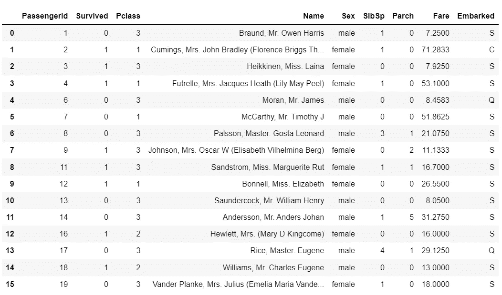

# 如何将带有隐藏行和列的 Excel 文件加载到 Pandas

> 原文：<https://towardsdatascience.com/how-to-load-excel-files-with-hidden-rows-and-columns-into-pandas-19d445fa5c47?source=collection_archive---------4----------------------->

## 使用 openpyxl 包在将 Excel 文件作为 Pandas DataFrames 读取时忽略隐藏的行和列


照片由[米卡·鲍梅斯特](https://unsplash.com/@mbaumi?utm_source=medium&utm_medium=referral)在 [Unsplash](https://unsplash.com?utm_source=medium&utm_medium=referral) 上拍摄

我最近学到了一些新东西——在将 Excel 文件作为 Pandas DataFrames 读取时，可以排除隐藏的行和/或列，这都要归功于`openpyxl`包，我想与你分享一下。

隐藏 Excel 文件的行或列并不罕见。不太相关的列可以被隐藏以保持电子表格的整洁；或者隐藏行以故意忽略重复数据。

无论原因是什么，当加载一个文件作为 Pandas DataFrame 时，隐藏它们可能是有价值的，因为它可能会影响后续的数据争论和探索。

不幸的是，将 Excel 文件作为 Pandas 数据帧读取的传统方式——使用`pandas.read_excel()`方法——并不方便。

在这篇文章中，我们将探索如何使用`openpyxl`包来识别 Excel 文件中隐藏的行和列，从而在将其作为 Pandas DataFrame 加载时排除它们。

# 数据集

我们将使用在 [Kaggle](https://www.kaggle.com/c/titanic/data) 上公开的 titanic 训练数据集的一小部分。为了简单起见，我将数据行数限制为 20。我还故意隐藏了 F(“年龄”)、I(“机票”)和 K(“客舱”)列，以及第 6、11、16 和 21 行。



在 Excel 中预览数据集(图片由作者提供)

# 为什么` pandas.read_excel()`不工作？

通常，我们使用 Pandas 的`read_excel()`方法在 Excel 中加载数据集作为 Pandas DataFrame。让我们看看当我们对包含隐藏行和列的 titanic 数据集这样做时会发生什么。

```
>>> import pandas as pd>>> df = pd.read_excel("data/titanic.xlsx")>>> df
```



数据集为熊猫数据框，包含所有行和列(图片由作者提供)

默认情况下，`read_excel()`方法从指定的 Excel 文件的所有行和列中读入**数据。换句话说，它不排除隐藏的行和列。**

# openpyxl 的安装

要加载 Pandas DataFrames 而不隐藏行和列，我们可以使用 **openpyxl** 包，一个 Python 库来“读/写 Excel 2010 xlsx/xlsm/xltx/xltm 文件”。

由于 openpyxl 不是一个标准的 Python 内置库，您首先需要安装它。打开命令行窗口，键入以下命令:

```
>>> pip install openpyxl
```

# 使用 openpyxl 加载 Excel 文件和工作表

要使用`openpyxl`包打开现有的 Excel 文件，我们使用`openpyxl.load_workbook()`方法，指定存储 Excel 文件的路径名。

```
>>> import openpyxl# Open an Excel workbook
>>> workbook = openpyxl.load_workbook("data/titanic.xlsx")
```

这创建了一个`Workbook`对象，根据文档，它是“所有文档信息的顶级容器”。该对象包含许多与输入文件相关的属性，包括返回工作簿中所有工作表名称列表的`.sheetnames`属性。

```
# Create a list of names of all worksheets in `workbook`
>>> sheet_names = workbook.sheetnames# Create a `Worksheet` object 
>>> worksheet = workbook[sheet_names[0]]
```

在我们的`titanic.xlsx`文件中，我们只有一个名为“train”的工作表，所以我们通过获取`sheet_names`列表的第一个元素来获得工作表名称。接下来，我们从`Workbook`对象创建一个`Worksheet`对象。

# 查找隐藏行的索引

类似地，`Worksheet`对象包含属于指定工作表的属性。为了找到所有隐藏行的索引，我们使用了`Worksheet`对象的`.row_dimensions`属性，如下所示:

```
# List of indices corresponding to all hidden rows
>>> hidden_rows_idx = [
        row - 2 
        for row, dimension in worksheet.row_dimensions.items() 
        if dimension.hidden
    ]>>> print(hidden_rows_idx)[4, 9, 14, 19]
```

注意，我们需要使用`row — 2`而不仅仅是`row`,因为我们想要找到对应于熊猫数据帧的索引，而不是 Excel 文件。

# 查找隐藏列的名称

为了找到所有隐藏列的名称，我们首先使用`Worksheet`对象的`.column_dimension`属性:

```
# List of indices corresponding to all hidden columns
>>> hidden_cols = [
        col 
        for col, dimension in worksheet.column_dimensions.items() 
        if dimension.hidden
    ]>>> print(hidden_cols)['F', 'I', 'K']
```

这将生成一个包含大写字母的列表，这些字母对应于 Excel 工作表的隐藏列。因此，我们需要以某种方式将`hidden_cols`列表转换成隐藏列的名称列表。为此，我们使用 Python 的内置库`string`及其`.ascii_uppercase`属性:

```
# List of indices corresponding to all hidden columns
>>> hidden_cols_idx = [
        string.ascii_uppercase.index(col_name) 
        for col_name in hidden_cols
    ]# Find names of columns corresponding to hidden column indices
>>> hidden_cols_name = df.columns[hidden_cols_idx].tolist()>>> print(hidden_cols_name)['Age', 'Ticket', 'Cabin']
```

***免责声明:请注意，使用*** `**string.ascii_uppercase**` ***假设最多有 26 列。如果超过 26 列，就需要修改代码。***

最后，一旦我们有了隐藏行的索引和隐藏列的名称，剩下的就简单了。为了排除那些隐藏的行和列，我们简单地使用 Pandas 的`.drop()`方法。

```
# Drop the hidden columns
>>> df.drop(hidden_cols_name, axis=1, inplace=True)# Drop the hidden rows
>>> df.drop(hidden_rows_idx, axis=0, inplace=True)# Reset the index 
>>> df.reset_index(drop=True, inplace=True)>>> df
```



没有隐藏行和列的数据集作为熊猫数据框架(图片由作者提供)

# 把所有的放在一起

下面是一个代码片段，它通过一些简单的重构将上述代码组合在一起:

# 包装它

现在，你有了它——一个 Python 代码，它允许你读取一个包含隐藏行和/或列的 Excel 文件，就像熊猫数据帧一样。

这个特殊的用例仅仅触及了`openpyxl`包所提供的皮毛。关于`openpyxl`包的更多信息，查看它的文档[这里](https://openpyxl.readthedocs.io/en/stable/index.html)。

这篇文章中显示的代码也可以在这个 [GitHub repo](https://github.com/zeyalt/My-Articles/tree/master/Python%20Tips/How%20to%20Load%20Excel%20Files%20with%20Hidden%20Rows%20and%20Columns%20into%20Pandas) 的笔记本中找到。

你好！我是泽雅。感谢你阅读这篇文章。如果你觉得它有用，请在评论中告诉我。我也欢迎讨论、问题和建设性的反馈。请随时通过[媒体](https://zeyalt.medium.com/)关注我，或者通过 [LinkedIn](https://www.linkedin.com/in/zeyalt/) 或 [Twitter](https://twitter.com/zeyalt_) 联系我。祝您愉快！