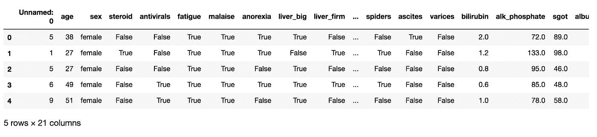

# 如何在 Python Pandas 中加载巨大的 CSV 数据集

> 原文：<https://towardsdatascience.com/how-to-load-huge-csv-datasets-in-python-pandas-d306e75ff276?source=collection_archive---------21----------------------->

## [理解大数据](https://towardsdatascience.com/tagged/making-sense-of-big-data)


图片来自 [Pixabay](https://pixabay.com/?utm_source=link-attribution&utm_medium=referral&utm_campaign=image&utm_content=3088958) 的 [xresch](https://pixabay.com/users/xresch-7410129/?utm_source=link-attribution&utm_medium=referral&utm_campaign=image&utm_content=3088958)

您可能有一个巨大的 CSV 数据集，它占据了您硬盘上 4 或 5 GB(甚至更多)的空间，您想用 Python `pandas`来处理它。也许你不需要数据集中包含的所有数据，只需要满足某些条件的一些记录。在这个简短的教程中，我将向你展示如何用 Python `Pandas`处理巨大的数据集。

我们可以采用四种策略:

*   垂直过滤器
*   水平过滤器
*   爆发
*   记忆。

你可以从我的 [Github 库](https://github.com/alod83/data-science/blob/master/Preprocessing/HugeDatasets/Load%20Huge%20Datasets%20in%20Python%20Pandas.ipynb)下载完整的 jupyter 笔记本。

# 垂直过滤器

在这种情况下，我们只加载整个数据集的一些列。我们可以使用`read_csv()`函数的参数`usecols`来只选择一些列。

```
**import** pandas **as** pd
df **=** pd.read_csv('hepatitis.csv', usecols**=**['age','sex'])
```

# 水平过滤器

在这种情况下，我们只加载数据集的一些行。我们可以选择起始行以及必须加载多少行。请记住，如果我们跳过第一行，我们必须将列名作为进一步的参数传递。

```
srow = 5
nrows = 50
columns = ['age','sex','steroid','antivirals','fatigue','malaise','anorexia','liver_big','liver_firm','spleen_palpable','spiders','ascites','varices','bilirubin','alk_phosphate','sgot','albumin','protime','histology','class']
df = pd.read_csv('hepatitis.csv', skiprows=srow, nrows=nrows, names=columns)
df.head()
```

# 爆发

可能会发生这样的情况，我们需要加载完整的数据集，但我们没有足够的内存来加载它。因此，我们可以批量加载它，然后应用一些过滤器，并将结果存储到另一个(更小的)数据集中。过滤器可以包括丢弃操作和从较大类型到较小类型的转换。

首先，我们定义一个名为`read_burst()`的函数，它读取第 I 个突发，执行一些过滤，然后将结果存储到另一个输出 csv 文件中。在我们的例子中，我们可以在`malaise = False`处删除行。我们传递起始行`srow`、突发大小`burst`和列名`columns`作为`read_burst()`函数的参数。当起始行等于 1 时，我们还必须将标题写入输出 csv 文件。这样我们定义了一个名为`header`的变量，如果`srow = 1`被设置为`True`。

```
def read_burst(srow,burst,columns):
    header = False
    if srow == 1:
        header = True
    df = pd.read_csv('hepatitis.csv', skiprows=srow, nrows=burst, names=columns)
    df = df.drop(df[df['malaise'] == False].index)
    df.to_csv('hepatitis_small.csv', mode='a',header=header)
```

现在我们可以遍历整个数据集。注意，我们必须预先知道 csv 文件的行数。这可以通过使用命令行勾选来完成。我们可以使用`wc` unix shell 命令。为了在 jupyther 笔记本中运行这个命令，我们必须使用`!`操作符。

```
**!** wc **-**l hepatitis.csv
```

它给出了以下输出:

```
156 hepatitis.csv
```

我们的文件包含 156 行，因此我们可以将要读取的最大行数设置为 156，因为第一行对应于标题。我们设置`burst = 10`。因此，我们有时读 100 本书。最后，我们再次运行`read_burst()`函数来加载最后剩下的行。

```
burst =10
srow = 1
nrows = 156
columns = ['age','sex','steroid','antivirals','fatigue','malaise','anorexia','liver_big','liver_firm','spleen_palpable','spiders','ascites','varices','bilirubin','alk_phosphate','sgot','albumin','protime','histology','class']
while srow < nrows:
    print('srow: ' + str(srow))
    read_burst(srow,burst,columns)
    srow = srow + burstread_burst(srow,nrows,columns)
```

现在我们可以加载较小的数据集。

```
df **=** pd.read_csv('hepatitis_small.csv')
df.head()
```



作者图片

我们可以删除`Unnamed: 0`列。

```
df.drop(columns**=**['Unnamed: 0'],axis**=**1,inplace**=True**)
```

# 存储格局

在 Python `pandas`中读取巨大数据集的另一个选择是增加与读取操作相关的内存。这可以通过`low_memory`参数来完成。

```
df **=** pd.read_csv('hepatitis.csv', low_memory**=False**)
```

# 摘要

在这篇简短的教程中，我展示了如何用 Python 处理巨大的数据集。我们了解到可以采用四种策略:

*   垂直过滤器
*   水平过滤器
*   爆发
*   内存配置。

如果你想了解我的研究和其他活动的最新情况，你可以在 [Twitter](https://twitter.com/alod83) 、 [Youtube](https://www.youtube.com/channel/UC4O8-FtQqGIsgDW_ytXIWOg?view_as=subscriber) 和 [Github](https://github.com/alod83) 上关注我。