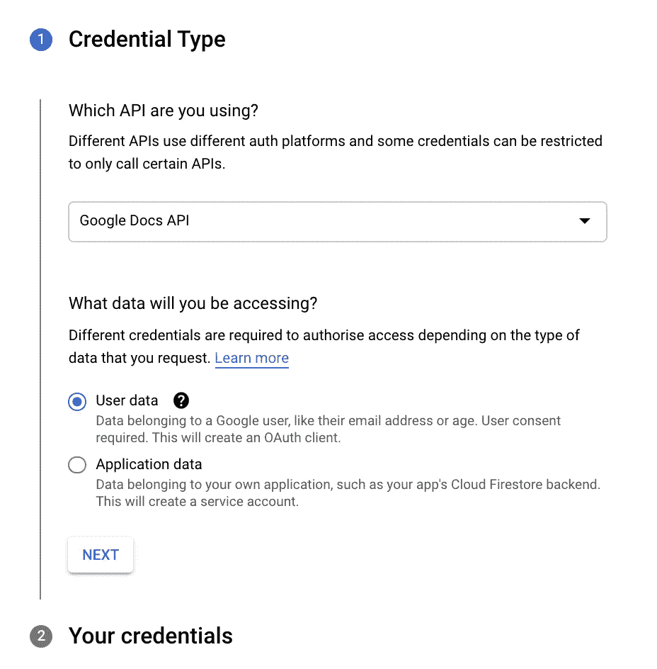
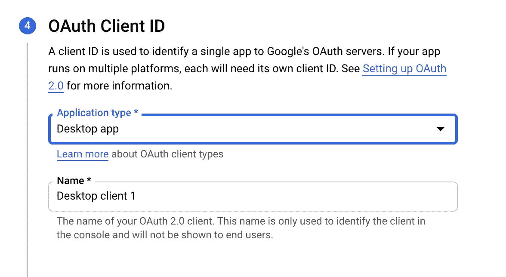
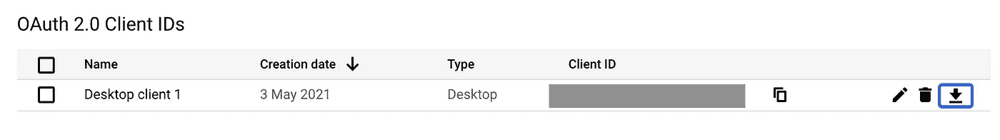

# 如何用 Python 加载 Google 文档的内容

> 原文：<https://towardsdatascience.com/how-to-load-the-content-of-a-google-document-in-python-1d23fd8d8e52?source=collection_archive---------14----------------------->

## 数据预处理

## 关于在 Python 中使用 Google Doc APIs 的快速教程


图片由[照片合成](https://pixabay.com/users/photomix-company-1546875/?utm_source=link-attribution&utm_medium=referral&utm_campaign=image&utm_content=1939255)来自 [Pixabay](https://pixabay.com/?utm_source=link-attribution&utm_medium=referral&utm_campaign=image&utm_content=1939255)

您可能在 Google Drive 中以 Google Doc 的形式存储了一个文档，并希望将其内容动态加载到 Python `pandas` DataFrame 中进行进一步处理。

首先，你需要访问[谷歌云平台](https://console.cloud.google.com/)并创建一个新项目，比如说 *MyProject* 。然后，您必须在主仪表板中选择创建的项目，并选择*explore and enable API*。你可以搜索谷歌文档 API，然后点击启用 API。启用后，您应该创建新的凭据。

可以选择 Google Doc API，查看用户数据，如下图所示。



作者图片

您可以按照向导完成凭据的创建。在第 4 部分 OAuth 客户端 ID 中，您可以选择桌面应用程序作为应用程序类型。



作者图片

现在您可以下载创建的秘密并将其重命名为`credentials.json`。将该文件放在将编写 Python 代码的同一个目录中。



作者图片

现在你可以下载并复制官方 [Google Doc API 文档](https://developers.google.com/docs/api/samples/extract-text)的代码，它允许你下载 Google Doc 文档的内容。确保你有权利阅读谷歌文档！！！

提取文本后，可以将其保存到本地文件中，然后转换成数据帧以供进一步分析。您将把文本的每一行作为一个新行存储在数据帧中。让我们假设您已经将 Google 文档的文本存储到一个名为`text`的变量中。

```
doc_content = body.get('content')
text = read_strucutural_elements(doc_content)
```

现在，您可以将它保存到本地文件中:

```
with open("my_doc.txt", "w") as text_file:
    text_file.write(text)
```

然后您可以重新加载该文件并将其转换为数据帧:

```
import pandas as pdwith open('my_doc.txt', 'r') as f:
    text = [line for line in f.readlines()]
df = pd.DataFrame(text,columns=['text'])
```

最终，您已经准备好处理您的数据了！好好享受吧！

# 摘要

在本教程中，我演示了如何通过官方的 Google Doc API 从 Google Doc 文档中加载文本，并将其转换为 Python `pandas` DataFrame。

这个过程很简单，但是需要一些重要的步骤，包括配置用来访问 Google Doc API 的凭证。

如果你想了解我的研究和其他活动的最新情况，你可以在 [Twitter](https://twitter.com/alod83) 、 [Youtube](https://www.youtube.com/channel/UC4O8-FtQqGIsgDW_ytXIWOg?view_as=subscriber) 和 [Github](https://github.com/alod83) 上关注我。

# 相关文章

<https://medium.datadriveninvestor.com/how-to-restore-the-original-layout-of-a-text-document-after-a-manipulation-in-python-8f3de41e8e95>  </how-to-extract-structured-information-from-a-text-through-python-spacy-749b311161e>  </automatic-update-of-django-models-from-a-google-spreadsheet-7c6d4f30e3ca> 