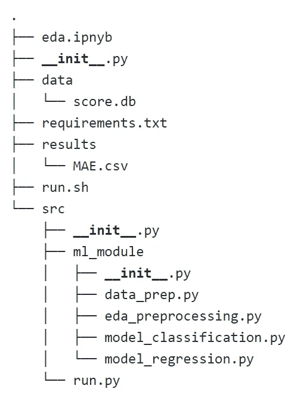
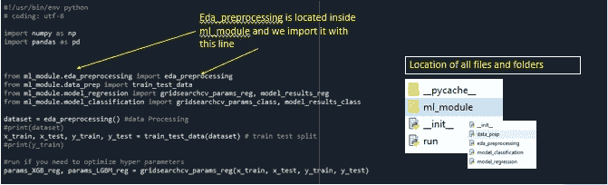
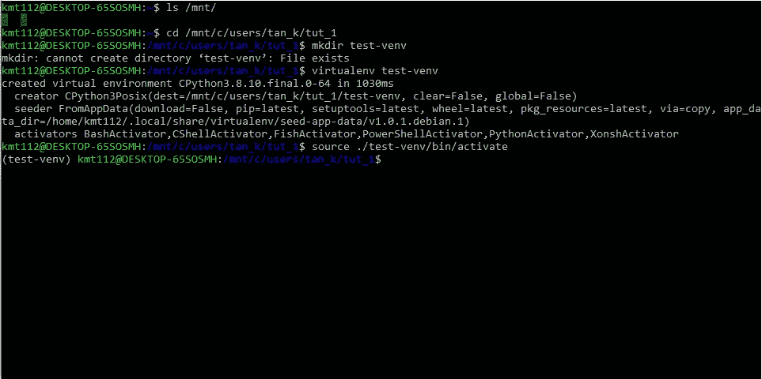
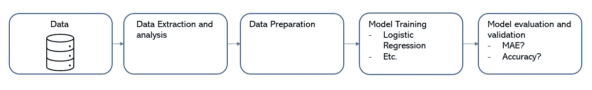
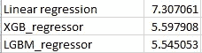
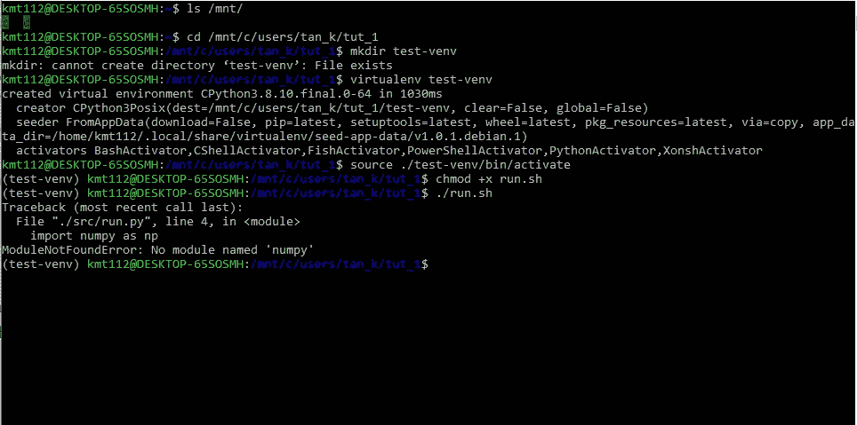
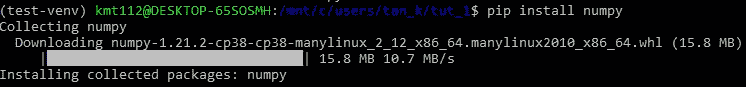

# 如何:机器学习管道(初学者)

> 原文：<https://towardsdatascience.com/how-to-machine-leaning-pipeline-beginner-2a736595cbfd?source=collection_archive---------9----------------------->


照片由 [JJ 英](https://unsplash.com/@jjying?utm_source=medium&utm_medium=referral)在 [Unsplash](https://unsplash.com?utm_source=medium&utm_medium=referral)

当我第一次开始我的机器学习之旅时，我只知道如何在 Jupyter 笔记本/google colab 中编码并运行它们。然而，当我试图在谷歌云和 AWS 中部署模型时，我发现越来越难以仅仅为了调整某些参数而检查代码行。如果有人只想用一个命令行运行全部代码，这就特别麻烦了。虽然网上有大量的资源，但我认为最好还是列出一个最佳实践的列表，并详细解释每个最佳实践的作用。

在本文中，我将介绍一个简单的回归和分类问题所需的各种组件和模块。整行代码将被分成多个模块，用一行代码编译。

所有文件都可以在这个 [github](https://github.com/kmt112/ML_Pipeline_Example) 资源库中找到。

请注意，在这个练习中，我将使用 Windows 操作系统。

**先决条件:**

1.  安装 Ubuntu LTS。记得安装长期支持版本。
2.  Spyder(蟒蛇 3)。我发现 spyder 界面更好运行。py 文件，也就是说。这完全是我自己的喜好，请随意使用你自己的编辑器。
3.  Python 3。确保 python3 安装在您的计算机或指定的文件夹/驱动器中。
4.  熟悉书写功能。在这篇文章中，我们会用到很多。

**文件和文件夹概述**



机器学习管道的树形图

**数据文件夹**

这是您存储数据的地方，以便您的机器学习管道从中提取数据。在本例中，我拥有的数据库位于。db 格式。

**Requirements.txt**

该文本文件夹包含所有必要的软件包，你应该安装，以使您的回购工作。一种快速提取所有相应库的方法

```
pip3 freeze > requirements.txt  # Python3
pip freeze > requirements.txt  # Python2
```

**Bash 文件(Run.sh)**

run.sh 文件初始化 run.py 文件，后者依次运行所有其他模块，如数据提取、数据处理和 ML 模型。

```
#!/usr/bin/env bash
python ./src/run.py
```

第一行也称为 shebang。想了解更多可以参考链接。Run.sh 运行位于 src 文件夹中的 python 文件。

**SRC(源)**

如前所述，run.py 模块提取在其他 python 文件中创建的函数。所创建的函数将在本文的第 3 步和第 4 步中解释，但现在只需知道它激活了在其他。py 文件。



运行. py 文件

# 第一步。将 ubuntu LTS 挂载到虚拟环境中

在开始任何项目之前，你会想把 ubuntu 挂载到一个驱动器上，这样它就可以访问你的文件。当你第一次打开你的 ubuntu 时，输入 ls /mnt/看看你能挂载到哪个驱动器上，假设你希望挂载到 c 盘上，命令是 cd /mnt/C/ <folder>。之后，您可以导航到存储数据的驱动器。更多信息，请点击这个 [YouTube](https://www.youtube.com/watch?v=xzgwDbe7foQ) 视频。</folder>

现在你的 Ubuntu 已经挂载到了某个驱动器或文件夹中，你可以继续安装你的虚拟环境了。如果你没有使用 python3，你可以 pip 安装它。

```
mkdir test-venv ## this creates a drive called test-venv
virutalenv test-venv ## install new virtual environment inside the directory
source ./test-venv/bin/activate ## activate your new environment.
```



Ubuntu 平台

如果您看到类似这样的内容，请不要关闭它，我们将在第 7 步中讨论它。

# 第二步。规划你的机器学习管道。

想想你希望你的数据如何在你的项目中流动，并最终形成见解。一个简单的、典型的机器学习管道将如下图所示。



典型的基本机器学习管道

在这个例子中，我将坚持流水线化机器学习模型的标准过程。

# 第三步。数据提取/数据准备/

**数据提取**

大多数数据库都是关系数据库，存储在。db 文件格式，因此您可以使用 SQL 提取它。我包含了一个[链接](/what-is-data-extraction-python-review-of-json-xml-apis-sql-and-csv-formats-a5470afc27b6)来展示我们如何提取不同类型的数据集。该函数输出提取的数据帧，该数据帧将被输入到数据准备 python 文件中。

**数据准备**

这个 python 文件包含了各种可以对测试分割进行特征工程、编码和训练的方法。

本文件定义的函数输出 4 个数据帧 *x_train* 、 *x_test* 、 *y_train* 、 *y_test* 。这 4 个数据帧将被输入到模型训练中。

在这个例子中，我对顺序特征使用了目标编码器，并通过 get_dummies 将分类特征转换为数字特征。然而，我建议你尝试不同的编码器，看看哪种帮助最大。

# 第四步。模特培训

这是建模发生的地方。我在这一部分添加了一个超级参数调整。但是，您可以选择将 hyper parameter tuning 分成不同的部分。

该函数输出 XGBoost、普通线性回归和 LGBM 的平均绝对误差。

# **第五步。模型评估和验证**

建模的结果输出到主 run.py 脚本中。然后，run.py 脚本将结果连接起来，并输出到一个 CSV 文件中，以便于比较。此后，由您决定使用哪种模型。



虽然 LGBM 能产生最好的结果，但考虑利益相关者的其他重要要求也很重要。一些例子是模型的可解释性或模型所需的训练时间，这些因素会影响最终的决策。

# **第六步。Run.py**

现在我们已经编写了 ML 管道的所有构件。现在是时候创建一个主 python 文件了，它结合了所有模块的所有输入和输出。

我之前解释过模型如何从各种函数中获取数据并输出它们。检查您是否将各种文件以正确的名称放在了正确的文件夹中，这一点很重要。如果需要帮助，请参考文件夹概述。

# 第七步。Run.sh

您所要做的就是创建一个 bash 脚本来运行。py 文件。回到 ubuntu IDE。

```
#!/usr/bin/env bash 
python ./src/run.py
```



```
chmod +x run.sh
./run.sh
```

现在，当您尝试运行 bash 脚本时，您可能会看到 numpy 或其他一些包没有安装。出现这种情况的原因是因为你在虚拟环境中。因此，你能做的就是 pip 安装你需要的各种包。



现在你所要做的，就是一个接一个地慢慢安装你需要的软件包。安装完所有必需的软件包后:

```
pip3 freeze > requirements.txt
```

从这里，您将获得保存在您的文件夹中的 requirements.txt。当您想要共享代码时，需求列表尤其重要。然后，用户可以看到需要哪些软件包，并可以快速安装它们。

# 结论

在这个练习中，我们学习了所需的各种 ML 模块，以及如何通过 ubuntu 使用 bash 运行它们。您还可以做其他一些改进，比如创建一个配置文件来存储您希望优化的所有变量。此后，您只需要更改配置文件来测试模型的不同变量。我希望你从这里学到一些东西，并一如既往地快乐编码！

*如果有任何错误请联系我，我会做出必要的修改。*