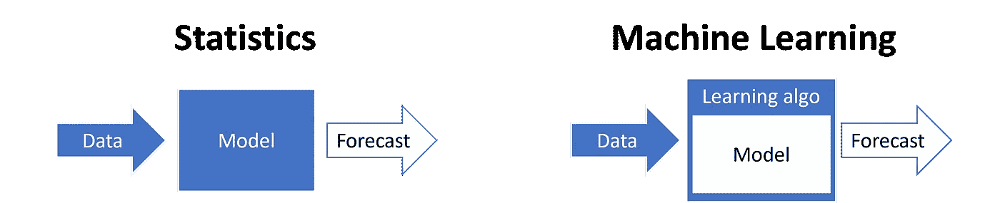
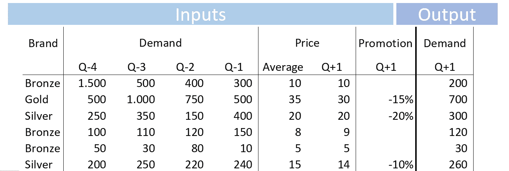
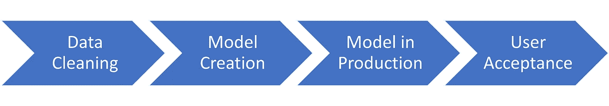

# 如何:机器学习驱动的需求预测

> 原文：<https://towardsdatascience.com/how-to-machine-learning-driven-demand-forecasting-5d2fba237c19?source=collection_archive---------6----------------------->

## 在这篇非技术文章中，我将解释什么是机器学习，它是如何工作的，以及在预测需求时使用它可以得到什么。我们还将讨论启动 ML 计划时的陷阱和最佳实践。

[信用](https://pixabay.com/illustrations/artificial-intelligence-network-3706562/)

# 什么是机器学习

通常的统计模型将一组*已知的*关系应用于数据集。例如，指数平滑法将有其估算潜在需求水平和趋势的方法。

</simple-exponential-smoothing-749fc5631bed>  

另一方面，机器学习是让算法自己理解数据集及其底层关系。

统计模型与机器学习模型。来源:[我的需求预测培训](https://supchains.com/)。

## 机器是如何学习的？

机器学习算法将在数据集上运行，查看*数据特征*，并(试图)找出任何潜在的关系。

在处理机器学习模型时，您需要注意两个主要方面:

*   赋予模型的数据(特征)。
*   你的机器学习模型的超参数。

选择正确的数据输入模型非常重要。数据科学家不应该独自考虑使用什么数据；每个人都应该帮忙。创建预测算法时，您应该问自己以下问题:

> 如果我必须对下个月我们将销售多少产品进行需求预测，我会问自己什么问题？

当您问自己和您的团队这个问题时，您将会看到对您的模型最有意义的信息。

以下是几个典型的回答:

*   我的产品目前的价格是多少，在过去的几个月里有变化吗？
*   我的产品的月平均销售额是多少？
*   该产品最近缺货吗？
*   我们目前正在进行一些促销活动吗？

通过向您的 ML 模型提供相关数据，它将能够更准确地预测未来需求。

机器学习模型的典型输入。来源:[我的需求预测培训](https://supchains.com/)

</machine-learning-for-supply-chain-forecast-66ef297f58f2>  

# ML 驱动的需求预测能带来什么？

许多公司对使用机器学习模型来预测他们的销售期望过高或过低。如果你期望和承诺太多，高层管理人员会感到沮丧，需求计划者会变得谨慎，不愿意使用一个承诺过多的工具。另一方面，如果你对 ML 的期望太低，你将永远不会启动一个数据科学计划，它将被证明具有非常高的投资回报率。

## 通过使用机器学习，你能期望多高的预测准确度？

最近的预测竞赛(如 [M5](https://www.researchgate.net/publication/344487258_The_M5_Accuracy_competition_Results_findings_and_conclusions) 和[corporacio n Favorita](https://arxiv.org/pdf/2009.07701.pdf))显示，与预测基准相比，误差减少了 20%至 60%。intermarché比赛略有减少，但这是由于使用了对数标度(见下面我的网上研讨会)。

> 自 2018 年以来，所有需求预测比赛都是机器学习获胜。你还在等什么？

欲了解更多信息，请参见卡斯帕·索尔海姆·博伊尔&延斯·彼得·梅尔德加德 撰写的《从卡格尔的预测竞赛中学习》。

在此[注册](https://supchains.com/newsletter/)，了解未来的网络研讨会。

根据我自己的咨询经验，与移动平均相比，通常的机器学习项目会导致预测误差降低 5%至 20%。

通常，随着数据越来越多，这种精确度的提高会越来越高。例如，通过提供更多的需求驱动因素(历史库存水平、促销、营销、定价)或通过每日或每周级别的预测。

## 机器学习和需求计划者

请注意，通过提高预测基准的准确性，您也将提高整体预测流程的准确性，因为您的需求计划团队将能够在需要时编辑预测(他们几乎总是能够增加一些额外的准确性)。例如，假设您当前的预测引擎达到了 50%的准确率，而您的团队由于他们的工作通常可以将准确率提高到 55%。通过更新模型和使用机器学习，可以达到 55%的基线准确率。那么你的团队可能会进一步提高到 57%或 58%。

需求计划员总是可以通过使用模型不知道的信息(例如，通过与客户交流)来改进模型的预测。

> 机器学习模型不会让你的需求规划团队过时——但它们可能会减少他们的工作量。

# 使用机器学习的陷阱

启动机器学习计划需要关注几个关键方面。如果你错过了它们，你很可能无法交付成果。

## 数据质量

不要用销售数据！你应该预测需求，而不是销售。

> 糟糕的数据会打败优秀的预测者。每次都是。

</capturing-unconstrained-demand-in-supply-chains-78b46bae1b28>  

## 预期

如上所述，承诺太多，你会失望(并面临最终用户的抵制)。但是，从另一方面来说，承诺太少，项目就不会有吸引力。

## 不良流程

> 需求预测的目的不是要准确。而是帮助你的供应链做出正确的决定。

简而言之，如果你预测的不是正确的事情，那么提高预测的准确性是没有意义的。因此，首先，您应该确保在正确的汇总级别预测您的需求。然后努力改进我们的模型。

例如，许多公司按市场逐月预测需求。而他们需要每周将库存从他们的工厂部署到世界上的几个仓库。关注仓库的每周需求预测比关注市场的每月需求预测更有意义。

> 首先，修复流程。然后，完善模型。

</the-4-dimensions-forecasting-framework-f7884ec1472>  

## 错误的指标

我仍然看到许多供应链使用 MAPE 作为预测指标。除非你确定你跟踪的是正确的指标，否则运行任何预测改进都是没有意义的。

</forecast-kpi-rmse-mae-mape-bias-cdc5703d242d>  

许多供应链也在很大的价格范围内销售不同的产品。价值 1 美分的产品的预测误差不如价值数百欧元/美元的产品的类似预测误差重要。

我提倡供应链跟踪 wMAE(价格加权 MAE)和 wBias(价格加权偏差)。将这两个指标结合起来，将使您能够关注最重要的产品，并确保不会有一个有偏见的模型。

# 使用机器学习预测需求的最佳实践

## 项目管理

召集一个有动力、思想开放、好奇、敬业的团队(你需要不同的个人资料)。根据我的经验，机器学习之旅的开始是最困难的:你需要收集和清理数据，而不促进任何短期的成功。这就是为什么你需要一个积极的团队，花必要的时间收集相关数据。

您还必须评估您的模型应该使用什么需求驱动因素。

📊**外部数据**。请注意，外部数据可能既昂贵又不一致。例如，许多外部提供商将在几个月后共享市场信息，并且基于不符合您要求的粒度。避开就好。

🌦️的天气。天气会影响许多供应链:你会根据天气卖出或多或少的东西。不幸的是，你无法提前几天准确预测天气。我通常以冰淇淋为例:销售受阳光的影响很大，但你无法提前四周预测天气来计划你的生产。

## 数据科学

在做需求预测项目时，我喜欢遵循下面强调的步骤。

版权所有:Nicolas Vandeput(来自我的[需求预测培训](https://supchains.com/)

正如您所看到的，在开始收集数据和创建模型之前，有一个明确的目标(在粒度、范围和度量方面)是至关重要的。

您应该对照未用于训练模型的测试集来验证结果。例如，除了用于训练模型的数据集之外，保留几个月的需求。然后，您可以在这些看不见的时间段内测试它，以评估它的准确性。

# 项目时间表

版权所有:Nicolas Vandeput(来自我的[需求预测培训](https://supchains.com/))

## 1️⃣数据收集和清理

👩‍💻**电力用户**

在第一阶段，您将收集和清理历史需求和需求驱动因素。请注意，获取一些需求驱动因素的数据可能需要几个月的时间(并且需要时间密集型工作)。相反，您可能希望直接进入第 2 步，稍后使用更多数据尝试另一个模型。

✔️Skip:如果你已经在当前的预测软件中使用了相关数据，请执行这一步

## 2️⃣模型创建

👩‍🔬**数据科学家**

数据科学家将使用不同的数据特征尝试不同的模型，直到他们获得想要的结果。

## 生产中的 3️⃣模型

👩‍💻**数据工程师**

一旦你有了一个工作模型，你就可以把它从“手动/本地计算机”设置转移到“自动/云”设置。

请注意，将工作模型从本地机器转移到云中(并使之自动化)所花费的时间可能不值得。我见过一些项目花费三个月的时间将一个工作模型转移到云上，希望每周节省 10-30 分钟的手工工作。

✔️:如果您同意每周/每月手动运行一次模型，请跳过这一步

## 4️⃣ **用户接受度**

👨‍💼**项目经理**

模型准确性应根据**未来未知数据进行测试。**这是评估预测质量的唯一方法。请记住，将您的模型所实现的准确性与简单基准(见下文)、您当前的预测引擎以及您的一致预测所实现的准确性进行比较。

<https://nicolas-vandeput.medium.com/assessing-products-forecastability-forecasting-benchmarks-vs-cov-2bdac1e7fd5f>  

不要犹豫，做一些平行运行，以确认新的模型工作正常。

本文基于我之前的一次网络研讨会。在此注册[以获得未来的通知。](https://supchains.com/newsletter/)

# 问与答(Question and Answer)

## 使用机器学习来预测需求，我们还能期望多高的准确度？

通常，机器学习模型比最先进的预测软件高出 5%至 15%。随着更多数据的可用，可以实现更高的准确性(需求驱动因素)。

## 如何启动概念验证(POC)

1.  收集初始数据(您可以使用当前的统计工具数据)
2.  优化模型
3.  试运行几次
4.  成功？实施您的解决方案！