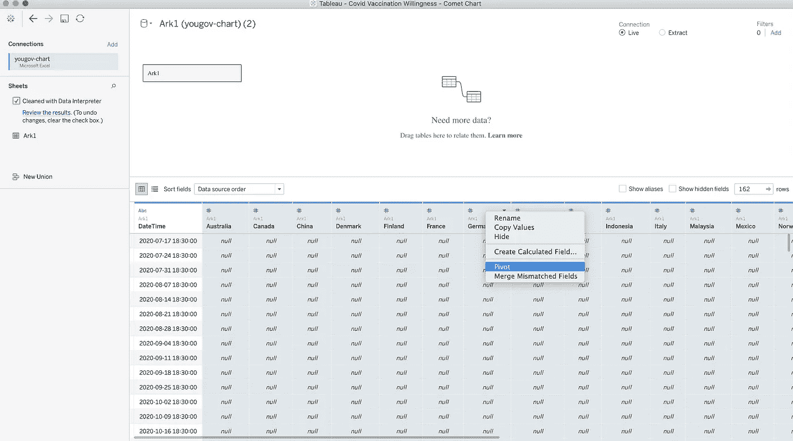
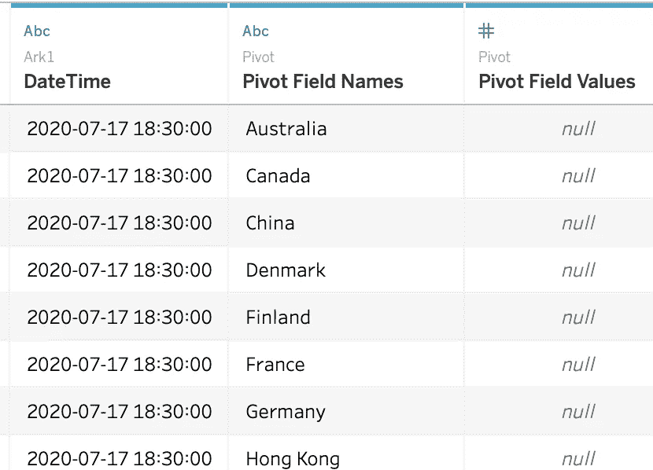
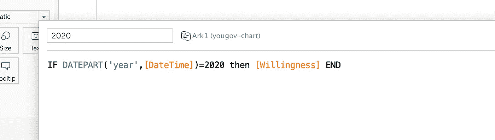
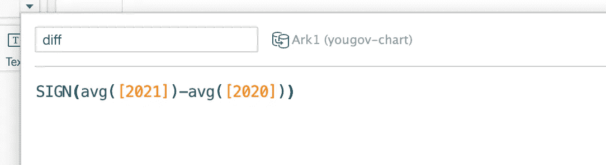
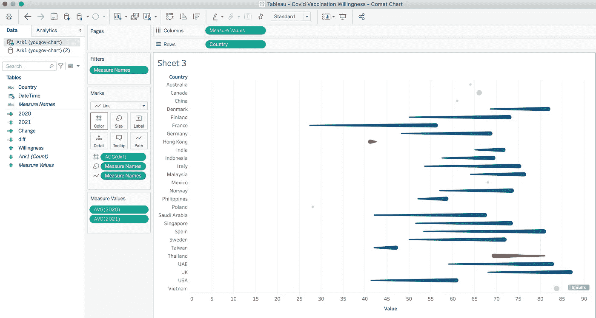
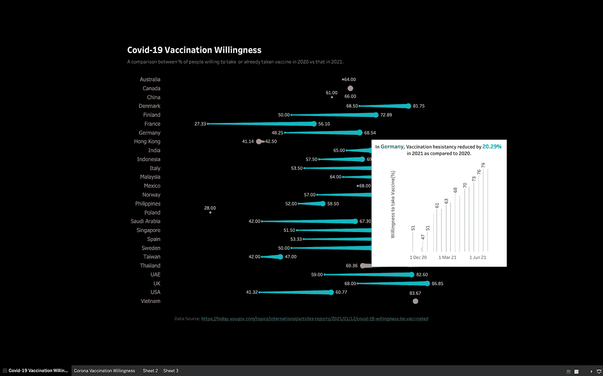

# 如何在 Tableau 中制作彗星图

> 原文：<https://towardsdatascience.com/how-to-make-a-comet-chart-in-tableau-b5c23e3dc58b?source=collection_archive---------22----------------------->

## 我喜欢用数据讲故事。因此，我一直在寻找创造性的方法来表示数据。

Justin W 在 [Unsplash](https://unsplash.com?utm_source=medium&utm_medium=referral) 上的照片

彗星图，顾名思义，基本上类似于条形图，但有一个方向。所以，当你想展示比较时，它们很有用。例如，彗星图可以用来漂亮地描绘 2019 年和 2020 年的销售情况。尽管这个概念有意义，但由于应用方面的原因，它并没有被广泛使用。

我最近决定使用它，我喜欢我所看到的。因此，我今天写信来尽可能简单地说明如何建立一个。

我们开始吧。

## 1.获取数据集

当您想要比较两个维度之间的一些度量时，彗星图最有效。所以，我决定使用新冠肺炎疫苗意愿数据集。你可以从[这里](https://today.yougov.com/topics/international/articles-reports/2021/01/12/covid-19-willingness-be-vaccinated)得到。

## 2.连接到数据集

下载的数据集是 xls 格式文件。当我试图将它作为数据源连接时，它抛出了错误。因此，您可能希望在 excel 中打开并另存为。然后尝试重新连接。

## 3.数据操作

数据集是宽格式的，如下所示。我们需要把它转换成长格式。

因此，一旦您将文件连接为数据源，单击除 DateTime 之外的所有列的顶部，右键单击并选择 Pivot。

作者图片

您的数据现在应该是这样的。将透视字段名重命名为 Country，将值重命名为 Willingness。

作者图片

接下来，我们需要创建几个字段-

**2020 年意愿**

作者图片

**2021 年意愿**

作者图片

**两者的区别**

作者图片

符号函数给出计算的符号。正数用 1 表示，负数用-1 表示，零用 0 表示。这将用于突出衡量标准的积极和消极变化。

## 4.拖放！

现在，只需将 Country 拖到 Rows shelf，将 measure 值拖到 column shelf，就像处理水平条形图一样。

*   将平均意愿 2021 和平均意愿 2020 添加到测量值卡。
*   将度量名称拖至路径和大小。
*   将符号字段(在我的例子中是 diff)拖到 colour。

瞧啊。彗星图准备好了。您的输出将如下所示。

作者图片

你可以进一步定制它，比如添加标签，改变表单格式，在工具提示中添加更多信息等等。

这是我的最终版本。我在工具提示中添加了每个国家的详细趋势以及变化百分比。

作者图片

你可以在这里找到完整的 viz。

我希望这些信息对你有用！请在评论中留下任何问题。

快乐学习！