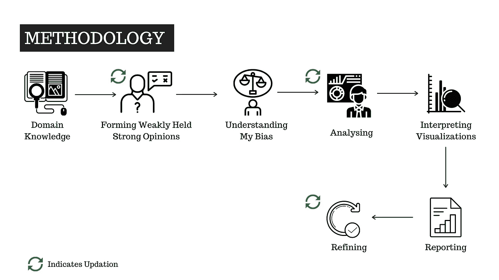
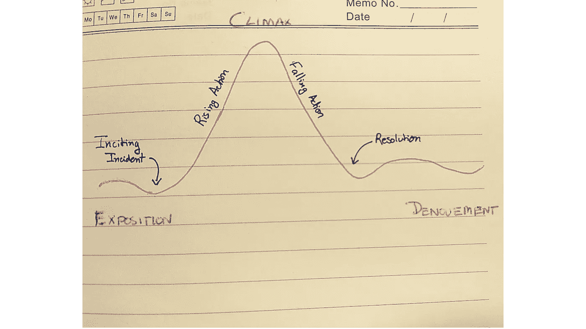
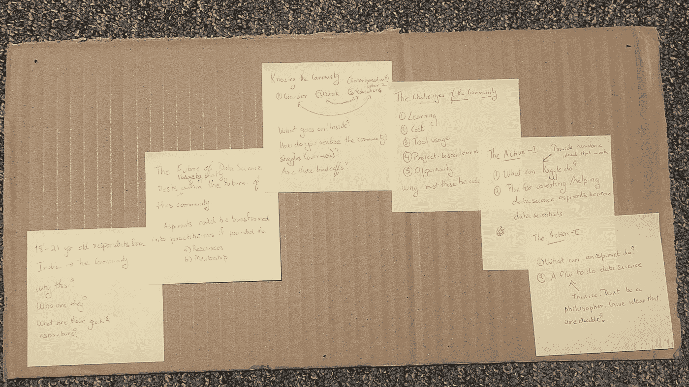

# 如何创建人们想要阅读的数据分析项目

> 原文：<https://towardsdatascience.com/how-to-make-a-data-analytics-project-that-people-want-to-read-47caea306570?source=collection_archive---------17----------------------->

## 让你的工作引人注目的 8 个可行建议

([来源](https://www.canva.com/media/MADmwGXt1oQ))

在一个领域建立自己的事业，最重要的部分是通过自己的工作为人所知。谈到数据分析，[拥有令人印象深刻的项目来展示你的知识和专长胜过所有其他方法，包括认证和课程](/sorry-online-courses-wont-make-you-a-data-scientist-8639d5f00889)。

那么，如何建立一个令人印象深刻的项目呢？更重要的是，是什么让一个分析项目令人印象深刻？

在这篇文章中，我向你展示了 8 个帮助我成为 [Kaggle 笔记本专家的技巧，它们帮助我在不同的数据集上建立叙述](https://www.kaggle.com/thedatabeast)。那么，事不宜迟，让我们开始吧。

# 提示 1:选择你的分析目标，而不是你想要使用的工具

> “永远记住，你的关注点决定了你的现实”——乔治·卢卡斯

人们很容易迷失在不断进入我们思维的一套奇特的数据可视化软件包中。虽然学习新工具没有错，但是在从事一个项目时，必须有某种节制。

分析项目的最终目标不是炫耀新工具的知识，而是在提供的数据中发现有用的模式。因此，集中精力询问数据问题比担心必须使用哪种工具更有成效。

当然，有些情况下，由于项目的需求，你可能更喜欢一个库而不是另一个。在这些情况下，在决定要使用的库方面做一些工作是有意义的。但是请注意，不要让您选择的库或语言来指导您的分析！

# 技巧 2:准备好一套方法

> “如果你不能把你在做的事情描述成一个过程，你就不知道你在做什么。”——w·爱德华兹·戴明

[方法论本质上是指导研究的上下文框架](https://en.wikipedia.org/wiki/Methodology)。简单地说，在分析项目的环境中，它可以帮助你在进行项目时坚持一个过程。

拥有一个方法是很重要的，因为拥有一个方法可以确保你有一个[清晰定义的途径来实现你的目标](https://www.ibmbigdatahub.com/blog/why-we-need-methodology-data-science#:~:text=Those%20who%20work%20in%20the,that%20will%20improve%20future%20outcomes.)。此外，当你必须向他人解释你的项目时，一种方法会变得非常有效。

这是因为从数据采集阶段开始到结果沟通阶段，你完全控制你所采取的每一个步骤；以及其他所有中间步骤！

拥有方法论的一个鲜为人知的好处是它*加深了你对项目*的思考。例如，我在我的项目中加入了一个步骤[“理解我的偏见”](https://ry05.github.io/2020-08-30-us-police-abuse/)，在那里我分析了[美国警察的种族暴力](https://www.kaggle.com/thedatabeast/understanding-the-extent-of-police-abuse-in-the-us)。这种包含帮助我确保我的发现不受我内在偏见的影响。

这一方法中的第二步和第三步是确保我的结果没有偏差的关键(鸣谢:作者，[来源](https://ry05.github.io/2020-08-30-us-police-abuse/))

# 技巧 3:头脑风暴，就像你的生活依赖于它一样

> “获得好想法的最好方法是获得大量的想法，把不好的扔掉。”——莱纳斯·鲍林

第一次尝试分析一个数据集总是会非常混乱。特别是如果它有很多实例和功能，如 [Kaggle Survey Challenge 2020 数据集](https://www.kaggle.com/c/kaggle-survey-2020)。

这就是头脑风暴变得重要的地方。简单地说，[头脑风暴是通过让这些想法](https://www.modernanalyst.com/Resources/Articles/tabid/115/ID/2067/Using-the-Brainstorming-Technique-in-Business-Analysis.aspx)从头脑中自由流动到物理(纸张)或数字(计算机)位置来产生新想法。

虽然头脑风暴的大多数定义称之为团队过程，但有[研究支持个人头脑风暴比团队会议产生更高质量想法的论点](https://onlinelibrary.wiley.com/doi/abs/10.1002/ejsp.2420030402)。

在为您的数据分析项目单独进行头脑风暴的背景下，有 3 个有用的步骤可以帮助您开始。

1.  **阅读数据集描述** —你认为收集数据的人最优先考虑的是什么？
2.  **阅读功能描述** —根据您的意见，哪些功能最符合步骤 1 中的主要优先级？
3.  **阅读以前的工作**——如果有人在过去使用过相同或相似的数据，请查阅它们

在这之后，你将能够把你产生的所有想法写在一张纸上(或者一个数字记录，如果你不是像我一样的守旧派)。是的，头脑风暴就像你的生活取决于它。坚持写下你可以用来分析你的数据的想法，直到你头脑枯竭。

*头脑风暴是你分析的支柱*，因此必须彻底考虑。

# 提示 4:进行初步分析，以确定最有希望的叙述

> “因为我们不认为我们知道一件事，直到我们熟悉它的主要条件或首要原则，并进行我们的分析，直到它的最简单的元素”——亚里士多德

在你的头脑风暴会议之后，你可能有多个想法想要作为你的分析的叙述。然而，如果你希望你的作品清晰有力，你应该只选择一个主要观点。

为了做出这个选择，快速启动您的系统并编写一些代码来执行初步分析会有所帮助。这可能是你的[探索性数据分析](https://www.itl.nist.gov/div898/handbook/eda/section1/eda11.htm)的一部分，因此需要在聚焦于最有希望讲述的故事之前，将手头的数据可视化。

例如，在今年的 2020 年 Kaggle ML 和 DS 调查挑战中，我通过初步分析发现[与调查中的其他任何一组受访者相比，21 岁以下的印度受访者增长最快](https://www.kaggle.com/thedatabeast/the-rise-of-data-science-interest-in-india/)。这帮助我为接下来的分析建立了我的案例。

# 技巧 5:使用故事板来构建你的叙述

> “对我来说，故事板是预先想象整部电影的方式”——马丁·斯科塞斯

说到用数据讲故事，我个人认为 Cole Nussbaumer Knaflic 是该领域最有头脑的人之一。虽然她通过她的[书籍](http://www.storytellingwithdata.com/books)和[多次演讲](https://www.youtube.com/watch?v=8EMW7io4rSI&feature=youtu.be)传播了大量的想法，但我发现其中一个想法非常足智多谋，那就是[故事板制作过程](http://www.storytellingwithdata.com/blog/2015/8/24/how-i-storyboard)。

正如专业作家所说，一个好的故事有 5 个部分——阐述、上升动作、高潮、下降动作和结局。在您的数据分析项目的上下文中，您可以遵循类似的结构来制作您的故事板。

介绍你拥有的数据，进入你的分析或主要目标的“为什么”,分析你选择的子目标，报告洞察力，同时将它们与你的主要目标联系起来，最后结合你的所有发现，选择最重要的，并报告它们作为相关利益方可以采取的决定。

5 部分故事结构(鸣谢:作者，灵感来自[来源](https://blog-cdn.reedsy.com/directories/admin/featured_image/105/large_3417868821bc15e4c64f2a4f83729d78.jpg))

我用于 Kaggle 2020 调查分析挑战的故事板(致谢:作者)

# 秘诀 6:这不是关于你，而是关于他们

> “这不是关于你，这是关于他们”——克林特·伊斯特伍德

转到一个更哲学的观点，我敦促读者理解，我们进行的任何分析从来都不是只为我们的眼睛。分析工作的影响*只与它对所涉及的利益相关者*的有用程度相关。

因此，如果没有必要，就不要在报告中添加图表。仅仅因为你努力工作，并不意味着你需要炫耀它。如果它与你的整个分析不一致，它必须看到回收站的内部。

同样重要的是，确保您能够将您的结果与利益相关者可以实现的可操作目标联系起来。

此外，确保你永远不会用没有意义的视觉效果误导你的观众。

# 技巧 7:获得一些初步反馈

> “反馈是冠军的早餐”——肯·布兰查德

你的分析的第一份完整草稿必须总是与那些对你正在讲述的故事的主题毫无概念的人分享。

这是有效的，原因很简单——如果一个没有主题 X 背景的人能够理解并欣赏你讲述的关于主题 X 的数据驱动的故事，那么这意味着*你的叙述是连贯的、清晰的和引人入胜的。*

如果这种情况没有发生，那么是时候回到绘图板，重新开始你的叙述了。重复，直到你达到目标！

请记住，反馈不是为了让你开心，而是为了改进。所以，[如果你听到你不喜欢的东西，不要怀有敌意！](https://leadershipfreak.blog/2017/09/21/7-ways-to-receive-feedback-you-dont-like/)

# 技巧 8:注意细节

> “好东西和伟大东西的区别在于对细节的关注。”——查尔斯·r·斯温多尔

即使是很小的事情，比如你的情节主题，你在报告中使用的字体和颜色，都会对读者如何看待你的作品产生深刻的影响。

作者非常关注细节的最好的分析例子之一是安德拉达·奥尔特亚努的[鸟鸣识别 EDA。甚至视觉效果也与鸟儿的配色方案相匹配！](https://www.kaggle.com/andradaolteanu/birdcall-recognition-eda-and-audio-fe)

一致性是分析报告的另一个非常重要的方面。你不需要华丽的报告。你需要一份极简的报告，讲述已经分析过的数据的故事。

# 对我有帮助的其他提示

以下链接包含了一些最好的数据分析师和故事讲述者的建议，他们对我的旅程产生了巨大的积极影响

1.  [John Miller 的“分析报告的一些最佳实践”](https://www.kaggle.com/jpmiller/some-best-practices-for-analytics-reporting)
2.  [Rachael Tatman 的《通向更专业的数据科学代码的六个步骤》](https://www.kaggle.com/rtatman/six-steps-to-more-professional-data-science-code)
3.  [本·威灵顿的《通过讲故事让数据更有意义》](https://www.youtube.com/watch?v=6xsvGYIxJok)
4.  [David McCandless 的《数据可视化之美》](https://www.youtube.com/watch?v=5Zg-C8AAIGg)

希望这是一个有用的阅读！干杯:)