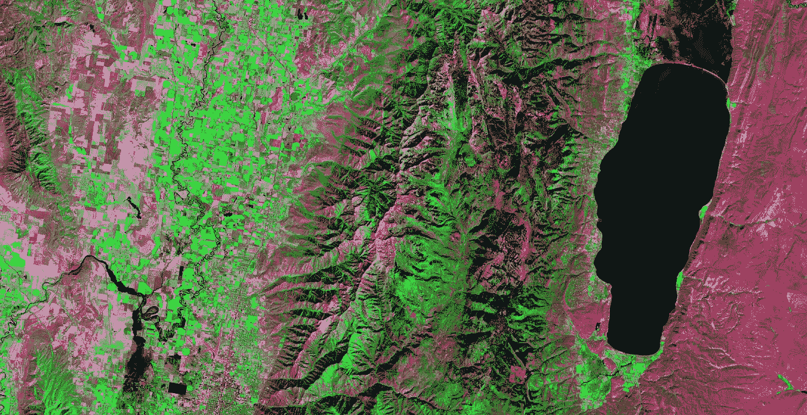
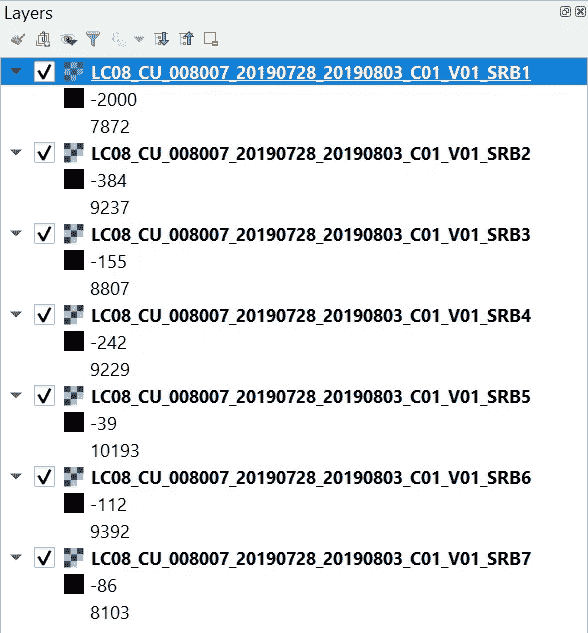
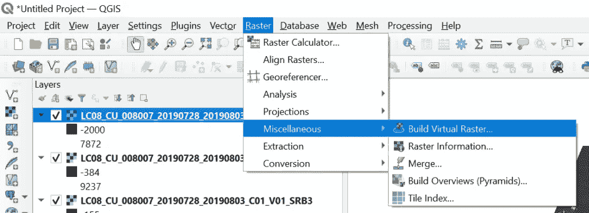
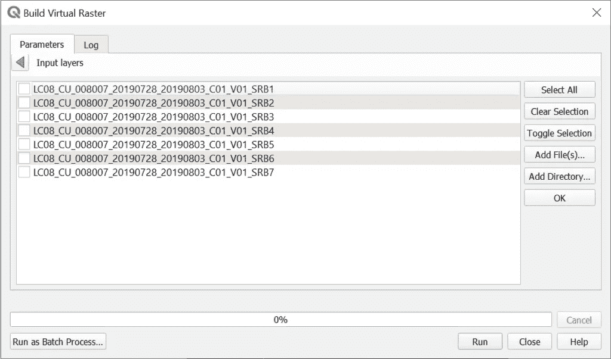
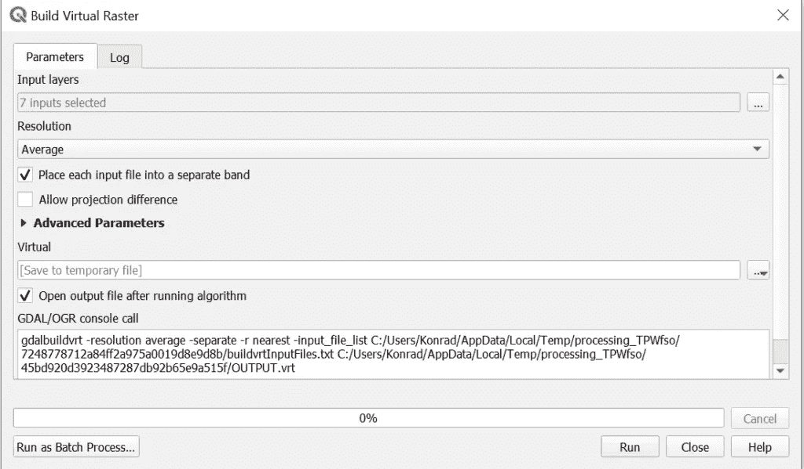
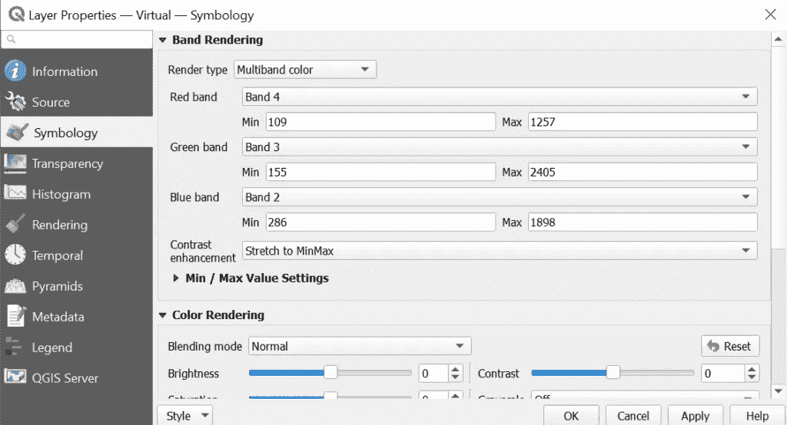
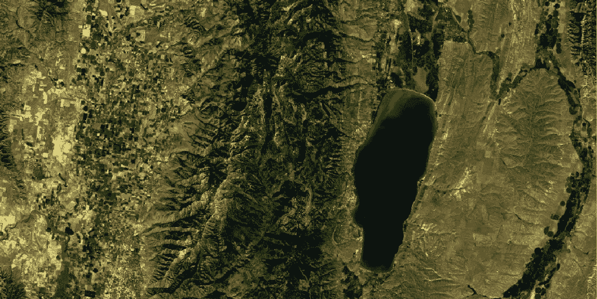
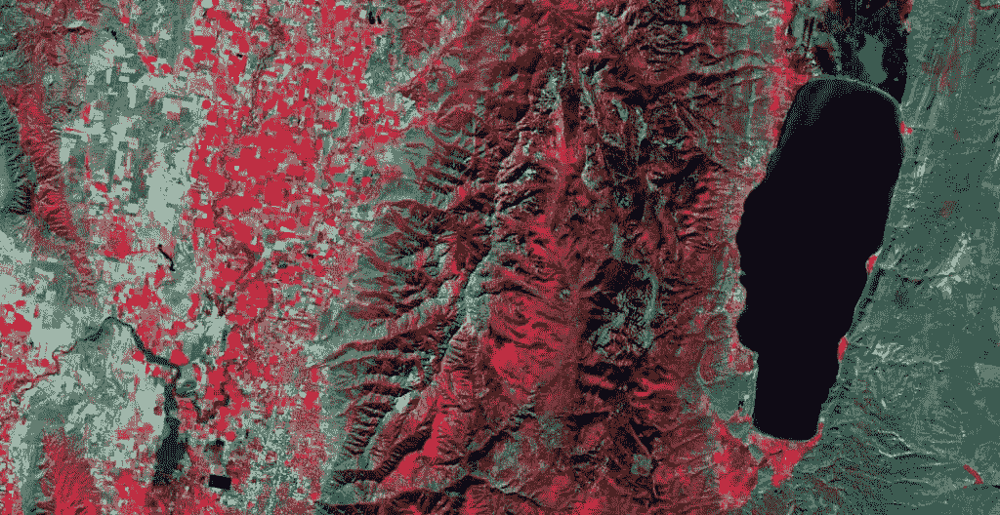
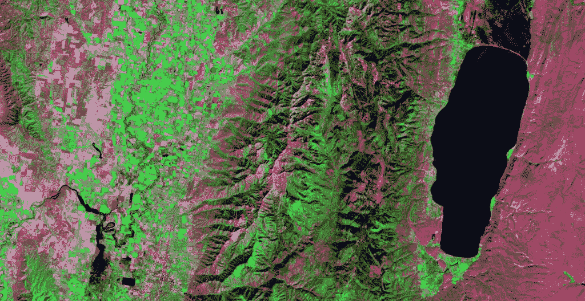
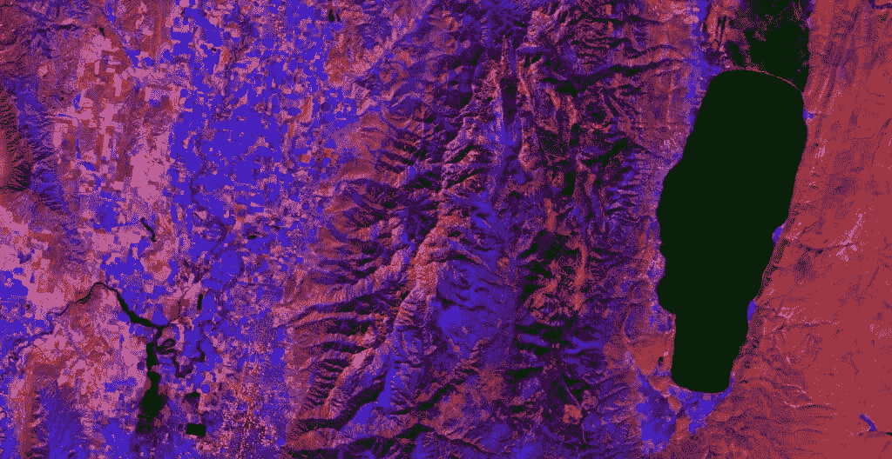

# 如何在 QGIS 中制作假彩色卫星影像

> 原文：<https://towardsdatascience.com/how-to-make-a-false-color-satellite-image-in-qgis-ebaa07acad0e?source=collection_archive---------15----------------------->

## 艺术和数据一体化

所有图片均由作者提供

假彩色卫星图像对于直观分析不同的景观特征非常有用。它们看起来也很酷，用于制作非常艺术的地图和展示。

假彩色卫星图像是通过用不同的颜色显示不同的波段组合而生成的。例如，通过将来自近红外传感器的数据显示为红色，将来自红色传感器的数据显示为绿色，将来自绿色传感器的数据显示为蓝色，来创建彩色近红外图像。

彩色近红外通常用于显示植被覆盖的区域和被水覆盖的区域(见下图)。植物反射近红外(NIR)光，水吸收 NIR 和红光。这种波段和颜色的组合使得健康的绿色植被在影像中呈现出鲜红色，而被水覆盖的区域呈现出近乎黑色。

在 QGIS 中，通过改变红色、绿色和蓝色光显示的图像波段，从卫星图像中创建假彩色合成图像。这些更改是通过将图层的符号系统设置为多波段颜色并更改默认波段显示设置来实现的。

本教程将演示如何使用 Landsat 8 卫星影像在 QGIS 中创建假彩色合成影像。同样的步骤可用于使用任何多波段影像创建假彩色合成图像。视觉学习者可以通过视频观看演示。

# 创建多波段栅格图层

如果您的影像已经是多波段格式，您可以进入下一部分。否则，请按照下列步骤操作。

# 确定栅格图层中波段的数量

要检查影像中的波段数，请将其添加到 QGIS，然后转到图层属性。选择左侧的信息选项卡。该选项卡可能包含每个波段的统计数据。向下滚动，直到看到尺寸信息。您将看到栅格图层中的行数、列数和波段数。

# 将 Landsat 波段添加到 QGIS

在本教程中，我将使用 Landsat 8 分析就绪数据。下面的视频演示了如何免费获取这些数据。

如何下载 Landsat 8 图像？

每个 Landsat 波段将由一个单独的栅格文件(.tif)。波段 1-7(实际上是 2-7)是我们最感兴趣的。下面列出了带的描述。更多关于陆地卫星 8 号仪器的信息可以从[美国地质调查局](https://www.usgs.gov/core-science-systems/nli/landsat/landsat-8?qt-science_support_page_related_con=0#qt-science_support_page_related_con)获得。

*   1 级沿海大气土壤(0.43-0.45 米)30 米
*   波段 2 蓝色(0.450-0.51 米)30 米
*   带 3 绿色(0.53-0.59 米)30 米
*   波段 4 红色(0.64–0.67 米)30 米
*   波段 5 近红外(0.85–0.88 米)30 米
*   波段 6 短波红外线(SWIR)1(1.57-1.65 米)30 米
*   波段 7 SWIR 2(2.11-2.29 米)30 米

将 Landsat 8 波段 1–7 添加到 QGIS。确保波段以数字顺序出现在内容列表中。这对于确保每个波段对应于多波段栅格的正确图层非常重要。添加后，您的目录应该类似于下图。

添加了 Landsat 8 波段 1–7 的 QGIS 目录。

# 将多个波段合并到一个栅格中

现在是时候将所有 Landsat 波段合并成一个单一的多波段栅格了。为此，进入 QGIS 主菜单上的“栅格”下拉菜单。展开“杂项”并选择“构建虚拟光栅”(见下图)。

打开构建虚拟栅格工具。

在出现的构建虚拟栅格窗口中，您会注意到输入图层下的一条消息，显示“选择了 0 个输入”。点击省略号(三个点。。。)在输入图层旁边。这将打开一个新窗口，显示当前加载到 QGIS 项目中的所有栅格波段。选择所有 7 个 Landsat 8 波段(这些应该是项目中仅有的 7 个图层)。您可以使用“全选”按钮。然后单击“确定”。

选择所有 7 个 Landsat 波段。

最后一步是指定输出文件。您也可以保留默认设置来创建临时图层。如果这样做，关闭 QGIS 后临时图层将不可用。指定输出文件后，单击 Run。构建虚拟栅格完成运行后，一个新图层将被添加到 QGIS 内容列表中。

构建虚拟栅格。

# 创建真彩色卫星图像

创建多波段栅格并将其添加到 QGIS 界面后，您会注意到它可能会以一些奇怪的颜色显示。让我们从创建真彩色影像开始，了解显示和符号化多波段影像的基础知识。

打开多波段栅格的属性，然后转到符号系统选项卡。“渲染类型”应为“多波段颜色”。如果不是，从“渲染类型”下拉菜单中将其更改为“多波段颜色”。

多波段颜色渲染器显示用于调整红色、绿色和蓝色波段的选项。默认情况下，红色、绿色和蓝色波段可能会分别设置为波段 1、2 和 3。然而，与红色、绿色和蓝色相对应的 Landsat 波段是波段 5、波段 4 和波段 3。使用下拉菜单将适当的波段分配给适当的颜色。

使用这些波段分配以真彩色显示 Landsat 8 图像:

*   红色波段:Landsat 8 波段 4
*   绿色波段:Landsat 8 波段 3
*   蓝色波段:Landsat 8 波段 2

您的符号系统窗口应该如下图所示。一旦完成，单击确定，多波段图像将以真彩色显示。

产生真彩色陆地卫星图像的波段分配

这是显示的陆地卫星 8 号真彩色图像的一部分。

# 基于 QGIS 的假彩色卫星图像

## 彩色红外线

正如本文前面提到的，彩色近红外(或彩色红外)图像以红色显示绿色健康的植被。这张图片很容易用我们正在使用的地球资源卫星数据制作。我们只需要重新分配哪些波段显示为红色、绿色和蓝色。在 QGIS 符号系统选项卡中，将波段分配更改为以下内容，以创建彩色近红外图像。

彩色近红外假彩色波段组合

*   红色波段:陆地卫星 8 号波段 5
*   绿色波段:Landsat 8 波段 4
*   蓝色波段:陆地卫星 8 号波段 3

你会得到一个与下图颜色相似的图像。你可以看到山上和农田里的植被是鲜红色的，湖水几乎是黑色的。

由 Landsat 8 数据生成的彩色红外图像。

## 另一个 Landsat 8 波段组合

下一个组合将绿色植被显示为亮绿色。如果你认为我们可以简单地将近红外波段显示为绿色，那你就错了！我们将把 SWIR 分配到红色波段，把绿色分配到蓝色波段。

*   红色波段:陆地卫星 8 号波段 7
*   绿色波段:Landsat 8 波段 5
*   蓝色波段:陆地卫星 8 号波段 3

这种波段组合可以帮助我们可视化植被、土地、雪和水。在下图中，你会再次注意到，水几乎是黑色的，植被是绿色的，裸露的地面是粉红色/紫色的。在这幅图像中没有雪，但是如果有雪的话，它会呈现亮蓝色(几乎是青色)。这种波段组合通常被称为“自然去除大气”。

从地球资源卫星数据创建的“去除大气影响的自然”图像。

## 制作自己的颜色组合

请随意尝试乐队组合。你会发现一些看起来和这里提到的相似。你会发现有些看起来真的很丑，有些看起来很奇怪。下面我举了一个有趣的例子。它不一定有特定的功能，但它确实为不同的功能呈现了一些有趣的颜色。

由地球资源卫星数据生成的有趣的假彩色图像。

# 结论

理解可见光如何表现不同地表的特征是遥感的基础。使用多波段影像并生成伪彩色合成影像有助于您了解影像不同波段之间的相互作用。拥有制作这些图像的技能还将提高您的数据可视化，并帮助您有效地显示相关信息。

# 观看视频

教程的视频演示。

*最初发表于*[*【https://opensourceoptions.com】*](https://opensourceoptions.com/blog/how-to-make-a-false-color-satellite-image-in-qgis/)*。*