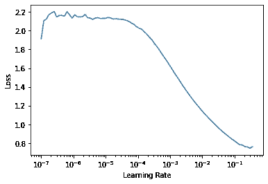
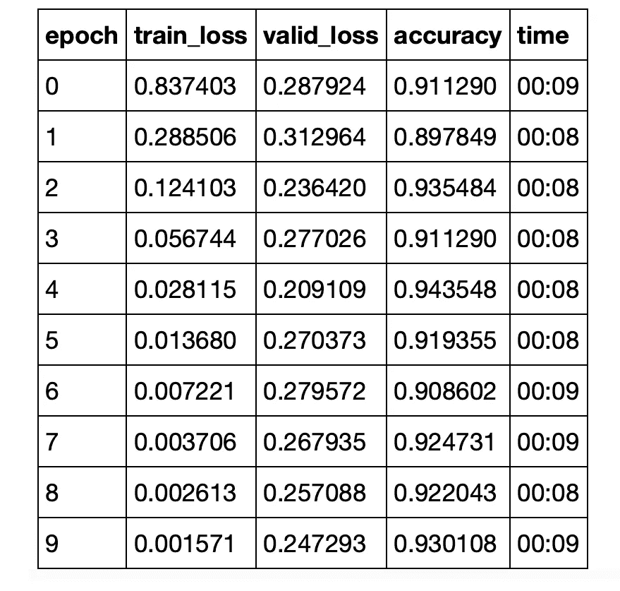
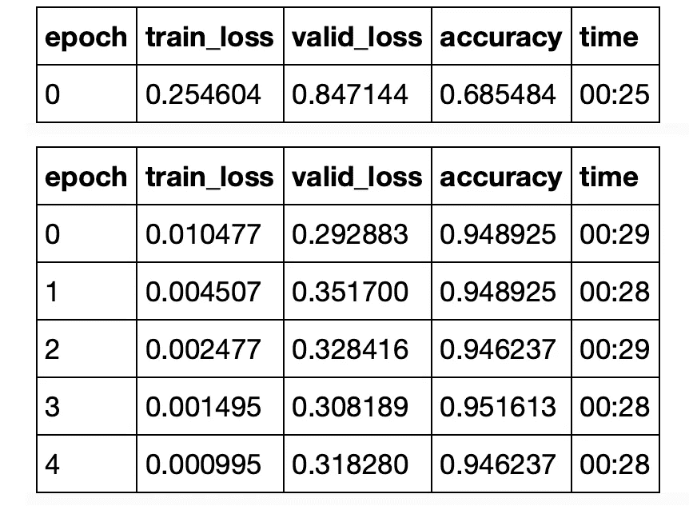

# 如何用 Fastai 制作一个艺术模型

> 原文：<https://towardsdatascience.com/how-to-make-a-state-of-the-art-model-with-fastai-bd11e168b214?source=collection_archive---------39----------------------->

## 使用学习率查找器和渐进调整大小方法进行图像分类，以便在短时间内获得最佳结果。


Amy Hirschi 在 [Unsplash](https://unsplash.com?utm_source=medium&utm_medium=referral) 上的照片

当我第一次开始 fastai 的旅程时，我非常兴奋地建立和训练一个深度学习模型，它可以在短时间内给出惊人的结果。既然我们已经看到了 fastai 与一些 Pytorch 基本函数一起使用的一些幕后培训术语，现在是时候看看在构建模型方面多做一点努力会产生什么结果了。

> 在这篇文章的最后，我将链接我以前的文章，在这些文章中，我记录了我对 fastai 的学习。:)

## 获取数据

我们需要这些数据来开始。它来自 Kaggle 的石头剪子布数据集。这个任务变成了一个多类图像分类问题，有三个类(每个类有训练、有效、测试文件夹)包含大小为 300x300 的 RGB 彩色图像。

为 fastai vision 的所有内容指定导入函数，并设置 path 变量。

```
**from** **fastai.vision.all** **import** ***path = Path('/storage/RockPaperScissors/RockPaperScissors/data/')
path.ls()**Output:
(#4) [Path('/storage/RockPaperScissors/RockPaperScissors/data/test2'),Path('/storage/RockPaperScissors/RockPaperScissors/data/valid'),Path('/storage/RockPaperScissors/RockPaperScissors/data/.DS_Store'),Path('/storage/RockPaperScissors/RockPaperScissors/data/train')]# make sure to set that path to wherever you've kept your data either locally or online.
```

现在我们将定义一个数据块来从文件夹中获取数据。我们指定这些来确保我们的数据在编写最少的代码时对模型可用:

1.  如何用 ***get_image_files*** 函数获取图像文件——这只是收集我们的火车和有效文件夹中的所有图像文件
2.  获得带有 ***parent_label*** 的类，这确保我们获得直接的父文件夹名作为我们的类名，最后，
3.  使用***grand parent splitter***进行训练和验证拆分，这将为我们提供单独的数据集，用于使用文件夹进行训练和验证，这些文件夹在层次结构中处于上一级，或者训练和有效文件夹。

```
**def** get_dls(bs, size):
    dblock = DataBlock(blocks = (ImageBlock, CategoryBlock),
                       get_items = get_image_files,
                       get_y = parent_label,
                       splitter = GrandparentSplitter(),
                       item_tfms = Resize(size)
                      )
    **return** dblock.dataloaders(path, bs = bs)
```

这将返回一个数据加载器，它将给出一个批量大小为 ***bs*** 和一个图像大小为 ***大小为*** 的图像。

## 什么是渐进式调整大小，我们如何应用它？

> 正如杰瑞米·霍华德在他的书中所说的那样:用小图片开始训练，用大图片结束训练。使用小图像进行大部分 epochs 训练有助于训练更快完成。使用大图像完成训练使得最终的准确度高得多。

这是一种实验性的技术，已经被证明是非常有用的，在获得更高的精确度方面，比在使用相同大小的图像时要有用得多。

现在让我们看看怎样才能训练出多种尺寸，好吗？

我们将得到的批量大小为 64，图像大小为更小的 128x128。

```
dls = get_dls(64, 128)
```

现在，让我们来计算一下这部分培训应该使用什么样的学习率。

## 找到合适的学习速度

首先，我们利用迁移学习建立一个模型，如下所示。

```
learn = cnn_learner(dls, resnet34, metrics=accuracy)
```

然后，我们绘制一个图表，看看如何找到学习率。

```
learn.lr_find()
```

输出看起来像这样，如果我们取学习率的一个特定值，我们的损失看起来会是什么样子。



学习率图

看起来采用 1e-3 左右的学习率将足以确保我们的损失随着训练而减少。我们会选择那个。

```
learn = cnn_learner(dls, resnet34, metrics=accuracy)
learn.fit_one_cycle(10, 1e-3)
```

我们在最初的几个时代里看到了相当显著的结果。



学习第 1 部分

> 注意:我在 GPU 上训练这个模型，这就是为什么每个历元只需要几秒钟。
> 
> 如果你只在 CPU 上训练，这将花费更长的时间，有时甚至大约 10 分钟。

既然我们已经在较小的图像尺寸上训练了模型，我们可以进行训练的第二部分。

我们使用批量大小为 128，图像大小为 224，用于模型的下一次微调。

```
learn.dls = get_dls(128, 224)
learn.fine_tune(5, 1e-3)
```



学习第 2 部分

正如您可以推断的那样，这为我们的训练带来了几乎 95%的准确率，并且在 GPU 上训练只需要大约三分钟！

## 结束…

Fastai 使我们能够快速开发任何深度学习任务，正如我在前几周对它进行的实验一样，我发现自己越来越喜欢它超级简单的方法。如果您热衷于跟随我的旅程，请确保关注我的持续更新，因为我将使用这个神奇的库探索更多的深度学习任务。

正如我之前承诺的，这里是我为 fastai 写的其他文章。编码快乐！😁

1.  fastai 快速入门:[FastAI 快速入门——我的经历](/a-fast-introduction-to-fastai-my-experience-b18d4457f6a5)
2.  像素相似性方法—引擎盖下第 1 部分: [Fastai —探索训练过程—像素相似性方法](/fastai-exploring-the-training-process-the-pixel-similarity-approach-74bbdb844509)
3.  随机梯度下降和从零开始训练—引擎盖下第 2 部分: [Fastai —从零开始随机梯度下降的多类分类](/fastai-multi-class-classification-with-stochastic-gradient-descent-from-scratch-8410fe3fea22)

此外，这里是 GitHub repo 链接，包含所有代码:

[](https://github.com/yashprakash13/RockPaperScissorsFastAI) [## yashprakash 13/rock paper scissors fastai

### 在 GitHub 上创建一个帐户，为 yashprakash 13/rockppapersscissorsfastai 的开发做出贡献。

github.com](https://github.com/yashprakash13/RockPaperScissorsFastAI) 

> 你想每周或两周收到一封免费的、干净的电子邮件，里面包含我发表的最好的策划文章和教程吗？加入我的代码广播吧！

在[推特](https://twitter.com/csandyash)和 [LinkedIn](https://www.linkedin.com/in/yashprakash13/) 上和我联系！