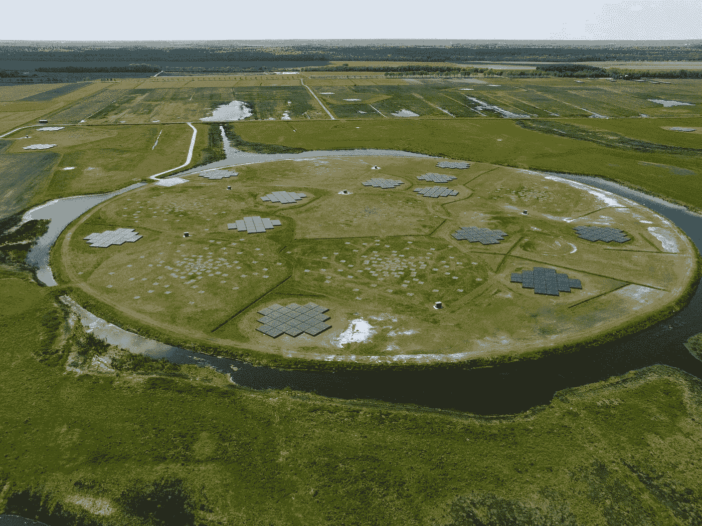

# 如何用你的(天文学)图像制作视频

> 原文：<https://towardsdatascience.com/how-to-make-a-video-from-your-astronomy-images-957f1d40dea1?source=collection_archive---------16----------------------->

## 从静态图像制作您自己的视频

你想过如何用你的数据制作一个视频吗？不要再想了！

你可能已经知道如何制作一个视频效果，方法是制作许多手工绘制的小图，然后一张一张地翻转它们。我采用了类似的方法，通过制作小的剪贴画并一个接一个地展示它们，从一幅大的射电天文学图像中制作了一个视频。

在我的例子中，我使用了来自 LOFAR 射电望远镜的图像。这台望远镜在低频无线电频谱中观察天空。它获得的信息可以转换成颜色，这样我们就可以将无线电波转换成人类可以理解的图像。原来宇宙中有很多正在发射无线电波的物体，比如活动星系、星系团、恒星形成星系、来自行星的磁场等等！你可以在这里找到来自 LOFAR 的惊人图片。



[LOFAR 站之一。来源:维基共享资源](https://en.wikipedia.org/wiki/Low-Frequency_Array_(LOFAR))

## 让我们创造吧！

但是，我们如何用这些图像制作一部电影，这样我们就可以浏览它了？这就把我们带回了图纸的翻转。在这种情况下，我们只需要将大的无线电图像切割成(许多)较小的图像(帧),每次移动图像的中心一点点，并将它们连成一行，这样我们就可以获得移动效果。

那么，你是怎么做到的呢？我使用了 Python 和命令行工具 FFmpeg。我的完整代码可以在这里找到。这是一个更大项目的一部分，在这里你还可以制作海报和互动地图。现在，你只需要关注脚本 *make_movie.py.*

首先用以下内容克隆回购:

```
git clone  [https://github.com/jurjen93/advanced_astro_visualiziation.git](https://github.com/jurjen93/advanced_astro_visualiziation.git)
```

现在你可以运行:
`python make_video.py`
在这里你可以使用以下标志

*   `-d` →选择从互联网下载特定的 fits 文件。如果需要，使用`1`，否则留空。
*   `-csv` →给出一个包含源文件的特定 CSV 文件。
*   `-N` →要使用的信号源数量。
*   `-fr` →视频的帧率。建议用`60`让视频流畅。
*   `-fi` →适合文件使用。(如果您没有下载您的 fits 文件)

所以最后你用了类似
`python make_video.py -csv catalogue/catalogue_lockman.csv -d 1 -N 2 -f 60`的东西

要做到这一点，你需要有一个以资源为中心的目录。“目录”文件夹中有一个例子。
使用以下字段:

*   `RA` →物体的赤经(与经度相当)
*   `DEC` →物体的赤纬(与纬度相当)
*   `imsize` →图像尺寸(度)

## 结果

现在，代码将帮助您从数据中生成一些精彩的视频，例如:

您还可以修改代码，将多个分辨率或大图像一个接一个地堆叠起来，这样您就可以做出类似这样的东西:

请随意修改 make_movie.py 脚本，因为它应该很容易使用，并且您可以制作自己的精彩视频。如果你有任何改进的建议，请告诉我！玩得开心！