# 如何建立有效的共指消解模型

> 原文：<https://towardsdatascience.com/how-to-make-an-effective-coreference-resolution-model-55875d2b5f19?source=collection_archive---------15----------------------->

## 如何改进现成的共指消解库

*作者* [*玛尔塔·马朗考斯卡*](https://medium.com/@m.maslankowska) *和* [*帕韦·米耶尼克祖克*](https://medium.com/@p.mielniczuk) *。*

Dariusz Sankowski 在 [Unsplash](https://unsplash.com/s/photos/open-book?utm_source=unsplash&utm_medium=referral&utm_content=creditCopyText) 上拍摄的照片

# 介绍

在本文中，我们介绍了如何改进 AllenNLP 的共指消解模型，以实现更连贯的输出。我们还介绍了几个集成策略，以同时利用 Huggingface 和 AllenNLP 模型。

简而言之，共指消解(CR)是一个 NLP 任务，旨在替换句子中所有的歧义词，以便我们获得不需要任何额外上下文就可以理解的文本。如果您需要复习一些基本概念，请参考我们的介绍文章。

在这里，我们主要关注**改进库如何解析发现的集群**。如果你对 CR 最常见的库的详细[解释感兴趣(例如什么是 *AllenNLP* 或 *Huggingface* )，我们的动机可以随意查看。](https://neurosys.com/article/most-popular-frameworks-for-coreference-resolution/)

# 现成可用但不完整

Huggingface 和 AllenNLP 共指消解模型对许多项目来说都是一个很好的补充。然而，我们发现了几个缺点(在前一篇文章中有详细描述),这让我们怀疑我们是否真的想在我们的系统中实现这些库。最大的问题不是无法找到可接受的聚类，而是整个过程的最后一步——解析共指以获得明确的文本。

这让我们想到，也许我们可以为此做些什么。我们决定对最终文本进行几处小改动，从而带来显著的改进。因为 AllenNLP 似乎找到了更多的集群，而这些集群往往更好，所以我们决定采用一种更侧重于这种模式的解决方案。

# 拟议改进概述

我们已经决定将 AllenNLP 作为我们的主要模型，并利用 Huggingface 作为更多的参考，同时主要将其用作对 AllenNLP 输出的改进。我们的解决方案包括:

1.  基于模型已经获得的聚类，改进 AllenNLP 替换共参照的方法，
2.  引入几种策略，将两种模型的输出(聚类)合并成一个增强的结果。

为了改进相互引用的替换，有几个有问题的区域可以稍微容易地改进:

*   在一个集群中缺少一个有意义的提及，可能成为它的头
    (一个跨度，我们用它替换给定集群中的所有其他提及)
*   将第一个区间视为一个簇的头(这对于下一个区间尤其成问题)，
*   各种复杂情况，以及由于嵌套提及而导致的无意义输出。

所有上述问题都在下面举例说明:

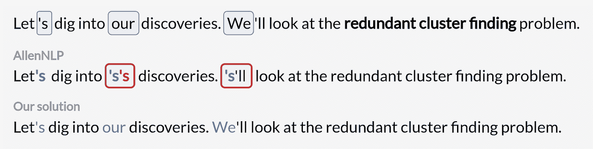

在聚类中缺少有意义的提及(例如名词短语)的文本。

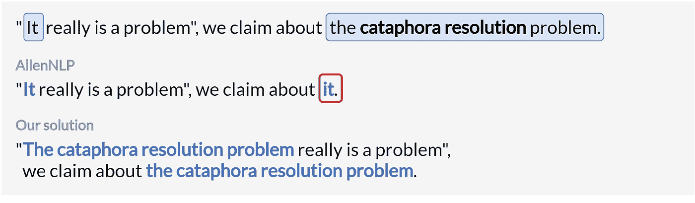

有下指的文本—代词在名词短语之前。

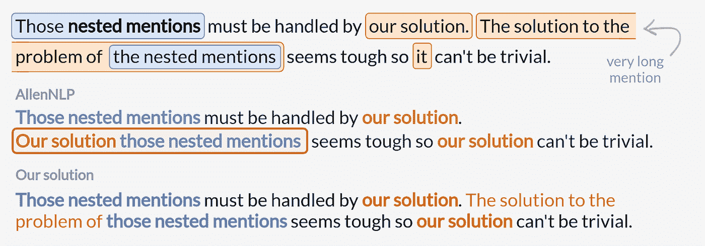

具有嵌套相关提及的文本。

我们对这些问题提出以下解决办法:

*   如果一个集群不包含任何名词短语，就不要考虑它
*   将聚类中的第一个名词短语(不是第一次提到的)视为其标题
*   仅解析嵌套的共同引用中的内部范围

在下一节中，将详细解释这些方法，包括 AllenNLP 改进和组合模型的策略。此外，无论你想更深入还是跳过细节，下一章的所有代码都可以在我们的 [NeuroSYS GitHub](https://github.com/NeuroSYS-pl/coreference-resolution) 库中找到。

# 深入改进

由于 Huggingface 基于 spaCy，使用起来毫不费力，并提供了多种附加功能。然而，修改起来要复杂得多，因为 spaCy 提供了许多机制，禁止您访问或更改底层实现。

此外，除了与 Huggingface 相比，AllenNLP 获得了更多数量的有效聚类之外，我们还发现前者更容易修改。

为了修改 AllenNLP 的行为，我们关注于 *coref_resolved(text)* 方法。它遍历所有聚类，并用第一个找到的提及替换每个聚类中的所有跨度。我们的改进只涉及这个函数和其中的嵌套方法。

下面是一个简短文本的例子，它包含了我们试图解决的上述所有三个问题，我们现在将重点关注这些问题。

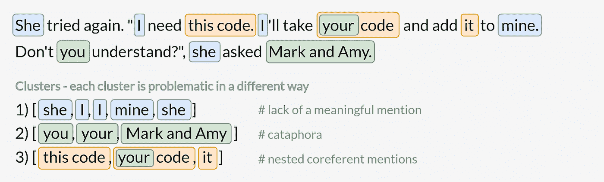

# 冗余集群

为了让我们的解决方案简单明了，我们决定将有意义的提及定义为任何名词短语。

对于每个聚类，我们获取包含名词短语的跨度的索引(我们在下面的改进中也使用它们)。验证一个标记是否是名词的最简单的方法是使用 spaCy！事实证明，AllenNLP 也使用 spaCy 语言模型，但只是对输入文本进行标记化。

这里最让我们感兴趣的嵌套方法是 *replace_corefs(spacy_doc，clusters)* 。它不仅利用了 spaCy Doc 对象，还包含了实现我们的改进所需的所有逻辑。它看起来像这样:

从[空间文档](https://spacy.io/api/annotation#pos-tagging)中，我们知道名词由两个词性(POS)标签表示:*名词*和*属性*。我们需要检查集群中每个 span 的 POS 标签(实际上是每个 span 中的每个令牌)是否是这两者之一。

下面展示了这段代码如何改进共指替换。现在，我们主要关注第一个集群，因为它显示了当前的问题。

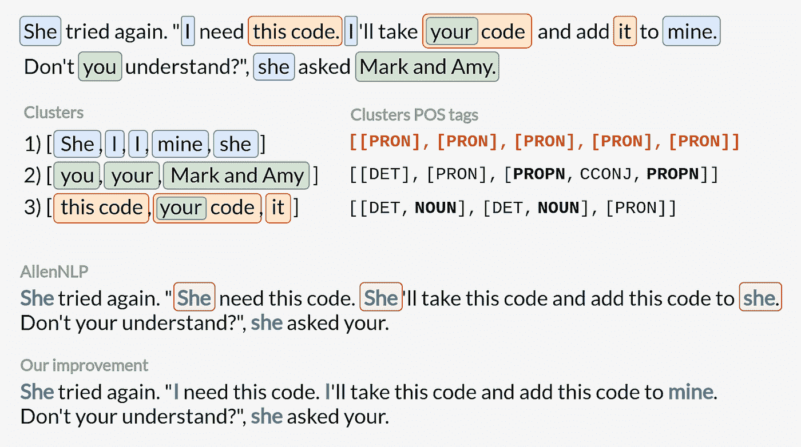

# 解决下指问题

许多共指消解模型，如 Huggingface，在检测下指时存在严重问题，因为这种情况很少发生。一方面，我们可能对解决这种引起更多问题的异常情况不感兴趣。另一方面，根据文本的不同，如果我们忽略了它们，我们可能会丢失或多或少的信息。

AllenNLP 检测下指，但由于它将聚类中的第一个提及作为其头部，因此会导致进一步的错误。这是因为先行词(例如代词)在后置词(例如名词短语)之前，所以一个无意义的跨度成为一个簇的头。

为了避免这种情况，我们建议将集群中的第一个名词短语(不仅仅是任何提及)作为它的头，用它替换所有前面和后面的部分。这个解决方案是琐碎的，虽然我们可以看到其他更复杂的想法的优点，但我们的解决方案似乎对大多数情况都足够有效。

让我们仔细看看 AllenNLP 的 *replace_corefs* 方法中的几个关键行。

为了让我们的解决方案起作用，我们需要重新定义*reference _ span*变量(集群的头),这样它就表示第一个找到的名词短语。为了实现这一点，我们使用了我们的*noun _ indexes*列表——它的第一个元素是我们想要的。

让我们看看它是如何提高输出的。这次我们关注第二个集群。现在没有信息丢失！然而，由于 AllenNLP 根据找到的聚类的顺序返回结果，所以在我们的版本中也有一个小错误。不过不要担心，我们将在下一节中修复它。

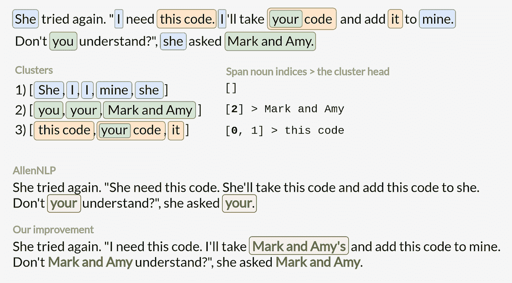

# 嵌套提及

最后一个改进涉及由多个提及组成的跨度。正如我们在上一篇文章中所展示的，有几种策略可以用来解决这个问题，但没有一种是完美的:

1.  仅用外部跨度替换整个嵌套提及→我们会丢失信息
2.  替换内部和外部 span →在许多情况下不起作用，根据找到的集群顺序会导致不同的结果
3.  仅替换内部 span →适用于大多数文本，但是，一些替换会导致无意义的句子
4.  省略嵌套提及；根本不替换跨度→我们没有获得共指消解模型首先应该提供给我们的信息，但是我们 100%确定文本在语法上是正确的

我们认为，第三种策略——仅替换内部跨度*——是信息增益和最终文本中可能的错误数量之间的良好折衷。它还提供了一个额外的功能—现在，无论群集排序如何，输出都将始终相同。*

*要实现它，我们只需要检测外部跨度并忽略它们。为此，我们只需检查特定的跨度索引是否包含任何其他提及。*

*最后，我们获得了一个包含所有改进的文本。我们意识到这个问题本来可以解决得更好，但是我们发现在解决方案的简单性和解决文本的有效性之间的权衡恰到好处。*

*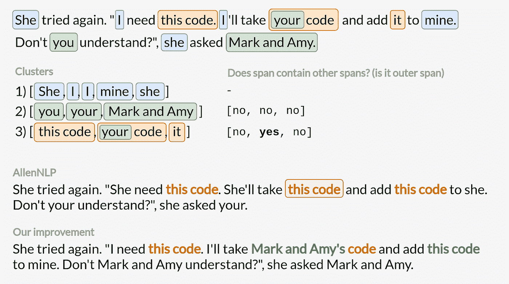*

*如上图所示，我们可以获得更好的结果，同时只增强找到的聚类的解析方式。*

# *整体策略*

*在所有的改进之后，我们现在可以转移到交集策略——关于如何结合 AllenNLP 和 Huggingface 集群的想法。正如我们之前提到的，我们认为 AllenNLP 产生了明显更好的集群，但它并不完美。为了在没有任何微调的情况下获得关于最终聚类的最高可能置信度，我们提出了几种合并两个模型输出的方法:*

*   *严格-仅保留那些在 Huggingface 和 AllenNLP 模型输出中完全相同的聚类(聚类的交集)*
*   *部分-仅保留那些在 Huggingface 和 AllenNLP(跨距的交点)中完全相同的跨距*
*   *模糊-保留 Huggingface 和 AllenNLP 中部分相同(重叠)的所有跨度，但优先考虑较短的跨度*

*由于 AllenNLP 通常更好，我们将其作为我们的基础，因此在可疑的情况下，我们仅根据其发现构建输出。由于代码不像讨论的改进那样短，我们给[提供了一个详细的 Jupyter 笔记本](https://github.com/NeuroSYS-pl/coreference-resolution)，在这里只看一下策略的输出。*

*以下示例摘自 GAP 数据集，我们之前已经详细解释过。*

*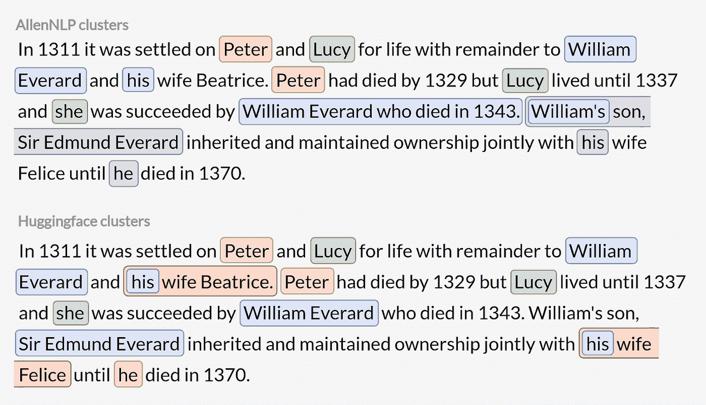*

*为了有效地比较提议的交集策略，更容易将模型的输出视为聚类集，如下图所示。值得注意的是，AllenNLP 和 Huggingface 不仅发现了略微不同的提及，还发现了整个集群。*

*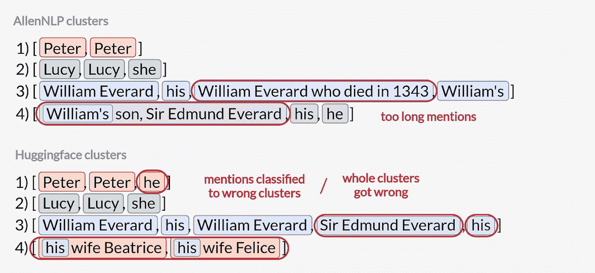*

*两个库都找到的集群— AllenNLP 和 Huggingface。*

*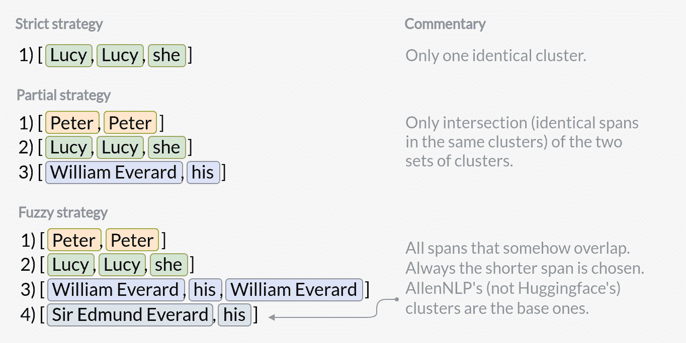*

*通过每个交集策略获得的聚类 AllenNLP 和 Huggingface 的集合。*

*我们大多倾向于模糊策略。它提供了比单一模型的输出更高的确定性，同时还提供了最大的信息增益。所有策略都各有利弊，因此最好进行试验，看看哪种策略最适合您的数据集。*

*让我们看看最终的结果——包含已解决的相互引用的示例，包括我们之前的改进:*

*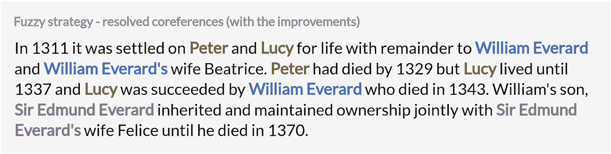*

*尽管最终的文本听起来不太自然，但我们必须记住，共指消解的目的通常是为语言模型消除歧义。因此，他们可以更好地理解输入，并能够产生更合适的嵌入。在这种情况下，我们只缺少一条信息——他死于 1370 年——同时获得了许多正确的替换，并去掉了过长的提及。*

# *摘要*

*在我们的文章中，我们解决了 NLP 中的一个主要问题——共指消解。我们解释了什么是 CR，介绍了最常见的库以及它们带来的问题，现在向**展示了如何改进现有的解决方案**。*

*我们试图用多张图片和各种例子来阐明我们可能有的一切。基本用法和我们的修改都可以在[我们的 NeuroSYS GitHub](https://github.com/NeuroSYS-pl/coreference-resolution) 上找到。*

*希望现在您已经熟悉了共指解决方案，并且可以轻松地将我们提出的解决方案应用到您的项目中！*