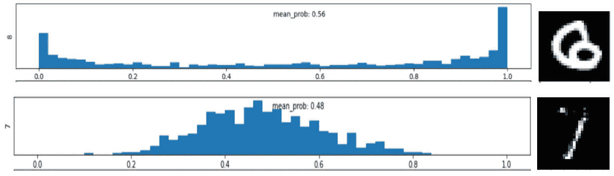

# 如何让人工智能清晰地表达疑问

> 原文：<https://towardsdatascience.com/how-to-make-artificial-intelligence-articulate-doubt-9c2885a9e541?source=collection_archive---------42----------------------->

## 影响人们生活的模特必须坦诚面对他们的疑虑。这种新方法给可解释的人工智能带来了平衡。

在[特征空间](https://www.featurespace.com/)，我们已经[发表了一个方法](https://arxiv.org/abs/2107.08756)来解释深度网络中的**模型不确定性**。我们的方法可以理解模型认为不符合其预测类别的输入数据中的混杂模式。这允许我们部署诚实和透明的模型，为决策提供平衡和完整的证据，而不仅仅是管理支持决策的证据。

例如，在下图中，我们观察到包含在 *CelebA* 数据集中的三幅名人图像。在所有情况下，名人都被标记为*“不笑”*，这可以使用广泛可用的用于图像处理任务的深度分类模型来轻松预测，如 VGG16、ResNet50 或 EfficientNet。然而，模特们很难为这些照片中的一些提供**自信的**分类。在下面的例子中，我们提出的方法强调了导致模型不确定的各种特征(右栏)。我们很容易注意到微笑弧、上唇弯曲和口腔走廊的存在，这些通常与微笑和咧嘴笑有关。

***左****:CelebA 数据集中预测类别标签为“没有笑容”的名人脸部图像。* ***右*** *:由我们的方法高亮显示的像素(红色)导致模型对该预测不确定。作者图片。*

## **不确定性和贝叶斯深度学习**

我们在贝叶斯神经网络(BNNs)的基础上建立了我们的不确定性归因方法。该框架彻底处理了预测中不确定性的所有来源，包括源于**模型选择和训练数据限制的不确定性，**其表现为每个神经细胞的拟合权重参数的不确定性。点击查看[中的 BNNs 概述。总而言之:](https://docs.aws.amazon.com/prescriptive-guidance/latest/ml-quantifying-uncertainty/welcome.html)

1.  神经元的每个拟合参数被捕获为一个**概率分布**，该概率分布表示在给定训练数据的情况下，我们对其最佳*值缺乏确定性。*
2.  由于深度模型有大量参数，因此，我们在所有训练参数上有一个**多元**分布，称为*后验分布。*
3.  当我们对一个新的数据点进行分类时，每个拟合参数值的合理组合都会给我们一个不同的分数！BNN 提供给我们的不是一个单一的分数，而是一种可能分数的分布，称为*后验预测分布。*
4.  bnn 通常返回后验预测分布的平均值作为它们对输出分数的估计。

这些计算通常是近似的，并在引擎盖下运行，例如，当您将脱落层添加到您的神经模型架构中时。重要的是，对于我们希望分类的每一幅图像、一段文本或金融交易，我们可以检索代表分数应该是多少的分布。MNIST 数字的一对示例分布如下所示。分布的平均值告诉我们分类有多确定，而方差告诉我们建模不确定性有多稳定。请注意，平均分数有时可能与由*最可能的*组模型参数产生的分数非常不同，这是非贝叶斯神经网络通常返回的分数。在第一个例子中，最可能模型与平均模型分数的偏差特别大。

两个 MNIST 数字的潜在类别患病率的后验预测分布，最可能类别的 BNN 概率相似。在**顶部图像**中，所示的分布(对于类别标签“8”)支持大范围的可能得分，事实上它是双峰的，有利于确定图像必须是“8”，或者确定它不可能是“8”。这意味着图像代表数据中的稀疏区域，在训练集中只有很少或没有样本。相反，**底部图像**中的分布在 0.5 附近达到峰值，并且相对较窄。这意味着训练集在特征空间的这一点上包含内在类别混合的证据——它已经看到了类似的例子，这些例子或者被标记为(不完整的)7，或者被标记为具有外围墨迹的杂散斑点的 1。作者图片。

## **解释模型不确定性**

为了解释预测中的不确定性，我们的方法建立在**积分梯度** (Sundararajan et al. 2017)的框架上，这是神经网络最广泛的解释技术之一。集成梯度通过对模型的输出倾向得分 **p *c* (x)** 的梯度进行集成来工作，对于类别 **c.** 它沿着基准起始点和被解释的点之间的特征空间中的路径执行该集成。对于不确定性的解释，我们不积分模型分数的梯度，而是积分预测熵的梯度

**H(x)=-σc PC(x)。log pc(x)**

该度量包含模型的总预测不确定性，包括源自后验预测分布的位置和宽度的分量。

我们在公共图像基准上测试了集成熵梯度，包括 MNIST 和 CelebA 人脸数据集。不幸的是，由普通的综合梯度产生的熵解释被证明是糟糕的、令人困惑的，而且是一种敌对的解释。这是可以理解的，积分梯度需要一个基准特征向量作为路径积分的原点，而普通算法使用空白图像作为其基准。这有合理的动机来解释为什么分数高，因为空白图像可能对所有类别具有大致相等的模型分数；然而，围绕黑色图像的不确定性通常非常高。

为了克服这个和其他问题(这些问题的细节在论文中)，我们的方法结合了两个最近的想法来产生干净和有信息的熵属性——这两个方法都利用了潜在的空间学习表示，使用了变分自动编码器。

*   **综合反事实解释** ( [安托万等人 2021](https://arxiv.org/abs/2006.06848) **)。**对于我们的路径积分的源图像，我们希望图像具有与测试图像相同的预测类别，但是预测熵为零。合成的反事实解释图像提供了这样的源图像，同时具有吸引人的属性，即源图像与测试图像非常相似——也就是说，增量限于那些增加不确定性的概念。
*   **分布内路径积分** ( [**Jha 等人 2020**](https://genomebiology.biomedcentral.com/articles/10.1186/s13059-020-02055-7) **)** 积分梯度的一个问题是基准源和测试向量之间的路径可能偏离数据流形——通过不可能的图像探索轨迹。我们希望基准点和测试点之间的路径积分在数据流形内，即:两幅图像之间路径上的每个特征向量都代表了数据中可能合理出现的一些情况。

结合起来，这些想法产生了干净和相关的不确定性解释，即使是对困难的机器学习问题，如阅读人类表情。我们通过解释 CelebA 数据集中最不确定的图像来证明这一点，如微笑检测，拱形眉毛检测和眼袋检测。

*与预测“拱形眉毛”(上面两行)和“没有拱形眉毛”(下面两行)的现有方法相比，我们的方法的不确定性解释。作者图片。*

## **结论**

新兴的可解释人工智能领域通常专注于收集证据，证明**支持已经做出的**决定，就像律师在法庭上陈述案件一样。然而，大多数人工智能模型的操作更像专家证人，而不是律师说服法官。这就明确了对更加平衡的解释方法的需求，这种方法提供了阐明模糊性、不确定性和怀疑的细致入微的解释。我们的方法所做的是用丰富而简洁的解释来补充传统的分数归因方法，解释为什么数据点的分类是不确定的。随着机器学习被更广泛地用于为对生活有重大影响的法律、金融或医疗决策提供信息，对自动化预测背后的证据权重进行诚实和公开的评估对于维护道德标准至关重要。