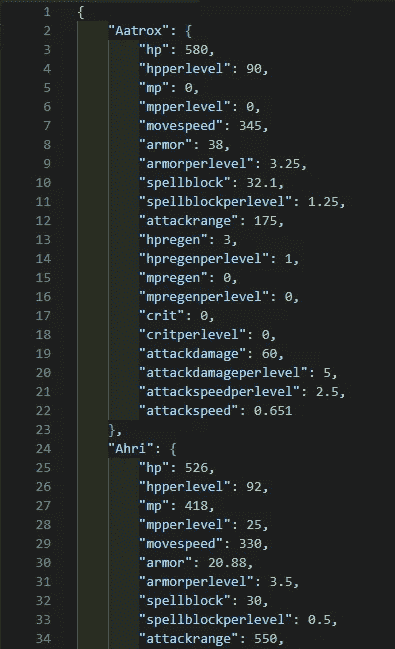
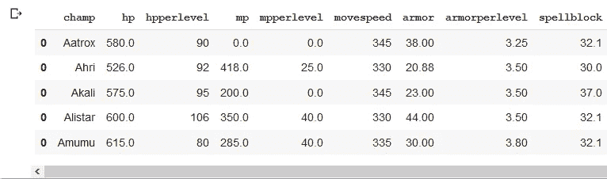
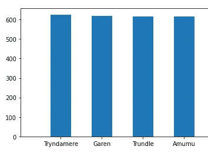
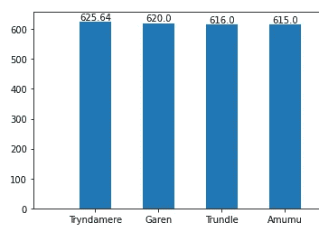
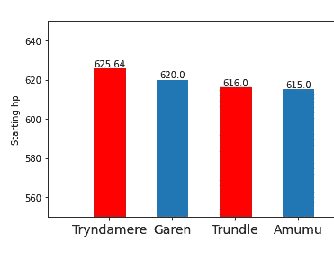
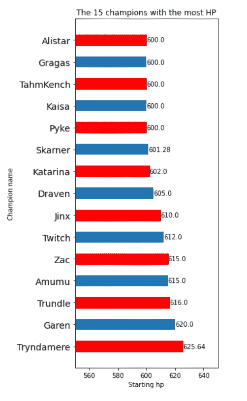

# 如何使用 matplotlib 制作带标签的条形图和 hbar 图

> 原文：<https://towardsdatascience.com/how-to-make-bar-and-hbar-charts-with-labels-using-matplotlib-b701ce70ba9c?source=collection_archive---------12----------------------->

## 使用来自传奇联盟**的数据的初级数据科学项目指南**


由[露丝·齐默曼](https://unsplash.com/@ruthson_zimmerman?utm_source=medium&utm_medium=referral)在 [Unsplash](https://unsplash.com?utm_source=medium&utm_medium=referral) 上拍摄的照片

## **简介**

我第一次做条形图**的时候，我不能马上**出**图** **如何给条形图添加标签。尤其是水平条形图对我来说很麻烦。所以，如果你也不能让它工作，也不要担心。在这篇文章**中，你将学习**这是如何完成的，以及一些设计图表的技巧和诀窍。**

> N ***注:*** *如果您只需要了解如何添加标签，您可以跳到以下部分:**[***创建带标签的条形图***](#9082) ***。我已经包含了我为你写的所有代码，如果你想边读边打字的话，我可以把它们复制下来，同时还有关于代码如何工作的详细解释。****

*为了让我教你如何制作带标签的条形图，我需要一些数据。所以我决定从网游《英雄联盟》 *中抓取一些游戏**数据。***这让该指南对游戏的粉丝来说更有趣，*(包括我自己)*。这篇文章的第一部分是为**演示我如何清理数据**使其成为我喜欢的格式。我鼓励你阅读这一部分以及**，它教你一种方法**将数据从 JSON 格式转换成 Pandas 数据帧。*

*该员额的结构如下:*

*   *介绍*
*   *准备数据(JSON 到 Pandas 数据框架)*
*   *[**创建带标签的条形图**](#9082)*
*   *总结和告别*

## *准备数据(JSON 到 Pandas 数据框架)*

*我有一个 JSON 文件，里面包含了*英雄联盟中所有冠军(可玩角色)的基础统计(特征)。* [**你可以在这里访问数据文件。**](https://github.com/JacobToftgaardRasmussen/labels_on_bar_charts/blob/main/champ_stats.json) 数据看起来是这样的(见截图):*

**

*总共有 **153 个冠军**在他们的字典中包含相同的关键字。*

*最后，我们将制作一个条形图，显示冠军的开始 **hp** (生命值)，以了解哪些冠军开始时最健康。如果你对其他统计数据感兴趣，你可以非常容易地改变条形图显示的内容，例如，你可能有兴趣看看哪些冠军拥有最多的 **ad** (攻击伤害)。*

*接下来，我想将这些数据从目前的 JSON 格式转换成一个 **Pandas DataFrame** 。*

> *我鼓励你试着编码，因为这会给你最好的理解！**边做边学你懂的。***

```
*import pandas as pd
import matplotlib.pyplot as plt
import json*
```

*我从**导入我们将使用的必要库**开始。`Pandas` 允许我们制作`DataFrames`,这是一个很好的数据科学结构。`Matplotlib.pyplot`将被用来制作图表。`json`将允许您将 JSON 文件中的数据加载到内存中，供我们使用。*

```
*with open('champ_stats.json') as f:
  data = json.load(f)champion = data['Aatrox']
stat_names = list(champion.keys())
columns = ['champ'] + stat_names
df = pd.DataFrame()*
```

*我打开数据文件并将其加载到名为`data`的变量中。接下来，我想有一个列表，其中包含所有不同的统计数据的名称，(冠军的统计数据/特征)，因为这将是完成的数据帧的列名。统计列表包含在数据中所有的冠军字典中，因此我们只需要深入其中一个字典并从该字典中获取关键字。我们使用`'Aatrox'`键，因为这是数据的第一个冠军。这给了我们保存到`champion`变量的相应值。这个值是另一个字典，其中所有的键都是我们正在寻找的名字，因此我们使用`.keys()`函数来获取它的键，当在`list()`函数中调用该函数时，返回值被转换为一个列表。 [*如果这一步让你困惑，我已经写了另一个指南，解释了* *如何访问 python 字典中的数据，你可以在这里找到****。***](/how-to-access-nested-data-in-python-d65efa53ade4)*

***数据帧的列名将是第一列的`'champ'`，它将包含所有冠军的名字，其他列将以`stat_names`中的项目命名。我们把它保存到变量`columns`中。最后，我们使用`pd.DataFrame()`创建一个空的数据帧，并保存到变量`df`中。***

```
***for name, stats in data.items():
  values = [stats[x] for x in columns[1:]]
  row = pd.DataFrame([[name] + values], columns=columns)
  df = df.append(row)
df.head()***
```

***在上一步中，我们有一个空的数据框架，现在是用数据行填充它的时候了，每一行代表一个冠军。我们现在为语句制作一个**，该语句**遍历**数据**字典中的所有键值对**，(`name`是键，`stats`是值)。我们想要一个所有 stat 值的列表，为此我使用 list comprehension 并将结果列表保存到变量`values`。列表理解是这样工作的:对于`columns[1:]`中的每个名字(`x`)，我们取这个名字，并把它作为从`stats`中访问相应值的键，这个值被添加到列表中。*****

***接下来，我们制作一个新的数据帧，保存到变量`row` **。这个数据帧用两个参数实例化。首先，一个列表中的列表，其中内部列表包含当前冠军的名字和所有值。其次，将形式属性`columns=`设置为我们的列表变量，也称为`columns`，这将按照我们的需要设置数据帧中的列名。
接下来，我们将`row`附加到我们称为`df`的主数据帧，这将返回一个新的数据帧，我们用它来覆盖之前的`df`。*****

***最后，我们调用`df`上的`head()`方法来显示 DataFrame 的第一行。如果您已经编写了代码，现在应该会得到以下输出:***

******

***数据现在已经很好地格式化为 DataFrame，下一步我们将最终创建条形图并添加标签。***

## ***创建带标签的条形图***

```
***df_sorted_by_hp = df.sort_values('hp', ascending=False)
x = df_sorted_by_hp['champ'][:15]
y = df_sorted_by_hp['hp'][:15]***
```

***为了改进图表，我选择了按`'hp'`值对数据帧中的行进行排序，而`ascending=False`按降序对值进行排序。之后，我们将**冠军列**保存到名为`x`的变量中，类似地，将 **hp** **值**保存到变量`y`中。为了确保图表不会太混乱，我选择只包括前 15 名冠军，这是用`[:15]`后缀完成的。***

```
***fig, ax = plt.subplots(figsize=(20,4))
bars = ax.bar(x, y, width=0.5)***
```

***我们使用`plt.subplots(figsize=(20,4))`创建一个图形对象和一个轴对象，它们被保存到变量`fig`和`ax`中。我们将图形尺寸设置为 20 乘 4 英寸，这可能不是绝对的最佳尺寸，但是您可以随意使用这些数字，直到找到最适合您的图表的尺寸。`ax.bar(x, y, width=0.5)`使用我们的`x`和`y`值以及 0.5 的`width`值创建条形图，同样，您可以尝试 0 到 1 之间的不同宽度大小。我将返回的对象保存在变量`bars`中，我们很快就会用到这个变量。***

***代码将生成下面的图表，*(只是其中的一部分，以便更好地适应媒体)*:***

******

> ***…不是很酷***

***首先，条形的高度差非常难以区分，其次，不可能读出每个条形的精确高度。这就是标签有用的地方！
现在就让添加它们吧！***

> *****注意:**将下面的代码片段追加到前面的代码片段中。***

```
***for bar in bars:
  height = bar.get_height()
  label_x_pos = bar.get_x() + bar.get_width() / 2
  ax.text(label_x_pos, height, s=f'{height}', ha='center',
  va='bottom')***
```

***我们可以循环通过`bars`变量来检查图表中的每一个条形。我们通过从`bar.get_height()`函数中获取每个条形的高度，将其保存到一个名为`height`的变量中。接下来，我们需要循环中当前条的标签的 x 位置。我们从`bar.get_x()`函数中获得这个位置，然后将条形的宽度除以 2，得到条形中心的 x 值。***

***最后，我们使用`ax.text(label_x_pos, height, s=f'{height}', ha='center')`来创建标签/文本。这个函数接受一个 x 位置的值和一个 y 位置的值，然后我们给它一个将要显示的字符串，在这个例子中是条形的高度。最后，`ha='center'`进一步帮助标签在酒吧的中心对齐，`va='bottom'`将标签放在酒吧的正上方。***

***这将产生下面的图表，*(只是其中的一部分，以便更好地适应媒体)*:***

******

> ***是啊！现在我们有了显示各自高度的条形标签！这显然更好，但仍可改进。***

***我认为由于尺寸的原因，条形下方的**名称有点难读。此外，我想为图表的标题以及轴的描述。此外，让 y 轴从 0 开始是没有意义的。最后，我认为**这个图表可以用一些颜色来增加趣味！*******

> *****注意:**将下面的代码片段追加到前面的代码片段中。***

```
***for tick in ax.xaxis.get_major_ticks():
  tick.label.set_fontsize(14)for bar in bars[::2]:
  bar.set_color('r')plt.title('The 15 champions with the most HP')
plt.xlabel('Champion name')
plt.ylabel('Starting hp')
plt.ylim([550,650])plt.show()***
```

***您可以通过循环从`ax.xaxis.get_major_ticks()`返回的刻度来设置每个刻度的字体大小，并用`tick.label.set_fontsize(14)`提供字体大小。同样，您可以使用`for bar in bars[::2]:`访问每隔一个条，并使用`bar.set_color('r')`设置颜色。标题、x 标签和 y 标签可以用它们对应的功能来设置。最后，你可以用`plt.ylim([550, 650])`限制 y 轴(x 轴也一样)。我发现从 550 开始到 650 结束对这个图来说是可行的。***

***`plt.show()`将显示完成的条形图，*(只是其中的一部分，以便更好地适应介质)*:***

******

> ***我认为这是一个很大的进步！***

***要制作一个水平条形图，我们需要做的改动很少。因此，我将在单个代码片段中显示代码，并以粗体**突出显示**中的变化。此外，请记住，数据与之前相同，因此我们仍然拥有`x`变量中的所有名称和`y`变量中的所有 **hp** 值。***

```
***fig, ax = plt.subplots(figsize=(**4, 10**))
bars = **ax.barh**(x,y, 0.5)for bar in bars:
  **width = bar.get_width()** #Previously we got the height
  **label_y_pos = bar.get_y() + bar.get_height()** / 2
 **ax.text(width, label_y_pos, s=f'{width}', va='center'**)for tick in ax.**yaxis**.get_major_ticks():
  tick.label.set_fontsize(14)for bar in bars[::2]:
  bar.set_color('r')plt.title('The 15 champions with the most HP')
plt.**xlabel('Starting hp')**
plt.**ylabel('Champion name')**
plt.**xlim**([550, 650])plt.show()***
```

***与之前一样，我们创建图形和轴对象并设置大小，但是，这一次大小为 **(4，10)** 效果更好，(高比宽)。为了制作水平条形图，我们**使用** `ax.bar**h**()`而不是`ax.bar()`。接下来，我们得到的不是每个条形的高度，而是宽度。我们需要使用`bar.get_y()`而不是 x 位置来获得条形的 y 位置，并且我们添加条形的高度除以 2，*(注意，与之前相比，这里的高度具有不同的含义)*。***

***我们再次用`ax.text()`设置条的标签，但是，我们用`width`表示 x 位置和要显示的字符串。此外，我们使用参数`va='center'`，这有助于将标签放在条的中心。*试着移除它，看看有什么不同。****

***对于刻度，我们只需改变 y 刻度的大小，而不是 x 刻度的大小。最后，您必须切换轴的标签，并限制 x 轴相对于 y 轴。
结果:***

******

> ***瞧，你现在知道如何制作垂直和水平条形图，以及添加标签使它们更具可读性。***

## ***摘要***

***如果您遵循了整个指南，那么您现在已经创建了一个小项目，在这个项目中，您将 JSON 数据转换为 Pandas 数据框架，然后创建带有标签的条形图。***

*****就我个人而言，我更喜欢水平条形图**，因为我觉得这样更容易阅读**。
记住**如果你有兴趣可以进一步探索数据**。尝试找出哪个冠军的血量最少，或者在你的图表上显示更多的冠军。*****

*****如果你对这篇文章有任何问题、意见或建议，请随时联系我！*****

*****感谢你花时间阅读这篇文章，希望你学到了有用的东西！*****

******坚持学习！
—雅各布·托夫加德·拉斯姆森******