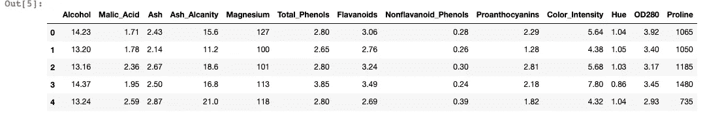
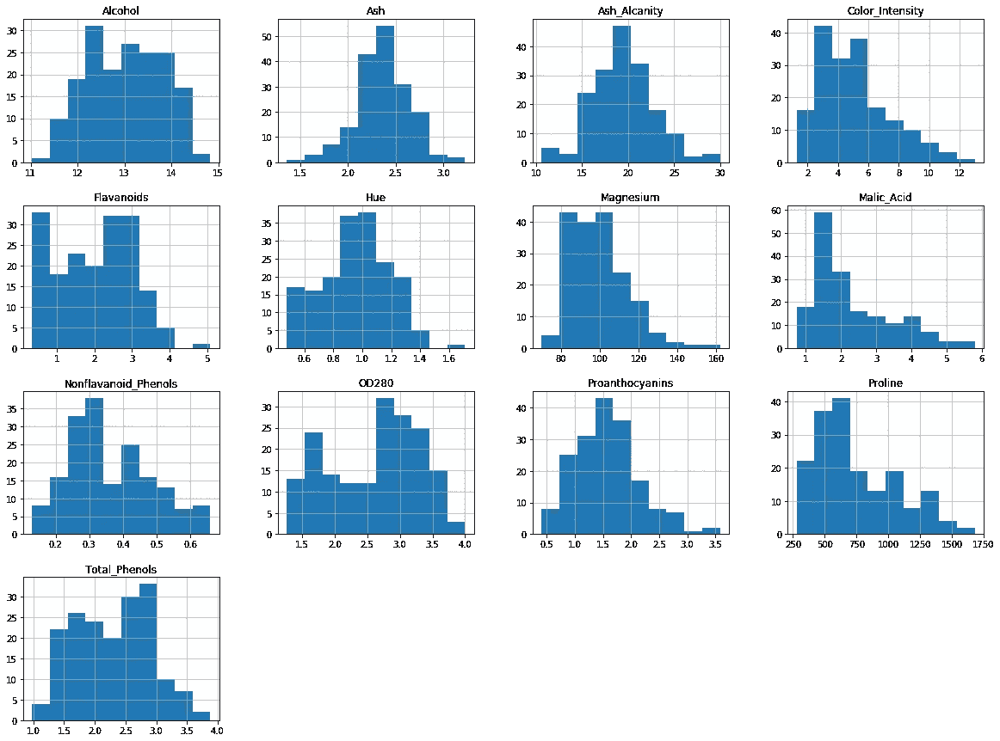
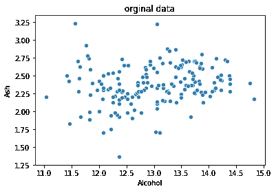
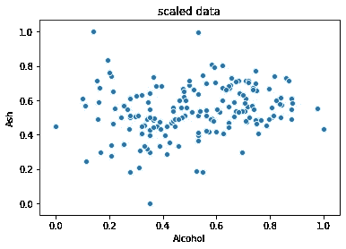
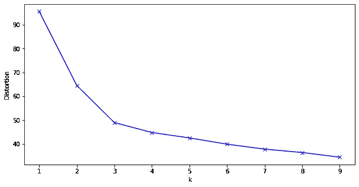
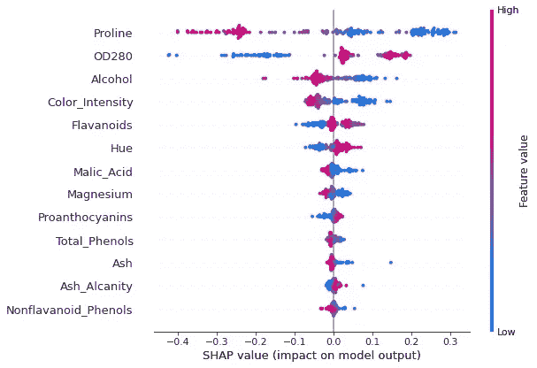

# 如何让聚类变得可解释

> 原文：<https://towardsdatascience.com/how-to-make-clustering-explainable-1582390476cc?source=collection_archive---------8----------------------->

## 在本文中，我将解释如何使用 SHAP 值来更好地理解聚类

# 聚类总是一个黑箱

为了更好地理解不同类型的客户，业务案例中经常需要聚类。但这可能已经足够了。从业务的角度来看，仅仅知道我们有多少个集群以及谁属于哪个集群是不够的。我们需要知道到底是什么形成了这些不同的星团。换句话说，我们想要解释聚类的结果，不幸的是，它总是一个黑箱。我发现自己总是在这种情况下，我也很清楚一个人属于哪个群体，但我不确定他在这个群体中的原因以及他与其他群体成员的不同之处。

这似乎并不明显。回到监督学习，SHAP 值提供了一个通用框架，赋予机器学习可解释性，无论是玻璃盒模型还是黑盒模型。我不打算详细解释 SHAP 值，因为它已经做得很好了，我们几乎可以在互联网上的任何地方找到参考资料，例如[https://christophm.github.io/interpretable-ml-book/shap.htm](https://christophm.github.io/interpretable-ml-book/shap.html)l。但不幸的是，SHAP 值的计算要求我们的数据有标签。事实上，SHAP 值被定义为样本的每个特征如何对输出标注的预测做出贡献。没有标签，SHAP 很难实施。

为了在聚类和 SHAP 值之间架起一座桥梁，我想使用数据聚类的标签，并在此基础上构建 SHAP 值。我将通过研究一个例子来解释我的想法。详细代码请找到[笔记本](http://Hello, sorry for the late reply. I was sick last month. Here is the link for the notebook: https://colab.research.google.com/drive/1BgJuRxRrEcreVwfbfwnFjoFeHonVriKc#scrollTo=eGie9OGPI-QE)的链接。

# 葡萄酒数据集聚类

## 葡萄酒数据集

我将在这里使用葡萄酒数据集:[https://www . ka ggle . com/Harry Wang/wine-dataset-for-clustering](https://www.kaggle.com/harrywang/wine-dataset-for-clustering)。这些数据是对意大利同一地区种植的葡萄酒进行化学分析的结果。分析确定了研究葡萄酒中发现的 13 种成分的数量。让我们先快速看一下桌子的头。



作者图片:葡萄酒数据集表的头

这里我也展示了所有特征的直方图。



按作者分类的图像:葡萄酒数据集所有特征的直方图

## 数据准备

在聚类算法之前，我们必须对特征进行归一化。我用了 MinMaxScaler。

```
import pandas as pd
from sklearn import preprocessingwine_value = wine_df.copy().values
min_max_scaler = preprocessing.MinMaxScaler()
wine_scaled = min_max_scaler.fit_transform(wine_value)
wine_df_scaled = pd.DataFrame(wine_scaled, columns=wine_df.columns)
```

这是缩放前后酒精和灰分值的两个散点图。



作者图片:归一化前后两个特征的散点图

## 聚类算法

我们现在准备在这个葡萄酒数据集上实现聚类算法。我将使用 K 均值算法。我们可以很容易地对一系列聚类运行 K-Means，并将失真收集到一个列表中。

```
from sklearn.cluster import KMeans
distortions = []
K = range(1,10)
for k in K:
    kmeanModel = KMeans(n_clusters=k)
    kmeanModel.fit(scaled_wine_df)
    distortions.append(kmeanModel.inertia_)
```

绘制不同聚类值的失真，我们很清楚 3 是最合适的聚类数。



作者图片:不同聚类值的扭曲。

# 用 SHAP 值解释聚类结果

现在创建了 3 个集群。K-means 模型将简单地输出一个范围从 0 到 2 的数字，表示样本属于哪个聚类。仅此而已。由于数据集有 13 个特征，即使是完整的可视化也不是很明显。为了更好地解释聚类结果，下面是我要做的事情:拟合一个分类器模型，其输出正是由聚类提供的标签，并基于该分类器模型计算 SHAP 值。

我将使用随机森林分类器。最棒的是，在拟合 RandomForest 分类器之前不需要进行归一化，因此我们可以直接使用原始数据。由于分类器的目标是更好地理解聚类，并且不存在过度拟合的问题，所以我将使用所有数据集来进行拟合。

```
from sklearn.ensemble import RandomForestClassifier
from sklearn.preprocessing import label_binarize
kmeanModel = KMeans(n_clusters=3)
y=kmeanModel.fit(scaled_wine_df).labels_
y = label_binarize(y, classes=[0,1,2])
clf=RandomForestClassifier()
clf.fit(wine_df,y)
```

现在，SHAP 终于准备好履行自己的职责了。我将让 SHAP 解释葡萄酒数据集的特性。

```
import shap
explainer= shap.TreeExplainer(clf)
shap_values = explainer(wine_df).values
```

# SHAP 告诉了我们什么？

以 0 组为例。让我们看看这两个标签的概要图。

该汇总图上的每个点都是样本特征的 Shapley 值。x 轴给出了 SHAP 值，而 y 轴由按重要性排序的要素决定。



作者图片:标签 0 的 SHAP 值

我们可以看到，OD280、黄酮类化合物和色调是对定义该集群具有最积极影响的特征。我们可以想象一种葡萄酒含有相对大量的 OD280、黄酮类化合物和色素。作为一个对酒非常无知的人，这个总结图确实让我对聚类结果有了更好的理解。

在这篇文章的最后，我想说的是，聚类是一种非常好的解读无标签数据的方式。但是如何解释聚类的结果一直是个问题。借助 SHAP 值，我们可以更好地理解聚类。