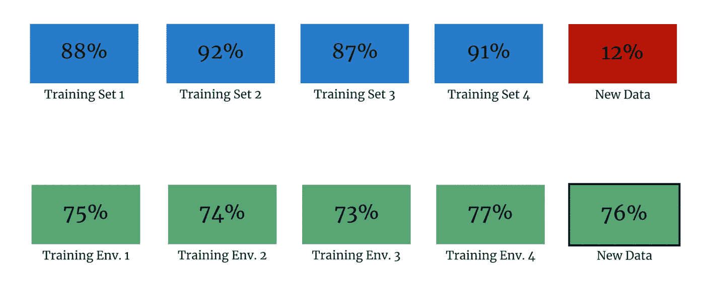
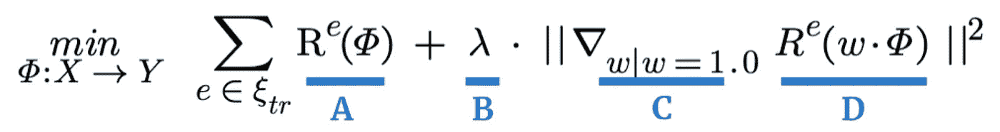

# 如何让深度学习模型更好的泛化

> 原文：<https://towardsdatascience.com/how-to-make-deep-learning-models-to-generalize-better-3341a2c5400c?source=collection_archive---------19----------------------->

## 脸书人工智能研究团队开发的新技术。

不变风险最小化(IRM)是一种令人兴奋的新学习范式，有助于预测模型在训练数据之外进行归纳。它是由脸书的研究人员开发的，并在 2020 年的一篇论文中概述。该方法可以添加到几乎任何建模框架中，但是它最适合利用大量数据的黑盒模型，即神经网络及其多种风格。

事不宜迟，我们开始吧。

# 0.技术 TLDR

在高层次上，IRM 是一种学习范式，试图学习因果关系，而不是相关关系。通过开发*训练* *环境*、结构化数据样本，我们可以最大限度地提高准确性，同时还能保证预测器的不变性。既能很好地拟合我们的数据又不随环境变化的预测值被用作最终模型的输出。

图 1:4 倍 CV 的理论性能(上)与不变风险最小化(IRM)(下)。这些值是从[论文](https://arxiv.org/pdf/1907.02893.pdf)中的模拟推断出来的。图片由作者提供。

**步骤 1:开发您的环境集。**我们没有重新排列数据并假设它们是 IID，而是利用关于数据选择过程的知识来开发采样环境。例如，对于一个解析图像中文本的模型，我们的训练环境可以按照编写文本的人来分组。

**第二步:最大限度地减少跨环境的损失。**在我们开发了我们的环境之后，我们拟合近似不变的预测器，并优化我们跨环境的准确性。详见第 2.1 节。

**第三步:更好地概括！**风险不变最小化方法比传统的学习范例表现出更高的分布外(OOD)准确性。

# 1.但是实际上是怎么回事呢？

让我们慢一点，理解风险不变最小化实际上是如何工作的。

## 1.1 预测模型的目的是什么？

从第一步开始，预测模型的目的是概括，即在看不见的数据上表现良好。我们称看不见的数据*为分布外(OOD)* 。

为了模拟新数据，引入了多种方法，如[交叉验证](/cross-validation-430d9a5fee22)。尽管这种方法比简单的训练集要好，但我们仍然局限于观察到的数据。那么，你能确定模型会泛化吗？

嗯，通常你不能。

对于定义明确的问题，如果您对数据生成机制有很好的理解，我们可以确信我们的数据样本是总体的代表。然而，对于大多数应用，我们缺乏这种理解。

举一个论文中引用的例子。我们正在寻找解决决定一幅图像显示的是一头牛还是一头骆驼的难题。

为此，我们使用交叉验证来训练二元分类器，并在我们的测试数据上观察到高准确度。太好了！

然而，经过进一步挖掘，我们发现我们的分类器只是使用背景的颜色来确定*奶牛*对*骆驼*的标签；当一头牛被放在沙色的背景中时，模型总是认为它是一头骆驼，反之亦然。

现在，我们可以假设在牧场上可以看到牛，在沙漠中可以看到骆驼吗？

大概不会。虽然这是一个微不足道的例子，但我们可以看到这一课如何推广到更复杂和更重要的模型。

## 1.2 为什么目前的方法不够充分？

在深入研究解决方案之前，让我们进一步了解为什么流行的培训/测试学习范例是不充分的。

经典的训练/测试范例在本文中被称为*经验风险最小化(ERM)* 。在 ERM 中，我们将数据汇集到训练/测试集中，在所有功能上训练我们的模型，使用我们的测试集进行验证，并返回具有最佳测试(样本外)准确性的拟合模型。一个例子是 50/50 训练测试分割。

现在，为了理解为什么 ERM 不能很好地概括，让我们看看它的三个主要假设，然后一次解决一个。很快，它们是:

1.  我们的数据是独立且同分布的(IID)。
2.  随着我们收集的数据越来越多，我们的样本大小 *n* 与重要特征数量之间的比率应该会降低。
3.  完美的测试精度只有在有一个具有完美训练精度的可实现(可构建)模型时才会出现。

乍一看，这三个假设似乎都成立。然而，*剧透警报*他们往往不会。原因如下。

看看我们的第一个假设，我们的数据几乎从来都不是真正的 IID。实际上，必须收集数据，这几乎总是引入数据点之间的关系。例如，沙漠中骆驼的所有图像必须在世界的某些地方拍摄。

现在有许多数据“非常”IID 的情况，但重要的是要批判性地思考你的数据收集是否以及如何引入偏见。

> 假设#1:如果我们的数据不是 IID，第一个假设是无效的，我们不能随机打乱我们的数据。重要的是要考虑你的数据生成机制是否会引入偏差。

对于我们的第二个假设，如果我们正在建模偶然关系，我们会期望在一定数量的观察之后，重要特征的数量保持相当稳定。换句话说，随着我们收集更多高质量的数据，我们将能够获得真正的因果关系，并最终将它们完美地映射出来，因此更多的数据不会提高我们的准确性。

然而，在机构风险管理中，这种情况很少发生。由于我们无法确定一种关系是否是因果关系，更多的数据往往会导致更多虚假的相关性被拟合。这种现象被称为[偏差-方差权衡](/understanding-the-bias-variance-tradeoff-165e6942b229)。

> 假设#2:当符合 ERM 时，随着样本量的增加，重要特征的数量可能会增加，从而使我们的第二个假设无效。

最后，我们的第三个假设简单地说，我们有能力建立一个“完美”的模型。如果我们缺乏数据或健壮的建模技术，这种假设就会失效。然而，除非我们知道这是错误的，否则我们总是假设它是正确的。

> 假设#3:我们假设最优模型对于足够大的数据集是可实现的，所以假设#3 成立。

现在本文讨论了一些非 ERM 方法，但由于种种原因，这些方法还存在不足。你明白了。

# 2.解决方案:不变风险最小化

提出的解决方案，称为不变风险最小化(IRM)，克服了上面列出的所有问题。IRM 是一种学习范式，从多种训练环境中估计因果预测因子。而且，因为我们从不同的数据环境中学习，我们更有可能归纳出新的 OOD 数据。

我们如何做到这一点？我们利用因果关系依赖于不变性的概念。

回到我们的例子，假设奶牛和骆驼 95%的时间都出现在它们各自的草地和沙地栖息地，那么如果我们适应背景的颜色，我们将达到 95%的准确率。从表面上看，这是非常合适的。

然而，借用一个来自随机对照试验的核心概念，叫做*反事实*，如果我们看到一个假设的反例，我们已经证明它是错误的。因此，如果我们在多沙的环境中看到甚至一头牛，我们可以得出结论，多沙的背景不会*导致*骆驼。

> 虽然严格的反事实有点苛刻，但我们通过严厉惩罚我们的模型在给定环境中预测失误的情况，将这一概念构建到我们的损失函数中。

例如，考虑一组环境，每个环境对应一个国家。假设在 9/10 的环境中，奶牛生活在牧场，骆驼生活在沙漠，但在第 10 个环境中，这种模式发生了逆转。当我们在第 10 个环境上训练并观察许多反例时，模型了解到背景不能*导致*标签*奶牛*或*骆驼*，因此它降低了该预测器的重要性。

## 2.1 方法

既然已经用英语理解了 IRM，让我们进入数学的世界，这样我们就能理解如何实现它。

图 2:最小化表达式— [来源](https://arxiv.org/pdf/1907.02893.pdf)。

图 2 显示了我们的优化表达式。如总结所示，我们希望在所有培训环境中最大限度地降低总价值。

进一步分解，“a”项表示我们在给定训练环境下的预测准确性，其中 phi (𝛷)表示数据转换，如 *log* 或向更高维度的核转换。 *R* 表示给定环境下我们模型的风险函数 *e* 。请注意，风险函数只是损失函数的平均值。一个经典的例子是均方误差(MSE)。

“B”项只是一个正数，用来衡量我们的不变性项。还记得我们说过严格的反事实可能过于苛刻吗？这是我们可以衡量我们想要多苛刻的地方。如果 lambda ( *λ* )为 0，我们不关心不变性，单纯优化精度。如果 *λ* 很大，我们很在意不变性，相应地进行惩罚。

最后，“C”和“D”项表示我们的模型在训练环境中的不变性。我们不需要太深究项，简单来说，我们的“C”项是我们的线性分类器 *w* 的一个[梯度向量](https://www.youtube.com/watch?v=tIpKfDc295M&ab_channel=KhanAcademyKhanAcademyVerified)，默认值为 1。“d”是线性分类器的风险乘以我们的数据转换(𝛷).整项是梯度向量距离的平方。

[论文](https://arxiv.org/pdf/1907.02893.pdf)对这些术语进行了大量的详细描述，所以如果你有兴趣的话，可以看看第三部分。

综上所述，“A”是我们的模型精度，“B”是衡量我们有多在乎不变性的正数，“C”/“D”是我们模型的不变性。如果我们最小化这个表达式，我们应该找到一个模型，只适合在我们的训练环境中发现的因果效应。

## 2.2 IRM 的下一步措施

不幸的是，这里概述的 IRM 范式只适用于线性情况。将我们的数据转换到高维空间可以产生有效的线性模型，然而，一些关系从根本上来说是非线性的。作者把非线性的情况留给未来的工作。

如果你想跟踪研究，可以看看作者的作品:[马丁·阿约夫斯基](https://scholar.google.com/citations?user=A6qfFPkAAAAJ&hl=en)、[莱昂·布图](https://leon.bottou.org/papers)、[伊桑·古尔拉贾尼](https://ishaan.io/)、[戴维·洛佩斯-帕兹](https://scholar.google.com/citations?hl=en&user=SiCHxTkAAAAJ&view_op=list_works&sortby=pubdate)。

这就是我们的方法。不算太坏，对吧？

# 3.实施说明

*   这里有一个 [PyTorch 包](https://github.com/facebookresearch/InvariantRiskMinimization)。
*   IRM 最适合于未知的因果关系。如果有已知的关系，您应该在模型的结构中说明它们。一个著名的例子是卷积神经网络(CNN)的卷积。
*   IRM 在无监督模型和强化学习方面有很大潜力。模型公平也是一个有趣的应用。
*   优化相当复杂，因为有两个最小化项。本文概述了一种使优化凸的变换，但仅在线性情况下。
*   IRM 对轻度模型错误设定是稳健的，因为它关于训练环境的协方差是可微的。因此，虽然“完美”模型是理想的，但最小化表达式对小的人为错误是有弹性的。

*感谢阅读！我将再写 47 篇文章，将“学术”研究引入 DS 行业。查看我对 IRM 方法的链接/想法的评论。*