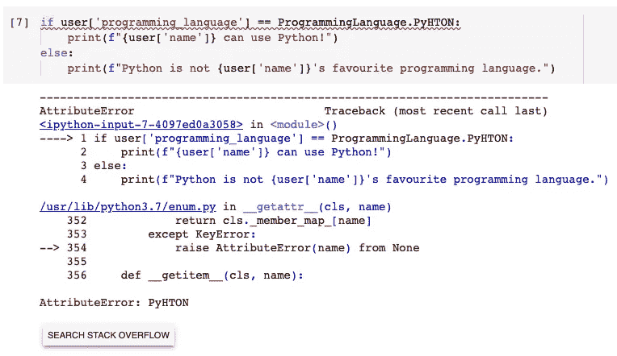

# 如何在 Python 中少犯“错误”

> 原文：<https://towardsdatascience.com/how-to-make-fewer-mistakes-in-python-6925619ce87e?source=collection_archive---------9----------------------->


由 [stevepb](https://pixabay.com/users/stevepb-282134/) 在 [Pixabay](https://pixabay.com/photos/mistake-spill-slip-up-accident-876597/) 拍摄的照片

## 当可以使用枚举时，不要使用 Python 字符串

每种编程语言都必须使用字符串类型。当我们在程序中输入字符串时，错别字通常是不可避免的。如何才能消除编程时可能犯的这种错误？

枚举常用于大多数流行的编程语言中。当然，Python 也提供了灵活的枚举类。使用枚举是一种非常好的编程方式。它帮助我们将一组符号名与唯一的常量绑定在一起。因此，我们可以很容易地使用它来避免一些由错别字引起的运行时错误。

# 典型的定义


照片由 [stevepb](https://pixabay.com/users/stevepb-282134/) 在 [Pixabay](https://pixabay.com/photos/slip-up-danger-careless-slippery-709045/) 上拍摄

现在让我们考虑一个极其简单的用例。我们有一本如下的字典。

```
user = {
    'name': 'Chris',
    'age': 33,
    'programming_language': 'Python'
}
```

然后，我们想测试用户是否喜欢 Python，并根据结果打印一些输出。

```
if user['programming_language'] == 'Python':
    print(f"{user['name']} can use Python!")
else:
    print(f"Python is not {user['name']}'s favourite programming language.")
```


好的。没问题。我觉得很简单，不需要解释代码:)现在，假设我们打了一个如下的错别字。这可能会导致难以定位的运行时错误。


这个 bug 会产生一个结果——没人喜欢 Python。我们知道那不是真的，当然，那是个错误:)

# 使用枚举的基本解决方案


照片由 [stevepb](https://pixabay.com/users/stevepb-282134/) 在 [Pixabay](https://pixabay.com/photos/mistake-error-correction-wrong-968334/) 上拍摄

每个人都会犯错。如何使用枚举来避免这种错误？让我们从定义一个枚举开始。只需导入`Enum`类并定义枚举的成员。

```
from enum import Enumclass ProgrammingLanguage(Enum):
    PYTHON = 1
    JAVA = 2
    C = 3
    JAVASCRIPT = 4
    PHP = 5
```

然后，我们有一个特定成员的枚举。我们可以把它放在字典里如下。

```
user = {
    'name': 'Chris',
    'age': 33,
    'programming_language': ProgrammingLanguage.PYTHON
}
```

如果我们想要平等的测试，它可以是这样的。

```
if user['programming_language'] == ProgrammingLanguage.PYTHON:
    print(f"{user['name']} can use Python!")
else:
    print(f"Python is not {user['name']}'s favourite programming language.")
```


那么，使用枚举比较和普通字符串有什么区别呢？为什么它可以防止错别字运行时的错误？首先，枚举中定义的成员被视为类属性。换句话说，大多数 IDE 工具将提供自动完成功能。因此，我们出现打印错误的可能性就更小了。


最重要的是，如果我们犯了一个错误，Python 解释器会抛出一个错误。



因此，如果有错别字，代码将无法编译。运行时之前暴露的问题通常不是实际问题，而是编程的一部分:)

# 访问枚举的成员


图片由 [Pixabay](https://pixabay.com/photos/bread-sliced-slices-hand-grabbing-410318/) 上的 [JESHOOTS-com](https://pixabay.com/users/jeshoots-com-264599/) 拍摄

好吧，如果你已经决定在必要的时候使用枚举，我猜你可能想了解更多。很高兴在本文中扩展这个主题。让我们首先讨论如何访问一个枚举的成员。

如果我们只是简单的打印成员，那么会打印原始的`Class.Attribute`，并不能提供太多的信息。


然而，如果我们使用`repr()`函数，它也会打印成员的值。


如果我们想得到成员的整数值，只需访问它的`value`属性。对于成员的键，我们可以使用`name`属性来访问它。


## 需要访问成员键的用例示例

访问成员键的用法提示是，我们可以从枚举成员中获取一个字符串以供进一步使用。例如，如果用户字典是从 JSON 文档中转储出来的呢？换句话说，“编程语言”的值必须是一个字符串。

```
user = {
    'name': 'Chris',
    'age': 33,
    'programming_language': 'Python'
}
```

因此，我们可以将字符串“Python”转换为大写，然后将其与枚举成员的键进行比较。

```
if user['programming_language'].upper() == ProgrammingLanguage.PYTHON.name:
```


你可能会问为什么成员键必须全部使用大写字母。简而言之，你不必这么做。但是，当我们定义一个“常量”时，建议使用全大写。枚举中的所有成员都被视为常数。遵循 PEP 标准是一种好的方式。

# 与数据结构集成


照片由[照片 1](https://pixabay.com/users/fotofan1-320502/) 在[图片栏](https://pixabay.com/photos/tower-bridge-bridge-sunset-441853/)上拍摄

你可能会意识到枚举是非常结构化和受限的。因此，它肯定可以集成不同类型的数据结构。这里我将展示 Python 列表和字典的两个例子。

## 将枚举转换为列表

我们可以使用 for 循环来迭代枚举。

```
for lang in ProgrammingLanguage:
    print(lang)
```


因此，我们可以很容易地使用列表理解将其转换为列表。

```
[lang.name for lang in ProgrammingLanguage]
```


事实上，还有另一种方法。这并不简单，但有助于理解枚举的结构。也就是说，我们可以使用一个神奇的属性来获取成员的所有细节。

```
ProgrammingLanguage.__members__
```


类型`mappingproxy`本质上是一个只读字典。因此，我们可以简单地通过调用它的`keys()`函数来获得键的列表。

```
list(ProgrammingLanguage.__members__.keys())
```


## 可用作字典关键字

枚举成员是可散列的，这意味着我们可以将它们用作有效的字典键。

```
popular_use_cases = {}
popular_use_cases[ProgrammingLanguage.PYTHON] = 'Data Science'
popular_use_cases[ProgrammingLanguage.JAVA] = 'Software Development'
popular_use_cases[ProgrammingLanguage.JAVASCRIPT] = 'Web Development'
```


这将是非常有用的，因为它也可以防止我们对字典键的错别字！当我们想从字典中的键获取值时，我们也将使用枚举成员。

```
popular_use_cases[ProgrammingLanguage.PYTHON]
```


# 用字符串值枚举


由 [StockSnap](https://pixabay.com/users/stocksnap-894430/) 在 [Pixabay](https://pixabay.com/photos/wooden-table-gift-wrap-tag-2572709/) 上拍摄的照片

到目前为止，上面所有的例子都使用整数作为枚举的值。事实上，我们可以使用字符串作为值。它在使用过程中提供了更多的灵活性。要获得基于字符串的枚举，只需用字符串定义成员。

```
class ProgrammingLanguage(Enum):
    PYTHON = 'Python'
    JAVA = 'Java'
    C = 'C'
    JAVASCRIPT = 'JavaScript'
    PHP = 'PHP'
```

因此，我们总是可以使用`value`属性来访问成员的字符串值。

```
print(ProgrammingLanguage.PYTHON.value)
```


请注意，我们仍然不能使用枚举成员来比较字符串，因为类型是不同的。结果永远是假的。


相反，我们需要使用成员的值。


# 定义枚举的最简单方法


照片由[pix abay](https://pixabay.com/users/inspiredimages-57296/)[上的](https://pixabay.com/photos/toys-bricks-game-child-colorful-950148/)灵感来源

最后，定义枚举的最“Pythonic 化”的方法可能要容易得多。我们甚至不需要写一个枚举类。`Enum`类有一个构造函数，它可以接受两个参数并生成一个枚举。

```
ProgrammingLanguage = Enum('ProgrammingLanguage', 'PYTHON, JAVA, C, JAVASCRIPT, PHP')
```

在上面的代码行中，第一个参数定义了枚举类的名称。然后，第二个参数是一个字符串，包含所有由逗号、空格或两者分隔的成员键。

在这里，我们没有为每个成员显式分配一个整数，该成员将被自动分配一个从 1 开始自动递增的整数。

之后，我们得到了一个枚举，这与显式地编写一个类是一样的。


# 摘要


[27707](https://pixabay.com/users/27707-27707/) 在 [Pixabay](https://pixabay.com/photos/laptop-coffee-arm-desktop-notebook-1205256/) 上拍摄的照片

在本文中，我介绍了 Python 中的 enumeration 类。我们可以用它将符号名绑定到唯一的常量值。通过这样做，我们可以利用大多数 ide 中都有的自动完成特性，并防止由输入错误引起的运行时错误。

Python 枚举还提供了其他一些有趣的特性，比如用作字典键。除此之外，我们可以使用“Enum”类构造函数轻松定义枚举，而无需显式编写类，多么“Pythonic 化”啊！

<https://medium.com/@qiuyujx/membership>  

如果你觉得我的文章有帮助，请考虑加入 Medium 会员来支持我和成千上万的其他作者！(点击上面的链接)