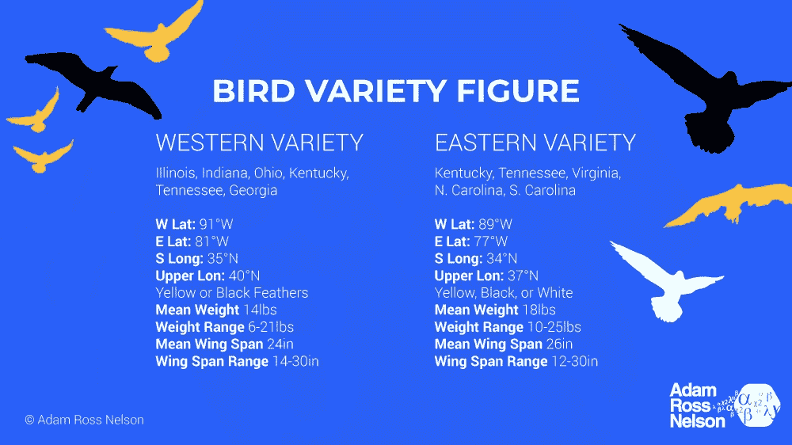

# 如何制作虚构的数据

> 原文：<https://towardsdatascience.com/how-to-make-fictional-data-7a79ce86a350?source=collection_archive---------25----------------------->

## 当您需要数据用于测试、培训、演示或其他目的时。自己做！

大约每周我都会收到(或在网上看到)一位数据科学家同事或有抱负的数据科学家提出的一个问题。*我在哪里可以得到一个数据集来玩？或者，我正在寻找一个有趣的数据集来学习，有什么建议吗？*

有大量有趣的数据被公布出来。但是为什么不自己做数据呢？当您需要数据进行测试或演示时，制作自己的虚构数据也是一项有用的技能。本文将向您展示如何生成虚构的数据(这是许多方法中的一种)。

在本文的底部是额外的资源，包括一个支持 GitHub 库的链接，还有一个 YouTube 视频也说明了这个主题。

# 设置

在图 1 中，我展示了两种鸟类的信息。有“西方”和“东方”之分。



图 1:提供了与鸟类品种相关的概述信息。有“西方”品种，也有“东方”品种。西方的鸟更轻更小。它们有黑色或黄色的羽毛。东方品种有时有白色特征。图片鸣谢:亚当·罗斯·尼尔森(作者)。

西方的鸟品种比东方的品种小。东方品种有时有白色羽毛。图 1 中的摘要信息是虚构的。下面的代码生成的虚构数据近似于图 1 所示的汇总统计数据。

# 代码

首先，有标准进口。

```
**import** **pandas** **as** **pd**
**import** **numpy** **as** **np
from** **random** **import** random
**import** **seaborn** **as** **sns**
```

## 西方品种数据

首先，我们将为西方品种制作数据。我们计划对每个品种进行 1000 次观察。

该代码将假设鸟类分散在它们的地理范围内。此代码还假设范围是矩形的。这是虚构的，我们可以随心所欲地决定。为了保持代码简单，这些是我们正在工作的假设。

```
*# Western variety Latitude & Longitude.* 
west_lat = np.random.uniform(81, 91, 1000) 
west_long = np.random.uniform(35, 42, 1000)
```

下一个代码块将为鸟的重量生成虚构的数据。我们将从均匀分布开始，然后通过添加以零为中心的正态分布来修改该分布。这种方法实现了与上面图 1 中指定的虚构场景相匹配的分布。

```
*# Specify weight.* 
west_weight = np.random.uniform(9, 19, 1000) 
west_weight = np.random.normal(0, 1.25, 1000) + west_weight
```

既然我们有了鸟的重量，我们就可以生成翼展数据。我们预计翼展与重量有关。随着重量的增加，翼展也随之增加。为了使数据更有趣，我们将随着重量增加翼展，但速度是递减的。下面的方程将近似重量和翼展之间的关系。

```
wing_span = 5.9 + 1.8 * weight + -.4 * weight * weight
```

下面的代码产生与上面给出的方程一致的翼展数据。通过使用以 5.9 为中心的随机正态分布，截距的标准偏差为 1，代码近似于自然的随机变化。

```
*# Specify wing-span.*
west_wing = np.random.normal(5.979, 1, 1000) + 1.871 * \
            west_weight + -.0396 * west_weight**2
```

生成的最后一个变量将是羽毛颜色。西方品种的新娘不是黑色就是黄色。第一步是生成一个由随机的 0 和 1 组成的熊猫系列。第二步是将 0 映射到黑色，将 1 映射到黄色。第三步是将数据指定为分类数据。

```
*# Specify the feather colors.* 
west_color = pd.Series(np.random.randint(0, 2, 1000))
west_color = west_color.map({0:'Black', 1:'Yellow'})
west_color = west_color.astype('category')
```

通过链接适用的方法，可以在一行代码中制作羽毛数据。然而，为了限制行宽并使代码更易于阅读，我用三行代码演示了代码。

## 复活节品种数据

为东方品种生成数据的代码与为西方品种生成数据的代码几乎相同。随机数生成器、翼展与重量的关系以及羽毛颜色贴图都有所不同。我在下面的 YouTube 视频中详细解释了这些差异。

```
*# Eastern variety Latitude & Longitude.*
east_lat = np.random.uniform(77, 89, 1000)
east_long = np.random.uniform(34, 39, 1000)*# Specify weight.*
east_weight = np.random.uniform(10.5, 24.5, 1000)
east_weight = np.random.normal(0, .66, 1000) + east_weight*# Specify wing-span.*
east_wing = np.random.normal(24.16, .75, 1000) + -.137 * \
            east_weight + .0119 * east_weight**2*# Specify the feather colors.* 
east_color = pd.Series(np.random.randint(0, 3, 1000))
east_color = east_color.map({0:'Black', 1:'Yellow', 2:'White'})
east_color = east_color.astype('category')
```

## 最后的结果


图二。虚构的鸟类数据。图片鸣谢:亚当·罗斯·尼尔森(作者)。

最终结果是一个数据帧，如图 2 所示。共有六列，包括`lat`(纬度)`long`(经度)`weight`(磅重)`wing`(翼展英寸)`color`(鸟羽颜色)`variety`(西方或东方)。

下图 3 显示的是一个配对图，说明了这些数据之间的关系。


图 3。图片鸣谢:亚当·罗斯·尼尔森(作者)。

[](https://adamrossnelson.medium.com/membership) [## 加入我的介绍链接媒体-亚当罗斯纳尔逊

### 作为一个媒体会员，你的会员费的一部分会给你阅读的作家，你可以完全接触到每一个故事…

adamrossnelson.medium.com](https://adamrossnelson.medium.com/membership) 

# 结论

下次您需要数据集进行测试、培训或演示时，可以考虑生成自己的数据。使用本文中的技术来生成您自己的。当您开始生成虚构的数据时，我建议您提前绘制一份数据概要，如图 1 所示。

如果你想了解更多这方面的信息，[我准备了一个 GitHub 库](https://github.com/adamrossnelson/BirdsDataCreation)，我还准备了一个 YouTube 视频(如下所示)。[一个伴随视频使用这个虚构的数据来显示 K 最近邻分类](https://www.youtube.com/watch?v=ssZq7-5OQLg)。

视频鸣谢:亚当·罗斯·纳尔逊(作者)。

这是生成虚构数据的唯一方法吗？没有。还有其他选择吗？当然，是的。本文提供了一个起点。如果你使用这些技术来生成虚构的数据，请在评论中发布一个链接。

如果您有其他生成虚构数据的方法，请在评论中发布代码的链接。你可能还会发现另外三种方法让虚构的数据成为有用的读物。

# 感谢阅读

感谢阅读。把你的想法和主意发给我。你可以写信只是为了说声嗨。如果你真的需要告诉我是怎么错的，我期待着尽快和你聊天。Twitter:[@ adamrossnelson](https://twitter.com/adamrossnelson)LinkedIn:[Adam Ross Nelson 在 Twitter](https://www.linkedin.com/in/arnelson) 和脸书: [Adam Ross Nelson 在脸书](https://www.facebook.com/adamrossnelson)。