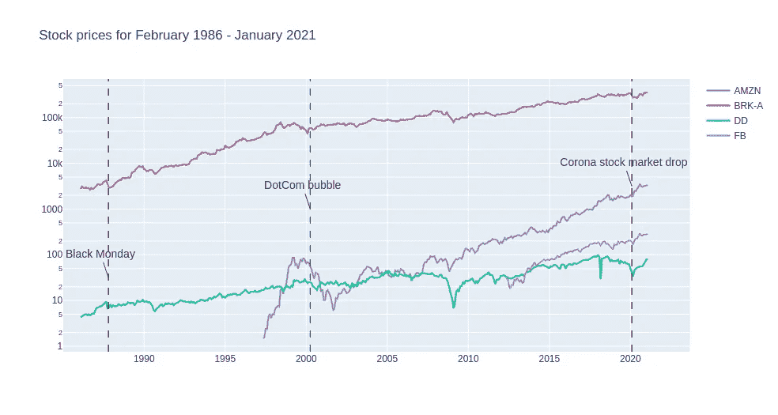
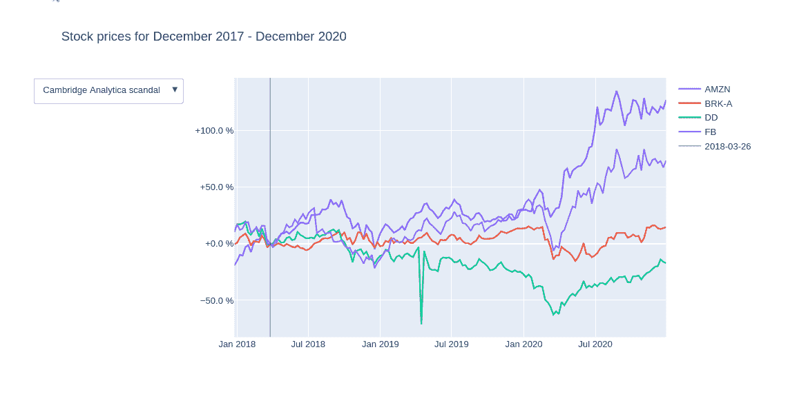
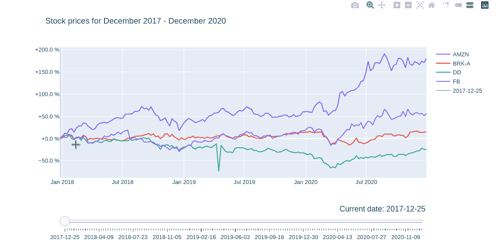
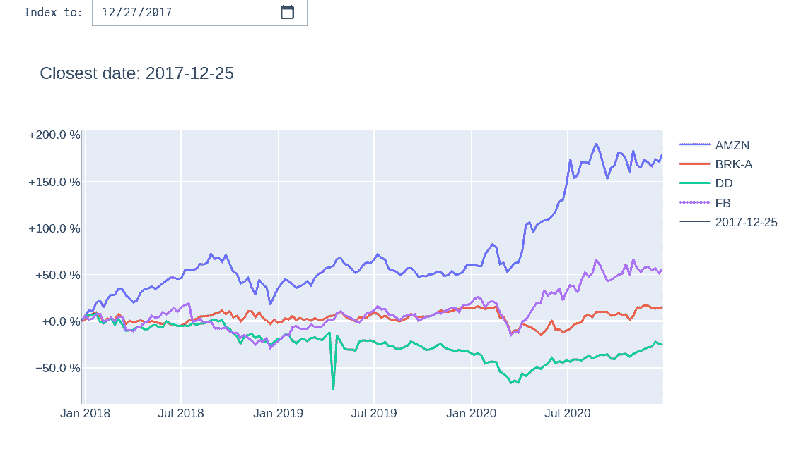
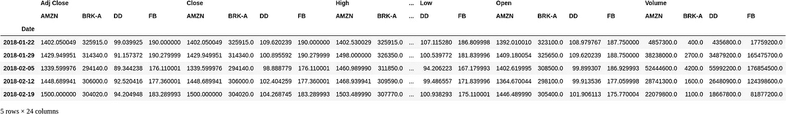
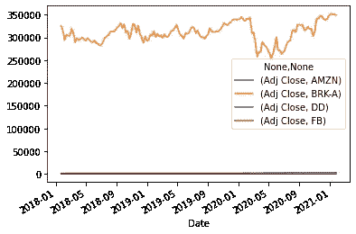
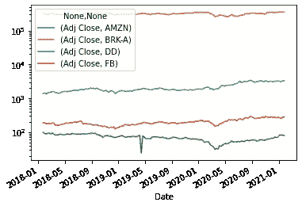
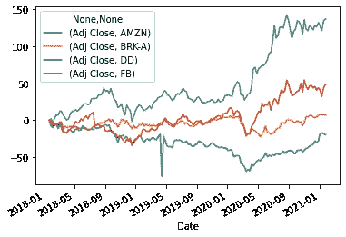
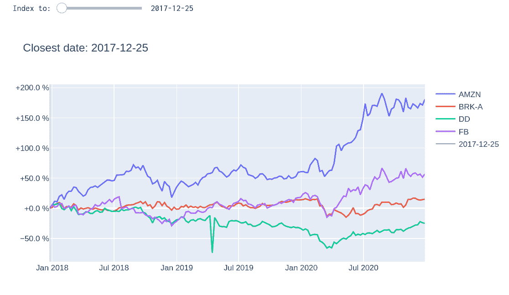

# 如何用 Plotly 制作多指标索引图

> 原文：<https://towardsdatascience.com/how-to-make-multi-index-index-charts-with-plotly-4d3984cd7b09?source=collection_archive---------5----------------------->

## 包含更多见解的索引图表

在处理时间序列数据时，原始数据通常不能提供多少信息。如果你有多个大小不同的变量，较小值的变化很难看到。这个问题有一个简单的解决方案:使用索引数据的索引图表。

虽然常规索引图表工作良好，但通过使用简单的索引扩展，您可以显著改善您的视觉呈现，并帮助您的图表传达数据中的因果关系。这个扩展就是我所说的“**多索引**”——使用多个索引而不是一个。这让你可以从不同的角度分析数据。当您怀疑在特定时间点发生的事件对相关变量的增长有重大影响时，这种方法尤其有用。



对股票市场价格有重大影响的事件(图片由作者提供)

举个例子，如果你要比较一些股票从 1980 年到今天的股价，你会发现 1987 年的[黑色星期一](https://en.wikipedia.org/wiki/Black_Monday_(1987))、2000 年的[网络泡沫](https://en.wikipedia.org/wiki/Dot-com_bubble)和 2008 年的[股市崩盘](https://en.wikipedia.org/wiki/Financial_crisis_of_2007%E2%80%932008)都是对市场产生重大影响的事件，看起来很有趣。因此，你可以将它们添加到指数列表中，参考每个日期的数据，并比较价格相对于每个参考点的发展情况。以这种方式看价格会让你对每个事件的规模有一个更好的直觉，而不仅仅是一个单一的指数日期。

在本文中，我将向您介绍如何使用 Python Plotly 数据可视化库在时间序列图中实现多重索引。我将用完整的代码介绍三种方法，并详细解释它们，包括每种方法的优缺点以及何时使用哪种方法。为了跟上这篇文章，您应该熟悉 Python 和 Pandas，最好对 Plotly 有所了解。

如果您只关心我将要谈到的三个图表中的一个，请随意跳过其他的——这篇文章是以模块化的方式编写的，因此您不会错过任何东西。但是，请务必通读第 1 部分(*设置和准备*)，因为它包含将在每个图表中使用的重要概念和功能定义。

你可以在这里找到这篇文章的全部内容。 ]

***如果你喜欢这篇文章，请*** [***关注我上媒***](https://medium.com/@nkhutorni) *。*

# **文章索引**

1.  [设置和准备](#29f9)
2.  [有固定参考日期的指数图](#9799)



作者图片

3.[动态指数图](#2e1b)



作者图片

4.[JupyterLab 中可变指数的指数图](#e1ec)



作者图片

# 1.设置和准备

## 1.1 获取和清理数据

如前所述，数据准备工作将由熊猫完成。大多数绘图将由 Plotly `graph_objects`模块处理。另外，对于一个绘图，我们将使用`ipywidgets`库，它提供了用于与 Jupyter Notebook 和 JupyterLab 中的绘图进行交互的小部件。对于时间序列数据，我们将使用 Yahoo！金融 API。有一个很棒的叫做`[yfinance](https://pypi.org/project/yfinance/)`的 Python 库，我们将用它来与 API 接口。

我们的目标是建立指数图表，使用户能够第一眼就比较选定股票相对于选定日期的发展。所以，我们挑几只股票来对比一下。我们将重点介绍脸书(Berkshire Hathaway)、亚马逊(Amazon)、杜邦(DowDupont)以及伯克希尔哈撒韦公司(Berkshire Hathaway)的 A 类股(BRK-A ),这是一只股票有史以来价格最高的股票。我有目的地从一个很宽的价格区间选择股票，以证明指数化的有效性。



作者图片

对`yf.download()`的调用以给定的时间间隔下载给定时间段的数据，在我们的例子中是从今天开始，追溯到 3 年前，每周一次。结果存储在一个多索引的 Pandas 数据框架中。

设置`group_by='column'`指定数据将如何分组，是按价格类型(列)还是按报价机(报价机)。这转化为价格类型或报价器是否会成为我们数据框架的顶级索引。

该表包含五种不同的价格。简单来说，我们只看调整后的收盘价，其他的都不看。我们也将删除空值。

```
df = df.filter(regex="Adj Close")
df = df.dropna()
df.head(5)
```


作者图片

## 1.2 索引:为什么和如何

现在我们的数据已经准备好了，让我们先看一下这些值。

```
df.plot()
```



作者图片

绘制原始价值对比较股票帮助不大。由于 BRKa 股的价格高得多，其他股票的变化几乎看不见。也许对数标度数据会缓解这个问题？

```
df.plot(logy=True)
```



作者图片

即使在对数尺度上，数值差异也太大，我们无法对股票进行有意义的比较。很明显，我们需要索引。

指数化很简单:选择一个日期 **D** 作为指数，用每个日期的价格除以日期 **D** 的价值。现在，所有结果值都表示为它们与 **D** 处的值 **V** 的比值，并且可以很容易地相互比较。在我们的例子中，我们需要区分不同的股票，所以对于每只股票，我们将所有的值除以相应股票在日期 **D** 的值。我们可以很容易地在 Pandas 中做到这一点，因为我们有一个多索引的数据框架。对特定指数调用`iloc`会返回一个 Pandas 系列，其中包含该特定指数的所有股票的值。当我们用序列划分数据帧时，Pandas 用序列中相应的元素划分每一列。

我们还会添加一些化妆品。将新值乘以 100 将得到百分比值，使用起来更舒服。第二个可选的修饰是从结果中减去 100。这有效地将 100%设置为 0%，并将*比率*更改为*相对差值*。例如，下降到原始值的 30%现在将被解释为`original value — 70 %`。我个人认为这种解释更容易理解。

注意，我将索引日期称为*参考日期*，索引值称为*参考值*。这样做是为了避免与 dataframe 索引混淆。

```
# use the first date as index 
reference_value = df.iloc[0]# dividing by the series divides each column by the 
# corresponding element in the series
tmp_df = df.div(reference_value) * 100 - 100tmp_df.plot()prepared_df = df.copy()
```



作者图片

这个看起来好多了。股票价格趋势是立即可见和可比的。

我们将更多地使用索引，所以让我们为这项技术写一个通用函数`create_indexed_columns()`。该函数将采用以下参数:

1.  `date` -索引的参考日期
2.  `df` -要处理的数据框架
3.  `top_level_name` -(可选)规范化数据帧的顶层索引的名称

并返回具有规格化数据和新的顶层索引的新的数据帧。

一个重要的考虑是如何处理不在数据帧中的输入日期。幸运的是，dataframe indices 有一个非常有用的方法`get_loc()`,可以找到给定索引的整数索引。当我们将参数`method=nearest`传递给该方法时，Pandas 将搜索与所提供的输入最接近的索引。因为我们的索引是类型`datetime`，所以将匹配最接近所提供日期的日期。

在我们进入第一个 Plotly 指数图表之前，让我们回顾一下**“多指数”**图表的概念。正如我们所见，将数据索引到一个时间点非常有效。然而，查看多个参考点通常是有用的。这些可能是时间序列中对我们的数据有重大影响的特定事件。从多个点查看数据使用户能够容易地看到相关变量相对于*不同的*参考点是如何增长的。实现这一点的最佳方式是将该功能直接嵌入图表中。

## 1.3 非常短的 Plotly Crashcourse

这个快速介绍只是简单地触及了 Plotly 的基本概念。如果你以前和 Plotly 一起工作过，跳过它。

在一个图中有多个索引意味着它们需要动态切换，因此我们的图必须是交互式的。Plotly 是开箱即用的交互式，扩展交互性相对简单，这就是 Plotly 是首选库的原因。

在 Plotly 中，每个图形都是一个类似 JSON 的数据结构，有三个主要属性(称为*属性*):数据、布局和框架。前两个是不言自明的，而帧属性包含动画中使用的可选帧。您可以先使用 JSON 或 Python 字典编写整个人物结构，然后实例化人物对象，或者先创建人物对象，然后逐步更新人物属性。

作为热身，让我们重新创建默认的 matplotlib 图表，该图表是通过调用 Plotly 中的`df.plot()`生成的。

在上面的例子中，我们实例化了 Figure 对象，然后一个接一个地向该对象添加单独的轨迹。我们可以用更新属性的字典调用`update_layout()`来改变图形的布局。

对 Plotly 图形的所有更改都是这样完成的，将属性字典传递给图形。Plotly 支持“神奇的下划线符号”,这意味着我们不需要逐步深入对象来访问内部属性，而是能够直接访问内部属性。例如，我们可以简单地编写`fig.update_layout(yaxis_type='log')`,而不是访问`yaxis`属性的`type`属性——在许多情况下，这是一种可读性更好的方法。

既然我们都准备好了，我们可以开始我们的第一个图表了。

# 2.具有固定参考日期的索引图表

在这张图表中，我们将使用预先选定的股市衰退前后的日期，以及对我们正在分析的公司有影响的日期。下面列出的日期可能不完全准确，但它们大致在所列事件的时间范围内。

```
ref_dict = {
    "Cambridge Analytica scandal": "2018-03-28",
    "DowDuPont separation":        "2019-04-15",
    "Corona stock market drop":    "2020-02-14"
}
```

我们将根据每个日期对数据进行索引，并在图表中包含所有不同的索引数据。不同索引数据之间的切换将通过使用一个下拉菜单来完成，每个参考日期都有一个项目。Plotly 将此称为“按钮”。点击一个按钮将只显示由各自的参考日期索引的数据。为了实现这一点，我们需要将我们想要显示的轨迹的可见性切换到 on，并且对于剩余的轨迹将其关闭。

首先，让我们计算每个参考日期的值，并用结果数据填充我们的数据框架。我们将为每个参考日期创建一个新的数据框架，然后将它们合并成一个数据框架。我们还将存储最接近给定参考日期的日期，以防我们没有该参考日期的值。

现在我们的表已经转换，我们可以构建我们的 Plotly 对象。我们将创建一个新的图形，并为每个新计算的列添加一个跟踪。我们将为每个跟踪提供一个额外的`meta`属性。`meta`属性可以存储任意的 JSON 数据，有很多应用。我们将使用它来存储一个跟踪所属的参考日期。这将允许我们识别将同时切换到可见/不可见的一组轨迹。

那可是好多痕迹啊！我们只想显示属于一个参考日期的那些。就像以前一样，我们不会为我们的精确数据硬编码按钮。最好将我们的程序一般化，这样我们就能够处理一组不同的参考日期和代号。

要显示或隐藏痕迹，我们需要设置图形的`visibility`属性。因为这是图形的一个属性，而不是单个轨迹，所以默认情况下，对此属性的更改适用于所有轨迹。在内部，可见性表示为一个布尔值数组，其中特定索引处的值表示具有相同索引的跟踪的可见性。轨迹索引是轨迹在该阵列中的位置，并且因为轨迹是一个接一个地添加的，所以轨迹索引表示轨迹被添加到图中的顺序。

visibility 数组允许我们通过传递特定跟踪的索引或传递一个布尔值数组来定位单个跟踪，其中每个索引处的值指示是否将显示相应的跟踪。例如，对于 4 条轨迹，通过数组`[True, False, True, False]`将只显示第一条和第三条轨迹。

可以想象，依靠添加轨迹的顺序来创建永久按钮是一种脆弱的方法。如果您以不同的顺序添加跟踪或添加更多的跟踪，则必须手动检查和更新对可见性数组的每次提及。这就是为什么我们添加了`meta`属性——这样，我们就不需要依赖于轨迹的顺序来确定打开/关闭哪些轨迹。

一个简单的函数`create_visibility_array`将通过比较每个跟踪的元值和传入的值来创建可见性数组。

最后，我们将编写一个生成按钮的函数。

让我们澄清一下按钮描述。`method`指定按钮点击时调用的 Plotly 方法。`restyle`更新数据和绘图布局。`args`参数接受一个图表属性列表，该列表将通过单击按钮来更新，在我们的例子中是 visibility 属性。

最后，我们将按钮添加到图形中，并检查结果。

太好了，按钮正常工作。唯一的问题是很难看到实际的参考日期。我们可以通过在每个参考日期的 x 坐标上添加一条垂直线来解决这个问题。自然，我们需要能够用现有的按钮来切换这些参考线的可见性。

在 Plotly 中有两种方法可以做到这一点:标准方法是在图形中添加一个`shape`对象。在我们的例子中，我们只需通过调用`figure.add_shape()`并指定 x 和 y 坐标来添加一个线条形状。虽然这种方法看起来很简单，但是对于我们的情况来说有一些特殊的困难。因为形状不是轨迹，我们不能用现有的方法改变它们的可见性。相反，必须设置单个 shape 对象的 visibility 属性，这样做有些晦涩难懂([这个堆栈溢出问题说明了过程](https://stackoverflow.com/questions/42406960/accessing-shapes-parameters-in-plotly-interactive-args))。此外，似乎没有类似于 trace visibility 数组的简洁方法来一次改变多个形状的可见性。

添加参考线的第二种方法是添加将被绘制为垂直线的轨迹。为此，必须选择两个 y 坐标来设置线的边界。然而，我们需要确保该线在高度方向覆盖整个绘图，除此之外，参考线不得影响绘图的比例——这意味着我们不能简单地选择数据帧中最小值和最大值之下或之上的某个值作为边界，因为这会扭曲其余值的比例。解决方案是在绘图中添加一个不可见的辅助 y 轴，该轴独立于数据框中的值，并相对于自身缩放参考线。

虽然第二个 y 轴在一定程度上增加了图形的复杂性，但使用走线作为参考线有一个显著的好处:我们可以像处理所有其他走线一样切换参考线的可见性。因此，我们只需要添加参考线跟踪，并将其元参数设置为它所引用的参考日期。

如您所见，第二种方法更适合我们的情况，这就是我们为什么要使用它的原因。在添加参考线之前，让我们先将辅助 y 轴添加到绘图中。当我们这样做的时候，我们也可以给情节添加一些简单的样式。

属性指定了 hoverlabels 将如何在我们的绘图中显示。将此值设置为“x”将显示鼠标悬停在 x 值处的每个轨迹的值。我们将辅助 y 轴设置为固定范围。这样，该线将始终贯穿整个地块的高度。将`overlaying`属性设置为‘y’非常重要，因为这将迫使相对于第二 y 轴定义的轨迹表现得好像它们是在第一 y 轴上定义的一样——具体来说，该属性和`fixedrange`的组合正是允许我们看到参考线，同时使它们的比例独立于 y 轴。

现在图形已经准备好了，我们可以编写一个`create_reference_line()`函数来为我们生成参考线。需要注意的一点是，当我们为 y 坐标对称地指定两个值时，我们也需要提供一个包含两个 x 值的列表。

对我们之前的散点追踪定义的唯一补充是:

*   `mode="lines"` -指定仅将轨迹绘制为直线，而不标记其间的点
*   `yaxis="y2"` -指定将辅助 y 轴用作 y 轴
*   `line` -决定线条的样式

最后，最后一步包括将参考线轨迹添加到绘图中，并重新生成可见性按钮。搞定了。

# 3.动态索引图表

我们要看的第二个图表是一个**动态指数图表**。该图表允许用户在参考日期之间快速移动，创建一个视觉上吸引人的图表。

因为我们只使用 Plotly 图形库，所以这里最好的方法是为每个参考日期创建一个框架，然后使用 Plotly 滑块在它们之间移动。通过使用滑块，我们还可以为参考日期之间的过渡添加动画效果，这将使过渡更加平滑。

首先，我们需要将数据索引到每个日期，并为其创建跟踪。结果数据将被存储在一个框架中，这个框架只是一个带有识别名称的`figure['data']`字典。我们将使用`create_indexed_columns`和`create_reference_line`函数创建轨迹，就像前面的例子一样。框架将由框架中的数据被索引到的日期来标识。函数`create_traces_for_date`将捆绑这个功能。

接下来，我们将创建一个滑块字典来定义我们的滑块。我们使用的一些重要属性是:

*   `yanchor`和`xanchor` -指定滑块的位置
*   `pad` -滑块的填充
*   `currentvalue` -描述如何显示滑块的当前值，包括位置、字体大小和前缀。
*   `len` -描述滑块相对于图表的长度。1 表示与长度完全匹配，这就是我们想要的。
*   `steps` -是滑块将循环通过的步骤列表。我们会先将它留空，稍后再添加。

接下来要做的是创建步骤，我们将添加到我们的滑块。一个步骤由属性`label`、`method`和`args`描述。`method`指定当滑块值改变时将调用哪个 Plotly 函数。通过使用`animate`,我们将获得帧间的平滑过渡。`args`属性描述了将被传递到`method`中指定的 Plotly 函数的数据，包括一个帧列表和一个指定如何在它们之间转换的字典。实际上，您可以为每个滑块步骤指定多个帧，当滑块移动到该步骤时，这些帧将全部循环。在我们的例子中，我们只需要一个帧，并用它的名字来标识它。之后，我们描述转换属性:

*   `frame` - `duration`指定画面将显示的总时间，`redraw`图表是否应该在每一步之后重新绘制。
*   `mode` -指定对`animate`函数的新调用如何与当前动画交互。设置为“下一个”意味着当前运行帧将在切换到下一帧之前结束。
*   `transition` -指定总帧持续时间过渡部分的持续时间和使用的[缓动功能](https://easings.net/)。

这里有一些重要的细节需要注意。首先，在我们的例子中，设置`redraw=False`提供了显著的性能优势，因为我们有数百个帧，每个帧有数百个点。如果没有这个设置，图表更新会明显滞后，您很快就会看到这一点。然而，禁用`redraw`也有一些缺点:例如，如果`redraw`被禁用，允许您设置视图范围的 rangeslider 将不会更新。另一个重要的缺点是 y 轴的范围不会自动更新，这有时可能不会显示图表上的所有点。在本文的第三部分，我们将看到如何结合两种实现的优点，即快速更新**和图表重绘**，代价是一些动态性和需要一个 Jupyter 笔记本。还有一种方法可以在不影响性能的情况下实现这一切(对于合理数量的数据点)，但是这种解决方案需要 Dash 服务器，这超出了本文的范围。

另一件要记住的事情是，过渡持续时间是帧持续时间的一部分，因此将其设置为大于帧持续时间不会改变总持续时间。

此外，Plotly 将在滑块步长*和*期间动画显示多个帧之间的过渡，以及两个相邻滑块步长的帧之间的过渡。

现在，所有的功能都设置好了，我们可以实际创建框架和步骤，并填充我们的图形。对于每个日期，我们将创建一个框架，其中包含索引到该日期的跟踪和该框架的滑块步骤。注意，我们将一个帧的名称设置为它所代表的日期的 iso 格式字符串，并立即将该字符串传递给我们的`create_slider_step`函数。这样做是因为滑块使用框架名称来确定要显示哪个框架。

最后，我们塑造我们的形象。我们简单地使用第一帧作为我们图形的`data`属性。我们使用`style_plot`功能配置辅助 y 轴，就完成了！

我已经警告过你要启用`redraw`，但是让我们实际看看它的运行情况。我们将创建与之前完全相同的索引图表，但是这次将`redraw`设置为 true。

如你所见，图表明显比以前慢了。就我个人而言，我觉得这种滞后是勉强可以接受的；然而，这是一个极限:如果你将数据点的数量增加到 5000 个以上，图表将会变得很慢，任何人都不会喜欢使用它。为了保持可接受的速度，您需要将数据点的数量保持在这个数字以下。

# 4.JupyterLab 中可变索引的索引图

第三个图表将允许用户选择自定义参考日期。如果您计划在 JupyterLab 中展示您的工作，不需要像动态索引图表中那样的花哨动画，但仍然希望用户能够选择任何日期作为参考日期，此图表正适合您。**请注意，此图表仅适用于 JupyterLab，不适用于 Jupyter 笔记本！**图表将通过使用小部件的`ipywidgets`库来实现。根据官方文件，微件是

> *在浏览器中具有表示形式的多事件 Python 对象，通常作为控制器，如滑块、文本框等。[..]你可以使用小部件为你的笔记本建立交互式图形用户界面。您还可以使用小部件在 Python 和 JavaScript 之间同步有状态和无状态信息。*

( [Source](https://ipywidgets.readthedocs.io/en/stable/examples/Widget%20Basics.html) )这个想法是使用小部件通过 GUI 为我们的图表提供输入，并更新图表。这样，在选择了不同的参考日期后，图表数据将通过 Jupyter 回调而不是 Plotly 事件进行更新。

我们将使用两个不同的小部件构建两个版本的图表。一个是 DatePicker 小部件，另一个是 SelectionSlider 小部件。第二个版本将是第 2 部分中动态索引图的健壮实现。

首先，我们复制我们的初始数据帧并导入额外的库。`Ipython.display`用于渲染浏览器中的小部件。

```
from IPython.display import display
from ipywidgets import widgets as wgdfs = df.copy()
```

接下来，我们创建图表对象。因为我们希望我们的 Plotly 图表与 Jupyter 小部件兼容，所以我们的图表需要是一个 FigureWidget 对象，而不是一个 Figure 对象。

我们之前定义的样式函数也适用于 FigureWidget 对象，所以我们可以简单地将它应用到我们的绘图中。

在添加交互性之前，我们需要用初始数据填充图表。我们需要为图表提供一个初始状态。在我们的例子中，state 代表选定的参考日期。我们将使用起始日期作为初始状态，用`create_indexed_columns`将数据索引到该日期，并将包括黑色参考线在内的所有轨迹添加到绘图中。

我们有基础，我们的初始状态。下一步是编写`update_chart`函数，该函数将接收一个日期作为小部件的输入和属性，使用`create_indexed_columns`将我们的数据标准化为该日期，并用这些新值更新轨迹的 y 值。为了一次更新多个值，我们将使用`[figure.batch_update()](https://www.kite.com/python/docs/plotly.basedatatypes.BaseFigure.batch_update)`上下文管理器来执行更新。对布局和`with figure.batch_update()`块内的数据的每一个改变都将在一个消息中发送到图表，而不是像`update`那样的多个消息，从而防止中断。

现在我们开始实现日期选择器变体和滑块变体。我们从第一个开始。

还有四个步骤:

1.  创建一个 DatePicker 小部件。
2.  定义一个回调函数`picker_response`，它监听小部件中的变化并调用`update_chart`。
3.  将回调函数连接到小部件。
4.  将小部件放入容器并显示所有内容。

第一步很简单。

对于第 2 步和第 3 步，带有签名`handler(change)`的特殊处理函数`picker_response`必须用于回调。`change`是一个保存变更信息的字典，比如旧值和新值，以及小部件已变更属性的名称。我们将使用`new`键获取更改时设置的新值。为了将处理程序绑定到小部件，我们使用小部件的`observe`方法。通过设置`observe`的`names`参数，我们指定回调函数将在小部件的哪些属性上执行。在我们的例子中，我们需要设置`names='value'`,因为我们想要将滑块的值，即选择的日期传递给处理程序。

在第 4 步中，我们简单地用一个垂直框小部件调用`ipython.display`函数，它包含日期选择器小部件(包装在一个水平框中)和数字小部件。这些框就像容器一样，类似于 HTML divs。就是这样！


作者图片

图表按预期工作。

现在让我们使用 slider 小部件重新实现带有滑块的动态索引图表。这里的过程在结构上与前面的图表相同。首先，我们定义一个选择滑块小部件，它存储一个选项值列表。对于我们的选项，我们将使用转换为字符串的索引中的日期。我们使用字符串，因为否则当前日期将被格式化为零小时，这不太好。

下面的部分将允许我们使这个图表成为动态索引图表的可靠替代:通过将小部件的`continuous_update`属性设置为 false，回调函数将只在发布事件时执行。这将产生一个不像动态索引图那样花哨的图表，但具有相同的日期选择界面和每次日期滑块改变时重新绘制的所有好处。如果您启用了`continuous_update`，图表的行为将与动态指数图表完全一样，速度相同(如果不是更慢的话)。

接下来，我们编写回调函数，用`observe`将其连接到滑块。最后，我们将所有东西包装到一个 VBox 小部件中，并调用`display`。瞧，图表准备好了！



作者图片

我希望这篇文章对你有用！我花了一段时间才发现如何实现多索引图表，我想让您免去这项工作。

我想问你一件事:**如果你喜欢这篇文章，请** [**跟我上媒**](https://medium.com/@nkhutorni) 。你的订阅将使媒体给我钱，我喜欢钱。谢谢😊

你可以在 [GitHub](https://github.com/nikitakhutorni/Articles) 上找到整篇文章的源代码。