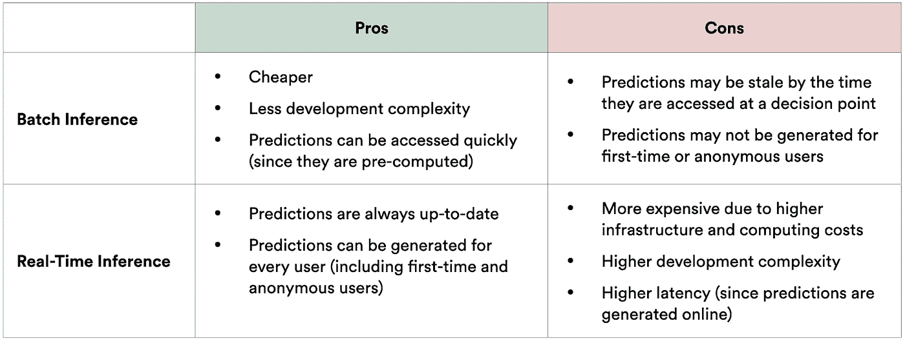
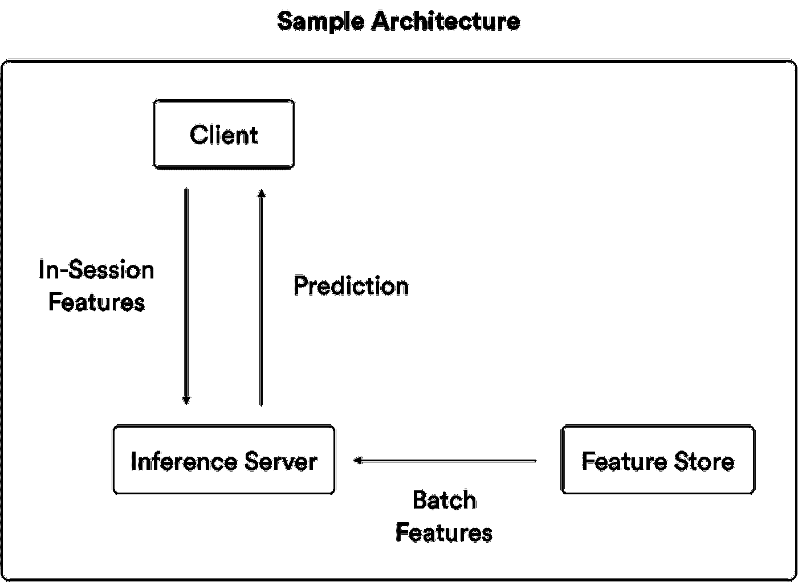

# 如何让实时机器学习为用户旅程服务

> 原文：<https://towardsdatascience.com/how-to-make-real-time-machine-learning-work-for-user-journeys-5d41fa073005?source=collection_archive---------18----------------------->

## *为什么结合会话和历史行为是 B2C 组织的正确方法*

[阿伦视觉| Unsplash](https://unsplash.com/photos/BXOXnQ26B7o)

现场用户体验是数字企业与其客户之间最重要的接触点。这就是为什么领先的 B2C 组织经常求助于[动态决策](https://en.wikipedia.org/wiki/Dynamic_decision-making)策略来优化他们的用户旅程。由机器学习(ML)驱动的动态决策引擎可以帮助产品团队满足消费者日益增长的个性化需求，同时引导他们实现有意义的业务成果，如转化、参与等。

实时机器学习可以通过在每个用户的会话中自动适应新信息来增强动态决策。与[批量推断](https://mlinproduction.com/batch-inference-vs-online-inference/)相比，实时更新预测可以提供两个实质性的好处:(1)更准确的模型，以及(2)针对匿名和首次用户的能力。然而，有许多不同形式的实时 ML，并不是所有都非常适合优化用户的旅程。在这篇文章中，我们解释了为什么 B2C 组织希望最大化其动态用户体验的价值，应该利用一种特定形式的实时 ML:由历史数据和会话中数据的组合提供动力的实时推理。

**实时推理的优势**

一旦训练了机器学习模型，在大多数情况下，使用该模型进行预测是一个两步过程:

1.  **特征工程** —将原始数据处理成更具预测性和机器可读的变量，并对模型进行训练。特征的例子包括用户行为随时间的变化、人口统计信息和一天中的时间。
2.  **推理** —通过模型输入这些特征以生成预测。

例如，考虑一个[机器学习管道](https://algorithmia.com/blog/ml-pipeline)，它被设计成[预测促销折扣将如何影响每个用户转化为付费订阅的可能性](https://marketingtechnews.net/news/2021/jan/27/its-time-to-stop-wasting-marketing-spend-and-start-using-uplift-models/)。为此用例收集的原始数据可能包括行为事件—点击、登录、页面浏览量等。但是为了训练一个高质量的模型，这些事件必须首先被转换成更高层次的特征，例如:“用户在过去两周内登录了多少次？”，或者“用户的会话有百分之多少发生在移动设备上？”。一旦训练完成，这些相同的特征必须在推理期间提供给模型，以便进行预测。

大多数 ML 系统通过在循环时间表上进行离线批处理来进行特征工程和推理。然后，可以非常快速地存储和访问所得到的预测，以便进行现场动态决策，但是它们不会考虑自批处理运行以来积累的任何信息。更重要的是，批量预测不适用于没有先前行为历史的首次用户或匿名用户。由于第三方 cookies 的长期压力，实时数据的缺乏越来越成问题。

实时推理试图通过利用最新的可用信息来填补这些空白。在许多情况下，实时推理会为现有用户带来更好的预测(因为会话中的数据通常对良好的性能至关重要)，并使企业能够瞄准更广泛的用户群(即匿名用户)。再加上动态决策引擎，这些优势可以转化为数字产品团队更多的转换和收入。

**实现实时 ML:用户旅程的挑战**

在理想情况下，特征工程和推理都是实时发生的。当用户浏览你的网站时，他们的行为会自动与历史事件结合成复杂的特征，这些特征会被用来进行最新的预测。然而，实际上，在(1)可以进行多少实时处理和(2)可以多快获得预测之间存在权衡。你越快需要返回结果，你就越不需要复杂的特性工程。

例如，考虑一个特征，该特征描述了在用户的一生中，在类别“新闻”上出现的用户文章的百分比。为了实时地重新计算这个特征，必须加载并查询用户的整个行为历史。现在考虑一个 ML 模型可能需要数千个相似的特性，很容易看出这种方法对于需要低延迟和客户端实现的用例来说是不可行的。由于这种权衡，许多成功部署实时 ML 的领域是那些直接从客户端收集做出准确预测所需的所有信息的领域。

例如，考虑保护当今许多智能手机的面部识别软件。一旦一个模型被训练来识别某些面部特征，预测一张给定的脸是否属于手机的主人仅仅依靠这张脸的照片。因为所有必要的输入数据都以机器可读的形式直接可用，并且不需要与其他数据源结合，所以可以非常快速地实时做出预测。下面列出了在独立环境中运行的实时 ML 的其他示例。

然而，对于消费者数据用例，仅仅依靠当前会话的信息通常是不够的。预测用户未来的行为通常需要对他们过去的行为有更全面的了解。但是，加载这些数据并将其整合到最新功能中通常非常缓慢。因此，B2C 产品团队有时被迫在两个不完美的解决方案之间做出选择:仅基于当前会话的数据使用实时推断，或者仅使用历史数据生成批量预测。

**两全其美的解决方案**

为了应对这一挑战，在消费者旅程中使用机器学习的组织应该采用混合方法。通过利用历史特征(批量预先计算)和会话中特征(实时计算)的组合，企业可以获得实时推理的好处，而不会牺牲过去数据的预测价值。

在这个框架中(我们称之为*具有混合特征的实时推理*)，每个用户的整个行为历史在做出预测时都被考虑在内。但是，为了避免延迟问题，过去和现在的数据不会合并到任何单一功能中。相反，一组特征是基于用户的当前会话构建的，而另一组特征是使用来自先前会话的数据构建的。例如，不是计算诸如“在过去 7 天内，包括这次会话，用户点击了多少次？”一个混合特征系统将产生两个独立的特征，这两个特征合在一起捕获相同的信息

1.  "用户在过去的 6 天里点击了多少次？"(在服务器上批量计算)
2.  "今天用户在当前会话中有多少点击？"(在客户端实时计算)

这种方法为动态用户旅程提供了两全其美的优势——复杂的历史功能描绘了用户行为的全面图景，最新的行为信号促进了上下文定位和匿名用户预测，以及低延迟(约数百毫秒)以确保响应迅速的用户体验。

**示例:动态订阅付费墙**

为了说明这个框架在实践中是如何工作的，考虑一个媒体组织，其目标是通过动态付费墙系统来增加订阅量。该系统由一组 ML 预测驱动，这些预测表明如果显示硬付费墙而不是访问 3 个额外的免费内容，每个用户订阅的可能性将如何变化。

预测一个用户的行为会如何改变是一项困难的任务。为了实现高投资回报率，组织需要准确的 ML 预测。为了生成准确的预测，模型需要访问一组丰富的要素。为了构建这些功能，我们混合使用了历史信息和会话信息。

首先，考虑历史特征。这些可以使用前一天结束时收集的信息，按批处理时间表每天重新计算。例如，在 1 月 1 日午夜，可能会运行一个批处理进程，使用截至 12 月 31 日一天结束时收集的信息来重新计算数千个分析风格的特征(如下所示)。

现在让我们假设用户 X 在 1 月 1 日登录网站。为了确定用户应该获得哪种付费墙体验，我们请求生成一个新的预测。用户的批量要素从高可用性要素存储中获取，而一组会话中的要素在客户端中实时计算。两组特征都被提供给模型，以便做出可能的最佳预测。

**结论**

实时推理可以极大地提高动态决策策略的效率，但对于 B2C 组织来说，采用正确的实时实现以实现其好处是很重要的。通过利用来源于过去和现在数据的混合特性工程系统，这些组织可以为更多用户生成更好的预测，以优化现场体验并推动其业务的关键指标。