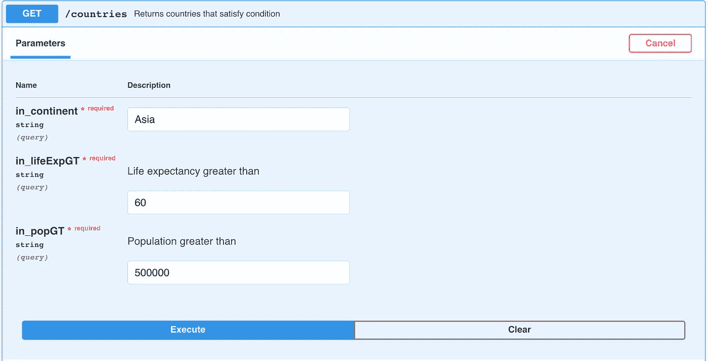

# 如何用 R 制作 REST APIs:水管工初学者指南

> 原文：<https://towardsdatascience.com/how-to-make-rest-apis-with-r-a-beginners-guide-to-plumber-9be4cd8c8015?source=collection_archive---------39----------------------->

## 立即将 R 脚本转换成 REST APIs。

照片由[史蒂夫·哈维](https://unsplash.com/@trommelkopf?utm_source=medium&utm_medium=referral)在 [Unsplash](https://unsplash.com?utm_source=medium&utm_medium=referral) 上拍摄

REST APIs 在我们身边无处不在。软件工程师用它们来开发后端逻辑，数据科学家用它们来部署机器学习模型。今天你将学习如何用 R 和`plumber`包制作一个基本的 REST API。

这篇文章的结构如下:

*   REST APIs 简介
*   用 R 和 Plumber 开发一个简单的 REST API
*   结论

# REST APIs 简介

REST 代表“代表性状态转移”。更简单地说，它代表了开发人员在创建 API 时遵循的一组规则。最常见的规则是，每当向特定 URL 发出请求时，都应该获得一段数据(响应)。

您的请求由四部分组成:

*   **端点** —您访问的 URL 的一部分。例如，URL[*https://example.com/predict*](https://example.com/predict)的端点是 */predict*
*   **方法** —您正在发送的一种请求，可以是 GET、POST、PUT、PATCH 和 DELETE。它们用于执行以下操作之一:创建、读取、更新、删除(CRUD)
*   **标头** —用于提供信息(例如，考虑认证凭证)。它们以键值对的形式提供
*   **正文** —发送给服务器的信息。仅在不发出 GET 请求时使用。

大多数情况下，发出请求后返回的响应是 JSON 格式的。另一种格式是 XML，但 JSON 更常见。你也可以返回其他对象，比如**图片**来代替。今天你将学会如何做。

r 允许你用`plumber`包开发 REST APIs。你可以在这里阅读官方文档[。](https://www.rplumber.io/)

用`plumber`可以很容易地将任何 R 脚本文件转换成 API，因为你只需要用注释来修饰你的函数。过一会儿你就会明白了。

# 用 R 和 Plumber 开发一个简单的 REST API

首先，创建一个空的 R 脚本文件。你需要几个包:

*   `plumber`–开发 API
*   `dplyr`–根据请求体(或 URL 参数)过滤数据集
*   `ggplot2`–用于数据可视化
*   `gapminder`–用于数据。这就是你将要使用的 API 的基础。

您可以放置两个类似于`roxigen2`的注释来指定 API 标题和描述。这两个不是强制性的，但是你不应该跳过它们。下面是整个代码片段(导入、名称和描述)的样子:

您现在已经准备好创建您的第一个端点。

## 端点 1—/国家

这个端点背后的想法是，在应用了几个过滤器之后，它应该返回国家和它们各自的数据。更准确地说，这个端点接受洲、预期寿命和人口的参数值。continent 的值必须精确，另外两个参数的值过滤数据，以便只返回具有较大值的行。

如果你想把事情做好，就需要很多评论，就像你之前看到的那样。写一个简短的描述、列出参数是一个很好的实践，并且必须指定请求类型和端点。

在注释下面，您将放置一个执行必要逻辑并返回结果的函数。

让我们考虑一下参数。你需要:

*   **洲** —列*洲*
*   **预期寿命** —列 *lifeExp*
*   **人口** —列*人口*

这三项都是强制性的，您可以使用`dplyr`包基于参数值进行过滤。该端点将只返回最近一年的数据，即 2007 年。

以下是*/国家*端点背后的完整逻辑:

如果您现在运行 API，您将看到以下内容:

图 1——API 文档页面(图片由作者提供)

图像底部的端点(蓝框)是可点击的。点击它会展开整个另一部分:

图 2——针对/countries 端点的文档(图片由作者提供)

您可以点击“试用”按钮，直接从浏览器发出请求。然后，您必须填写参数值；让我们这样说:

图 3 —测试国家/地区终点(图片由作者提供)

一旦您点击“执行”按钮，响应将显示如下。这种情况下看起来是这样的:

图 4—/国家/地区端点示例响应(图片由作者提供)

这就是你的第一个终点！它接收数据并返回数据。但是如果你想返回别的东西呢？例如，像一幅图像。接下来您将学习如何做到这一点。

## 端点 2—/图

这个终点会很不一样。现在的目标是返回图像而不是原始数据。该图像将包含一个用`ggplot2`制作的线形图，显示一段时间内的预期寿命。

两个参数是必需的——国家和图表标题——它们都是不言自明的。

如果你想用 R 从一个 API 返回一个图像，你必须加上下面的注释:`#* @serializer contentType list(type='image/png')`。其他的都差不多。

关于可视化，从仅包含指定国家的记录的原始数据集制作子集。然后从数据集制作一个简单的线条和标记图。

问题是——你不能返回一个`ggplot2`可视化。你必须用`ggsave()`功能保存图像，然后用`readBin()`功能返回。

以下是完整的片段:

如果您现在运行 API，一个新的端点会立即引起您的注意:

图像 5—/绘图端点(作者提供的图像)

下面是它的文档:

图像 6—/绘图终点文档(作者提供的图像)

您可以再次单击“试用”按钮来测试功能。让我们看看波兰人的预期寿命是如何随着时间的推移而变化的:

图 7 —测试/plot 终点的波兰预期寿命(图片由作者提供)

单击“执行”按钮后，您将看到以下画面:

图 8 —波兰人的预期寿命(图片由作者提供)

这就是你如何在 API 响应中返回图像。到目前为止，您只使用 GET 方法创建了端点。接下来，您将学习如何使用 POST。

## 端点 3—/计算国内生产总值

现在，您将学习如何使用 POST 方法(或任何其他在请求正文中发送数据的方法)。目标是创建另一个端点来计算指定国家最近一年(2007 年)的 GDP 总量。

您需要的唯一参数是国家。

一旦有了这个值，就可以使用`dplyr`和`summarize()`函数来计算 GDP 总量。以下是完整的代码片段:

如果您现在运行 API，您会立即看到一个新框，这次是绿色的，表示 POST 方法:

图片 9—/计算 gdp 终点(图片由作者提供)

您可以再次单击“试用”按钮来测试功能:

图 10 —测试/calculate_gdp 端点(图片由作者提供)

让我们看看 2007 年波兰的 GDP 总量是多少:

图 11 —测试波兰的/calculate_gdp 端点(图片由作者提供)

单击“执行”按钮后，您将看到以下响应:

图 12—2007 年波兰的国内生产总值(图片由作者提供)

GET 和 POST 之间的唯一区别是，您不能将参数及其值放在 POST 的 URL 中。参数和值作为 JSON 在请求体中传递。

您现在知道如何将 R 代码包装成一个简单的 REST API。接下来让我们总结一下。

# 结论

今天你已经学到了很多——什么是 REST API,`plumber`包有什么作用，以及如何使用它在 R 编程语言中构建基本的 API。

R 中的 API 通常是为公开机器学习模型的预测功能而开发的。当然，您还可以做其他事情(正如今天所演示的)，但是 R 可能不是最好的语言。如果是这样的话，你可能更擅长 Java、Go 或 JavaScript。

*喜欢这篇文章吗？成为* [*中等会员*](https://medium.com/@radecicdario/membership) *继续无限制学习。如果你使用下面的链接，我会收到你的一部分会员费，不需要你额外付费。*

<https://medium.com/@radecicdario/membership>  

## 加入我的私人邮件列表，获取更多有用的见解。

*原载于 2021 年 1 月 13 日 https://appsilon.com*<https://appsilon.com/r-rest-api/>**。**