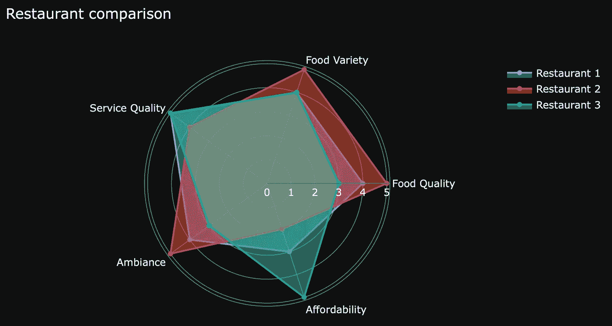
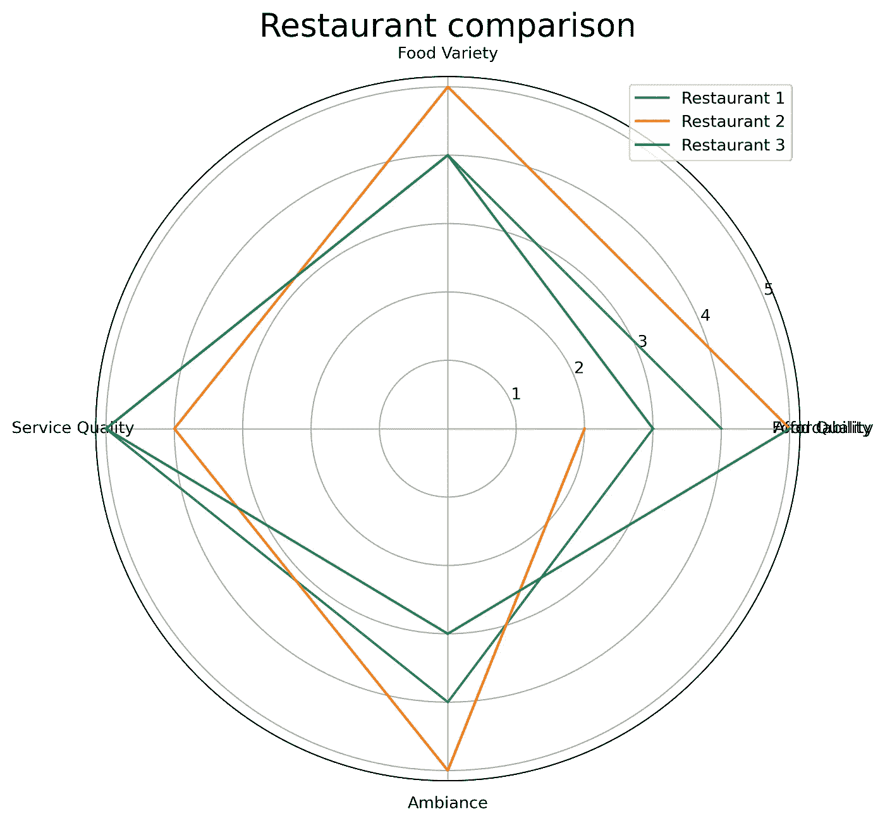
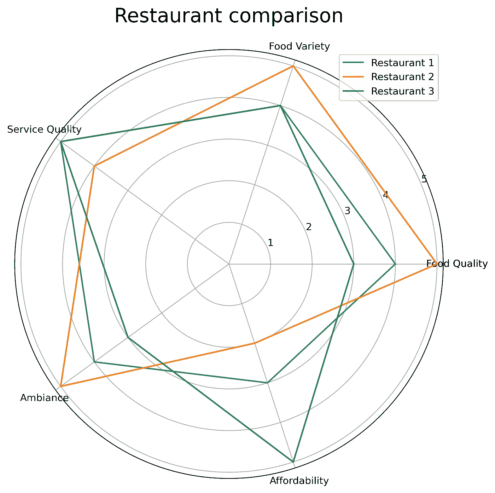
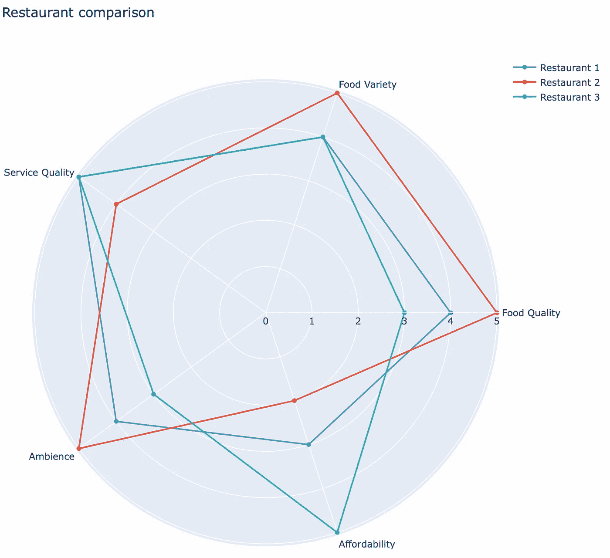
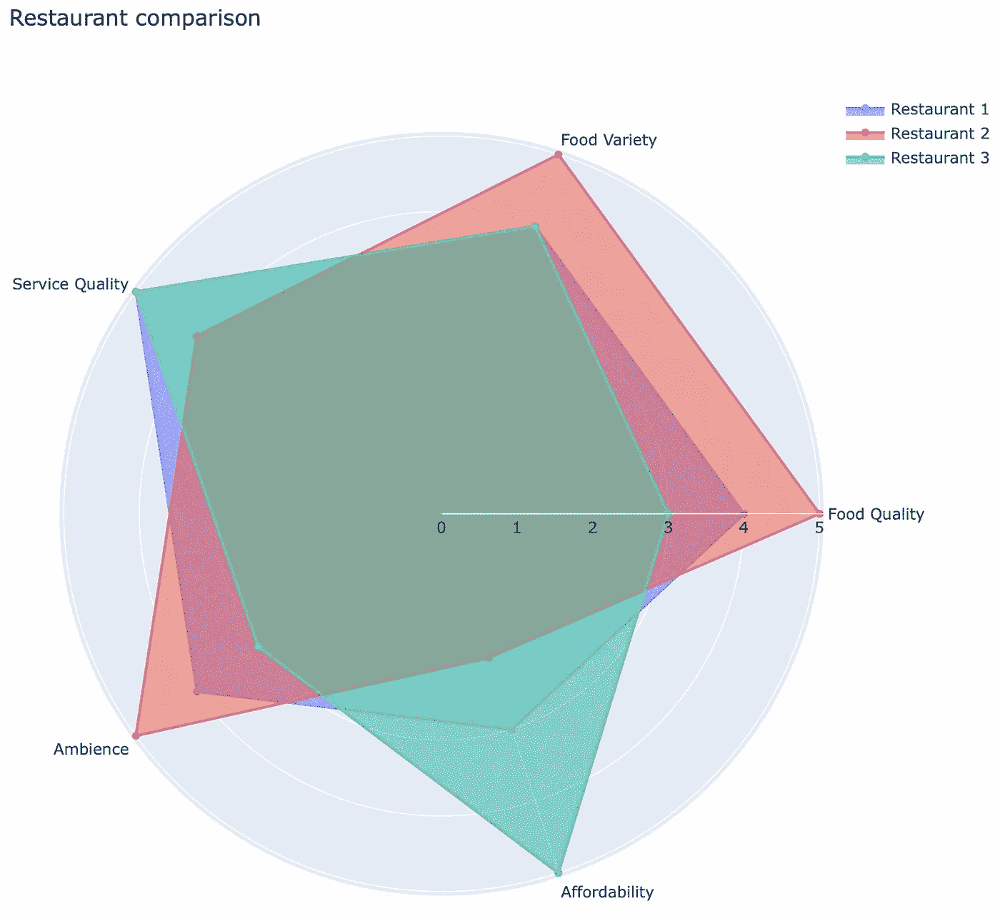

# 如何用 Python 制作令人惊叹的雷达图——用 Matplotlib 和 Plotly 实现

> 原文：<https://towardsdatascience.com/how-to-make-stunning-radar-charts-with-python-implemented-in-matplotlib-and-plotly-91e21801d8ca?source=collection_archive---------4----------------------->

## 使用雷达图轻松可视化第二维以上的数据——在 Matplotlib 和 Plotly 中实现

文章缩略图—作者图片

在大多数情况下，可视化二维以上的数据并不是一个好主意。这就是雷达图的用武之地，它使您能够直观地表示多个相同比例变量的一组或多组值。

今天，您将了解雷达图如何使用 Matplotlib 和 Plotly 在多个维度上可视化数据。您还将了解什么是雷达图以及使用它们的利弊。

这篇文章的结构如下:

*   雷达图介绍
*   雷达图的利与弊
*   使用 Matplotlib 的雷达图
*   用 Plotly 绘制雷达图
*   结论

你可以在这里下载相应的笔记本[。](https://github.com/daradecic/BDS-articles/blob/main/008_Radar_Charts.ipynb)

# 雷达图介绍

你很可能知道什么是雷达图。有时它们被称为*蜘蛛图*或*极坐标图*，但这些术语代表相同的概念。雷达图的目标是直观地表示多个变量的一组或多组值。

例如，假设您想通过一些公共变量直观地表示餐馆，比如食物质量、食物种类、服务质量和其他变量(*剧透提示:*您稍后会这么做)。在这种情况下，雷达图应该是首选的可视化类型。

每个变量都有一个轴，轴围绕中心呈放射状排列。不用说，但是轴是等间距的。然后沿着每个轴绘制单个观察值，就像散点图一样，但是这些点然后被连接起来形成一个**多边形**。您可以重复使用相同的逻辑在同一个图表中绘制多个多边形。

这就是雷达图背后的基本思想。让我们在开始动手示例之前先分析一下利弊。

# 雷达图的利与弊

先说一下**的利弊**:

1.  雷达图非常适合观察结果之间的可视化比较，您可以轻松地比较不同观察结果之间的多个属性，并查看它们是如何叠加的。例如，您可以使用雷达图根据一些常见变量来比较餐馆。
2.  很容易看到整体“最佳表现者”-如果您要查看整体表现，多边形面积最大的观察结果应该是最佳的。

但是事情并不都是阳光和彩虹，正如你从下面的清单中看到的:

1.  雷达图很快就会变得令人困惑——比较几个以上的观察结果会导致没人愿意看到的混乱局面。
2.  如果变量太多，就很难找到最佳选择——想象一下，一张雷达图有 20 多个变量。没人想看一眼。上帝禁止解读它。
3.  变量必须在相同的范围内——比较学生成绩(从 1 到 5)和对某些服务的满意度(从 0 到 100)是没有意义的。

你现在知道什么是雷达图，什么时候使用它们是有意义的。接下来您将学习如何用 Matplotlib 绘制它们。

# 使用 Matplotlib 的雷达图

Matplotlib 是 Python 事实上的标准数据可视化库，所以这就是我们首先关注它的原因。

目标是在以下类别中比较三家餐厅:食品质量、食品种类、服务质量、氛围和可负担性。所有类别的范围从 1 到 5，所以它们是雷达图可视化的完美候选。

下面的代码片段演示了如何指定数据和类别、标签位置以及可视化图表。有几件事你应该事先知道:

*   `label_loc`是以弧度表示标签位置的列表
*   `plt.subplot(polar=True)`必须用来制作雷达图
*   `plt.thetagrids()`用于在标签位置放置类别名称

这些一开始可能会令人困惑，但你很快就会明白要点。您可以使用以下代码片段进行可视化:

下图显示的是:

图片 1 —您的第一张雷达图(图片由作者提供)

快速看一下前面的数字就可以看出有问题。最后一个数据点没有连接到第一个数据点，您需要以某种方式解决这个问题。没有 100%直观的解决办法，但是**你应该这么做**:在类别和餐馆中添加一个与第一项相同的元素。

您可以手动这样做，但是如果您不知道第一个值是什么呢？您可以使用解包和索引操作来解决这个问题。方法如下:

正如您所看到的，每次都编写这个逻辑有点乏味(您可以用它来创建一个函数)，但是现在雷达图看起来是这样的:

图 2-修复雷达图中的数据点连通性(图片由作者提供)

如你所见，好多了！

Matplotlib 的美观性没有得到广泛认可，所以接下来让我们看看如何用 Plotly 生成更好看的可视化效果。

# 用 Plotly 绘制雷达图

普洛特利是另一回事。使用几乎相同数量的代码，很容易制作高度可定制的、好看的和交互式的图表。雷达图也不例外。

这并不意味着他们对 Matplotlib 的问题免疫。您仍然需要手动“关闭”多边形，但结果是更好看的可视化。

下面的代码片段产生了之前用 Matplolib 创建的相同的可视化效果:

可视化如下所示:

图 3 —带 Plotly 的雷达图(图片由作者提供)

这就是全部了！Plotly 也使得填充多边形变得容易——只需指定`fill='toself'`。这里有一个例子:

可视化如下所示:

图 4-用 Plotly 填充的雷达图(图片由作者提供)

这就是用 Plotly 制作雷达图有多简单。接下来让我们总结一下。

# 结论

雷达图提供了一种很好的方法来可视化多个变量的一组或多组值。今天你已经学会了如何做到这一点——用完全虚构的餐厅满意度数据。

请记住雷达图的限制或缺点。如果你想可视化许多观察结果，它们不是最好的选择，所以最多坚持一个或几个。

*喜欢这篇文章吗？成为* [*中等会员*](https://medium.com/@radecicdario/membership) *继续无限制学习。如果你使用下面的链接，我会收到你的一部分会员费，不需要你额外付费。*

<https://medium.com/@radecicdario/membership>  

# 了解更多信息

*   [每个数据科学家必读的 3 本编程书籍](/3-programming-books-every-data-scientist-must-read-db1d3a1a284c)
*   [脊线图:用 Python 可视化数据分布的最佳方式](/ridgeline-plots-the-perfect-way-to-visualize-data-distributions-with-python-de99a5493052)
*   [Python 字典:你需要知道的一切](/python-dictionaries-everything-you-need-to-know-9c2159e5ea8a)
*   [如何用 Python 发送漂亮的电子邮件——基本指南](/how-to-send-beautiful-emails-with-python-the-essential-guide-a01d00c80cd0)
*   新的 M1 macbook 对数据科学有好处吗？让我们来看看

# 保持联系

*   关注我的[媒体](https://medium.com/@radecicdario)以获取更多类似的故事
*   注册我的[简讯](https://mailchi.mp/46a3d2989d9b/bdssubscribe)
*   在 [LinkedIn](https://www.linkedin.com/in/darioradecic/) 上连接
*   查看我的网站

*原载于 2021 年 2 月 15 日*[*【https://betterdatascience.com】*](https://betterdatascience.com/radar-charts-matplotlib-plotly/)*。*