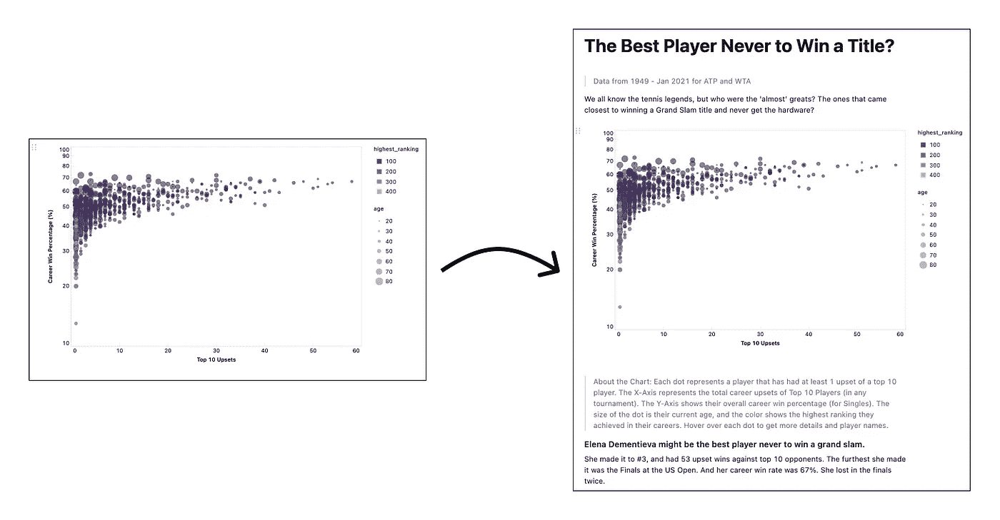
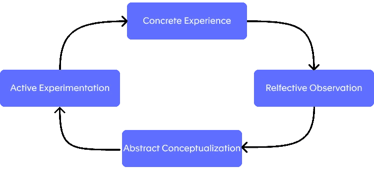
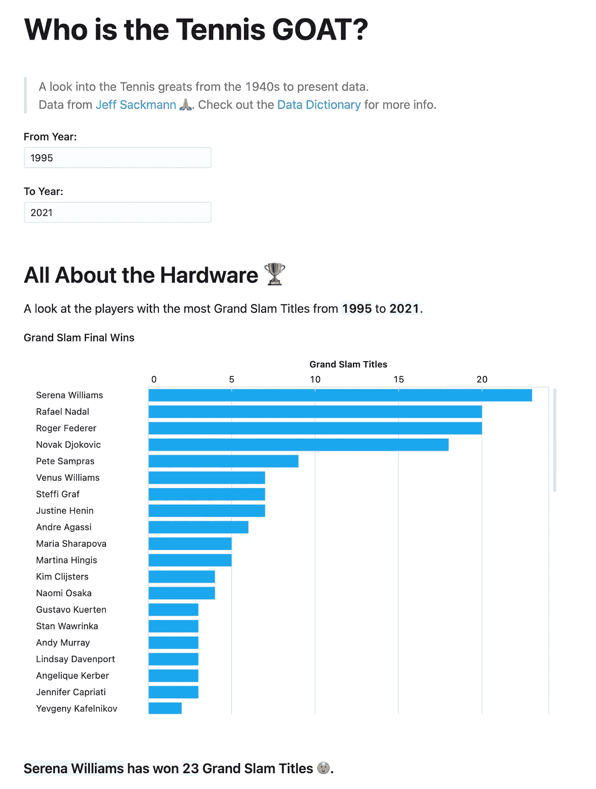

# 如何确保你的分析被实际使用

> 原文：<https://towardsdatascience.com/how-to-make-sure-your-analysis-actually-gets-used-4295bac3073?source=collection_archive---------13----------------------->

## 将海盗拒之门外

由[奥斯丁·尼尔](https://unsplash.com/@arstyy?utm_source=unsplash&utm_medium=referral&utm_content=creditCopyText)在 [Unsplash](/s/photos/pirates?utm_source=unsplash&utm_medium=referral&utm_content=creditCopyText) 上拍摄的照片

# 小心海盗

最普遍的令人沮丧的经历之一就是看到你努力工作的成果没有被发现，没有被欣赏，没有被使用。在数据世界里，这是我们经常经历的事情。以下面的假设情况为例:

1.  Jim 向数据团队提交了一份请求，要求对下周的客户演示进行深入分析。
2.  你和 Jim 花一周时间进行分析，密切合作以确保他有正确的视觉效果，并有信心展示调查结果。
3.  展示的日子到了，但吉姆一句话也没说。太奇怪了。
4.  当你最终找到他时，他告诉你他“最终还是没有使用图表。”“他们只会把他们弄糊涂，”他用安抚的语气补充道。
5.  你生气了。浪费了整整一周。另一个没有数据支持的决定。他当初为什么要问？

我喜欢称这些请求者为海盗，因为他们偷走了我的时间。不幸的是，总会有海盗，但我们可以学会避免他们，或者至少应对他们的存在。这里有一个提示列表，根据我自己的经验、学术研究和行业最佳实践，可以确保你的分析得到应有的信任。

## 1.丢弃数据请求表单

> 我们必须是顾问，而不是雇工。

大多数数据团队都有一个请求门户，用于筛选和分配来自业务的数据请求。这些门户旨在使业务和数据团队更容易合作；业务用户准确地输入他们想要的，数据团队只是让它发生。

不幸的是，正如我们从吉姆那里看到的，事情没那么简单。许多业务用户来到数据团队时脑子里已经有了一个图表，包括图表上的数字应该显示什么。

在这一点上，我们已经注定了。如果数据与请求者想要的故事不匹配，或者有点细微差别，那么他们永远不会使用这个分析。我们需要知道他们试图解决的问题。

作为数据专业人员，我们比任何人都更了解数据和统计方法，并可以建议使用数据来回答手头问题的最佳方法。业务环境与我们的数据专业知识相结合，可以创建比我们单独生成的分析更有影响力的分析。

简而言之，我们必须是顾问，而不是雇工。

## 2.数字从不独行

> 单靠一张图表不可能传达所有信息，这种想法抑制了我们通过工作影响业务的能力。

通常，我们希望发送一个完整的图表或仪表板请求。如果没有一对一的解释，业务用户几乎不可能理解这些内容。

我们被告知数据可以自己说话；一张精心制作的图表可以独自传达所有的细微差别。这根本不是真的。单靠一张图表不可能传达所有信息，这种想法抑制了我们通过工作影响业务的能力。

不能只靠图表来传达见解。利用文字来解释你的工作。来源:[从未获得冠军的最佳球员](https://count.co/n/rrpfH1Hi0L5)作者:【count.co】T2

在分享任何分析时，我会尽量包含以下信息:

*   数据的时间段
*   分析日期
*   作者
*   TL；博士:背景和见解总结
*   如何阅读图表的说明
*   你是如何进行分析的(不是代码，而是外行的解释)
*   局限性和后续步骤

这种上下文信息可能看起来令人头疼，但它会产生巨大的影响。我们不仅仅是发送了一个图表，孤立地看，它可能会带来无益的潜台词“搞清楚”。我们已经向他们发送了一份分析报告，提供了将图表转化为洞察力所需的一切，这是一个不会被忽视的小举动。

打破自己发送图表的习惯给了他们一个被理解并最终被使用的机会。

## 3.让它成为一种体验

> 要真正理解你的分析，你的用户需要戳戳它…让我们帮助他们实现这一点。

用上下文和解释围绕你的图表可以确保读者从我们的分析中了解到他们需要的一切。但是我们通过经验学习得最好。

因此，要真正理解你的分析，你的用户需要戳戳它。Kolb 的学习模型表明，他们需要对我们的分析进行实验，并花时间思考它在现实世界中的含义，然后才能正确理解它。让我们帮助他们到达那里。

大卫·库伯的体验式学习模式(ELM) [1]图片来源:作者

至少，这涉及到为您的分析设置交互元素。添加过滤器和参数，让用户开始查询数据。如果你有两倍的预算会怎么样？一半？

这种问答流程让用户信任分析，并理解它与他们的问题的关系，最终让他们有信心在董事会中运用这种分析。这种缺乏信心是你的图表没有进入幻灯片的首要原因，所以在这里要小心。

## 4.准备好演示文稿

> 在不牺牲分析复杂性的前提下，创建引人入胜、信息丰富的视觉效果，不会吓到观众。

不幸的是，我们不能指望有人花时间从演示文稿的分析中学习我们的商业伙伴(希望)到目前为止的做法。这意味着我们现在需要创建一个摘要图表，它可以反映我们分析的关键点，但细节要少得多。

理想情况下，一旦你就关键见解以及如何最好地将它们组成一个更大的决策或要解决的问题达成一致，这就是你分析的最后一步。然后，您可以利用数据可视化最佳实践[2]来创建引人入胜且信息丰富的视觉效果，而不会威胁到查看者，同时又不会牺牲您分析的复杂性。

## 5.分析万岁

> 请确保您的分析不仅限于这一个数据请求，并且可以反复使用。

这个过程中被严重忽视的一部分是将这种分析转化为可扩展知识的问题。你如何确保你刚刚回答的业务问题不只是与 Jim 或 Jim 的团队分享，而是与更广泛的公司分享？不仅仅是这个星期，而是在 6 个月内同样的问题再次出现时可以使用。答案显然不是仪表板，而是更微妙的东西。

AirBnB 的方法 [3]是实现一个知识源，该知识源采用我们刚刚概述的详细分析类型，并将其发布给整个公司。其结果是一个报告集合，所有用户都可以轻松理解，但仍然可以访问原始代码和注释，供分析师用作未来工作的起点。关键属性被记录下来，让每个人对他们所看到的有信心(何时发布，限制等)。).他们使这个知识数据库易于解析，这样人们在向数据团队提交请求之前，就可以快速找到与他们的问题相关的分析。

现在，您可以确保您的分析超越了这个单一的数据请求，并且可以一次又一次地使用。

# 每日时间

这种工作方式的好处是易于测试。下一次当你的一个更友好的商业用户(避免盗版)发出请求时，我建议试试这个方法。与其将他们要求的图表具体化，不如要求与他们会面，以更好地了解他们希望用这张图表做什么。它为哪些决策提供了信息？观众是谁？

当你们在这个分析中一起工作时，我建议使用一个数据笔记本来记录所需的元数据，并向你的业务伙伴解释你的工作。这让你可以灵活地将你的分析与代码和图像联系起来，这样你就不会试图在某个地方拼凑一个谷歌文档。

一旦你们都对分析和发现感到满意，然后一起完成最终的图表，看看它与最初的请求有多大的不同。我敢打赌他们完全不同。

计数笔记本示例。来源:[谁是网球山羊？](https://count.co/n/COxbPuAsqRC)

将这种分析用于共享知识需要更多的深谋远虑。这些笔记本没有多少自然的去处；Github 对非开发人员来说不够用户友好，像 DropBox 或 Google Docs 这样的选项不够技术化，无法包含所需的代码。

如果你强迫我推荐一个工具，我会说[算](https://count.co?utm_source=medium)，但是坦白地说，我确实帮助构建了它。Count 是一个数据笔记本，旨在使这种工作方式成为规范。您可以创建高质量的分析报告，在一个文档中包含完整的上下文、解释和定制的视觉效果，为您的工作提供所需的平台，使其能够经受住短暂的数据请求，并成为整个公司都可以从中受益的知识。

如果你尝试过这些方法，我很想在评论中听听效果如何！

# 参考

[1]Kolb，D. A. [*体验式学习:经验作为学习和发展的源泉*](https://www.researchgate.net/publication/235701029_Experiential_Learning_Experience_As_The_Source_Of_Learning_And_Development) 。新泽西:普伦蒂斯-霍尔；1984.

[2]迈克尔·马奥尼。 [*数据可视化的艺术与科学*](/the-art-and-science-of-data-visualization-6f9d706d673e) 。走向数据科学；2019.

[3] Sharma，C. & Overgooer，Jan .[*Airbnb*](https://medium.com/airbnb-engineering/scaling-knowledge-at-airbnb-875d73eff091)*缩放知识。*airbnben；2016.