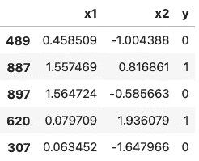
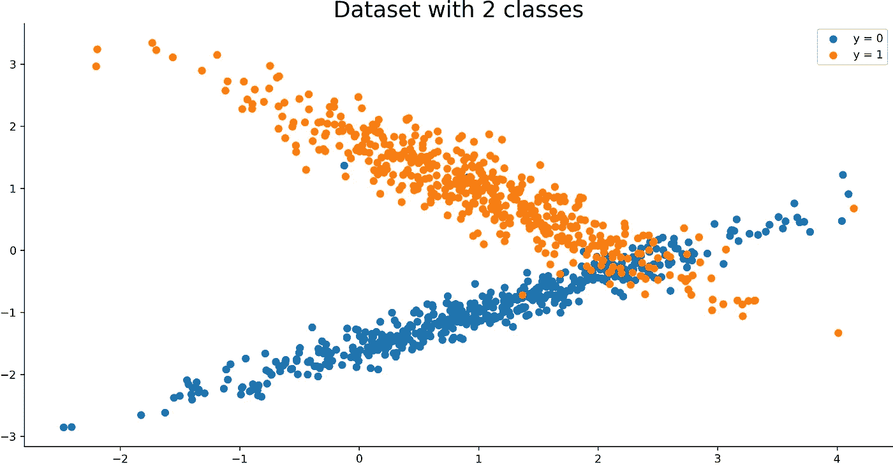
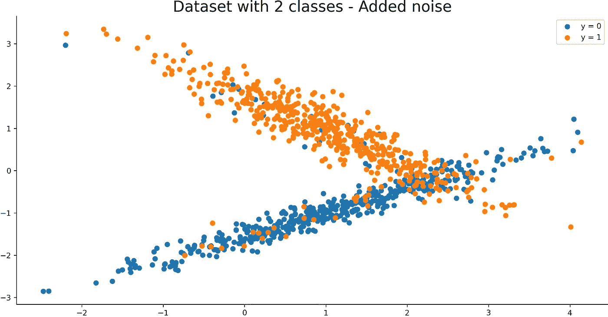
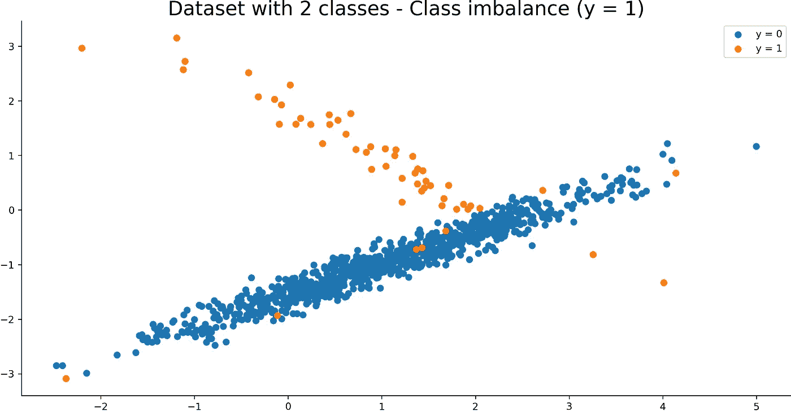
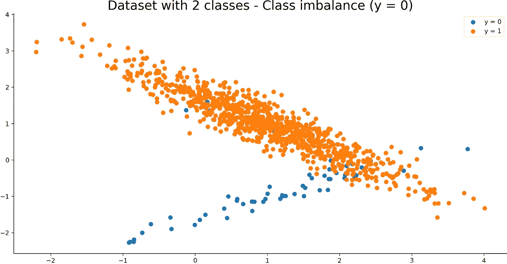
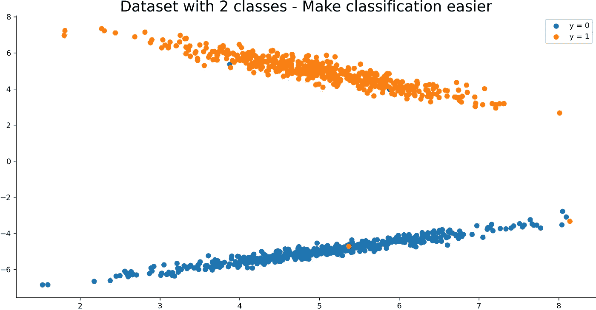

# 如何用 Python 制作合成数据集:机器学习完全指南

> 原文：<https://towardsdatascience.com/how-to-make-synthetic-datasets-with-python-a-complete-guide-for-machine-learning-376093b360ac?source=collection_archive---------33----------------------->

## 没有数据集？没问题。使用 Python 在几秒钟内创建您自己的。

照片由[海登·邓塞尔](https://unsplash.com/@florida_guidebook?utm_source=unsplash&utm_medium=referral&utm_content=creditCopyText)在 [Unsplash](https://unsplash.com/?utm_source=unsplash&utm_medium=referral&utm_content=creditCopyText) 上拍摄

好的数据集很难找到。另外，有时候你只是想表明自己的观点。对于这些情况，繁琐的加载和准备可能有点多。

今天，您将学习如何使用 Python 和 Scikit-Learn 制作合成数据集，Scikit-Learn 是一个出色的机器学习库。您还将学习如何处理噪声、类平衡和类分离。

这篇文章的结构如下:

*   制作您的第一个合成数据集
*   添加噪声
*   调整职业平衡
*   调整类分离
*   结论

你可以在这里下载这篇文章的笔记本[。](https://github.com/daradecic/BDS-articles/blob/main/001_Make_Synthetic_Datasets.ipynb)

# 制作您的第一个合成数据集

真实世界的数据集对于展示概念和想法来说往往太多了。假设你想直观地解释 SMOTE(一种处理类不平衡的技术)。你首先必须找到一个类别不平衡的数据集，并将其投影到 2-3 维，以便可视化工作。

有更好的方法。

Scikit-Learn 库附带了一个方便的`make_classification()`函数。它不是创建综合数据集的唯一工具，但今天您会大量使用它。它接受各种参数，让您控制数据集的外观和感觉，但稍后会详细介绍。

首先，您需要导入所需的库。请参考以下片段:

您已经准备好创建您的第一个数据集。它将有 1000 个样本分配到两个类(0 和 1)中，并达到完美的平衡(50:50)。属于每个类别的所有样本都集中在单个聚类周围。数据集只有两个特征，以使可视化更容易:

对`sample()`的调用打印出五个随机数据点:

图片 1—5 行随机样本(图片由作者提供)

这并不能给你数据集背后的全貌。它是二维的，所以你可以为数据可视化声明一个函数。这里有一个你可以用的:

这是它的视觉效果:

图 2-合成数据集的可视化(图片由作者提供)

太快了！您现在有了一个简单的合成数据集，可以随意摆弄。接下来，您将学习如何添加一点噪声。

# 添加噪声

您可以使用`make_classification()`功能的`flip_y`参数添加噪声。

此参数表示随机分配类别的样本的分数。较大的值会在标注中引入噪声，使分类任务更加困难。请注意，默认设置 flip_y > 0 在某些情况下可能会导致 y 中少于 n _ classes[1]。

下面是如何在我们的数据集上使用它:

下面是相应的可视化:

图 3-添加了噪声的合成数据集的可视化(图片由作者提供)

你可以在蓝色星团中看到更多橙色点，反之亦然，至少与*图 2* 相比是这样。

这就是你添加噪音的方式。接下来把重点转移到阶级平衡上来。

# 调整职业平衡

在现实世界的数据集中，至少可以看到一点点的阶级不平衡。一些数据集遭受严重的类别不平衡。例如，1000 笔银行交易中有一笔可能是欺诈性的。这意味着余额比例为 1:1000。

你可以使用`weights`参数来控制职业平衡。它将列表视为具有 N–1 个值的值，其中 N 是要素的数量。我们只有 2 个，所以列表中只有一个值。

让我们看看如果将值指定为 0.95 会发生什么:

以下是数据集的视觉效果:

图 4-正类上存在类不平衡的合成数据集的可视化(图片由作者提供)

如您所见，只有 5%的数据集属于类 1。你可以轻松扭转局面。假设您想要类 0 中数据集的 5%:

下面是相应的可视化:

图 5-在负类上具有类不平衡的合成数据集的可视化(图片由作者提供)

这就是阶级平衡的全部。让我们通过调整类分离来结束。

# 调整类分离

默认情况下，存在一些重叠的数据点(类别 0 和类别 1)。您可以使用`class_sep`参数来控制类的分隔程度。默认值为 1。

让我们看看如果将值设置为 5 会发生什么:

以下是数据集的外观:

图 6-具有严重类别分离的合成数据集的可视化(图片由作者提供)

正如你所看到的，现在的班级更加分散了。更高的参数值会导致更好的类分离，反之亦然。

现在，您已经了解了制作用于分类的基本合成数据集的所有内容。接下来让我们总结一下。

# 结论

今天，您已经学习了如何使用 Python 和 Scikit-Learn 创建基本的综合分类数据集。当你想证明一个观点或者实现一些数据科学概念的时候，你可以使用它们。真实的数据集对于这个目的来说可能是多余的，因为它们通常需要严格的准备。

请随意浏览[官方文档](https://scikit-learn.org/stable/modules/generated/sklearn.datasets.make_classification.html)，了解其他有用的参数。

感谢阅读。

喜欢这篇文章吗？成为 [*中等会员*](https://medium.com/@radecicdario/membership) *继续无限制学习。如果你使用下面的链接，我会收到你的一部分会员费，不需要你额外付费。*

<https://medium.com/@radecicdario/membership>  

## 加入我的私人邮件列表，获取更多有用的见解。

# 了解更多信息

*   [三大分类机器学习指标—一劳永逸地消除准确性](/top-3-classification-machine-learning-metrics-ditch-accuracy-once-and-for-all-923beab025a4)
*   [ROC 和 AUC——如何快速评估机器学习模型](/roc-and-auc-how-to-evaluate-machine-learning-models-in-no-time-fb2304c83a7f)
*   [精确召回曲线:如何快速轻松评估机器学习模型](/precision-recall-curves-how-to-easily-evaluate-machine-learning-models-in-no-time-435b3dd8939b)

# 参考

[1][https://sci kit-learn . org/stable/modules/generated/sk learn . datasets . make _ classification . html](https://scikit-learn.org/stable/modules/generated/sklearn.datasets.make_classification.html)

*原载于 2021 年 1 月 11 日 https://betterdatascience.com**T21*[。](https://betterdatascience.com/python-synthetic-datasets/)