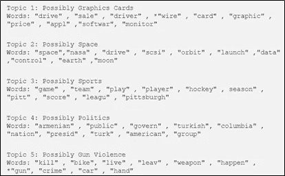
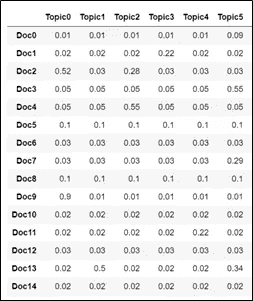
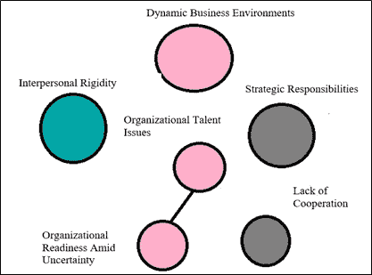
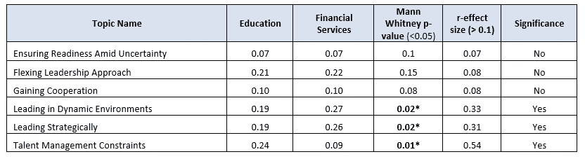
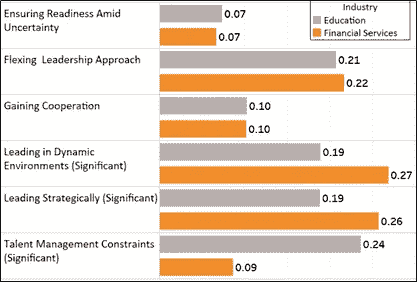
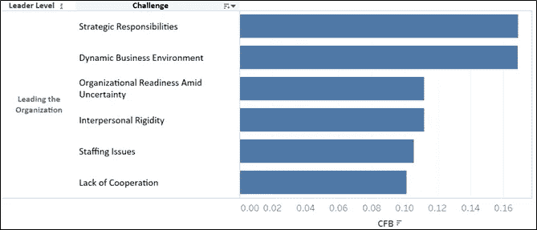
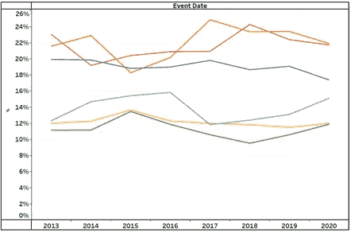
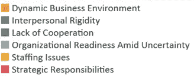

# 如何使主题模型可解释:3 个新想法

> 原文：<https://towardsdatascience.com/how-to-make-topic-models-interpretable-3-new-ideas-f594518c4b9c?source=collection_archive---------21----------------------->

## [实践教程](https://towardsdatascience.com/tagged/hands-on-tutorials)

## 调整 LDA 主题模型输出的三种创新技术

主题建模是一种无监督的机器学习方法，它扫描一组文档，检测其中的单词和短语模式，并自动聚类单词组和最能表征一组文本响应(或文档)的类似表达。迄今为止，潜在狄利克雷分配(LDA)已经成为最流行的主题建模技术之一，广泛应用于不同的工业应用中。这里提供了对 LDA 的详细解释[。LDA 是应用于一组单词的概率模型，它有两个关键输出:](https://medium.com/@pratikbarhate/latent-dirichlet-allocation-for-beginners-a-high-level-intuition-23f8a5cbad71)

I .来自文档集合的主题列表。每个主题都是单词(经常共存)的集合，其形式是每个主题的词汇的概率分布。

图片由 Divya Dwivedi [ [来源](/nlp-extracting-the-main-topics-from-your-dataset-using-lda-in-minutes-21486f5aa925)

二。每个文档的已识别主题的概率分布。

大样本的概率分布通常是包含数百万数字的巨大矩阵，这使得社会科学研究人员难以提取关键见解。在我的案例中，我分析了来自[创新领导力中心](https://www.ccl.org/)数据库的开放式文本回复，该数据库包含 43，000 名领导者，历时 10 年，我们要求他们回答以下问题:你目前面临的 3 个最关键的领导力挑战是什么？平均而言，领导者在 3 个挑战中写了大约 100 个单词(Balakrishnan，Young，Leslie，McCauley，& Ruderman，2021)。

出于本博客的目的，我将使用来自高层管理人员(C-suite leaders)的挑战数据集的子集。我使用 LDA 并实现了不同的技术来更好地解决社会科学研究人员经常问的关于这些数据的问题。

本博客的主要目的是了解提取的主题之间的关系，评估亚组差异，并确定主题流行度是否以及如何随时间变化。下面提供了上述技术的一步一步的过程。

1.主题之间的相互关系(理解提取的主题之间的关系)

2.识别语料库中两个不同子集的主题比例之间有意义的和统计上显著的差异(评估子组差异)

3.科菲·费恩戈尔德·布罗姆伯格(CFB)衡量标准，以确定话题随时间的变化(话题流行率如何随时间变化？)

**主题间的相互关联:**

LDA 导出的主题可以相互关联。例如，关于遗传学主题的文档更可能是关于传染病主题，而不是天文学或政治。为了在我的数据集中确定这一点，我检查了主题之间的关系。重要的是要记住，文档中所有主题的平均主题概率分布总和必须为 100%。换句话说，如果一个文档在一个给定的主题中排名靠前，那么理论上它们在其他主题中的排名应该靠后。在这种情况下，可以以这样的方式应用二分法文档主题矩阵的机制，即将中值以上的主题概率转换为 1，将中值以下的概率转换为 0。可以为二分法矩阵计算主题之间的相关系数，以确定主题之间的相互相关性。

**图 1:高层管理人员的主题相互关系。**

上图是关于高层领导面临的挑战的主题之间相互关系的表示。如果领导者报告与“组织人才问题”相关的挑战，他们更有可能报告与“不确定性中的组织准备情况”相关的挑战，反之亦然。

主题之间的联系表示大于或等于. 16 的主题之间的相关性，节点的大小表示主题比例。0.16 是根据 Bosco 及其同事(2015 年)的相关基准选择的，该基准发现应用心理学文献中的场水平效应大小的中值为 0.16。

**识别语料库中两个不同子集的主题比例之间有意义的和统计上显著的差异:**

领导力挑战数据集包括来自 32 个不同行业的不同领导者。我的项目的目标之一是比较不同行业之间主题比例的差异(例如，制造业(184 名领导者)和金融业(211 名领导者)的高管之间的差异)。我进行了显著性测试和效应大小测试，以检查这种差异是否有意义和统计显著性。由于偏态和不平等的样本量，我选择了曼-惠特尼检验，以确定统计意义。为了确定实际意义，计算了 r 效应大小。根据 Cohen 的标准(Cohen，1988；1992).基于这一分析，6 个主题中有 3 个显示了教育和制造业领导者之间的显著差异。

**表 1:教育与金融行业领导者的话题比例和统计数据**

**图 2:教育和金融服务领导者的话题概率**

**科菲·费恩戈尔德·布罗姆伯格(CFB)用于识别话题随时间变化的衡量标准:**

CFB 分数是对一组加权比例的可变性的度量。分数范围从 0 到 1，数值越高表示可变性越高。形式上，科菲测度 C({p1，…，pn}，{w1，…，wn})由以下公式给出:

其中{p1，…，pn}是一组比例，{w1，…，wn}是一组权重，{p1*，…，pn*}是一组在以下约束条件下产生最大方差的比例:

43，000 名领导者的挑战数据集是从 2010 年至 2020 年收集的。为了分析过去十年挑战数据集的主题变化，我计算了每个主题的 CFB 度量。下图显示了 2010 年至 2020 年挑战主题的 CFB 指标。

**图 3:****CFB 2010 年至 2020 年**高管

为了更好地理解为什么 CFB 高管级别的得分差异更大，我们按年研究了挑战。在领导组织层面，从 2014 年到 2018 年，在“动态商业环境”和“战略责任”挑战方面观察到了轻微的波动。尽管很难解释为什么会出现这种情况，但对于高管来说，这两种挑战一直都很大。

**图 4:随着时间的推移，高管模型的平均主题比例%**

Bovens、Chatkupt 和 Smead (2012 年)实施了 CFB 衡量标准，以计算欧盟寻求庇护者承认率的可变性。实现在 *Mathematica* (版本 8)中。点击[此处](http://fitelson.org/coffey_measure.nb)查看 *Mathematica* 笔记本，其中包含用于计算 Bovens、Chatkupt 和 Smead (2012)中出现的科菲测度的函数。

主题建模是我最喜欢的探索文本数据主题的方法之一。在分析主题建模结果时，除了上述思路之外，还有不同的方法。上面解释的技术对我在 I/O 心理学领域的研究很有用。如果你有任何其他关于主题建模结果的有趣想法或提示，请在下面的评论中告诉我。

**参考文献:**

Balakrishnan，Young，s .，Leslie，j .，McCauley，c .，& Ruderman，M. (2021)。领导力挑战阶梯(LCL)技术报告。北卡罗来纳州格林斯博罗:创造性领导中心。

f .博斯科、h .阿吉尼、k .辛格、j .菲尔德和 c .皮尔斯(2015 年)。相关效应大小基准。*《应用心理学杂志》，100 卷 2 期，*431–449 页。

Bovens，l .，Chatkupt，c .和 Smead，L. (2012 年)衡量欧盟庇护结果数据中的共同标准和平等责任分担。*欧盟政治*

科菲，议员，费恩戈尔德，硕士和布罗姆伯格，J. (1988 年)。比例间可变性的赋范度量。*计算统计&数据*分析，7(2)，127–141。

科恩，J. (1988)。*行为科学的统计功效分析*。新泽西州希尔斯代尔:劳伦斯·厄尔鲍姆联合公司。

科恩，J. (1992 年)。能量引爆器。*《心理通报》，112 卷 1 期，*第 155–159 页。