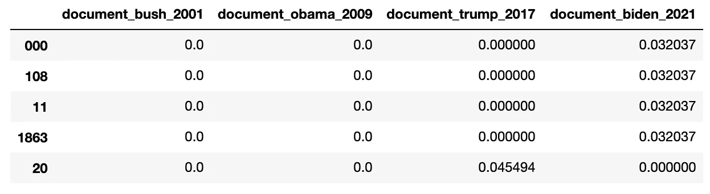
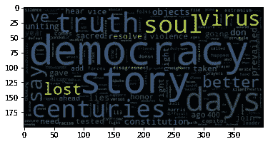
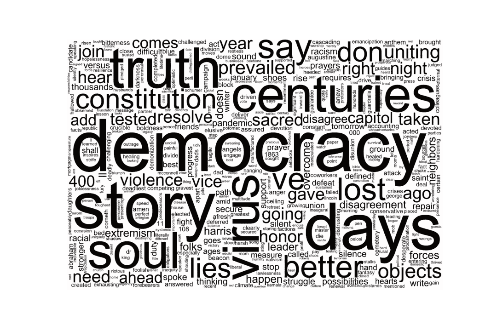
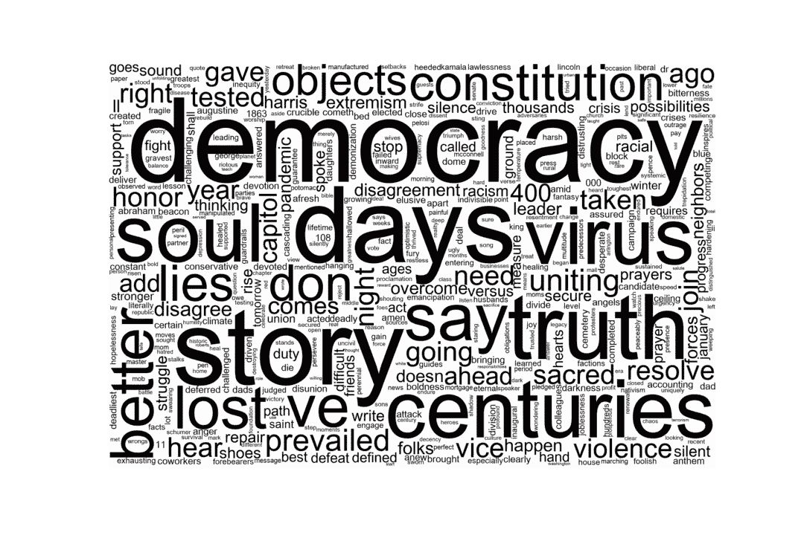
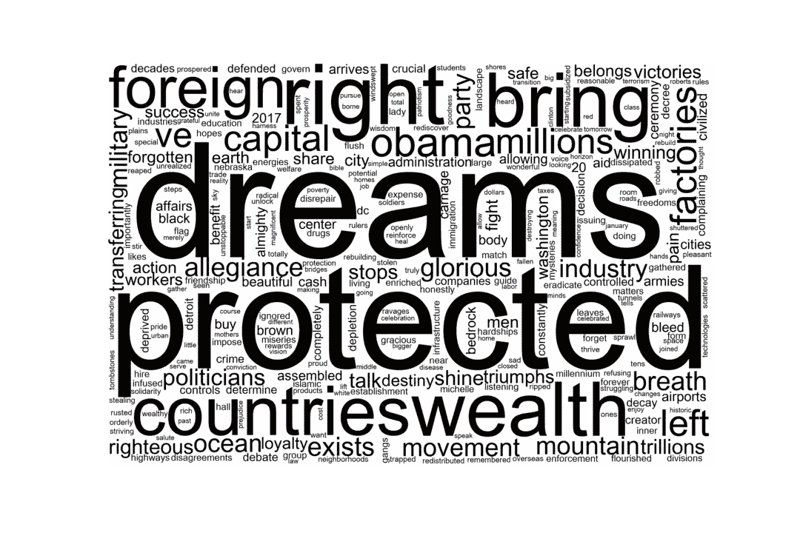
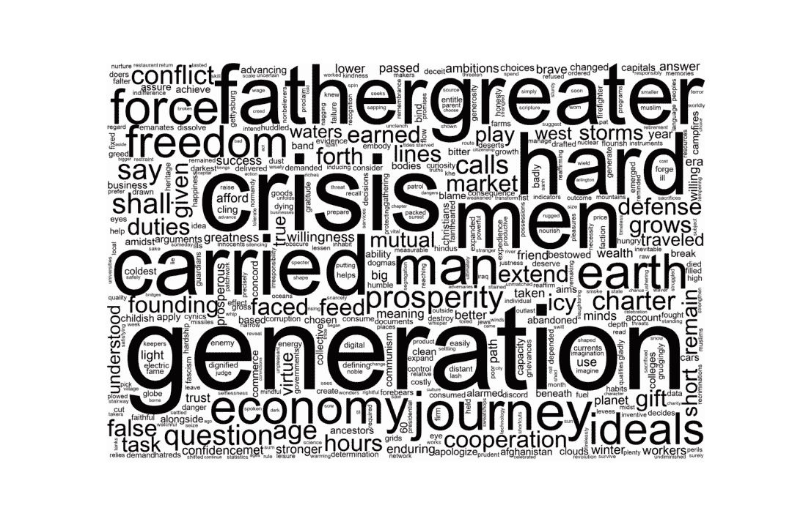
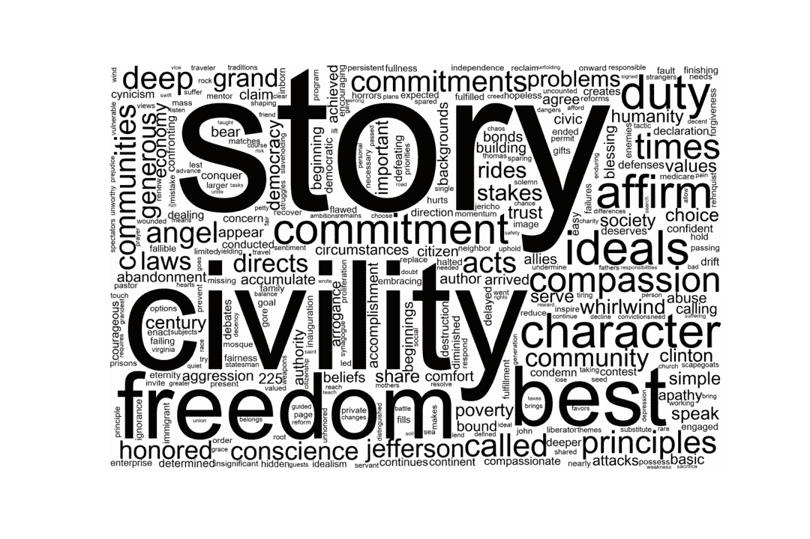

# 如何用 Python 制作不烂的词云

> 原文：<https://towardsdatascience.com/how-to-make-word-clouds-in-python-that-dont-suck-86518cdcb61f?source=collection_archive---------4----------------------->

## 用 python 制作美丽而有意义的单词云的简短教程


张秀坤·施罗德在 [Unsplash](https://unsplash.com?utm_source=medium&utm_medium=referral) 上拍摄的照片

# 动机

在最近一次对总统就职演说的 NLP 分析中，我发现结果很有趣，但我意识到大多数人不会被这些演讲所强迫。我通常认为词云可能是可怕的，但我认为它们在这里是有意义的——为了让 TF-IDF 的结果更容易立即使用，我从 TF-IDF 对拜登、特朗普、奥巴马和布什的就职演讲的矢量化中创建了词云。

# 作为自然语言处理工作流工具的词云

本教程的重点是学习如何在视觉和基于内容的层面上制作不烂的单词云。网上有很多免费的工具供非程序员制作 word clouds，但是在 NLP 项目中迭代参数时可视化 python 管道中的数据是评估决策结果的一种有效方法，并且可以向非技术利益相关者展示您的过程。有了视觉设计背景，我发现开箱即用的单词云包有点可怕，所以我会提供一些调整，让你的单词云不那么糟糕。

# **如何在 Python 和 Jupyter 笔记本里做一个字云，一步一步来:**

这是一个概述，但是我会随着您的继续深入下去。

1.  安装 wordcloud 包。
2.  将 wordcloud 和 matplotlib 导入笔记本。
3.  使用 TF-IDF 值创建术语文档矩阵(可选步骤)
4.  使用文本或矩阵运行 Word Cloud。
5.  调整设置，让你的字云不吸。
6.  包装在一个函数中并迭代。

开始了。

1.  **安装 wordcloud**

如果您使用 anaconda，请在终端中键入以下内容:

```
conda install -c conda-forge wordcloud
```

备选方案[此处](https://pypi.org/project/wordcloud/)。

**2。导入包**

```
import matplotlib.pyplot as plt
from wordcloud import WordCloud
```

**3。使用 TF-IDF 值创建术语-文档矩阵(可选步骤)**

你绝对不需要一个 TF-IDF 矩阵来构建一个词云——你可以只使用你想要构建一个词云的文本。然而，让你的词云不糟糕的一个方法是使用更有意义的数据集——一个经过 TF-IDF 处理的数据集。使用 TF-IDF 矩阵的优势在于，您可以控制您在词云中查看的词的类型，而不是最常用的词，您可以查看最独特的词。甚至使用计数矢量器并在制作单词云之前调整设置也是一个有效的工作流程。创建 TF-IDF 矩阵的这一额外步骤使比较单词云更有意义，并且有助于解释调整 nlp 工作流中的设置的效果。

要了解如何生成 TF-IDF 矩阵，您可以在这里查看我以前的文章。：

</tf-idf-a-visual-explainer-and-python-implementation-on-presidential-inauguration-speeches-2a7671168550>  

基于我的 TF-IDF 矩阵，我想要一个数据帧，其中每一列是一个文档，每一行是一个单词及其每个文档的 TF-IDF 值。

```
# Prep TF-IDF Matrix for Word Cloudsdata = df.transpose()data.columns = ['document_bush_2001', 'document_obama_2009', 'document_trump_2017', 'document_biden_2021']data.head()
```

这是我想要使用的数据的形状:



**4。运行文字云。**

一旦你有了 TF-IDF 矩阵，你就可以使用 wordcloud 来生成频率，使用 matplotlib 来绘制。

```
wordcloud = WordCloud().generate_from_frequencies(data['document_biden_2021'])plt.imshow(wordcloud)
```

现成的结果如下所示:



除了大小和轴的包含，单词的颜色大多难以辨认，并且与数据集不相关。字的大小被调整了，这很好，但这并不好。

**5。调整你的设置，让你的 WordCloud 不烂。**

除了尺寸和移除轴之外，还有一些额外的考虑事项:

**色彩**——我是一个传统主义者，尽可能少用色彩来表达我的观点。对我来说，白色或灰色背景上的黑色文字效果很好。我不认为根据 TF-IDF 的一个数据集同时使用颜色和大小来区分单词是必要的。然而，如果你要用这种颜色来代表另一个有相同单词的数据集，那对我来说是可行的。例如，我会支持颜色的使用，如果在后面加上另外一个信息，比如术语频率或逆文档频率。

我喜欢绘画通常的工作方式，因为你第一眼就能理解图像的想法，但当你细想时，你会理解得更多。我认为文字云可以这样工作，所以我喜欢增加页面上的字数，因为它可以让人们第一眼就简单地理解文档，然后进一步深入并停留在文档的细节上。

**font_path —** 我讨厌现成的字体，如果有选择的话，我会坚持使用 arial 或 helvetica 字体，尤其是像 word cloud 这样看起来“现代”的可视化字体。

```
# change the value to black
def black_color_func(word, font_size, position,orientation,random_state=None, **kwargs):
    return("hsl(0,100%, 1%)")# set the wordcloud background color to white
# set max_words to 1000
# set width and height to higher quality, 3000 x 2000
wordcloud = WordCloud(font_path = '/Library/Fonts/Arial Unicode.ttf', background_color="white", width=3000, height=2000, max_words=500).generate_from_frequencies(data['document_biden_2021'])# set the word color to black
wordcloud.recolor(color_func = black_color_func)# set the figsize
plt.figure(figsize=[15,10])# plot the wordcloud
plt.imshow(wordcloud, interpolation="bilinear")# remove plot axes
plt.axis("off")# save the image
plt.savefig('biden_wc.png')
```

这里有一个不烂的词云:



有几件事我可以做，比如步长，但是我觉得对我的目的来说没有必要。你也可以看看 wordcloud 的例子库，在这里找到更多的。

**6。包装在一个函数中并迭代。**

一旦我有了我喜欢的设置，我就把它打包成一个函数。随着分析的进行，我可能会迭代我的词云来评估我的 TF-IDF 设置，比如 max 和 min tf，或者关注特定的词类——名词、形容词等。为了加速我的过程，我可能想在函数中改变输出的宽度和高度，但是这是一个很好的方法来感受你在 nlp 中所做的决定。

```
filenames = ['bush_2001_.png', 'obama_2009_.png', 'trump_2017_.png', 'biden_2021_.png']def word_cloud(data, filenames):
    def black_color_func(word, font_size, position, orientation, random_state=None, **kwargs):
        return("hsl(0,100%, 1%)")
    columns  = list(data)for i in range(4):
        wordcloud = WordCloud(font_path = '/Library/Fonts/Arial Unicode.ttf', background_color="white", width=3000, height=2000, max_words=500).generate_from_frequencies(data[columns[i]])
        wordcloud.recolor(color_func = black_color_func)
        plt.figure(figsize=[15,10])
        plt.imshow(wordcloud, interpolation="bilinear")
        plt.axis("off")
        plt.savefig(filenames[i])# plot the wordcloud
plt.imshow(wordcloud, interpolation="bilinear")# remove plot axes
plt.axis("off")# save the image
plt.savefig('biden_wc.png')
```

这里比较单词云:



拜登 2021 就职演说词云



特朗普 2017 年就职演说词云



奥巴马 2009 年就职演说词云



布什 2001 年就职演说词云

在这里打开这项研究的结果:

<https://anupamagarla.medium.com/comparing-inaugural-addresses-democracy-is-to-dreams-as-biden-is-to-trump-8a1aaeba5f9c> 