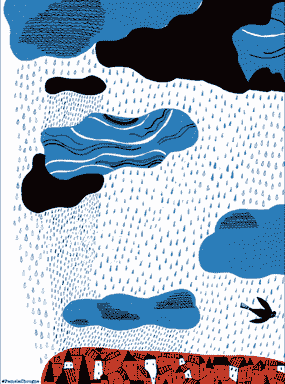
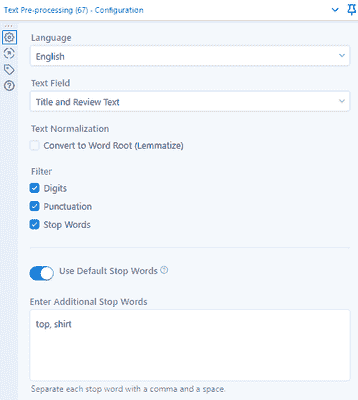
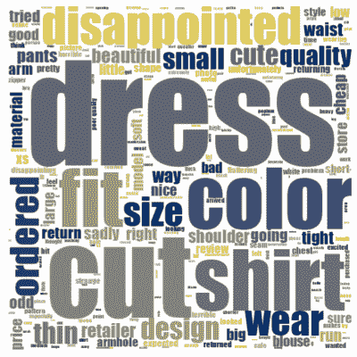
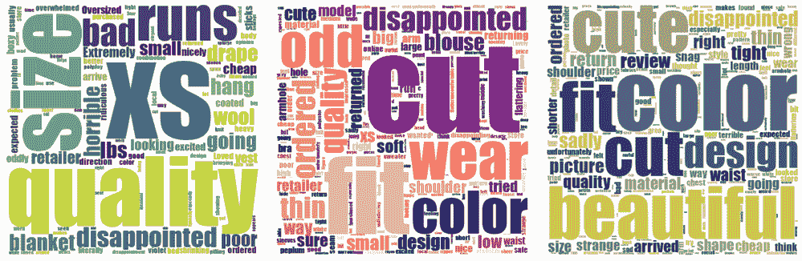
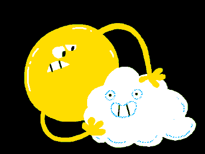
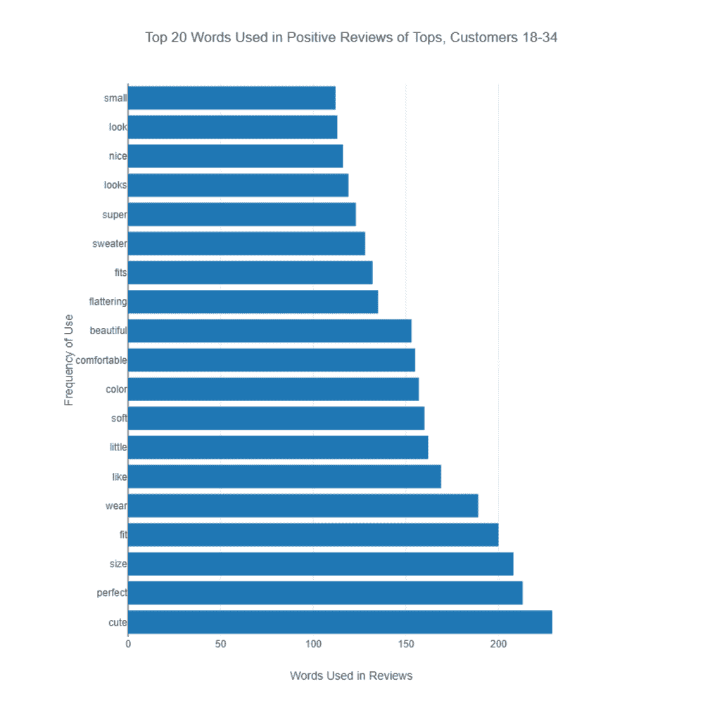

# 如何让文字云让人不会讨厌

> 原文：<https://towardsdatascience.com/how-to-make-word-clouds-people-wont-hate-9a465c1b63ab?source=collection_archive---------18----------------------->

## 讨厌的人会讨厌文字云。但它们仍然是有用的可视化，你可以让它们变得更好。

*照片由*[*NOAA*](https://unsplash.com/@noaa?utm_source=unsplash&utm_medium=referral&utm_content=creditCopyText)*[*Unsplash*](https://unsplash.com/s/photos/cloud-heart-word?utm_source=unsplash&utm_medium=referral&utm_content=creditCopyText)*

*单词云:它们听起来很轻，很蓬松，很有趣。它们是可视化文本数据中术语频率的一种流行方式。但数据评论员长期以来一直批评这些方便的图形，如[“词云是蹩脚的】](/word-clouds-are-lame-263d9cbc49b7)，[“词云:我们不能让它们消失，所以让我们改善它们”，](https://medium.com/multiple-views-visualization-research-explained/improving-word-clouds-9d4a04b0722b)以及颇具攻击性的标题[“词云被认为是有害的。”](https://www.niemanlab.org/2011/10/word-clouds-considered-harmful/)哎哟。*

*这些人对词云有什么意见？如果使用不当，它们确实会有问题，但是有办法让它们变得更好。让我们来看看对 Word Cloud 的批评，看看我们如何绕过它们的潜在陷阱，特别是当您使用 Alteryx Designer 和 Alteryx Intelligence Suite 的文本挖掘调色板中的 [Word Cloud 工具](https://help.alteryx.com/20212/designer/word-cloud)时。*

**

**图片经由* [*GIPHY*](https://media.giphy.com/media/xlCGfjj0u5i7PzRKCd/giphy-downsized.gif)*

# *大多多云？对词云的批评*

*对词云有哪些常见的批评？这里有一个 TL；上面链接的文章的博士:*

*   *词云通常共享不言自明或显而易见的信息。产品评论的文字云可能会以大字体显示产品名称，因为这些名称经常出现——但这对浏览者来说不是有用的洞察力。而且，如果不删除它们，停用词(英语中频繁出现的词，如“the”、“a”或“an”)也会使词云变得杂乱，从而难以看到重要的词。*
*   *单词云通常孤立地显示单个单词，忽略了有价值的上下文和周围的叙述。它们将复杂的文本数据减少到最低限度——也许太简单了。观众必须弄清楚单词显示的意义，他们可能会得出错误的结论。*
*   *字体大小不能清楚地表明单词的实际频率；更大的字体意味着一个单词出现的频率更高，但进行更细微的比较或排名是很困难的。*

*这些作者提出了一些很好的观点。我们可能都曾尝试创建过包含无用单词或不为数据提供故事的单词云。*

*那么，我们如何解决词云的这些缺点呢？考虑到它们有时是一种以视觉上引人入胜的方式总结文本数据的好方法。*

**

**图片经由* [*GIPHY*](https://media.giphy.com/media/xloX7WONvugBmUnGNb/giphy.gif)*

# *一连串的停用词*

*你可以使用一些策略来解决你的单词云的这些问题。让我们来看看其中的一些。我将使用[一个我之前用来](https://www.kaggle.com/nicapotato/womens-ecommerce-clothing-reviews)[演示情感分析](https://community.alteryx.com/t5/Data-Science/Try-Sentiment-Analysis-with-Designer-You-Must/ba-p/589153)的数据集；它包含了对服装的评论。*

*首先，我们可以相当容易地处理自显和停止词的问题。在 Alteryx Designer 中，一定要在你的 Word Cloud 工具之前设置一个文本预处理工具。然后，在字云工具中，一定要选择原字段名后带有 _processed 的文本字段；我已经忘记这么做很多次了！在预处理步骤中，您可以删除数字、标点符号和停用词。*

*[默认停用词](https://help.alteryx.com/20212/designer/text-pre-processing)来自 spaCy，该工具底层的 Python NLP 包。但是，您可以添加自己的停用词来删除一些明显的术语，这些术语不会帮助观众从词云中获得意义。*

*下面，我已经从单词 cloud 中删除了“top”和“shirt ”,因为这个单词 cloud 将只代表服装评论的“tops”类别。在单词 cloud 中突出显示“top”和“shirt”不会帮助我们理解人们对它们的看法。*

**

*作者图片*

*显然，您应该小心省略默认停用词之外的其他词，这样您就不会无意中歪曲您的数据，但我会为查看者提供上下文，以确保他们知道这个词云仅限于 tops 的评论。*

**

**图像通过* [*GIPHY*](https://media.giphy.com/media/PYsOfmCLHEaAg/giphy.gif)*

# *你觉得那朵云像什么？*

*在我们确保单词云中只包含有用的、相关的单词之后，我们如何确保观众提取出我们希望在可视化中分享的有意义的故事呢？看看下面的云这个词，它代表了所有包含“面料”这个词的负面服装评论的文字。这里有哪些关键的要点，甚至是一些有趣的观察结果需要跟进？很难说。*

**

*作者图片*

*根据你的词云的主题和你想要分享的故事，拥有多个词云可能更有意义。例如，如果我的目标是分享不同服装类别(例如，上衣、连衣裙、裤子)的主要客户反应，那么首先将我的数据集和评论文本划分到这些类别，然后创建单词 clouds 可能更有意义。或者，我可以按照主题(例如，面料、尺寸)和/或情感分析分数(即，正面或负面评论)来划分评论。*

*通过更小的相关词分组，浏览者可以集中在每个主题的关键点上，而不必研究所有的词并找出一个总体信息。正如一项调查研究所说，“最好将这些单词组织成有意义的区域，并通过空间或颜色分组，在视觉上以不同的组来显示这些区域。”*

**

**提及面料的负面评论词云，按服装类型分组(从左至右:连衣裙、上衣、夹克；图片作者)**

*如果我们把负面评论的文本按服装类型分类，如上所示，我们现在马上就能看到可能引人注目的差异。当顾客在负面评论中提到面料时，顾客也在评论尺码 XS 的连衣裙；有些上衣有些“奇怪”;夹克的颜色尤其引人注目。*

*不幸的是，大多数这种分组必须手动进行，或者至少是半手动进行。在 Designer 中，您可以使用公式和/或过滤工具来设置“主题”标准，以确定将哪些文本项输入到每个词云中。您还可以在 Word Cloud 工具中为不同的主题选择不同的配色方案，这样图像在视觉上就很明显。*

*您还可以使用主题建模来帮助识别关键主题，然后使用主题建模分数来划分您的文本数据。如果你想了解更多关于主题建模的内容，这里是我们系列教程的开始，一个使用它的 [SFW 演示](https://community.alteryx.com/t5/Data-Science/Ho-Ho-Ow-Identifying-Holiday-Hazards-with-Topic-Modeling/ba-p/682235)，还有一个[也许是 NSFW 演示](https://community.alteryx.com/t5/Data-Science/Am-I-the-Data-Geek-Who-Analyzed-Reddit-AITA-Posts-Yes/ba-p/789146)！*

**

**图像通过* [*GIPHY*](https://media.giphy.com/media/26BGDQxDCZDFHW5Ne/giphy.gif)*

# *当云模糊时:频率和排名*

*词云可以变得更有用，但有时你可能想要一个不同的选择。例如，当查看者能够更详细地了解文本数据中不同单词的相对频率和/或排名非常重要时，单词云可能会让您失望。显示关键词的条形图可能是更好的选择。*

*例如，也许你想深入了解年龄在 18-34 岁的顾客的意见，尤其是他们对你的上衣的积极评价，这样你就能看出他们真正喜欢哪些特点。下面的条形图显示了一种查看他们最常用词排名的方法(一些明显的停用词——*衬衫*、*顶级*、*爱情*和*伟大*——添加到默认列表中)。尺寸和合身似乎是快乐顾客讨论的流行标准；很容易看出，在这种格式中，尺寸和合身比“舒适”更常被提及。*

**

*作者图片*

*从你的文本中创建一个这样的条形图需要更多的步骤，正如你在这篇文章的[原始版本](https://community.alteryx.com/t5/Data-Science/How-to-Make-Word-Clouds-People-Won-t-Hate/ba-p/795468?utm_content=795468&utm_source=tds)所附的工作流程中看到的。“拆分为行”上设置的“文本到列”工具可以将文本审阅转换为单独的行；有了汇总工具和交互式图表工具，条形图可以很快地组合在一起。*

*[本文](https://onlinejournalismblog.com/2018/02/05/text-as-data-journalism-sotu-speeches/#more-25542)还展示了一个用于可视化文本的热图的很酷的例子(查看第 2 项)。*

# *天气监视:小心前进*

*虽然有些人可能不喜欢单词云，但明智地使用它们肯定是可能的。与任何数据可视化一样，我们的目标是将信息有效地传达给浏览者，因此当务之急是，您的天空应该是晴朗的！*

**在* [*Alteryx 数据科学博客*](https://community.alteryx.com/t5/Data-Science/How-to-Make-Word-Clouds-People-Won-t-Hate/ba-p/795468?utm_content=795468&utm_source=tds) *上找到本文引用的 Alteryx 工作流。**

# *推荐资源*

*   *阅读一些用于可视化文本数据的[单词云替代方案](https://onlinejournalismblog.com/2018/02/05/text-as-data-journalism-sotu-speeches/#more-25542)。*
*   *[上面提到的这篇文章](https://medium.com/multiple-views-visualization-research-explained/improving-word-clouds-9d4a04b0722b)，对词云进行了基于研究的批判，并对它们提出了深思熟虑的建议。*
*   *[本教程](https://www.datacamp.com/community/tutorials/wordcloud-python)展示了如何使用 Python 构建单词云，这是一种可以用 Python 工具构建到 Alteryx 工作流中的方法。*
*   *关于各种数据可视化的更多信息，请查看我们的 Data Science Mixer 播客，其中有 data viz 专家和作者 Alberto Cairo 我们有[小插曲](https://community.alteryx.com/t5/Data-Science-Mixer/Do-Charts-Lie-A-Conversation-with-Data-Visualization-Expert/ba-p/760177)和[长插曲](https://community.alteryx.com/t5/Data-Science-Mixer/Leveling-up-your-data-visualization-game-Alberto-Cairo/ba-p/779002)供你欣赏！*

**原载于 Alteryx 社区* [*数据科学博客*](https://community.alteryx.com/t5/Data-Science/How-to-Make-Word-Clouds-People-Won-t-Hate/ba-p/795468?utm_content=795468&utm_source=tds) *。**