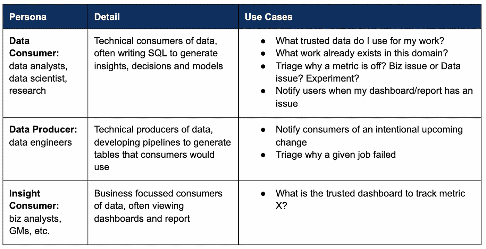

# 如何使您的数据目录成功

> 原文：<https://towardsdatascience.com/how-to-make-your-data-catalog-successful-3df6894f1975?source=collection_archive---------22----------------------->

## 从数十家公司学习如何让您的数据目录成功

约书亚·索蒂诺在 [UNSPLASH](http://unsplash.com) 上拍摄的照片

衡量数据目录的成功只有两个目标:1)采用，2)客户满意度。如果你搞定了这两个，你就成功了。

我是领先的开源数据目录 Amundsen 的共同创建者，该目录被 35 多家公司使用，包括 Instacart、Square、Brex、Asana 等等。在这篇文章中，我分享了从 Lyft、其他 Amundsen 采纳者和 [Stemma](http://stemma.ai/) 客户那里学到的关于数据目录安装成功的关键知识。

我们在 Stemma 中吸收了一些知识，但是这篇文章吸收了产品中还没有吸收的知识。这些学习侧重于如何推出产品，如何获得广泛采用，以及如何衡量成功。

# 1.区分人物角色及其用例的优先级

一个数据目录有许多用户角色和用例。成功的安装优先考虑首先关注哪些角色和用例。这是数据目录中最常见的角色和用例的简化视图。首先从哪个角色开始并不重要，重要的是从特定的目标用户群开始。

按作者分类的图片:数据目录中最常见的角色和用例

# 2.分阶段推出

在这一节中，我将深入探讨启动数据目录的最佳实践。

**第一步:确定一小组表格**来获得 alpha 用户的反馈。

*   该集合可以是公司内最常用的表(通常称为“核心”表)，也可以是公司内的一个领域，如营销、增长或财务等。
*   更常见的是，我看到核心表是被选择的集合，部分原因是它们最有影响力，但也因为通常有一个中央数据团队负责维护它们。

**步骤 2:在这些表上填充 MVP 元数据**。

*   这是大多数数据目录失败的地方。为了让用户从他们身上获得价值，描述，标签，所有者等等。需要策划。然而，如果没有大量的数据管理员，这是不可持续的，而且这些文档很快就会过时。这是数据目录失败的最大原因。通过为大部分数据选择自动化的数据目录，并仅管理最有影响力的数据，可以避免这一缺陷。
*   对于部落知识，在你必须的地方，与一群数据生产者和消费者进行“文档即兴会议”会有所帮助。你甚至可以为那些提交最多文档的人提供奖励(比如礼品卡)!

**第三步:向 5-20 名 Alpha 用户发布**。

*   阿尔法用户最好是超发声用户。这些将来自您之前选择的优先角色。当您向更广泛的受众发布时，这些用户将成为 data catalog 的忠实支持者。
*   整合反馈和迭代。有些类型的反馈在这里非常有价值，比如有人说，“哦，我们已经在这个电子表格中有了这些元数据，我们应该把它们也放在这里。”

**第四步:向优先角色的所有用户发布**测试版。

*   将你的测试版集中在你的优先用户(例如数据消费者)上是很重要的。一个常见的错误是通过向所有角色开放来淡化发布的焦点。这并不意味着你应该从数据目录中锁定其他的角色，这只是意味着你应该首先关注哪些角色。
*   如果您能够达到成功指标目标，则升级到 GA。在后面衡量成功的章节中会有更多的介绍。

# 3.大量收养的土地

为了更好地被采用，这里有一些我见过的最佳实践:

*   **更新松弛频道标题**，人们在那里互相提问。产品功能在这里非常有用，例如，如果您的目录具有松散集成，并且可以自动将这些对话链接到目录。
*   **嵌入新员工培训。**标记每个领域的数据集(营销、增长等。)可以帮助新员工快速进入他们的领域。如果您已经接受过培训，请展示目录作为切入点。在 Lyft，我们让所有新入职的技术人员在入职时使用一个指标。他们使用 Lyft 的数据目录来发现和理解该任务的正确数据。
*   **与其他产品的联系。**创建各种数据工具之间的链接。例如，自动填充填充表的气流 DAG 和数据目录中的表页面之间的链接(反之亦然)。另一个有效的链接是数据目录中的表页面和用于生成表的代码的链接。
*   在小组或公司会议上展示产品目录。在面向角色用户的全体会议上做一个 5 分钟的简短演示。教育、回答问题、感谢你的 alpha 用户——通过创造更多的认知和学习的机会，这是非常有影响力的。

# 4.衡量成功

就像我前面说的，采用和客户满意度是唯一重要的两个目标。我进一步探讨了对每一个指标使用什么样的具体指标定义:

**1。采用:**

*   **WAUs:** 我建议从周活跃用户(WAUs)开始，而不是日活跃用户或月活跃用户。常见的使用频率是每周，而不是每天或每月。 **‍**
*   目标穿透率:80%。在你的目标人物中，高渗透率是 80%。

**2。客户满意度(CSAT):**

*   **定期进行带外测量。**根据我的经验，定期(每 3 或 6 个月)测量的带外(非产品内)CSAT 反馈比在数据目录产品内获得反馈更好。我了解到，当在产品中衡量反馈时，最近的体验可能会玷污用户共享的反馈。

还有一些公司经常考虑的其他指标:文档质量、搜索质量等。然而，我的建议是一开始就坚持核心指标。随着您的数据目录逐渐成熟，并且随着时间的推移您将更多的元数据吸收到您的数据目录中，您可以使用这些特定的指标来跟踪这些不同改进的影响。

我希望本分步指南有助于您和您的团队了解如何导航数据目录安装，并使您的数据目录获得成功。正确的数据目录可以大大减少管理的开销。然而，无论您选择什么样的数据目录，上述步骤仍然对确保您的成功起着巨大的作用。

想了解更多关于 Stemma 的完全托管数据目录的信息吗？查看演示并开始使用 [stemma.ai](http://stemma.ai) 。