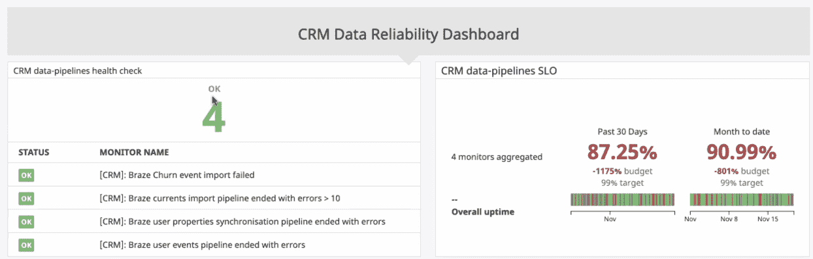

# 为什么您需要为您的数据管道设置 SLA

> 原文：<https://towardsdatascience.com/how-to-make-your-data-pipelines-more-reliable-with-slas-b5eec928e906?source=collection_archive---------12----------------------->

## 意见

## 如何设定贵公司对数据质量和可靠性的期望

图片由 Shutterstock 上的 [Yevgenij_D](https://www.shutterstock.com/image-vector/world-analytics-infographic-set-transparent-graphs-695437906) 提供，可供拥有标准许可证的作者使用。

*对于今天的数据工程团队来说，对实时、准确数据的需求从未像现在这样高，然而破损的管道和陈旧的仪表板却是一个司空见惯的现实。那么，如何才能打破这种恶性循环，做到数据可靠呢？*

就像我们 20 年前的软件工程同行一样，21 世纪 20 年代初的数据团队面临着一个重大挑战:[可靠性](/what-is-data-reliability-66ec88578950)。

与以往相比，公司正在吸收越来越多的运营数据和第三方数据。整个企业的员工都在数据生命周期的各个阶段与数据进行交互，包括非数据团队的员工。与此同时，数据源、管道和工作流变得越来越复杂。

虽然软件工程师已经用专业领域(如开发运维及站点可靠性工程)、框架(如服务水平协议、指标和目标)和大量首字母缩写词(分别为 SRE、SLA、SLIs 和 SLOs)解决了应用程序停机问题，但数据团队并没有以应有的努力处理 [**数据停机**](/the-rise-of-data-downtime-841650cedfd5) 。

现在是时候让数据团队做同样的事情了:区分优先级、标准化和度量 [**数据可靠性**](https://www.montecarlodata.com/what-is-data-reliability/) 。我预计在未来十年，数据质量或可靠性工程将发展成为自己的专业，负责这一关键的业务功能。

> 在此之前，让我们探索一下什么是数据可靠性 SLA，它们为什么重要，以及如何创建它们。

# 什么是 SLA？

Slack 的 SLA 保证 99.999 的服务正常运行时间。如果违约，他们会申请服务信用。图片由 Slack 提供。

简而言之，服务水平协议(SLA)是许多公司用来定义和衡量给定供应商、产品或内部团队将提供的服务水平的一种方法，以及如果他们未能提供的潜在补救措施。

例如， [**Slack 面向客户的 SLA**](https://slack.com/terms/service-level-agreement#:~:text=Slack%20provides%20a%2099.99%25%20Uptime,your%20account%20for%20future%20use.) 承诺每个财季 99.99%的正常运行时间，计划停机时间不超过 10 小时，适用于 Plus 计划及以上的客户。如果他们达不到要求，受影响的客户将在他们的帐户上获得服务积分以供将来使用。

> 客户使用 SLA 来确保他们从供应商那里得到他们所支付的东西:健壮、可靠的产品。对于许多软件团队来说，SLA 是为内部项目或用户开发的，而不仅仅是终端客户。

# 为什么 SLA 很重要？

让我们以内部软件工程 SLA 为例。如果没有客户向您施压，要求您在合同中承诺某些阈值，为什么还要经历编纂 SLA 的过程呢？为什么不指望每个人都尽力而为，争取尽可能接近 100%的正常运行时间呢？这不就是引入不必要的繁文缛节吗？

一点也不。定义、同意和度量构成可靠软件的关键属性的实践非常有用，并且为内部涉众设定了明确的期望。

SLA 可以帮助工程、产品和业务团队就他们的应用程序中最重要的事情达成一致，并对传入的请求进行优先级排序。有了 SLA，不同的软件工程团队和他们的涉众可以确信他们在说相同的语言，关心相同的度量标准，并且共享一个清晰记录的期望的承诺。

> 设定那些非 100%正常运行时间的期望值也为增长留下了空间。如果容忍零停机风险，就没有创新的空间。另外，这是不可行的。即使拥有世界上所有的最佳实践，系统也会偶尔崩溃。但是有了好的 SLA，当事情确实出错时，工程师将确切地知道何时以及如何进行干预。

# 为什么数据可靠性如此重要

图片由蒙特卡洛提供。

同样，对于数据团队及其数据消费者来说，在数据的整个生命周期中定义、测量和跟踪数据的可靠性已经成为一项关键需求。

设置数据可靠性 SLA 有助于在您的数据、您的数据团队和下游消费者(无论是您的客户还是您公司的跨职能团队)之间建立信任并加强关系。如果没有这些明确定义的指标，消费者可能会做出有缺陷的假设，或者依赖关于您的数据平台的可靠性和可信度的轶事证据。换句话说，数据 SLA 有助于您的组织更加“数据驱动”数据。

SLA 还将沟通形式化并简化，确保您的团队和您的利益相关者使用相同的语言并引用相同的指标。由于定义 SLA 的过程有助于您的数据团队更好地了解业务的优先级，他们将能够快速确定优先级，并在事件发生时加快响应速度。

# 如何创建数据可靠性 SLA

创建数据可靠性 SLA 并遵守它们是一项协作和专业的练习。

让我们先弄清楚一些词汇。根据 Google 的服务水平协议(SLA ),需要明确定义的服务水平指标(sli)、服务质量的量化衡量标准以及商定的服务水平目标(SLO ),即每个指标应达到的目标值或值范围。例如，许多工程团队将可用性作为站点可靠性的一个指标来衡量，并设定一个目标来保持至少 99%的可用性。

> 通常，对于数据团队来说，创建可靠性 SLA 的过程遵循三个关键步骤:定义、测量和跟踪。

## 步骤 1:用 SLA 定义数据可靠性

第一步是就可靠数据对您的组织意味着什么达成一致并明确定义。

我建议从设定基线开始。首先对您的数据进行清点，包括数据的使用方式和使用人。评估数据的历史性能，以获得可靠性的基准指标。

您还想从数据消费者那里获得关于他们眼中“可靠性”的反馈。即使对数据谱系有很好的理解，数据工程师也经常会被从他们同事的日常工作流程和用例中剔除。在与内部团队达成可靠性协议时，了解消费者实际上如何与数据交互、哪些数据最重要以及哪些潜在问题需要最严格、最直接的关注是至关重要的。

此外，您还需要确保相关利益相关方——所有对可靠性有既得利益的[数据领导者](https://www.montecarlodata.com/which-of-the-six-major-data-personas-are-you/)或企业消费者——已经对您正在开发的可靠性定义进行了权衡和认可。

> 一旦您了解了(1)您正在处理哪些数据，(2)如何使用这些数据，以及(3)谁在使用这些数据，您就能够制定清晰、可行的 SLA。

(如果你仍然不确定这些 SLA 会是什么样子，我强烈推荐阅读这个关于设置数据仓库 SLA 的**[**系列**](https://locallyoptimistic.com/post/data-warehouse-sla-p1/) 。Brooklyn Data Co .的 Scott Breitenother 提供了一个非常强大的入门模板，以及与利益相关者沟通 SLA 的实用建议。**

## **步骤 2:用 SLIs 测量数据可靠性**

**一旦您有了透彻的理解和基准，您就可以开始关注将成为可靠性的服务级别指标的关键指标。**

**根据经验，数据 sli 应该代表您在步骤 1 中定义的双方同意的数据状态，提供如何使用和不使用数据的界限，并具体描述数据停机时间是什么样子。这可能包括丢失、重复或过期数据等情况。**

**您的 SLIs 将取决于您的具体用例，但这里有一些用于 [**量化数据健康**](https://www.montecarlodata.com/data-quality-you-are-measuring-it-wrong/) 的指标:**

*   **特定数据资产的数据事件数量(N)。尽管这可能超出了您的控制范围，但考虑到您可能依赖外部数据源，它仍然是数据停机的一个重要驱动因素，并且通常值得衡量。**
*   **检测时间(TTD):当问题出现时，此指标量化您的团队得到警报的速度。如果您没有适当的检测和警报方法，这可能需要几周甚至几个月的时间。由不良数据造成的“无声错误”会导致代价高昂的决策，对您的公司和客户都有影响。**
*   **解决问题的时间(TTR):当您的团队收到问题警报时，这衡量您解决问题的速度。**

## **步骤 3:使用 SLO 跟踪数据可靠性**

****

***在设置可靠性仪表板时，数据团队应该更加具体。图片由蒙特卡洛提供。***

**在确定了数据可靠性的关键指标(sli)后，您可以设定目标，即可接受的数据停机时间范围。**

**这些 SLO 应该是现实的，基于你的现实环境。例如，如果您决定将 TTD 作为一个度量标准，但是您不使用任何自动化的监控工具，那么您的 SLO 应该低于一个拥有全面的数据可观察性工具的成熟组织的范围。**

**就这些范围达成一致使您能够创建一个统一的框架，根据严重程度对事件进行评级，并在出现问题时简化沟通和快速响应。**

**一旦您设定了这些目标并将其合并到您的 SLA 中，您就可以创建一个仪表板来跟踪和报告进度。一些数据团队创建他们自己的专用仪表板，而另一些则使用专用的数据可观察性 解决方案。**

# **实践中的数据可靠性**

**为数据设置 SLA、SLO 和 SLIs 只是难题的第一部分。当数据事件发生时，我们还需要一种方法来分类和管理事件，以免它们成为下游消费者的一大难题。**

**为此，我们可以再次向我们在 DevOps 的朋友寻求灵感。大多数工程组织会指派整个站点的可靠性团队来识别、解决和防止停机。在当今的现代数据组织中，当管道破裂和仪表板变得不稳定时，数据工程师往往首当其冲。**

**为了使事件解决过程更加简单和无缝，我们可以借鉴 SRE 手册，在数据问题出现时进行有效的沟通和分类。**

**例如，假设您的主管的一份重要报告中出现了陈旧的数据。从一开始，你不确定这条管道是如何断裂的，但是你需要告诉他们管道已经断裂，你的团队正在处理这件事。在您解决这个问题时，您不仅需要不断更新您的数据宕机侦探同事，还需要更新您的关键利益相关方对事件解决流程的了解。**

**以下是从一些最好的数据工程团队收集到的一些有用的表情符号及其相应的含义，便于交流:**

****

**图片由蒙特卡洛提供。**

**和一些图标来指示事件的严重性:**

****

**图片由蒙特卡洛提供**

> **虽然获得可靠数据的手段最终取决于您的业务需求，但拥有一个良好的沟通策略将使您更容易执行 SLA。( **Blinkist 分享了他们解决数据宕机的路线图，这里**)。**

# **入门指南**

**我们很兴奋地看到[**数据可靠性工程**](/what-is-data-reliability-66ec88578950) 这个专业领域是如何发展的。SLA、SLIs 和 SLOs 是一个很好的起点:它们为测量数据停机时间提供了一个有用的框架，并有助于在整个组织中建立一种信任、协作、数据驱动的文化。**

**就像 sre 通过自动化支持系统确保应用程序正常运行一样，数据团队也应该拥有自己的专业工具。最好的数据平台不仅会测量数据停机时间，还会通过 [**端到端的数据可观察性**](https://www.montecarlodata.com/data-observability-the-next-frontier-of-data-engineering/) ，最终帮助从一开始就防止数据停机，让您的团队达到最高的数据可靠性标准。**

*****有兴趣学习如何设置自己的数据可靠性 SLA？伸出手去*** [***巴尔摩西***](https://www.linkedin.com/in/barrmoses) ***和其余的*** [***蒙特卡洛团队***](https://www.montecarlodata.com/) ***。*****