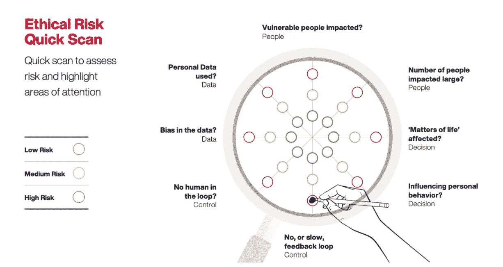
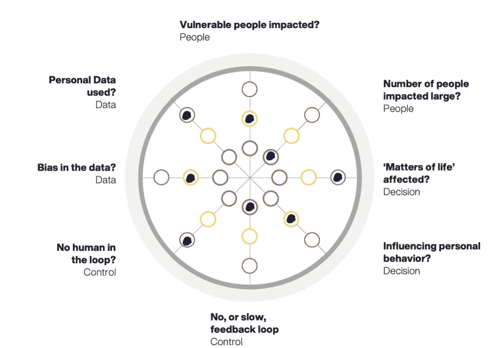
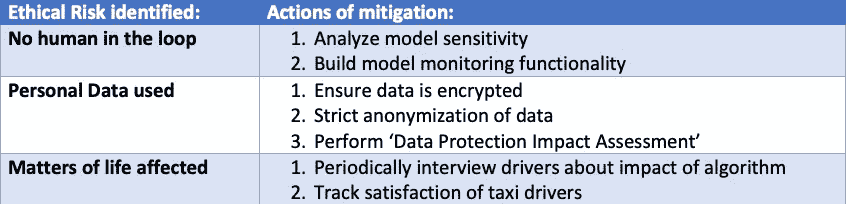

# 如何通过设计使您的数据项目合乎道德

> 原文：<https://towardsdatascience.com/how-to-make-your-data-project-ethical-by-design-99629dcd2443?source=collection_archive---------18----------------------->

## 一个简单的框架从今天的数据伦理开始

图片由 [Riccardo Annandale](https://unsplash.com/@pavement_special) 在 [Unsplash](https://unsplash.com/) 上拍摄

数据是当今公司的命脉。日常运作不仅依赖于有关运营各个方面的持续数据，而且越来越清楚的是，有了足够的数据和正确的分析，以前难以解决的问题就可以得到解决，流程也可以得到改进。毫不奇怪，[数据科学目前在 Glassdoor 的 2021 年美国最佳工作名单中排名第二(过去 6 年中有 4 年一直排名第一)。](https://www.glassdoor.com/List/Best-Jobs-in-America-LST_KQ0,20.htm)

[但正如 2018 年脸书/剑桥分析政治丑闻向世界表明的那样，收集和分析大量数据的现代方法也可能引发伦理问题。丑闻爆发后，整个世界开始形成一种关于数据如何被使用和不被使用的观点，开启了可以被称为数据伦理的时代。](https://www.nytimes.com/2018/04/04/us/politics/cambridge-analytica-scandal-fallout.html)

将这一点与旨在限制可以收集多少客户数据以及出于何种目的的现有和新兴立法结合起来，底线是:如果您的公司使用客户数据来做出面向客户的决策，则必须考虑做出这些决策所涉及的道德和法律问题。

## **培养伦理思维专家**

在我的上一篇文章中，我描述了疏忽的数据使用可能导致的各种问题。我还提到了许多框架，数据科学家可以使用这些框架作为开始思考他们的工作可能带来的潜在问题的基础。但是，随着数据越来越成为整个组织决策的驱动力，数据道德意识需要扩展到数据科学团队之外。避免无意的陷阱意味着将每个数据用例的道德规范视为组织流程的一个组成部分。

我工作的公司积极帮助防止公司陷入道德数据陷阱。我们试图将数据使用的伦理注入我们的 DNA。我们公司的每一位顾问都接受过某种程度的数据安全和道德培训。我们最近还成立了一个包容性、多样性、公平和意识(IDEA)小组，面向热衷于思考道德和公平如何影响业务决策的人们。在进行数据项目时，IDEA group(多么有趣的缩写)的想法有助于确保我们的数据科学家了解利用客户数据的道德规范的最新趋势。

## **道德数据使用框架**

通常，公司认为解决道德问题对业务不利，或者以某种方式“破坏”他们所做的事情。但是在我们的经验中，从来不是这样。在我的工作中，我以道德的方式帮助公司用数据达到他们的目标。

为此，我(和两位同事)创建了一个道德风险快速扫描，帮助客户快速评估他们的数据用例是否会导致道德风险。对于尚未设计解决方案的用例，很难评估风险和定义所需的度量，更不用说构建了。然而，道德风险是区分用例优先级和选择方法的关键标准。因此，我们开发了在用例选择和需求收集的早期阶段精确使用的快速扫描。它让我们对项目早期涉及的风险水平和领域有一个感觉，因此在哪些领域需要额外的关注。该框架帮助您将道德规范融入数据项目的设计中。

快速扫描如下所示:

作者为 [IG & H](http://www.igh.com) 创建的框架

我们设计了快速扫描来提供潜在道德问题点的可视化表示。只需填写与您的案例细节相对应的点即可。

## 运行中的框架:出租车司机用例

下面是如何使用该框架的一个示例:想象一个出租车服务，它以数字方式监控出租车司机分配和执行的乘坐的许多方面。他们希望开发一种模型，根据这些数据对司机的表现进行评分，并相应地自动调整司机的工资。

让我们讨论一下这个用例在框架的每个维度上的得分:

*   **弱势人群受到冲击？**受影响的人通常经济收入低于平均水平，有些人可能只能勉强度日。
*   **受影响的人数多吗？**这是一个内部应用，对很多人没有影响(只有公司的出租车司机员工)。
*   **‘人生大事’受影响？该模型的决策将影响生活中的事情，因为它们将影响财务健康和工作保障。**
*   **影响个人行为？**该模型的决策可能会影响出租车司机的行为，因为它们可能会刺激出租车司机工作更长时间，或者接受往返于他们不舒服的地点。
*   **没有，或者说慢，反馈回路？**模型决策的效果会很快显现(每周或每月)，因此会有一个快速的反馈循环。
*   **没有人类参与？**用例要求自主的绩效评分和薪酬调整，这意味着没有人参与。
*   **数据中的偏差？**性能通常是一个主观的概念，因此模型训练所依据的数据可能会有偏差。
*   **使用的个人数据？**最后，数据会涉及到细粒度的个人位置数据，被认为是个人数据。

下面是我如何根据这个特定的使用案例填写快速扫描:

作者为 [IG & H](https://www.igh.com/) 创建的框架

对于每个填有红点的区域，必须考虑或采取措施来缓解潜在问题。此外，建议特别注意填有“中等风险”点的区域。下表提供了这种情况下最大问题点的可能缓解措施示例。

快速浏览将注意力集中在项目开始前可以采取的措施和缓解措施上。一旦项目全面展开，随着实际的解决方案和数据需求变得越来越清晰，团队可以通过道德风险评估框架将其评估提升到下一个级别。这进一步从普遍接受的安全、公平、透明和隐私的道德准则方面检查了风险维度。我们从对 36 个著名的人工智能原则文档进行的元研究中提炼出了这些指导方针。

## **确保数据转换中的道德行为**

在转型期间，我公司的数据科学家与行业专家一起工作，以确保数据、分析、技术和业务技能之间的无缝互动。同时，我们确保数据使用得到优化，以有效实现业务目标，而不会违反道德数据使用准则和法规。

在下一篇文章中，我打算使用我们的(更广泛的)道德风险评估框架，根据快速扫描结果阐明我们可以采取的行动类型。使用这些指南，我们可以消除和/或减少已识别的风险，并使人工智能的使用不仅可行，而且可行和可取。

这篇文章(和框架)是我和我的同事曼多·罗特曼和 Floor Komen 共同完成的。它也被发布到我们的 [*公司网站*](https://www.igh.com/post/ethical-data-analytics-2-incorporate-ethics-into-the-design-of-data-projects?utm_content=169463583&utm_medium=social&utm_source=linkedin&hss_channel=lcp-11167) *，在那里你也可以下载 pdf 格式的框架，这样你就可以自己使用了。*

*这篇文章也被发表到 IG & H 的网站上。这是三篇系列文章中的第二篇，你可以在这里找到:第一部分* *和* [*第三部分*](/the-importance-of-ethics-centricity-in-data-projects-ea2a60e6b67)