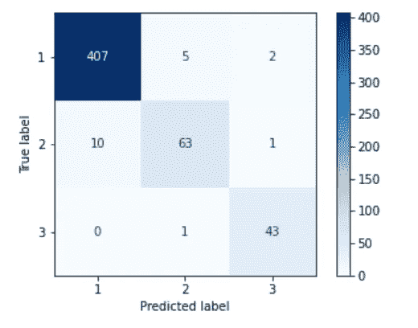

# 如何让你的建模过程更有效率

> 原文：<https://towardsdatascience.com/how-to-make-your-modeling-process-more-efficient-89e70259839d?source=collection_archive---------43----------------------->

## 介绍一种用于数据集初始建模的省时方法


[张杰](https://unsplash.com/@jay_zhang?utm_source=medium&utm_medium=referral)在 [Unsplash](https://unsplash.com?utm_source=medium&utm_medium=referral) 上的照片

在这篇文章中，我将分享一些关于如何有效地开始初始建模的技巧。在花了很多时间测试哪些模型在我的特定数据集上表现最好之后，我想出了一个节省时间的方法，我用它来对我的所有数据集进行初始建模。一旦我能够找出在我的数据集上表现最好的模型，我就专注于这些模型，并开始调整它们的超参数，使它们在我优化的指标方面更好。

我下面描述的过程将有助于找到你的模型的一个好的起点。在这个例子中，我正在进行一个项目，该项目使用 CTG 信息将胎儿健康分为 3 类(1 为健康，2 为可疑，3 为病理)。请注意，在开始项目的建模阶段之前，我彻底清理了数据并执行了 EDA。

为了开始分类建模过程，我定义了 X 和 y 变量，并创建了训练、测试分割和缩放数据，如下图所示。一旦训练和测试数据被缩放，就该开始初始建模了。

```
X = df.drop(columns = ['fetal_health'])
y = df['fetal_health']X_train, X_test, y_train, y_test = train_test_split(X, y, stratify = y )ss = StandardScaler()
X_train_sc = ss.fit_transform(X_train)
X_test_sc = ss.transform(X_test)
```

我创建了一个函数来实例化并拟合训练数据上的指定模型，对测试数据进行预测，然后打印出训练和测试的准确度分数。下图显示了我如何设置这个简单而有效的函数。

```
def pipe(model): #instantiate model
    model = model() #fit to scaled data
    model.fit(X_train_sc, y_train)

    #make predictions
    predictions = model.predict(X_test_sc) #print accuracy scores for training and testing groups
    print(f'{model} training score: {model.score(X_train_sc, y_train)}')
    print(f'{model} testing score: {model.score(X_test_sc, y_test)}')return
```

接下来的部分是最有趣的部分！我能够通过我在笔记本中导入的函数传递任何模型。我能够很快地在 8 个不同的分类模型上重复这个函数，并打印出训练组和测试组的准确度分数。然后，我可以查看如下所示的 8 个模型的得分，并挑选出前两个模型来微调超参数，以进一步提高准确性。

```
pipe(LogisticRegression)
> LogisticRegression() training score: 0.8977415307402761
> LogisticRegression() testing score: 0.9078947368421053pipe(DecisionTreeClassifier)
> DecisionTreeClassifier() training score: 0.998745294855709
> DecisionTreeClassifier() testing score: 0.9116541353383458pipe(KNeighborsClassifier)
> KNeighborsClassifier() training score: 0.9316185696361355
> KNeighborsClassifier() testing score: 0.8984962406015038pipe(RandomForestClassifier)
> RandomForestClassifier() training score: 0.998745294855709
> RandomForestClassifier() testing score: 0.9454887218045113pipe(AdaBoostClassifier)
> AdaBoostClassifier() training score: 0.9084065244667503
> AdaBoostClassifier() testing score: 0.8853383458646616pipe(SVC)
> SVC() training score: 0.9240903387703889
> SVC() testing score: 0.9191729323308271pipe(GradientBoostingClassifier)
> GradientBoostingClassifier() training score: 0.9949811794228356
> GradientBoostingClassifier() testing score: 0.9492481203007519pipe(ExtraTreesClassifier)
> ExtraTreesClassifier() training score: 0.998745294855709
> ExtraTreesClassifier() testing score: 0.9342105263157895
```

在这种情况下，我选择继续研究梯度提升分类器和随机福里斯特分类器，因为它们在训练组和测试组之间具有最高和最一致的分数。在那里，我设置了网格搜索来测试每个模型中不同的超参数选项。网格搜索需要更多的时间来迭代，这就是为什么我只想在最高性能的模型上尝试。梯度增强分类器网格搜索如下所示。然而，我对这两个模型都做了这个过程，并确定了每个模型的最佳参数。

```
X = df.drop(columns = ['fetal_health'])
y = df['fetal_health']X_train, X_test, y_train, y_test = train_test_split(X, y, stratify = y )#pipeline to scale data and then grid search
pipe = Pipeline([
    ('ss', StandardScaler()),
    ('gbc' , GradientBoostingClassifier()) 
])#gbc parameters to grid search through
pipe_params = {
    'gbc__max_depth':[1, 2, 3, 4],
    'gbc__learning_rate'  :[0.1, 0.001, 1],
    'gbc__n_estimators' :[100, 300, 500],
    'gbc__min_samples_leaf' :[1, 2]
}#instantiate and fit grid search
gs = GridSearchCV(pipe, param_grid = pipe_params, cv = 5)
gs.fit(X_train, y_train)#print accuracy scores for training and testing groups
print(f'training score:  {gs.score(X_train, y_train)}')
print(f'testing score: {gs.score(X_test, y_test)}')> training score: 0.9887076537013801
> testing score: 0.9473684210526315#get best parameters from grid search
gs.best_params_> {'gbc__learning_rate': 0.1,
 'gbc__max_depth': 2,
 'gbc__min_samples_leaf': 2,
 'gbc__n_estimators': 500}
```

最后，为了评估用于生产的最佳模型，我对测试数据进行了预测，并查看了每个模型的准确性分数和召回分数。我希望优化召回分数，因为在处理胎儿健康数据时，假阴性的风险很高。我选择梯度提升分类器作为最佳模型，因为与随机森林分类器相比，它在准确性和召回率方面得分最高。参见下面的分类报告和混淆矩阵，其中第 3 组(病理组)的假阴性已降至最低。

```
#make predictions on testing data
preds = gs.predict(X_test)#print out classification report
print(classification_report(y_test,preds))> 
fetal health  precision    recall  f1-score   support

           1       0.96      0.97      0.97       414
           2       0.91      0.78      0.84        74
           3       0.86      0.98      0.91        44

    accuracy                           0.95       532
   macro avg       0.91      0.91      0.91       532
weighted avg       0.95      0.95      0.95       532#plot confusion matrix
cm = confusion_matrix(y_test, preds)
ConfusionMatrixDisplay(cm, display_labels = gs.classes_).plot(cmap = 'Blues');
```



作者照片

这整个过程可以在一天的工作中完成。我希望模型功能和网格搜索的结合也能帮助你的分类建模更有效！