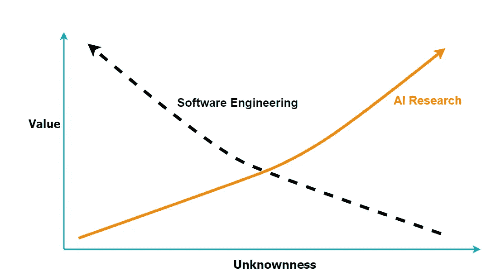

# 如何成功管理人工智能团队

> 原文：<https://towardsdatascience.com/how-to-manage-ai-teams-for-success-502c1f85ca96?source=collection_archive---------36----------------------->

## **隐藏的动力、目标和竞争矢量**

Shutterstock.com[瓦伦丁·瓦尔科夫](https://www.shutterstock.com/g/ValentinValkov) / [摄影](http://shutterstock.com/)

几个月前，我与多伦多一家知名人工智能公司的几位研究人员进行了一次对话，他们的公司理念是，每个人都应该编写生产级代码，甚至能够部署它。这让我想起了很多事情。关于我的团队，关于人工智能和管理软件工程的复杂性。人工智能团队特别有趣，因为他们同时需要至少两个学科:软件/硬件工程和科学发现。

那么，一个人如何走向成功，创建一个有凝聚力的团队，或者由研究人员和软件工程师组成的团队，他们一起工作，创造出伟大的产品呢？产品要么是企业试图在知识产权方面获得竞争优势的纯研究，要么是在给定垂直领域更适合商业产品的应用研究，要么是两者的混合。

这是我们三年前面临的挑战。作为一个团队，我们需要为我们的金融客户创建一个软件生态系统。它有几个不同的组件:基于 Kafka 的数据摄取系统，ETL 流程，特征工程，发现 ML/深度学习算法的核心流程，并最终将它们部署到生产中。这是一个既需要科学研究又需要创造商业产品的混合环境。观察新出现的团队内部模式很有趣，这让我想起了我以前与科学家和软件工程师的合作。我发现仔细检查人工智能研究和软件工程的交互中隐藏的假设，以及管理哲学如何影响这些交互，并最终影响一个组织的目标可以实现的程度，这很有趣。

# **竞争向量**

想象你是一名软件/数据工程师，与一名人工智能研究人员一起工作，或者相反，这取决于你更喜欢哪种角色。作为一名软件工程师，你朝着消除设计中的错误和减少设计中的缺陷前进，如果你的系统中有未知的东西，在很大程度上你就暴露在风险之中。相反，作为一个人工智能研究者，你会走向一个新的发现，本质上你是在走向一个在发现之前未知的东西。它有多新颖并不重要，重要的是它以前不为任何人所知。换句话说:研究人员走向未知，而软件工程师走向消除未知，图 1。我把这种现象称为未知向量的*竞争(CUV)。*我一直在从三个维度思考 CUV:系统熵、奖励系统、集体与个人目标，并有兴趣看看这些向量可能在哪里收敛或发散。

图 1:未知向量的*竞赛，a* s 如果有两个向量，代表每个学科的努力，指向两个不同的搜索空间。*作者图片。*

# **系统熵**

从系统熵的角度来看待未知会很有趣。人工智能研究中的发现过程，或任何与此相关的科学研究，似乎都伴随着所涉及的思维过程和潜在工作空间中熵的增加。类似于给思想的灯塔充能，把它送到高维空间，寻找新的发现。如果你的研究灯塔能量不高，你就不太可能接触到新奇的事物。似乎没有这种熵水平的内在增加，就无法进行研究。如果不在创造力的空间里进行高维度的搜索，一个人怎么能发现未知的新领域呢？另一方面，软件工程寻求在系统层次上减少熵。熵的起伏会在目标、支持系统、协议、数据管道和项目的运营预算等方面产生摩擦。

例如，在我们项目的早期，我们的研究人员正在构建新的模型，这些模型不断需要新的数据流、这些数据的新转换以及这些数据的新存储解决方案。他们的创造速度超过了数据平台所提供的开箱即用。在这种情况下，一家公司可能有两种选择，一种是将研究人员转化为兼职工程师，他们也可以创建自己的临时管道，在我看来，这是一种自我挑战的活动，因为它会导致团队的研究能力大幅下降。第二个选择是想出新的方法来支持研究人员。第二个选择最终是我们选择的道路，它帮助我们在不破产的情况下增加我们的研究能力(我将在下一篇文章中更详细地介绍我们如何扩大我们的团队)。我想在这里强调的一点是，这两个子系统，数据管道和不同机器学习模型的实验，在增加或减少系统熵方面是如何发生冲突的。除了数据管道，我们在其他子系统中也看到了熵上升和下降的相同模式，以及随之而来的摩擦，例如在编码、测试和设计 ML 模型的定制模拟中。

# **奖励系统**

这两个领域的奖励制度可能大相径庭。在科学领域，一个人会因为有所发现而获得奖励，即揭开未知的秘密。例如，[亚当优化器](https://en.wikipedia.org/wiki/Stochastic_gradient_descent#Adam)的发明是一项科学成就，它使得深度模型的训练更快。虽然，让我们说，创建一个高性能的数据流管道，实时填充功能商店*和*也为生产模型提供数据，虽然非常复杂和非常有价值，但它更像是一项工程成就，而不是科学或 NeurIPS 有兴趣发表的东西。我认为奖励制度是公司需要投资澄清的主要话题之一，因为它影响了企业的最终目标，以及如何平衡人工智能研究人员和软件工程师的留用和工作满意度。

照片由[航拍](https://www.shutterstock.com/g/aerialmotion)/[Shutterstock.com](http://shutterstock.com/)拍摄

# **集体目标与个人目标**

在商业人工智能公司中，目标不明确有许多方式，但似乎最常见的方式之一是试图简单地复制管理哲学和学术界的目标。如果考虑未知向量、奖励系统和系统熵的竞争，就可以更清楚为什么简单地复制学术界可能不是中小型企业的最佳主意。可以举出几个不同的例子来说明这种不适用性。

例如，学术界可以承受思维过程中几乎无限的熵(这是正确的，因为这是他们的设计目的，做出新的发现)，而在商业企业中，无限的熵可能会破坏工程努力和团队内部的努力，从而破坏产品化的机会。

另一个例子可以是如何在人工智能公司中衡量进展。在我们项目的早期，我们在 finance+ml 杂志上看到了一篇很有前途的同行评议论文，它为解决我们现有的一些问题提供了理论依据。然而，令我们惊讶的是，我们无法重现该论文承诺的结果。为了解决这个问题，我们作为一个团队合作创建了一个模拟环境，以测试实现该论文承诺结果的可能性。通过这些概率模拟，我们发现实现那篇论文发表结果的几率只有 70%。对我们来说，这一过程是成功的，因为有两个原因，首先，它节省了我们在那份文件上花费的时间，其次，它揭示了那份文件中隐藏的风险远远超出了我们在任务关键型环境中所能容忍的程度。对我们来说，这里的成功不一定是写一篇新的科学论文，而是发现一个模型与项目的目标不一致。

第三个例子是检查学术界和企业所需的软件工程工作的规模和结构。在学术界，软件工程工作通常是在筒仓中完成的，有趣的是，这些筒仓老化得非常快，并且不期望它们相互连接和交换数据，因为根本不迫切需要它，因为目标不是公司范围的，而是基于个人的。在企业方面，要使这些孤岛相互通信、保持最新状态并服务于多个客户，需要在软件和数据工程方面进行大量投资。

# **思绪向前**

我认为检查人工智能企业中存在的隐藏假设是有益的，无论它们更倾向于研究还是研究和产品的混合体。并且可能有助于提出具有深远影响的问题:团队是如何构建的，进展是如何衡量的，代码是如何产生的，敏捷迭代是如何完成的，谁支持谁以及支持到什么程度，以及成功的定义是什么:它发表了更多的论文吗？或者，作为一个例子，成为金融领域领先的人工智能提供商？或者两者都有？这就引出了这样一个问题:一个公司要取得预期的成功，需要什么样的结构、团队和脚手架。我也有兴趣了解你的经验和实地观察，无论是作为一名人工智能研究人员，一名软件工程师，还是一名经理，请随时通过评论或消息联系。

感谢阅读。

[https://www.linkedin.com/in/atavakolie/](https://www.linkedin.com/in/atavakolie/)
http://www . silka tech . ca