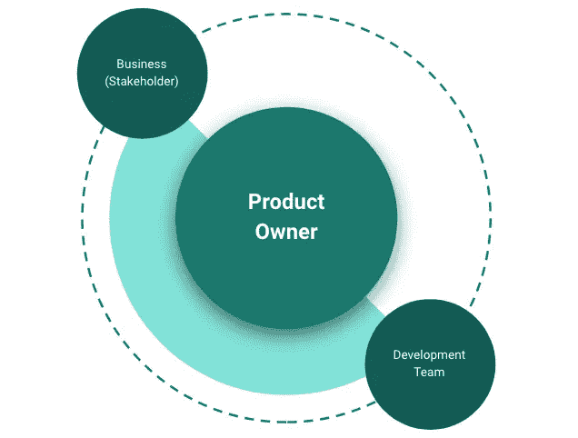

# 如何管理您的数据科学项目

> 原文：<https://towardsdatascience.com/how-to-manage-data-science-projects-successfully-8fbcbdb3b5f7?source=collection_archive---------49----------------------->

## 数据科学项目的五个 P

蒂姆·斯万在 [Unsplash](https://unsplash.com/s/photos/nature?utm_source=unsplash&utm_medium=referral&utm_content=creditCopyText) 上的照片

在这篇短文中，我想为您提供什么是 5P 的答案，以及如何通过在您的数据科学项目中使用它们来从中受益。

## 目的

类似于经典的项目管理，目标或目的总是应该被制定。在大数据世界中，可能的目标包括:

*   更好的商业洞察力
*   欺诈预防/检测
*   预言；预测；预告
*   最大化问题等。

但是，如果没有明确的目标，就不应该做大数据或数据科学项目。不要因为每个人都在做某件事就去做它！

## 人

通常参与开发团队的人员的角色如下:

*   开发商
*   试验装置
*   数据科学家
*   领域专家

敏捷数据科学团队—作者图片

还有**利益相关者和项目发起人**，他们通过**项目经理/产品负责人**了解项目的进展，在双方之间进行调解，并承担建立适当团队、组织截止日期、创建项目计划或故事的任务。在这里阅读更多关于组建团队的。

## 处理

你必须考虑两种不同类型的过程。一方面**组织流程**和主题如:

*   项目组织:经典与敏捷
*   项目进度报告和项目营销(例如，我如何通知我的利益相关者？)
*   变更流程(我如何让相关人员参与进来，并让他们成为合作者？)

另一方面，你将处理**技术流程:**

*   我试图用 IT 和数据科学支持的业务流程是什么？
*   数据集成过程和使用什么等问题——以 ETL 与 ELT 为例
*   您希望选择什么样的数据分析和数据科学流程(例如 CRISP)

## 平台

影响您将用于分析和产品的平台的基本和战略性问题有:

*   我的 IT 治理规定了什么？
*   我追求哪些(IT)策略？
*   以前的(IT)架构
*   一两个速度呢？
*   我的法规遵从性/安全性要求什么？

这导致了一些技术问题，如:

*   数据集成应该如何实现？(通过 Java 手动操作，而不是使用 talend、Dataflow 等工具。)
*   应该使用哪种云(AWS 对 Google 对 Azure 以及
    公共对私有对混合)
*   我的技术要求是什么？
*   SLA(服务提供商和客户之间的合同)

本文中的[描述了如何构建您的数据分析平台。](/how-to-set-up-an-flexible-and-scalable-data-analytics-platform-quickn-easy-5fb3a4c83745)

## 可编程序性

我使用哪些工具和编程语言？这一点当然也是由 IT 治理和战略以及对上述问题的回答所决定和影响的。

工具和编程语言可以是:

*   像 SQL、Python、R
*   像 Hadoop、谷歌云存储和大查询、AWS 红移和 S3 这样的大数据工具
*   Kafka、Spark、talend 等流媒体软件
*   商务智能工具，如:Tableau，Qlik，谷歌数据工作室

## 结论

在从事数据科学项目甚至管理项目时，5P 将为您提供您应该考虑的五个主要主题。此外，他们会问你一些你在项目中可能会问自己的问题。要了解更多信息，您可以点击下面的链接。

## 资料来源和进一步阅读

</how-to-set-up-an-flexible-and-scalable-data-analytics-platform-quickn-easy-5fb3a4c83745>   