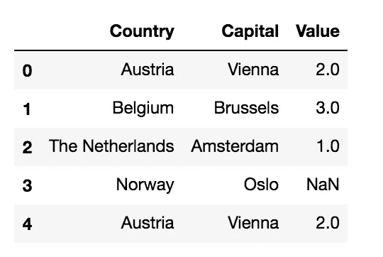
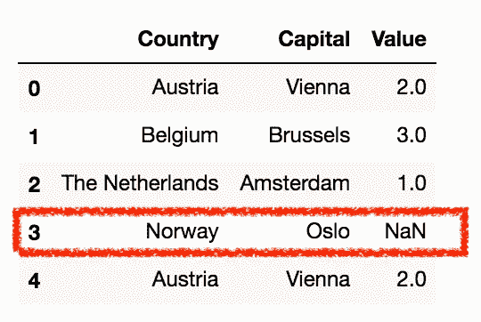
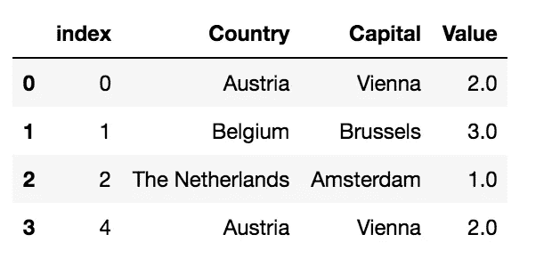
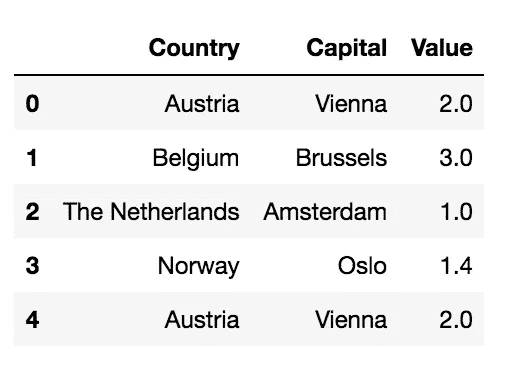
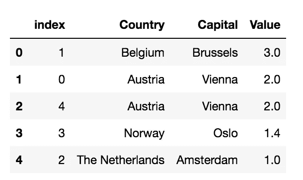
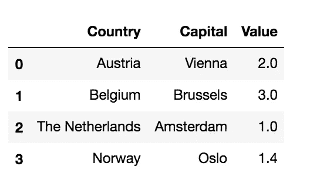
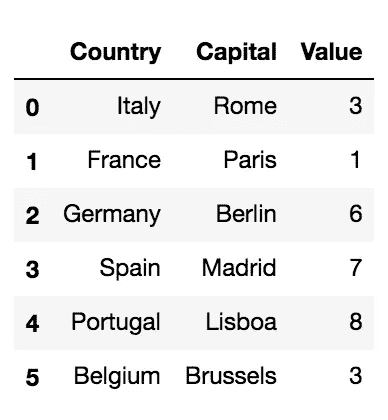
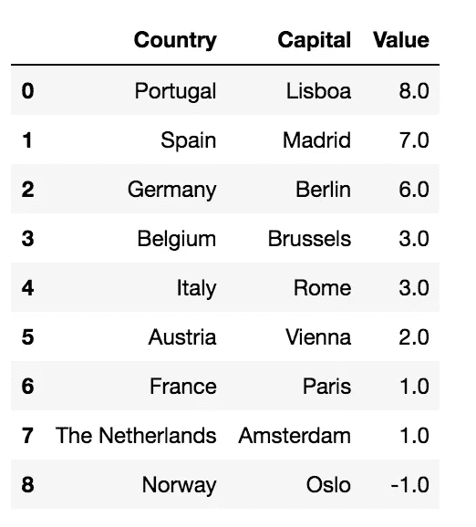
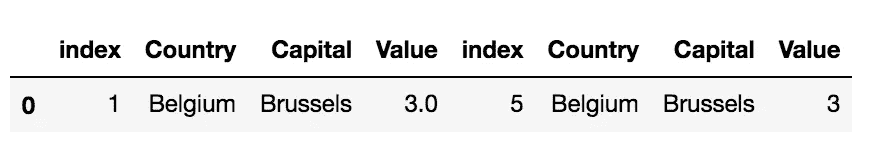

# 如何在 SQL 中操作熊猫数据帧

> 原文：<https://towardsdatascience.com/how-to-manipulate-a-pandas-dataframe-in-sql-7d1a1503f47?source=collection_archive---------13----------------------->

## 数据操作

## 这是一个现成的代码，包含一些使用 SQL 查询操作 Python Pandas 数据框架的技巧。


迈克尔·泽兹奇在 [Unsplash](https://unsplash.com?utm_source=medium&utm_medium=referral) 上拍摄的照片

在本教程中，我展示了一些使用 SQL 查询操作 Python Pandas 数据帧的技巧。具体来说，我涵盖以下主题:

*   缺失值(移除和替换)
*   数据帧排序
*   删除重复项
*   合并两个数据框架(并集和交集)

为了通过 SQL 查询来查询 Pandas 数据帧，我使用了`sqldf` Python 库，可以通过下面的命令安装这个库:`pip install sqldf`。

# 加载数据集

我导入了`pandas`库并读取了一个简单的数据集，其中包含每个国家的首都和一个通用字段，称为 Value。

```
import pandas as pddf = pd.read_csv('../../Datasets/capitals1.csv')
df.head()
```



作者图片

现在我导入`sqldf`库。

```
import sqldf
```

# 缺少值

缺失值是数据集中不可用的值。例如，丢失的值可以表示为`NULL`、`None`或`NaN`。可以采用不同的策略来处理缺失的价值观。在本教程中，我演示了两种技术:

*   删除缺少的值
*   替换丢失的值。

# 删除缺少的值

删除缺失值包括删除某一列中缺失值的所有行。在我们的示例数据集中，索引为 3 的行缺少一个值。



作者图片

我定义了一个查询，它只选择`Value`列不为空的行:

```
query = """
SELECT *
FROM df
WHERE Value IS NOT NULL;
"""
```

现在我可以通过`run()`函数运行查询。

**如果查询包含** `**SELECT**` **语句，则** `**run()**` **函数返回新的 dataframe。相反，如果查询包含一个** `**UPDATE**` **语句，则更新原始数据帧。**

```
sqldf.run(query)
```



作者图片

# 替换丢失的值

处理缺失值的另一个策略是用固定值替换它们。例如，固定值可以是平均值。据我所知，`sqldf`库不支持嵌套查询，因此我必须运行两个独立的查询，一个检索平均值，另一个替换丢失的值。

首先，我计算列`Value`的平均值:

```
query = """
SELECT AVG(Value) as AVG
FROM df
"""avg = sqldf.run(query)['AVG'][0]
```

然后我更新数据集:

```
query = """
UPDATE df
SET Value = {}
WHERE Value IS NULL;
"""sqldf.run(query.format(avg))
df.head()
```



作者图片

# 订单数据框架

可能发生的情况是，为了建立一个最终的可视化，必须订购一个数据帧。因此，我可以利用 SQL 提供的`ORDER BY`语句:

```
query = """
SELECT *
FROM df
ORDER BY Value DESC;
"""sqldf.run(query)
```



作者图片

# 删除重复项

SQL 的强大功能也可以用来删除重复项。这可以通过构建查询来实现，该查询选择不同的列:

```
query = """
SELECT DISTINCT Country, Capital, Value
FROM df;
"""sqldf.run(query)
```



作者图片

# 合并两个数据帧

数据集合并包括合并两个数据帧。SQL 是一种非常强大的方法，可以毫无困难地合并数据集。

# 联盟

两个数据帧之间的联合操作的结果包含两个数据集的所有行。为了执行 union，我加载了一个额外的数据帧`df2`，称为`capitals2.`，它与前面的类似。附加数据帧`df2`仅包含一个与`df`重叠的行。

```
df2 = pd.read_csv('../../Datasets/capitals2.csv')
df2.head(len(df2))
```



作者图片

两个数据帧的联合可以通过以下查询实现:

```
query = """
SELECT Country, Capital, Value 
FROM df
UNION
SELECT Country, Capital, Value 
FROM df2
ORDER BY Value DESC
"""sqldf.run(query)
```



作者图片

请注意，union 操作已经删除了重复项。

# 交集

两个数据帧的交集只包含两个数据帧中包含的行。在 SQL 中，可以通过`INNER JOIN`操作进行交集:

```
query = """
SELECT *
FROM df
INNER JOIN df2
  ON df.Country = df2.Country AND df.Capital = df2.Capital;
"""sqldf.run(query)
```



作者图片

# 摘要

在本教程中，我展示了一些在 Pandas 数据帧上运行 SQL 查询的技巧。我只描述了一些查询的例子，但是你的幻想将比我的更有创造性！

本教程的完整代码可以从我的 [Github 库](https://github.com/alod83/data-science/tree/master/Preprocessing/SQLDF)下载。

如果你想了解我的研究和其他活动的最新情况，你可以在 [Twitter](https://twitter.com/alod83) 、 [Youtube](https://www.youtube.com/channel/UC4O8-FtQqGIsgDW_ytXIWOg?view_as=subscriber) 和 [Github](https://github.com/alod83) 上关注我。

# 相关文章

[](/how-to-sample-a-dataframe-in-python-pandas-d18a3187139b) [## 如何在 Python Pandas 中对数据帧进行采样

### 使用不同的技术对 Python Pandas 中的数据集进行采样的现成代码

towardsdatascience.com](/how-to-sample-a-dataframe-in-python-pandas-d18a3187139b) [](/how-to-load-huge-csv-datasets-in-python-pandas-d306e75ff276) [## 如何在 Python Pandas 中加载巨大的 CSV 数据集

### 可能会出现这样的情况，您的硬盘中有一个巨大的 CSV 数据集，占用了 4 或 5gb(甚至更多),而您…

towardsdatascience.com](/how-to-load-huge-csv-datasets-in-python-pandas-d306e75ff276) [](https://medium.com/geekculture/the-top-25-python-libraries-for-data-science-71c0eb58723d) [## 面向数据科学的 25 大 Python 库

### 你一生中至少应该尝试一次的 Python 库列表。

medium.com](https://medium.com/geekculture/the-top-25-python-libraries-for-data-science-71c0eb58723d)