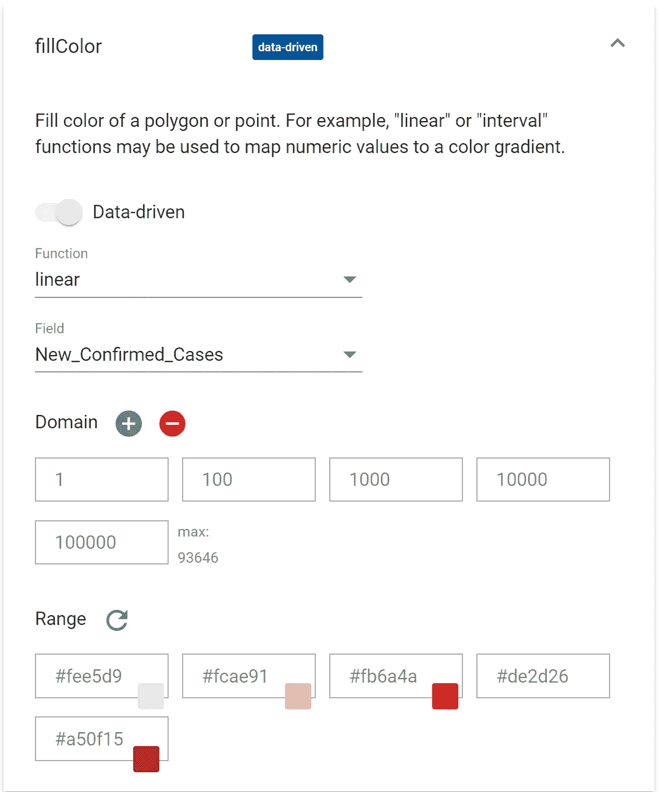
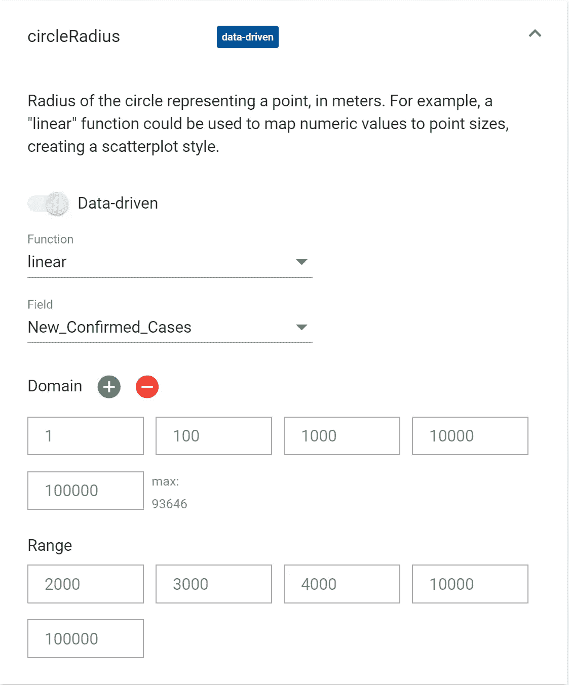
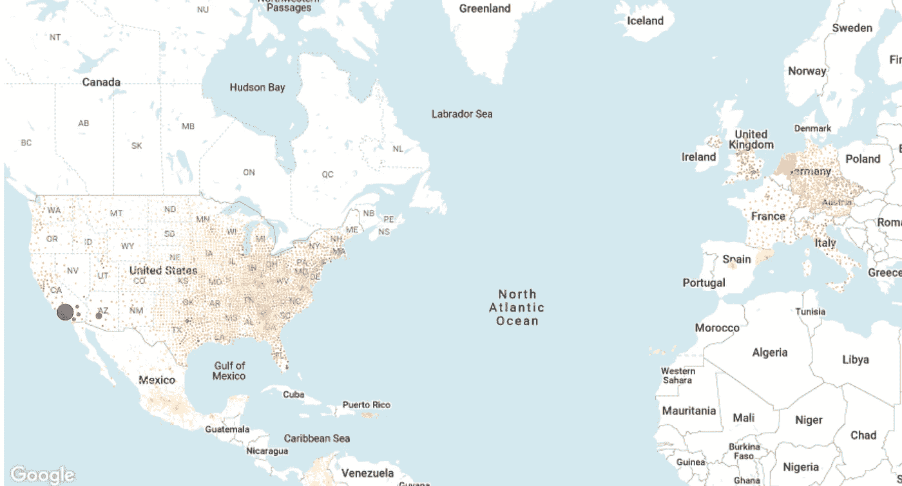

# 如何在几分钟内绘制出新冠肺炎在全球的传播图

> 原文：<https://towardsdatascience.com/how-to-map-the-spread-of-covid-19-globally-in-minutes-baa2e18d25e5?source=collection_archive---------55----------------------->

## 使用 BigQuery GeoViz 在 20 分钟内实现数据可视化

## 使用 BigQuery GeoViz 快速可视化新冠肺炎感染的指南


在 [Unsplash](https://unsplash.com?utm_source=medium&utm_medium=referral) 上[摄影](https://unsplash.com/@j_b_foto?utm_source=medium&utm_medium=referral)拍摄的照片

## 介绍

一张图胜过千言万语。请原谅这里的陈词滥调，但是没有什么时候比当你试图向非技术观众阐述数据发现时更重要了。许多人不希望看到一页塞满了数字。简洁的数据视觉效果可能是让你的观点被理解的区别，也可能是让你的听众厌倦和茫然的凝视的区别。

在这篇文章中，我将向你展示如何使用 Google BigQuerie 的 GeoViz 工具来可视化新冠肺炎的全球传播。这种类型的可视化可以用多种方式来完成，我发现 GeoViz 既快又直观。

在这篇文章结束时，你将已经创建了一个地图，显示了过去 7 天全球新新冠肺炎感染情况。

## 数据

我们将使用通过 BigQuery 的[公共数据集程序](https://console.cloud.google.com/marketplace/browse?filter=solution-type:dataset&_ga=2.151389305.1564136408.1609780247-1478613759.1609779590&_gac=1.262901502.1609864558.CjwKCAiAudD_BRBXEiwAudakX-Cmyx2D1SlOxVQzKCrDAlOPwpWSAKny1FYiAycblwyLAK_y-yZ4nhoC7fQQAvD_BwE&pli=1)获得的新冠肺炎公共数据集。这些数据集可以免费使用，涵盖了从医疗保健到金融的各种行业。谷歌已经将新冠肺炎的数据在短时间内免费提供给 BigQuery 进行访问和分析，以帮助研究

## **先决条件！**

在构建数据可视化之前，您需要做两件事…

1.  你需要在谷歌云平台(GCP)上开一个账户。您可以从这里免费开始使用
2.  您需要创建一个项目。你可以通过遵循这些[指南](https://cloud.google.com/appengine/docs/standard/nodejs/building-app/creating-project)来做到这一点。**重要！请记下你的项目 ID，你将需要它来生成你的可视化。**

好了，让我们开始吧！

## **步骤 1:设置您的 BigQuery GeoViz 环境**

从 GCP 仪表板导航到 **Google BigQuery** ，打开 BigQuery 控制台。


作者图片

在**资源**下，导航到**big query-public-data**>**covid 19 _ open _ data _ eu**，打开 **covid19_open_data** 。您将看到一个数据集，您可以通过按下**预览**进行浏览。

点击位于 BiGQuery 控制台右侧的**导出**，然后点击**使用 GeoViz 进行浏览**。

这将在浏览器的新窗口中打开 GeoViz studio。点击**授权**按钮，按照步骤完成必要的权限授予。您需要这样做，以允许 GeoViz 在 Google BigQuery 中查看和管理您的数据。

一旦你这样做了，导航回 GeoViz 工作室。在**查询**下输入你的**项目 ID。**

## 第二步:产生你的观想

在您的**项目 ID** 下的空白处，输入以下 SQL 查询:

```
SELECT
    country_name,
    subregion1_name,
    subregion2_name,
    ST_GeogPoint(longitude, latitude) AS WKT,
    sum(new_confirmed) as  New_Confirmed_Cases
  FROM 
    `bigquery-public-data.covid19_open_data_eu.covid19_open_data` 
  WHERE 
    date BETWEEN DATE_ADD(CURRENT_DATE(), INTERVAL -7 DAY) AND CURRENT_DATE() AND
    new_confirmed IS NOT NULL AND
    subregion1_name IS NOT NULL AND
    subregion2_name IS NOT NULL
  GROUP BY 
   country_name, subregion1_name, subregion2_name, longitude, latitude
```

该查询汇总了自运行之日起最近 7 天内所有新确诊的新冠肺炎病例。它跨越由经度和纬度定义的空间点来实现这一点。输入查询后，点击**运行。**点击**显示结果可以看到结果。**

当你满意时，导航到**样式**来改变图上点的外观。您可以编辑样式，以便给定点反映它所代表的数据。例如，较大的点表示较高数量的新冠肺炎病例。

下面的图片是帮助你编辑风格的指南。摆弄设置，直到你找到你喜欢的东西。一旦你满意点击**应用样式**，你可能需要通过放大来调整你的地图的分辨率，但是你应该有一个工作的可视化。



作者图片



作者图片

如果我的指示已经很清楚了，你应该有一个类似这样的地图:



作者图片

这是我之前准备的。它是交互式的，所以你可以点击每一个点来深入了解新冠肺炎在任何地方的感染情况。

[](https://www.linkedin.com/in/john-adeojo/) [## John Ade-Ojo -数据科学|技术|银行和金融

### 查看 John Ade-Ojo 在全球最大的职业社区 LinkedIn 上的个人资料。约翰的工作列表上有 6 份工作…

www.linkedin.com](https://www.linkedin.com/in/john-adeojo/)