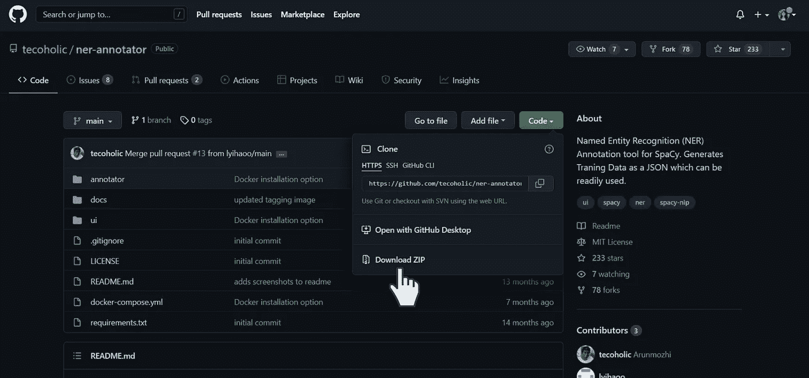
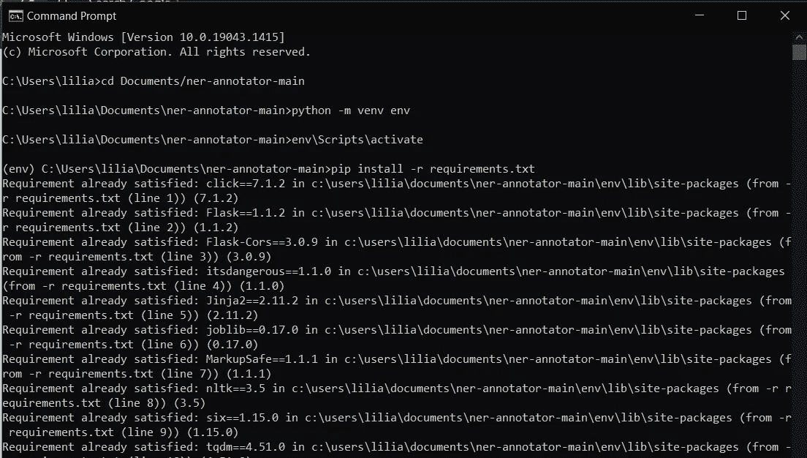
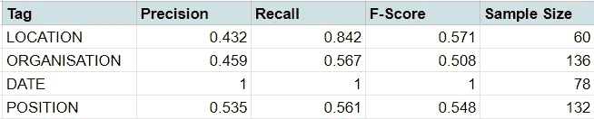
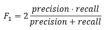

# 如何大量识别重复出现的文本特征

> 原文：<https://towardsdatascience.com/how-to-mass-identify-recurring-textual-features-e3e98c4b0309?source=collection_archive---------18----------------------->

## 当你为西班牙语、英语等培训一名 NER 模特时，要知道你真正在做什么。使用空间


图片作者。

假设你有一堆短信。文本中有人名、地名、组织、日期、职位等。我们称这些实体为一般实体。通过阅读，你可以知道哪些单词组(记号)代表了每个实体，但是你不希望自己去识别所有的单词，尤其是当你有成百上千的页面需要浏览的时候。这根本不是对你时间的有效利用。

> **命名实体识别(NER):** 一种识别代表特定实体(如个人、组织、品牌、地点)的词组的方法。

你可以使用现成的模型，比如 [spaCy](https://spacy.io/api/entityrecognizer) ，它有一个优秀的英语 NER 模型，但是对于其他语言(在我的用例中是哥伦比亚西班牙语)并不十分准确。该模型未能识别我所关心的实体。如果您在寻找使用不太流行的语言的小众实体，可能会遇到同样的问题。

这篇文章是为你写的，如果你:

*   有原始文本可以处理
*   当前 NER 模型的精确度越来越低
*   是一个完全的初学者与培训 ner 模型

这是我发现的改进 spaCy 现有 NER 模型的最省时、最有利于协作的方法。如果你正在和一个不是特别懂技术的人一起做一个数字人文(或任何)项目，这个工作流程会有所帮助。

在你们任何一个人开始模特训练冒险之前，我应该先回答你们脑海中的第一个问题:

# 这会有多难？

你要知道的第一件事是，训练一个模特是**耗时又繁琐的**。你投入的时间大约与你得到的准确度成正比。这就是为什么普通实体的英语模型更准确——它们有更多的训练数据。

简单地说，训练数据告诉模型什么定义了一个实体。你在一个文本块中标注了成百上千、上百万个实体，模型根据机器学习(ML)算法选择模式(关于这一点的更多信息，请参见另一篇文章)。您提供的训练数据的数量和种类越多，ML 算法就越能准确地识别这些模式。

给 1，069 个实体做标记花了我大约 4 个小时，因为我对西班牙语只有基本的了解，对哥伦比亚也不熟悉。[这些数据够吗？](https://machinelearningmastery.com/much-training-data-required-machine-learning/)这取决于:

*   期望的精度水平(你愿意接受模型的什么样的误差水平？)
*   你的模型的复杂性(你是在寻找特定的东西还是计算机难以识别的东西？)
*   现有数据量(您是在优化模型还是从头开始训练模型？)
*   你的训练数据的质量(是否有各种各样的文本？这些单词出现在不同的上下文中吗？)

最终，一个经验的测试方法是使用测试数据来验证你的结果，我将在下面解释。

第二件事是编码技巧。如果你对 Python 有一个**的基本了解，我相信这个指南会被证明是容易理解的。老实说，如果您不习惯使用 terminal 和 spaCy，这需要一点时间来适应，但是花一个小时来做这个设置，只会变得更容易。让我们开始吧！**

# 设置 NER 注释器

Arunmozhi 创造了我发现的最方便的 tagger。下载文件并将其解压缩到一个方便的位置，如 Documents 文件夹。



点击链接[https://github.com/tecoholic/ner-annotator](https://github.com/tecoholic/ner-annotator)下载 zip。图片作者。

然后，我们将遵循 GitHub 上给出的说明，但我会提供更多考虑到使用终端的初级经验的详细指导。(一开始我真的很反对学习使用终端，但是几次之后，我发现它并没有那么糟糕！不要让这个影响你。)

1.  打开命令提示符/终端
2.  *建立虚拟环境。*使用`cd Documents/ner-annotator-main`导航至包含该程序的文件夹。`cd`代表更改目录，并告诉终端您希望它查找的位置。
3.  *使用`python -m venv env`在 Python* 上创建虚拟环境。你应该在`ner-annotator-main`文件夹中看到一个名为`env`的文件夹。
4.  *激活虚拟环境。*我们想导航到`activate`文件。根据您的操作系统，您需要查看`env`中的文件夹，看看它在哪里。例如，在使用 Windows 时，我在终端输入了`env\Scripts\activate`。
5.  *下载依赖关系*。这些都是程序需要的库和文件，写在主文件夹的文本文件中。在终端中键入`pip install -r requirements.txt`。
6.  运行你的后端服务器。键入`python annotator/server.py`进入端子。
7.  打开另一个终端启动另一个服务器。导航到`ui`文件夹。你可以输入`cd Documents\ner-annotator-main\ui`
8.  `yarn install`将下载软件包管理器，它将处理 tagger 程序的前端。
9.  `yarn serve`将启动程序。
10.  在浏览器中打开 [http://localhost:8080](http://localhost:8080/) 打开 tagger。

> **虚拟环境:**电脑上的隔离空间，用于下载特定程序所需的所有文件，而不会与其他程序所需的文件发生冲突。



完成第 5 步后，您的终端应该是这样的。图片作者。

厉害！下次运行时，您只需执行步骤 4、6、7、9 和 10。

# 我们来列举一些实体吧！

上传完你的。txt 文件，您可以开始标记，但您应该等待一秒钟。首先，你需要确定你想要什么标签，以及加入每个标签俱乐部的标准。你不想回去重做所有的标签！

以下是一些你应该考虑的问题:

1.  你有兴趣提取什么信息？
2.  哪些令牌可能难以标记？例如,“联合国日内瓦会议”会被认为是属于“组织”或“地点”或“事件”的标签吗？记住:你不能双重标记一个实体！

完成后，您的注释将保存在一个. json 文件中。


标记单词的外观示例。图片来自 [Arunmozhi](https://github.com/tecoholic/ner-annotator) 。

# 培训 NER 模型

将训练数据加载到 Python 中。

```
import json
with open('training_data.json', 'r') as f:
  DATA = json.load(f)["annotations"]
```

分离出 20%的数据作为你的测试数据，这样我们就可以验证更新后的 NER 模型有多准确。只要你有足够的数据进行测试，你可以随意改变百分比。

```
import numpy as np
N = len(DATA)# Randomly select 20% of the data for testing
test_idx = np.random.randint(N, size=N//5)
TEST_DATA = np.array(DATA)[test_idx].tolist()# Leave the remaining 80% as training data
train_idx = list(set(np.arange(N))-set(test_idx))
TRAIN_DATA = np.array(DATA)[train_idx].tolist()
```

我从 [Shrivarsheni 的文章](https://www.machinelearningplus.com/nlp/training-custom-ner-model-in-spacy/)中学习了如何实现 spaCy 培训管道，所以请阅读它以了解更多细节！我确实纠正了他的一些不适合我的代码，所以希望这个补充对你有帮助。

本质上，下面的代码建立在 spaCy 的 NER 模型上，并更新了令牌的方式:

1.  `trf_wordpiecer`:已定义
2.  `trf_tok2vec`:转换成矢量(数值表示)
3.  `ner`:已标记

根据你的训练数据。

```
# Load pre-existing spacy model
pip install spacy # Download the package if you haven't
import spacy
nlp=spacy.load('en_core_web_sm') # Spanish

# Getting the pipeline component
ner=nlp.get_pipe("ner")# Disable pipeline components you dont need to change
pipe_exceptions = ["ner", "trf_wordpiecer", "trf_tok2vec"]
unaffected_pipes = [pipe for pipe in nlp.pipe_names if pipe not in pipe_exceptions]# Import requirements
import random
from spacy.util import minibatch, compounding
from pathlib import Path
from spacy.training.example import Example# TRAINING THE MODEL
with nlp.disable_pipes(*unaffected_pipes):
  # Training for 30 iterations
  for iteration in range(30):
    # shuffling examples  before every iteration
    random.shuffle(TRAIN_DATA)
    losses = {}
    # batch up the examples using spaCy's minibatch
    batches = minibatch(TRAIN_DATA, size=compounding(4.0, 32.0, 1.001))
    for batch in batches:
      for text, annotations in batch:
        # create Example
        doc = nlp.make_doc(text)
        example = Example.from_dict(doc, annotations)
        nlp.update(
                 [example],
                 drop=0.5, # dropout - make it harder to memorise data
                 losses=losses,
                 )
print("Losses", losses)
```

损失是底层神经网络用来确定模型在 NER 表现如何的指标。在另一篇文章中有更多关于这方面的内容！目前，最重要的是模型的目标是将损失最小化。

## 模型表现如何？

毕竟，我们希望 NER 模型可以帮助大规模识别所需的实体。这一步有助于确定我们对模型获得正确标签的能力有多大的信心。

```
from spacy.scorer import Scorer
from spacy.tokens import Docdef evaluate(ner_model, examples):
  scorer = Scorer()
  example = []
  for input_, annot in examples:
    pred = ner_model(input_)
    temp = Example.from_dict(pred, annot)
    example.append(temp)
    scores = scorer.score(example)
  return scoresresults = evaluate(nlp, TEST_DATA)
print(results)# Calculate sample size
from collections import Counter
ent = []
for x in TEST_DATA:
  ent += [i[-1] for i in x[1]['entities']]
print(Counter(ent))
```



我自己测试数据的结果。

精度显示所有标记的实体中有多少实体被正确标记。它显示了模型在辨别哪些实体属于某个标签时是多么敏感。回忆显示基于实际的标签，我们做了多少正确的。它显示了模型在挑选与标签相关的实体方面有多好。

例如，在带有“位置”标签的 60 个实体中，NER 模型正确地标记了其中的 84.2%(召回)。精确地说，在所有用“位置”标记的实体中，只有 43.2%的实体有“位置”标记。

如示例所示，在一项指标上得分极高，而在另一项上却没有，这是一个不好的迹象。该模型在“位置”标签的精确度上得分很低，因为它无法区分不同的标签，即使它有相对较高的召回分数。以此类推，由于模型发射了更多的子弹，更多的子弹可能会落在正确的目标上，即使许多子弹没有击中。



只有两个类别(标签)的 F-1 分数公式。

我们使用 F 分数来平衡这些指标，F 分数是在只有两种标签的情况下由上面的公式给出的。在多类分类中，如在 NER 模型中，分数根据大小对每个标签进行加权，并在所有标签中取平均值。当精度和召回率为零时，最低分为 0，这意味着所有东西都被错误标记。当精确度和召回率完美时，最高分是 1，这意味着一切都被正确标记。

总而言之，我的更新模型在确定所有“日期”方面做得非常好，但在所有其他标签方面做得很差，只捕捉到了大约一半。

# 使用模型

恭喜你！所有的努力都有了回报。现在您可以保存您的模型，并在您的下一个项目中使用它。

```
# Save the  model to directory
output_dir = Path('/content/')
nlp.to_disk(output_dir)# Use the model
output_dir = Path('/content/')
nlp = spacy.load(output_dir)
```

# 我们可以做得更好！！(改进模型)

对于不精通技术的人来说，设置 NER 注释器可能具有挑战性。这里有一个(尽管有点不完美)方法，通过使用 Google Sheets 的更多协作来添加更多的训练数据。

1.  创建一个带有“实体”和“标签”列的谷歌表
2.  将数据验证添加到“标签”列，这样所有标签将统一显示
3.  按照这篇 [TDS 文章](/how-to-integrate-google-sheets-and-jupyter-notebooks-c469309aacea)中的说明访问电子表格数据。
4.  当将`table`转换成熊猫数据帧时，使用`train_df = pd.DataFrame(table[1:], columns=table[0])`
5.  然后用下面的代码将它添加到您的训练数据中。

```
# Add training data from Google Sheets
for i in train_df.index:
  TRAIN_DATA.append([
      train_df.ENTITY[i],
      {
        'entities': [
          [0, len(train_df.ENTITY[i]), train_df.TAG[i]]
        ]
      }])
```

现在，你可以与你的项目合作伙伴分享谷歌表单，以纠正他们在 NER 模型中看到的错误，并且你可以将正确的标记硬编码到模型中。

然而，这种强力方法的主要缺陷是它没有包含单词嵌入。该模型基于句子或段落中的上下文来确定哪个字符序列是标记，以及哪个标记属于哪个标签。当我们按原样将令牌输入到模型中时，它并不知道令牌在不同的上下文中会如何变化。

然而，我希望这篇文章已经给了你一个训练你自己的 NER 模型的起点！我还希望理解 NLP 模型令人眼花缭乱的背后的困难，能够更好地理解这些刻板模型中的工作。

> 如果你知道一个更省时和/或协作友好的方法来训练 NER 模型，我很乐意学习更多！

*注意:这篇文章并没有深入到 spaCy 所做的所有酷的幕后工作。我想在另一篇文章中公正地阐述这些概念，所以请密切关注！*