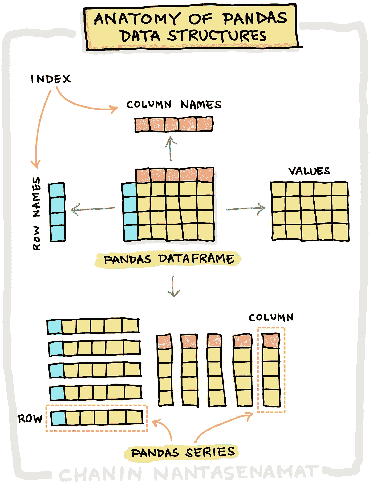
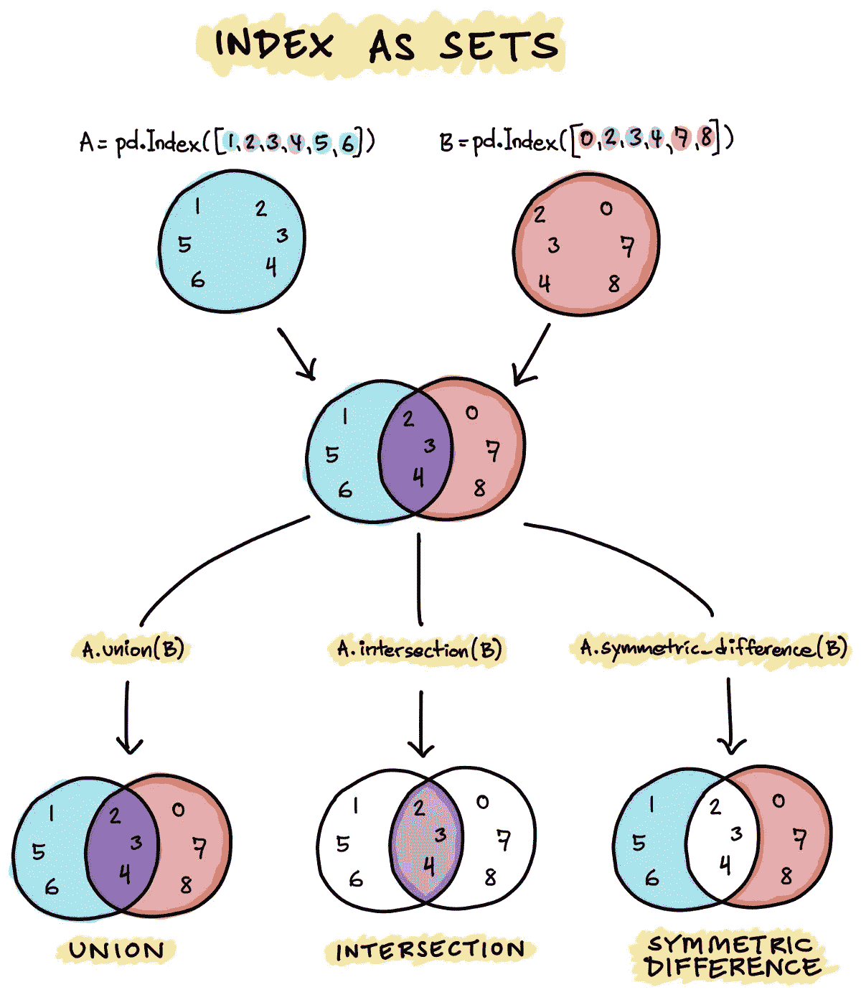
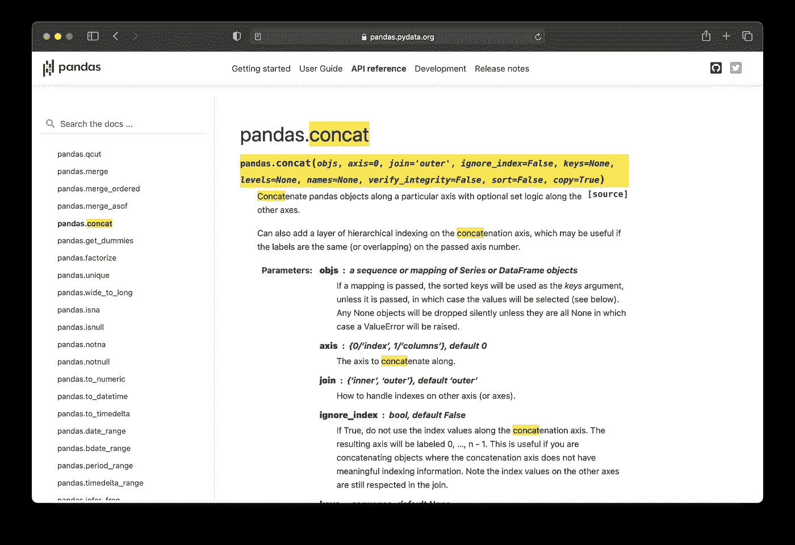
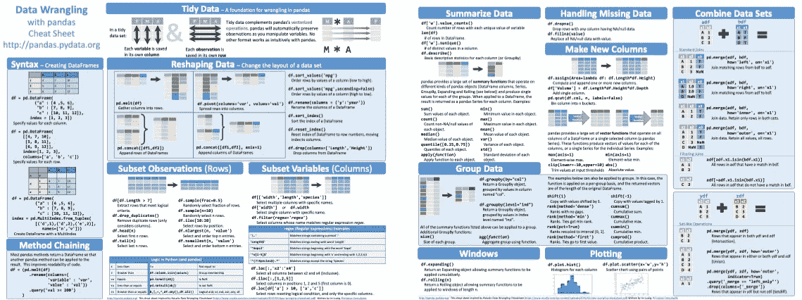
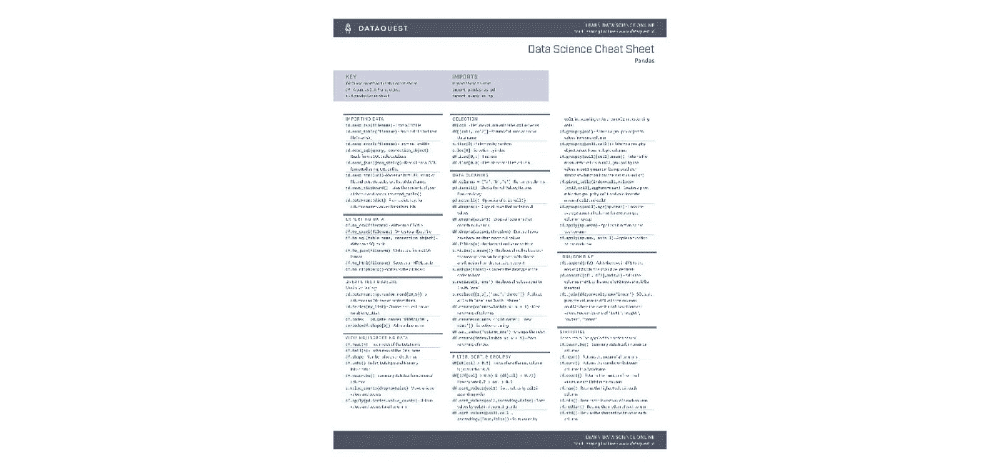
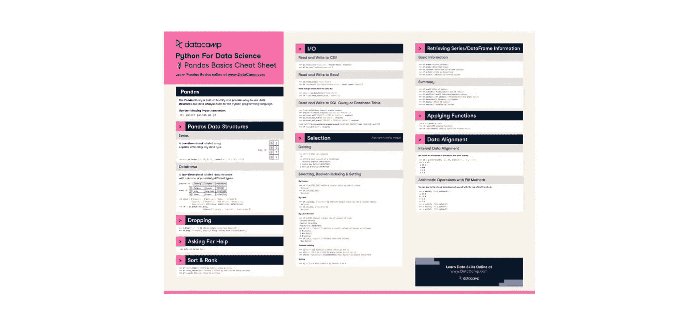
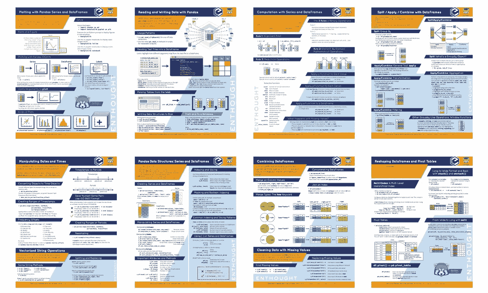
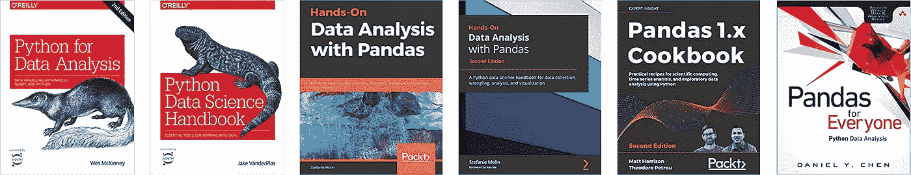

# 如何掌握熊猫进行数据科学

> 原文：<https://towardsdatascience.com/how-to-master-pandas-for-data-science-b8ab0a9b1042?source=collection_archive---------0----------------------->


使用来自 [envato elements](https://1.envato.market/c/2346717/628379/4662) 的 [mir_design](https://elements.envato.com/user/mir_design) 的图像创建(经许可)。

## [入门](https://towardsdatascience.com/tagged/getting-started)

## 这是数据科学需要的基本熊猫

Pandas 是一个开源的 Python 库，允许处理表格数据(*即*探索、清理和处理)。该术语源于计量经济学术语 *panel data* 并由此产生**PAN(**El)-**DA(**ta)-**S**。

在高层次上，Pandas 在处理行和列时非常像一个电子表格(比如 Microsoft Excel 或 Google Sheets)。Pandas 是任何数据科学工作流的支柱库之一，因为它允许您执行数据的处理、争论和管理。这一点尤为重要，因为许多人认为数据预处理阶段占据了数据科学家 80%的时间。

在本文中，我们将探索掌握 Pandas 所需的基本知识，以便开始学习数据科学。正如您将看到的，Pandas 是一个功能丰富的库，甚至整个 [*Pandas 文档*](https://pandas.pydata.org/docs/pandas.pdf) 都可能是一个挑战，因为它多达 3411 页(在撰写本文时)！

# 1.对数据争论的需求

George Fuechsel 在计算机科学和软件工程中经常使用的一个流行短语是:

> “垃圾进，垃圾出。”
> 
> —乔治·富希塞尔，IBM 程序员

它明确指出，无论一个程序有多好，如果输入的质量很差，生成的输出将是不相关的。这在数据科学中有很好的通用性，因为模型只有在给出它的输入数据的情况下才是好的。因此，数据清理有助于以这样一种方式处理数据，即数据中没有丢失的值，数据结构和值具有一致性，等等。

简而言之，如果您正在处理表格数据，那么 Pandas 就是您处理数据所需的首选库。

# 2.我们为什么需要熊猫？

下图总结了数据科学生命周期的典型工作流程。


数据科学生命周期。作者绘制。

一旦收集了数据，它们可能会存储在单独的数据库中，并且必须检索来自异构数据源的这些数据的汇编，以便在数据科学项目中使用。数据科学项目中的大部分工作可能会花费在数据清理阶段以及探索性数据分析上，因为这两个阶段都有助于提供高质量的数据集(即，在密集的数据清理之后)并提供对数据的高级理解，这是制定假设的良好起点，随后可以通过探索性数据分析以及机器学习模型构建来验证假设。

Pandas 库具有大量功能，允许您执行从原始数据的第一次输入、清理和转换到最终整理形式的任务，以便产生高质量的数据(即，希望没有缺失值和错误)，通过探索性数据分析和机器学习进行进一步的假设测试和验证。

# 3.熊猫基础知识

## 3.1.熊猫物品

熊猫允许我们使用表格数据集。让我们来看看熊猫的基本[数据结构，它由以下三种类型组成(*即*，前两种是数据结构，后者作为参考点):](https://pandas.pydata.org/pandas-docs/stable/user_guide/dsintro.html)

1.  系列
2.  数据帧
3.  索引

在下图中，我总结了熊猫数据结构的基本结构。简而言之，您将看到熊猫数据帧和熊猫系列被标记为数据(*，即*，它有行名和列名)。您还会看到，Pandas DataFrame 是 Pandas 系列的集合(*即*单独的列和行)。



熊猫数据结构剖析。作者绘制。

## 3.2.系列

熊猫 ***系列*** 是一个一维数组，与 NumPy 数组非常相似，但具有标记功能(*即*轴标签或也称为 ***索引*** )。一个系列可以容纳一个整数、浮点数、字符串、python 对象等。在高层次上，可以将系列视为 Microsoft Excel 中的一列。

## 3.3.数据帧

一只熊猫 ***DataFrame*** 是一个二维数组。在高层次上，数据帧可以被认为是 Microsoft Excel 中的电子表格(*即*M×N 矩阵，其中 M 表示行，N 表示列)。

## 3.4.索引

Pandas 中的 ***索引*** 是 Series 和 DataFrame 对象的固有属性，用作关于对哪些行和/或列执行操作(即对于 DataFrame)或对 Series 中的特定元素执行操作的参考点。默认情况下，Pandas 自动分配从 0 开始的索引号来表示行号或列号(*即*如果没有明确定义)。

索引有两个主要特征:(1)是一个不可变的数组，(2)是一个有序的集合。

***3.4.1。*不变**

简单地说，不可变意味着我们不能通过简单的赋值(*即*像我们对数据帧的任何其他行所做的那样)来轻易地修改索引值，如下所示

```
index_value = pd.Index([0,1,2,3,4,5])
index_value[0] = 10
```

这将产生一个错误:

```
TypeError: Index does not support mutable operations
```

这样做的好处是，我们可以放心，索引将在编码过程中保持完整。然而，如果我们想给索引命名，可以通过`pd.Index.rename()`函数来完成。

**3 . 4 . 2*。数组***

作为一个数组，我们可以通过执行简单的切片来检索索引中的特定值，如下所示:

```
index_value = pd.Index([0,1,2,3,4,5])
index_value[0]
```

这将提供:

```
0
```

**3 . 4 . 3*。*集**

Pandas 索引的工作方式非常类似于`set`数据结构，允许您对其应用集合操作。还记得我之前提到的索引可以作为你的系列和数据框架的参考点吗？



作为集合索引。作者绘制。

因此，您可以根据索引比较和连接(*即*交集、并集、差集、对称差集、连接和追加)Pandas 系列和 DataFrame。

例如，您可以利用 Pandas index 来找出 2 个系列或 2 个数据帧之间哪些元素是相同的，哪些是不同的。还在迷茫？一个很好的例子是维恩图，它允许你检索前一句中提到的相同或不同的元素。

# 4.熊猫的使用案例

在这一节中，我们将从较高的层面来了解 Pandas 提供的一些功能，您可以将这些功能用于您的数据科学项目。

简而言之，这里列出了您可以使用 Pandas 执行的常见任务:

*   创建数据对象
*   加载和保存数据
*   数据检查
*   缺失数据
*   索引、选择、添加、修改和删除数据
*   数据过滤
*   合并和联接数据
*   重塑和透视数据
*   分组数据
*   排序数据
*   汇总统计数据
*   数据可视化
*   时序数据
*   字符串和分类数据

## 4.1.探索性数据分析的熊猫

现在让我们来看看熊猫在进行典型的探索性数据分析(EDA)。

本质上，EDA 让我们在被分析的数据集的高层次上有一个总体的理解。这可能有助于我们提出假设，以便在后续的统计分析和机器学习模型构建工作中进行探索(见下一节)。

*   从 CSV 文件(`pd.read_csv()`)加载数据。将其赋给一个变量，比如`df`。
*   通过`df.shape`查看数据的维度大小。
*   通过`df.head()`或`df.tail()`浏览数据的前几行或后几行，以获得数据的要点(*即*我们有哪些变量及其数据类型，如分类或数值)。
*   查找缺失值(*，即*至`pd.isna(df)`)。决定是删除缺失值还是估算缺失值(*即*用 0 等任意值替换或用列的平均值或中值替换)。
*   计算汇总统计(*例如*最小值、最大值、平均值、中值、标准差等)。)通过`df.describe()`对整个数据或分层数据(*，即*根据特定标准对数据进行分组，然后计算汇总统计数据；*例如:*通过如下所示的 groupby 函数，按类别标签对数据进行分组，并为每个类别计算汇总统计数据:`df.groupby('name_of_variable_used_as_criteria').describe()`。
*   创建一些基本的数据可视化(*，如*条形图，箱线图，热图，直方图等。)用于整个数据或通过`df.plot.bar()`功能用于分层数据。
*   写一份报告，总结我们从这次 EDA 分析中获得的一些初步发现和见解。这也将帮助我们弄清楚正在分析的数据是否足够，或者我们是否需要收集额外的数据。

## 4.2.熊猫是统计分析和机器学习的先驱

如前所述，从 EDA 分析中获得的一些初步见解是一个很好的起点，可以帮助我们为更深入的统计分析和机器学习模型构建指明正确的方向。

统计分析可能需要对数据的不同子集进行比较，这些子集可能是先前通过经由 Pandas 执行 ***groupby*** 操作而获得的。Python 中一个流行的统计包是 [*statsmodels*](https://www.statsmodels.org/) 库，还有一个新兴的非常健壮的库叫做 [*pingouin*](https://pingouin-stats.org) ，我在我的 YouTube 频道上的视频 [*中回顾了如何使用 Pengouin 库*](https://youtu.be/zqi51Wu5qC0) 在 Python 中轻松执行统计分析。

现在让我们来看看熊猫如何帮助我们建立机器学习模型。

*   从 CSV 文件(`pd.read_csv()`)加载数据。
*   通过`df.shape`查看数据的维度大小。
*   通过`df.head()`或`df.tail()`功能检查第一行或最后几行来检查数据。
*   寻找丢失的值(*，即*通过`pd.isna(df)`)。决定是删除缺失值还是估算缺失值(*即*用 0 等任意值替换或用列的平均值或中值替换)。
*   将内容从`df`分配到`X`和`Y`变量，以便为通过 scikit-learn 库建立模型做准备。这可以按如下所示执行:

```
X = df.drop(['Y_variable'], axis=1)
Y = df['Y_variable]
```

*   然后将`X`和`Y`变量用作 scikit-learn 库的输入数据，用于如下数据分割:

```
X_train, X_test, Y_train, Y_test = train_test_split(X, Y, test_size=0.2, random_state=42)
```

*   然后，通过随机森林，在生成的训练和测试数据上训练机器学习模型，随后评估它们的模型性能度量，如下所示:

```
from sklearn.ensemble import RandomForestClassifier*# 1\. Define classifier*
rf = RandomForestClassifier(n_estimators=10)*# 2\. Train model* rf.fit(X_train, y_train)

*# 3\. Make predictions*
y_train_pred = rf.predict(X_train)
y_test_pred = rf.predict(X_test)

*# 4\. Training set performance**# 4.1\. Calculate Accuracy*
rf_train_accuracy = accuracy_score(y_train, y_train_pred) *# 4.2\. Calculate MCC*
rf_train_mcc = matthews_corrcoef(y_train, y_train_pred) *# 4.3\. Calculate F1-score*
rf_train_f1 = f1_score(y_train, y_train_pred, average='weighted') 

*# 5\. Test set performance**# 5.1\. Calculate Accuracy* rf_test_accuracy = accuracy_score(y_test, y_test_pred) *# 5.2\. Calculate MCC* rf_test_mcc = matthews_corrcoef(y_test, y_test_pred)*# Calculate F1-score* rf_test_f1 = f1_score(y_test, y_test_pred, average='weighted')
```

[](/how-to-build-your-first-machine-learning-model-in-python-e70fd1907cdd) [## 如何用 Python 构建你的第一个机器学习模型

towardsdatascience.com](/how-to-build-your-first-machine-learning-model-in-python-e70fd1907cdd) 

*   也可以执行超参数调整，以便通过搜索最佳超参数集来提高模型性能。

[](/how-to-tune-hyperparameters-of-machine-learning-models-a82589d48fc8) [## 如何调整机器学习模型的超参数

### 使用 Scikit-learn 的分步教程

towardsdatascience.com](/how-to-tune-hyperparameters-of-machine-learning-models-a82589d48fc8) 

# 5.学习资源

## 5.1.熊猫官方文件

正如在介绍性段落中简要提到的，整个熊猫文档由 3411 页组成。具体来说，文档由 4 部分组成:(1)[](https://pandas.pydata.org/docs/getting_started/index.html#getting-started)*，(2) [*用户指南*](https://pandas.pydata.org/docs/user_guide/index.html#user-guide) ，(3) [*API 参考*](https://pandas.pydata.org/docs/reference/index.html#api) ，(4) [*开发者指南*](https://pandas.pydata.org/docs/development/index.html#development) 。*

*官方的 [*Pandas 用户指南*](https://pandas.pydata.org/pandas-docs/stable/user_guide/index.html) 提供了一个全面的文档，其中有大量的例子来解释每个功能是如何使用的。这些用户指南被方便地组合在一起，用于涵盖广泛主题的常见任务。如果你多少知道你想做什么，这是特别有用的。例如，如果你知道你想要更多关于如何在 Pandas 中选择数据的信息，那么你可以阅读关于 [*索引和选择数据*](https://pandas.pydata.org/docs/user_guide/indexing.html) 的指南。*

*如果你对一个特定的熊猫函数非常清楚，想要更多的信息，你可以深入到 API 文档中。如下图所示，您可以看到`pd.concat()`函数的所有输入参数，每个参数的含义以及如何使用它的例子。*

**

*显示感兴趣的特定函数的 API 文档的屏幕截图。*

## *5.2.小抄*

*下面是一份官方的、伟大的[熊猫小抄](https://pandas.pydata.org/Pandas_Cheat_Sheet.pdf)总结了熊猫的主要功能。这个熊猫小抄的灵感来自于 Rstudio 数据争论小抄。*

**

*普林斯顿顾问 Irv Lustig 制作的熊猫小抄。*

*DataQuest 制作的熊猫小抄有网页版和下载版。这些功能按任务方便地分组，如果您大致了解每个任务组或任务允许您做什么，这些功能将允许您快速实施。*

**

*由 DataQuest 制作的[熊猫小抄](https://www.dataquest.io/blog/pandas-cheat-sheet/)。*

*DataCamp 还创建了一个[熊猫备忘单](https://www.datacamp.com/community/blog/python-pandas-cheat-sheet)，总结了所有的功能，也是根据任务分组的。*

**

*DataCamp 制作的熊猫小抄。*

*Enthought 不仅在这个 [Pandas cheat sheet](https://www.enthought.com/wp-content/uploads/2019/09/Enthought-Pandas-Cheat-Sheet-1-Plotting-with-Series-and-DataFrames-v1.0.2.pdf) 中对 Pandas 的功能进行了分组，而且他们还在这个长达 8 页的 cheat sheet 中提供了示意图来帮助理解 Pandas 的各种操作。*

**

*Enthought 制作的[熊猫小抄](https://www.enthought.com/wp-content/uploads/2019/09/Enthought-Pandas-Cheat-Sheet-1-Plotting-with-Series-and-DataFrames-v1.0.2.pdf)。*

## *5.3.书*

*下面列出的所有书籍(除了杰克·范德普拉斯的《Python 数据科学手册》)都是关于熊猫的。*

**

*熊猫方面的书籍推荐。*

*   *[***用于数据分析的 Python:****与熊猫、NumPy 和 IPython 的数据争论(第二版)*](https://amzn.to/2UOUTc9)作者 Wes McKinney
    Wes McKinney 是熊猫的创造者，这本书的前一版是最早提供关于熊猫的书籍之一。除了 Pandas，其他对数据科学重要的库(如 NumPy，Matplotlib 和 scikit-learn)也包括在内。*
*   *[***Python 数据科学手册:*** *处理数据的基本工具*](https://amzn.to/3w8DYOC)
    作者 Jake Vander plas
    Jake Vander plas 的书中有一章专门讲述了熊猫，它提供了应用于数据科学的熊猫的基本知识的大量而简明的内容。*
*   *[***与熊猫一起动手进行数据分析:*** *一本关于数据收集、争论、分析和可视化的 Python 数据科学手册(第二版)*](https://amzn.to/3heLVwp)
    作者斯蒂芬妮·莫林
    这本书涵盖了数据科学过程的整个跨度，从与熊猫的数据争论到使用 Matplotlib 和 Seaborn 进行数据可视化，以及使用 Scikit-learn 构建模型。*
*   *[***Pandas 1.x 食谱:*** *使用 Python 进行科学计算、时间序列分析和探索性数据分析的实用食谱(第二版)*](https://amzn.to/3h57XTv)
    作者 Matt Harrison 和 Theodore Petrou
    这本书是第一部涵盖 Pandas 1.x 的书，几乎所有的内容都只关注 Pandas，并提供了一些数据可视化库(例如 Matplotlib 和 Seaborn ),用于从 Pandas 准备的数据的可视化。*
*   *[***熊猫为大家:*** *Python 数据分析*](https://amzn.to/2UaNAuW)
    作者陈琦程
    该书从数据处理和争论以及如何使用处理后的数据进行数据可视化和模型构建等方面对熊猫进行了全面的介绍。*

# *结论*

*Pandas 是任何数据科学工作流程中的核心组件。对于一个初学者来说，学习使用熊猫似乎是一项艰巨的任务，因为有大量可用的熊猫功能。希望这篇文章可以作为读者在使用 Pandas 进行数据项目时可以参考的蓝图。*

*总之，我们对 Pandas 库进行了高层次的概述，考虑了数据争论的重要性，了解了 Pandas 中的基本数据结构，考虑了 Pandas 用于探索性数据分析和机器学习模型构建的用例，并探索了可用的学习资源以了解更多关于 Pandas 的信息。*

# *公开*

*   *作为一名亚马逊员工，我可能会从合格购买中获利，这将有助于未来内容的创作。*

# *接下来读这些*

*   *[**数据科学如何掌握 Python**](/how-to-master-python-for-data-science-1fb8353718bf)
    *下面是数据科学需要的必备 Python**
*   *[**如何用 Python 构建 AutoML App**](/how-to-build-an-automl-app-in-python-e216763d10cd)
    *使用 Streamlit 库的分步教程**
*   *[**学习数据科学的策略**](/strategies-for-learning-data-science-47053b58c19f)
    *打入数据科学的实用建议**
*   *[**如何免费搭建一个简单的作品集网站**](/how-to-build-a-simple-portfolio-website-for-free-f49327675fd9)
    *不到 10 分钟从头开始的分步教程**

## *✉️ [订阅我的邮件列表，获取我在数据科学方面的最佳更新(偶尔还有免费内容)!](http://newsletter.dataprofessor.org/)*

# *关于我*

*我是泰国一所研究型大学的生物信息学副教授和数据挖掘和生物医学信息学负责人。在我下班后的时间里，我是一名 YouTuber(又名[数据教授](http://bit.ly/dataprofessor/))制作关于数据科学的在线视频。在我做的所有教程视频中，我也在 GitHub 上分享 Jupyter 笔记本([数据教授 GitHub 页面](https://github.com/dataprofessor/))。*

*[](https://www.youtube.com/dataprofessor) [## 数据教授

### 数据科学、机器学习、生物信息学、研究和教学是我的激情所在。数据教授 YouTube…

www.youtube.com](https://www.youtube.com/dataprofessor) 

# 在社交网络上与我联系

✅YouTube:[http://youtube.com/dataprofessor/](http://youtube.com/dataprofessor/)
♇网站:[http://dataprofessor.org/](https://www.youtube.com/redirect?redir_token=w4MajL6v6Oi_kOAZNbMprRRJrvJ8MTU5MjI5NjQzN0AxNTkyMjEwMDM3&q=http%3A%2F%2Fdataprofessor.org%2F&event=video_description&v=ZZ4B0QUHuNc)(在建)
♇LinkedIn:[https://www.linkedin.com/company/dataprofessor/](https://www.linkedin.com/company/dataprofessor/)
♇Twitter:[https://twitter.com/thedataprof](https://twitter.com/thedataprof)/
♇Facebook:[http://facebook.com/dataprofessor/](https://www.youtube.com/redirect?redir_token=w4MajL6v6Oi_kOAZNbMprRRJrvJ8MTU5MjI5NjQzN0AxNTkyMjEwMDM3&q=http%3A%2F%2Ffacebook.com%2Fdataprofessor%2F&event=video_description&v=ZZ4B0QUHuNc)
♇github:[https://github.com/dataprofessor/](https://github.com/dataprofessor/)
ϝinsta*