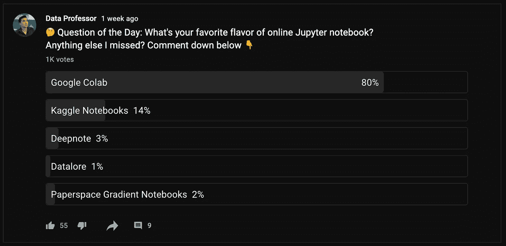

# 数据科学如何掌握 Python

> 原文：<https://towardsdatascience.com/how-to-master-python-for-data-science-1fb8353718bf?source=collection_archive---------2----------------------->


由 [envato elements](https://1.envato.market/c/2346717/628379/4662) 的 [alexacrib](https://elements.envato.com/user/alexacrib) 使用图像创建(经许可)。

## [入门](https://towardsdatascience.com/tagged/getting-started)

## 这是数据科学所需的基本 Python

那么你正在开始你的数据科学之旅，每个人都建议你从学习如何编码开始。您决定选择 Python，但现在却被大量可供您使用的学习资源弄得不知所措。也许你不知所措，由于分析瘫痪，你正在拖延学习如何用 Python 编码的第一步。

在本文中，我将作为您的向导，带您探索掌握 Python 所需的最基本的知识，以便开始学习数据科学。我会假设你以前没有编码经验，或者你可能来自非技术背景。但是，如果您有技术或计算机科学背景，并且了解以前的编程语言，并且希望过渡到 Python，那么您可以使用本文作为高级概述来熟悉 Python 语言的要点。无论哪种方式，本文的目的都是引导您了解 Python 语言与数据科学的交集，这将帮助您迅速入门。

# *1。为什么是 Python？*

你可能会问的第一个(也是最著名的)问题是:

> 应该学什么编程语言？

在互联网上做了一些研究后，你可能会决定使用 Python，原因如下:

*   Python 是一种解释性的高级编程语言，具有可读性和易于理解的语法
*   Python 有丰富的学习资源
*   根据 Python 软件基金会和 JetBrains 进行的 [*Python 开发者调查 2020*](https://www.jetbrains.com/lp/python-developers-survey-2020/) ，Python 具有很高的通用性和多种用例
*   Python 有大量用于执行各种操作和任务的库
*   Python 是一种流行语言根据 [*TIOBE 索引*](https://www.tiobe.com/tiobe-index/python/) 和 [*栈溢出开发者调查*](https://insights.stackoverflow.com/survey/2020)
*   Python 是雇主非常追捧的技能

# 2.Python 的用例

你可能有的另一个问题是:

> Python 将如何帮助您的数据科学项目？

要回答这个问题，让我们考虑如下所示的数据生命周期。本质上有 5 个主要步骤，包括数据收集、数据清理、探索性数据分析、模型构建和模型部署。所有这些步骤都可以用 Python 实现，并且一旦编码，产生的代码是可重用的，因此可以重新用于其他相关项目。


数据科学生命周期。由作者绘制。

除了数据分析、数据科学和数据工程之外，Python 强大的多功能性允许它应用于无限的可能性，包括自动化、机器人、web 开发、web 抓取、游戏开发和软件开发。此外，Python 几乎被用于我们能想到的每个领域，包括但不限于航空航天、银行、商业、咨询、医疗保健、保险、零售和信息技术(参见 ActiveState 关于 [*十大 Python 用例*](https://www.activestate.com/resources/datasheets/top-10-python-use-cases/) 的数据表)。

# 3.学习 Python 的心态

## 3.1.你为什么学 Python？

弄清楚你为什么学习 Python 可能有助于你在生活遇到阻碍时保持动力。当然，坚持不懈和良好的习惯只能让你到此为止。有一个明确的学习理由可能有助于提高你的动力，引导你回到正轨。

## 3.2.不要害怕失败或犯错

学习任何新技能的一部分是深入学习方法。不要害怕失败或陷入困境，因为这些都是不可避免的。记住，如果你没有被卡住，你就没有在学习！我总是喜欢通过犯尽可能多的错误来学习新事物，积极的一面是学到了宝贵的经验教训，可以用于第二次解决它。

事实上，我已经从 Daniel Bourke 的一个博客中了解到 [***OODA 循环*** ，我们越快迭代这个循环，我们就越能更好地实现预期目标。](https://www.mrdbourke.com/how-fast-is-your-ooda-loop/)


OODA 环路示意图。由作者绘制。

OODA 环代表观察、定位、决策和行动，这最初是由美国空军上校约翰·伯伊德设计的用于战斗的军事战略。关键是速度，为了达到这个速度，循环中的迭代必须进行得更快。因此，当应用于实现编码项目时，我们迭代 OODA 循环的速度越快，我们学到的就越多。

## 3.3.学习如何学习

有大量的学习资源可用于学习 Python。根据与你共鸣的方法，选择那些最大化你学习潜力的方法。

**3 . 3 . 1*。阅读***

如果阅读是你的事情，有几本很棒的书和书面教程可以让你学习 Python。
→ [*Python 基础知识:Python 实用入门 3*](https://amzn.to/3vGA0wq)
→ [*用 Python 自动化枯燥的东西:完全初学者实用编程*](https://amzn.to/3wFClJj)
→ [*Python 速成班:基于项目的实用编程入门*](https://amzn.to/3wPwdy4)

在数据科学和机器学习的背景下使用 Python 的一些好书如下:
→ [*Python 数据科学手册:处理数据的基本工具*](https://amzn.to/2SHoGTn)
→[*Python 用于数据分析:与 Pandas、NumPy 和 IPython*](https://amzn.to/3cRwvNc) *→*[*的数据争论使用 Scikit-Learn、Keras 和 TensorFlow 进行机器学习:概念、工具和技术*](https://amzn.to/3q8rV2E)

**3 . 3 . 2*。目测***

也许你是一个视觉型的人，那么 YouTube 上有很多很棒的频道可以教授概念和实践教程。其中包括: [*freeCodeCamp*](https://www.youtube.com/channel/UC8butISFwT-Wl7EV0hUK0BQ) ， [*数据教授*](https://www.youtube.com/channel/UCV8e2g4IWQqK71bbzGDEI4Q) ， [*编码教授*](https://www.youtube.com/channel/UCJzlfIoF8nmWqJIv_iWQVRw) ， [*CD 道场*](https://www.youtube.com/channel/UCxX9wt5FWQUAAz4UrysqK9A) ， [*科里斯查费*](https://www.youtube.com/user/schafer5) ， [*理工跟蒂姆*](https://www.youtube.com/c/TechWithTim) ， [*Python 程序员*](https://www.youtube.com/user/consumerchampion) ， [*数据学校*](https://www.youtube.com/user/dataschool)

**3 . 3 . 3*。项目***

什么也比不上边做边学。这也是将你的学习推向极限的最好方法。在 [*Kaggle*](https://www.kaggle.com/) 上可以获得大量数据集，这是获得启动自己项目的灵感的绝佳起点。[*Coursera*](https://click.linksynergy.com/deeplink?id=PNeWWakF7rI&mid=40328&murl=https%3A%2F%2Fwww.coursera.org%2Fcourses%3Fquery%3Dguided%2520projects)指导项目也是在课程导师的指导下实施项目的另一种方式。如果您喜欢现场培训，Data Science Dojo 有一个介绍性的[*Python for Data Science*](https://bit.ly/dsdojo-dataprofessor)程序，可以在一周内完成。

## 3.4.从跟随编码教程转向实现你自己的项目

能够成功地跟随教程和能够从头实现自己的项目是两码事。当然，对于前者，你可以成功地遵循教程中的每一个步骤，但是当你需要自己决定使用哪种方法或者使用哪种库/函数时，你可能会屈服于挑战并陷入困境。

那么，你如何才能从一个编码教程的追随者转变为真正能够实现自己的项目呢？在下一节中找出答案。

## 3.5.学习解决问题

答案很简单。你必须开始做项目。越多越好随着你从许多项目中积累经验，你将获得解决问题和构建问题框架的技能。

要开始，请遵循以下流程:

1.  选择一个感兴趣的问题来解决。
2.  理解问题。
3.  把问题分解成最小的部分。
4.  实现小部件。接下来，将这些部分的结果拼凑在一起，整体地看它们是否解决了问题。
5.  冲洗并重复。

如果你对这个话题充满热情，或者它激起了你的兴趣，你也会发现这个项目更有吸引力。看看你的周围，你对什么话题感兴趣，想一想你想知道更多。例如，如果你是一个 YouTube 内容创建者，你可能会发现分析你的内容与它的性能(例如，浏览量、观看时间、观看时间、视频点击率等)的关系是很有趣的。).

## 3.6.不要多此一举

您应该熟悉使用 Python 函数来执行各种任务。简而言之， *PyPI* 、 *conda* 或 *GitHub* 上的数千个 Python 库都预装了广泛的功能，开箱即可使用。

这些函数的本质是，它通常接受输入参数，用于在返回输出之前执行预定义的任务或任务集。运行函数时可以显式指定输入参数，但是如果没有指定，Python 会假设您使用的是一组默认参数。

在开始编写您自己的自定义函数之前，进行一些谷歌搜索，看看是否已经有一些库中的现有函数执行与您计划实现的功能相似的功能。可能已经有一个现成的函数，您只需要简单地导入并使用它。

## 3.7.学习新的库

应该注意的是，如果你熟悉一个库，你也有可能找到其他相关的库。例如，如果你已经熟悉使用`matplotlib`，使用`seaborn`或`plotly`应该很容易学习和实现，因为基础已经到位。类似于深度学习库(如`tensorflow`、`torch`、`fastai`、`mxnet`)。

## 3.8.调试和寻求帮助

当你为你的项目编码时，你的代码抛出了错误，因此你必须学会如何调试代码和解决问题。然而，如果错误超出了你的理解范围，你知道如何寻求帮助是非常重要的。

你应该问的第一个人是你自己。是的，我知道你可能想知道那将如何工作，因为你现在一无所知。问自己，我的意思是，在你向别人求助之前，你先试着自己解决问题。这很重要，因为它显示了你的性格和毅力。

那么你如何调试代码并解决问题呢？

1.  请仔细阅读输出，因为错误原因已明确写在输出中。有时，即使是最简单的错误也可能会被我们遗忘，比如忘记安装一些库，或者忘记在使用变量之前先定义变量。
2.  如果你仍然一无所知，现在是时候开始谷歌搜索了。因此，你现在必须学会如何掌握提出正确问题的艺术。如果你用不相关的关键词问谷歌，你可能在搜索结果中找不到任何有用的答案。最简单的方法是包含与问题相关的关键词。

在搜索查询中，我会使用以下内容作为关键字

```
<name of Python or R library> <copy and paste the error message>
```

对，基本就是这样。但是假设我想限制我的搜索，只搜索堆栈溢出，我会在搜索查询中添加`site:stackoverflow.com`作为附加语句。或者，您可以前往 Stack Overflow 并在那里执行搜索。

## 3.9 一致性和问责制

在任何学习旅程中，一个反复出现的主题是培养学习的习惯，这将有助于你在学习旅程中保持一致。坚持不懈地编码会让你的动力付诸行动，你用得越多，你就会变得越熟练。俗话说:

> 使用它或者失去它。

由[肯·吉](https://www.youtube.com/watch?v=3jxSW8wJKrc)发起的 [***66 天数据***](https://youtu.be/qV_AlRwhI3I) 计划是一个建立良好学习习惯、保持一致性和对学习负责的好方法。参与这项计划非常简单:

1.  每天至少花 5 分钟编码或做数据科学
2.  在 [Twitter](https://twitter.com/search?q=%2366daysofdata&src=typed_query) 或 [Linkedin](https://www.linkedin.com/search/results/all/?keywords=%2366daysofdata&origin=GLOBAL_SEARCH_HEADER) 上使用#66daysofdata 标签分享你的所作所为和所学。

# 4.Python 编码环境

## 4.1.集成开发环境

集成开发环境(IDE)可以被认为是存放代码的工作空间，不仅如此，它还提供了额外的便利和便利，可以增强您的编码过程。

IDE 的基本功能包括语法突出显示、代码折叠和括号匹配、项目中文件的路径感知以及运行选定代码块或整个文件的能力。更高级的特性可能包括代码建议/完成、调试工具以及对版本控制的支持。

Python 的流行 ide 包括:

*   [VS Code](https://code.visualstudio.com/) —功能强大且高度可定制的 IDE。
*   [PyCharm](https://www.jetbrains.com/pycharm/) —另一个强大的 IDE，但可能需要付费订阅才能解锁 Pro 版本中的所有功能，除了社区版本提供了一个很好的标准 IDE。
*   [Spyder](https://www.spyder-ide.org/) — R 和 MATLAB 用户会发现这有一种 RStudio/MATLAB 的感觉。
*   Atom —一个初学者友好的界面，高度可定制。

## 4.2.Jupyter 笔记本

[Jupyter](https://jupyter.org/) 笔记本可以通过`pip`或`conda`本地安装到您选择的任何操作系统(*即*无论是 Windows、Linux 还是 Mac OSX)。Jupyter 的其他风格是 Jupyterlab，它也为更大更复杂的项目提供了工作区和类似 IDE 的环境。

Jupyter 笔记本的云变体已经成为所有有抱负和实践数据科学家的福音，因为它使每个人都能够访问强大的计算资源(*即*CPU 和 GPU 计算)。

我在我的 YouTube 频道(Data Professor)的社区部分进行了一项调查，以了解哪些基于云的 Jupyter 笔记本在社区中最受欢迎。



从上面可以看出，五款受欢迎的 Jupyter 笔记本包括:

*   [Google Colab](https://colab.research.google.com/)
*   [Kaggle 笔记本](https://www.kaggle.com/code)
*   [深度笔记](https://deepnote.com)
*   [数据资料](https://datalore.jetbrains.com)
*   [Paperspace 渐变笔记本](https://gradient.paperspace.com/notebooks)

应该注意的是，所有这些笔记本电脑都提供免费层(可访问有限的计算资源)和专业层(可访问更强大的计算资源)，这可能需要一些前期成本。可能还有更多，但以上是我经常听到的。

## 4.3.有用的插件

代码建议和完成插件，如[***Kite***](https://www.kite.com/get-kite/?utm_medium=referral&utm_source=youtube&utm_campaign=dataprofessor&utm_content=description-only)提供的插件，为加速编码过程提供了巨大的支持，因为它有助于建议代码行的完成。这很方便，尤其是当你必须长时间坐着写代码的时候。这里或那里节省的几秒钟可能会随着时间的推移而急剧累积。这种代码建议也可以兼作教育或强化工具(*即*有时我们的思维会因为长时间的编码而停滞不前)，因为它可以基于我们已经编写的代码的上下文来建议某些代码块。

# 5.Python 基础

在这一节中，我们将介绍开始使用 Python 所需要知道的最基本的知识。

*   ***变量、数据类型和操作符***——这是最重要的，因为你会在几乎所有的项目中经常用到。你可以认为这有点像字母表，是你用来拼写单词的积木。定义和使用 ***变量*** 允许您存储值以备后用，各种 ***数据类型*** 允许您灵活使用数据(*即*无论是定量还是定性的数字或分类数据)。 ***操作符*** 将允许你使用过程和过滤数据。
*   ***列出了理解和操作*** —这对于预处理数据数组非常有用，因为数据集本质上是数值或分类值的集合。
*   ***循环*** —像`for`和`while`这样的循环允许我们遍历数组、列表或数据帧中的每个元素来执行相同的任务。在高层次上，这允许我们自动处理数据。
*   ***条件语句*** — `if`、`elif`和`else`允许代码决定适当的路径来处理输入数据。如果满足某种条件，我们可以用它来执行某种任务。例如，我们可以用它来判断输入数据的数据类型是什么，**如果**是数字，我们执行处理任务 A，否则( **else** )我们执行处理任务 b。

*   *****文件处理***—读写文件；创建、移动和重命名文件夹。设置环境路径；在路径中导航等。**
*   *****错误和异常处理***——错误是不可避免的，设计对这种错误的正确处理是防止代码停滞不前的一个好方法。**

# **6.用于数据科学的 Python 库**

*   *****数据处理*** — `[pandas](https://pandas.pydata.org/)`是处理常见数据格式的常用库，这些格式可以是一维`Series` ( *即*可以看作是`DataFrame`的一列)或二维`DataFrames` ( *即*常见于表格数据集)。**
*   *****统计分析*** — `[statsmodels](https://www.statsmodels.org/)`是一个提供统计检验、统计模型以及建立线性回归模型功能的库。**
*   *****机器学习*** — `[scikit-learn](https://scikit-learn.org/)`是构建机器学习模型的首选库。除了模型构建，该库还包含示例数据集、用于预处理数据集以及用于评估模型性能的实用函数。**
*   *****深度学习*** —深度学习的热门库有 TensorFlow ( `[tensorflow](https://www.tensorflow.org/)`)和 PyTorch ( `[torch](https://pytorch.org/)`)。其他库包括`[fastai](https://www.fast.ai/)`和`[mxnet](https://mxnet.apache.org/)`。**
*   *****科学计算*** — `scipy`是科学和技术计算的首选库，包括积分、插值、优化、线性代数、图像和信号处理等。**
*   *****数据可视化*** —有几个用于数据可视化的库，最流行的是`[matplotlib](https://matplotlib.org/)`，它允许生成各种各样的图。`[seaborn](https://seaborn.pydata.org/)`是一个替代库，从 matplotlib 中提取其功能，但结果图更加精炼和吸引人。`[plotly](https://plotly.com/graphing-libraries/)`允许生成交互式情节**
*   *****web 应用*** — `[django](https://www.djangoproject.com/)`和`[flask](https://flask.palletsprojects.com/en/2.0.x/)`是 Web 开发以及部署机器学习模型的标准 Web 框架。近年来，最小且更轻量级的替代方案因其实施简单快捷而广受欢迎。其中一些包括`[streamlit](https://streamlit.io/)`、`[dash](https://plotly.com/dash/)`和`[pywebio](https://pywebio.readthedocs.io/)`。**

# **7.编写漂亮的 Python 代码**

**2001 年，吉多·范·罗苏姆、巴里·华沙和尼克·科格兰发布了一份文档，建立了一套编写 Python 代码的指导方针和最佳实践，名为[***pep 8***](https://www.python.org/dev/peps/pep-0008/)。特别是，PEP 是 Python 增强提案的 acynoym，PEP8 只是发布的众多文档之一。PEP 8 的主要目的是提高 Python 代码的可读性和一致性。**

**正如吉多·范·罗苏姆所说:**

> **“代码被阅读的次数比它被编写的次数多得多”**

**因此，编写可读的代码就像向前支付，因为它要么被你未来的自己阅读，要么被其他人阅读。我经常遇到的一个常见情况是我自己或我的同事编写的糟糕的代码，但幸运的是，这些年来我们已经有所改进。**

# **8.记录您的代码**

**一写完代码就记录下来总是一个好主意，因为很有可能，久而久之，你可能已经忘记了为什么使用某种方法而不是另一种方法的一些原因。我还发现，将我的思路纳入某些代码块会有所帮助，你未来的自己可能会欣赏这一点，因为它很可能成为在未来某个时间点改进代码的良好起点(*即*当你的大脑处于新的精神状态，想法可能会更好地流动)。**

# **9.练习您新学到的 Python 技能**

**做填字游戏或数独是很好的精神锻炼，为什么不做同样的事情来测试你的 Python 技能呢。[***leet code***](https://leetcode.com/)[***hacker rank***](https://www.hackerrank.com/)等平台帮助你学习和练习数据结构和算法，为技术面试做准备。数据科学领域的其他类似平台还有 [***面试查询***](https://www.interviewquery.com/) 和[***StrataScratch***](https://www.stratascratch.com/)。**

**[***ka ggle***](https://www.kaggle.com)是有志于数据科学家通过参加数据竞赛的方式学习数据科学的绝佳场所。除此之外，还有大量的数据集可以练习，还有大量的社区出版的笔记本可以从中汲取灵感。如果你热衷于成为顶尖的 Kaggler，Coursera 有一个关于如何赢得数据科学竞赛的课程:向顶尖 ka ggler 学习可以帮助你。**

# **10.分享你的知识**

**因为程序员经常依赖橡皮鸭作为教学工具，在那里他们会试图解释他们的问题，这样做允许他们获得观点，并且经常找到这些问题的解决方案。**

**作为一名有抱负的数据科学家或正在学习新工具的数据科学家，最好的学习方法是将它教给其他人，这也是费曼学习技巧所陈述的。**

****

**费曼技术的示意图。由作者绘制。**

**那么具体怎么教呢？实际上有很多方法，我列举如下:**

*   *****教一个同事***——也许你可以招待一个你可以教的实习生**
*   *****写博客*** —博客是一种很好的教学方式，因为有大量的学习者希望通过博客来学习新的东西。技术博客的热门平台有 [*Medium*](https://medium.com/) 、Dev.to 和 Hashnode。**
*   *****制作一个 YouTube 视频*** —你可以制作一个视频来解释你正在学习的一个概念，甚至是一个实用的教程视频，展示如何使用特定的库，如何建立一个机器学习模型，如何建立一个 web 应用程序，等等。**

# **11.为开源项目做贡献**

**为开源项目做贡献有很多好处。首先，您将能够向该领域的其他专家学习，也能够从审查其他人的代码中学习(*即*通过审查问题和拉式请求)。**

****

**GitHub 上 tensorflow 项目的 Pull requests 页面截图。**

**其次，你也将有机会在贡献你的代码时熟悉 Git 的使用(*即*开源项目托管在 GitHub 以及 BitBucket、GitLab 等相关平台上。).**

**第三，随着你获得社区和同行的认可，你将能够与社区中的其他人建立联系。你也会对自己的编码能力更有信心。谁知道呢，也许你甚至会创建自己的开源项目！**

**第四，你要向前支付，因为开源项目依赖于开发者在志愿者的基础上做出贡献。为更大的利益做出贡献也会给你一种满足感，因为你对社区产生了影响。**

**第五，你还将获得为现实世界项目做贡献的宝贵经验，这可能有助于你在未来找到自己的实习生或工作。**

**贡献并不意味着你必须为项目创建一个大而复杂的增强。你可以从纠正你可能遇到的一个小错误开始，这应该会让势头滚滚而来。**

**一个额外的好处是，当你修改代码时，你也可以提高你的编码和文档技能(例如，编写可读和可维护的代码)。此外，由此带来的挑战和责任也可以帮助你继续从事编码工作。**

# **结论**

**总之，本文探索了 Python 在数据科学中的应用前景。作为一名自学成才的程序员，我知道不仅要学习编码，还要应用它来解决数据问题是多么困难。这个旅程并不容易，但是如果你能坚持下去，你会惊奇地发现在你的数据科学之旅中你可以用 Python 做多少事情。**

**我希望这篇文章提供了一些起点，在您开始学习之旅时，您可以使用它们来适应新的环境。请发表评论，提出任何对你有用的观点！**

# **公开**

*   **作为此处提到的服务的亚马逊准会员和附属会员，我可能会从合格购买中获得收入，这些收入将用于帮助创建未来的内容。**

# **接下来读这些**

*   **[**如何用 Python 构建 AutoML App**](/how-to-build-an-automl-app-in-python-e216763d10cd)
    *使用 Streamlit 库的分步教程***
*   **[**学习数据科学的策略**](/strategies-for-learning-data-science-47053b58c19f)
    *打入数据科学的实用建议***
*   **[**如何免费搭建一个简单的作品集网站**](/how-to-build-a-simple-portfolio-website-for-free-f49327675fd9)
    *不到 10 分钟从头开始的分步教程***

## **✉️ [订阅我的邮件列表，获取我在数据科学方面的最佳更新(偶尔还有免费赠品)!](http://newsletter.dataprofessor.org/)**

# **关于我**

**我是泰国一所研究型大学的生物信息学副教授和数据挖掘和生物医学信息学负责人。在我下班后的时间里，我是一名 YouTuber(又名[数据教授](http://bit.ly/dataprofessor/))制作关于数据科学的在线视频。在我做的所有教程视频中，我也在 GitHub 上分享 Jupyter 笔记本([数据教授 GitHub page](https://github.com/dataprofessor/) )。**

**[](https://www.youtube.com/dataprofessor) [## 数据教授

### 数据科学、机器学习、生物信息学、研究和教学是我的激情所在。数据教授 YouTube…

www.youtube.com](https://www.youtube.com/dataprofessor) 

# 在社交网络上与我联系

YouTube: [【http://dataprofessor.org】](https://www.youtube.com/redirect?redir_token=w4MajL6v6Oi_kOAZNbMprRRJrvJ8MTU5MjI5NjQzN0AxNTkyMjEwMDM3&q=http%3A%2F%2Fdataprofessor.org%2F&event=video_description&v=ZZ4B0QUHuNc)【Under construction】

【LinkedIn:】[https://www.linkedin.com/company/dataprofessor/](https://www.linkedin.com/company/dataprofessor/)

[https://www.linkedin.com/thedataprof】](https://twitter.com/thedataprof)

[【HTTP://facebook.com/dataprofessor/】](https://www.youtube.com/redirect?redir_token=w4MajL6v6Oi_kOAZNbMprRRJrvJ8MTU5MjI5NjQzN0AxNTkyMjEwMDM3&q=http%3A%2F%2Ffacebook.com%2Fdataprofessor%2F&event=video_description&v=ZZ4B0QUHuNc)

【GitHub:[【HTTPS://github.com/dataprofessor/】](https://github.com/dataprofessor/)**