# 如何掌握 Scikit-学习数据科学

> 原文：<https://towardsdatascience.com/how-to-master-scikit-learn-for-data-science-c29214ec25b0?source=collection_archive---------2----------------------->

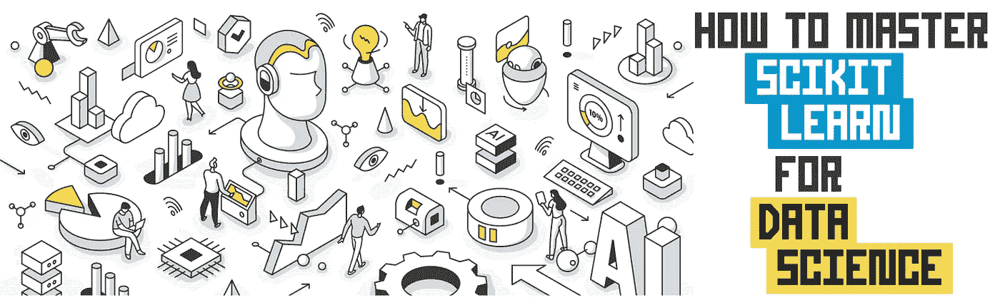

使用 [koctia](https://elements.envato.com/user/koctia) 从 [envato elements](https://1.envato.market/c/2346717/628379/4662) 中创建的图像(经许可)。

## [入门](https://towardsdatascience.com/tagged/getting-started)

## 以下是数据科学所需的基本知识

`Scikit-learn`是许多专门研究机器学习的 scikits(即 SciPy 工具包的简称)之一。一个 scikit 代表一个过于专门化而不能包含在`SciPy`中的包，因此被打包成许多 sci kit 中的一个。另一个流行的 scikit 是`scikit-image` ( *即*图像处理算法集)。

`[Scikit-learn](https://scikit-learn.org/stable/)`是 Python 中机器学习的支柱之一，因为它允许您构建机器学习模型，并为数据准备、模型后分析和评估提供实用函数。

在本文中，我们将探索掌握数据科学入门的`scikit-learn`所需的最基本的知识。我尽最大努力通过使用关键概念的手绘插图以及您可以在自己的项目中使用的代码片段来提取 scikit-learn 库的精髓。

让我们开始吧！

# 1.scikit-learn 中的数据表示

让我们从基础开始，考虑一下`scikit-learn`中使用的数据表示，它本质上是一个表格数据集。

在高层次上，对于**监督学习**问题，表格数据集将由`X`和`y`变量组成，而**非监督学习**问题将仅由`X`变量组成。

在高层次上，`X`变量也称为自变量，它们可以是感兴趣样本的定量或定性描述，而`y`变量也称为因变量，它们本质上是构建预测模型进行预测的目标或响应变量。

下图是在`scikit-learn`中使用的典型表格数据的动画说明。

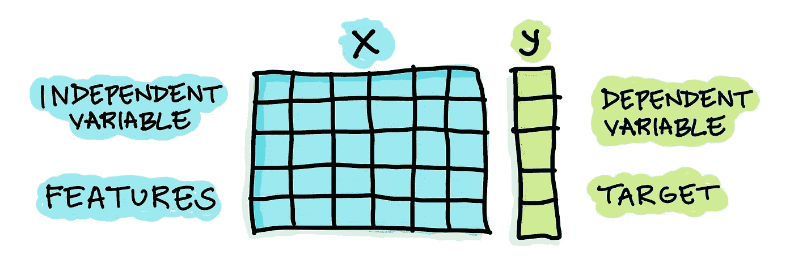

scikit-learn 中使用的表格数据。由作者绘制。

例如，如果我们建立一个预测模型来预测个人是否患有疾病，疾病/非疾病状态是`y`变量，而通过临床测试结果获得的健康指标被用作`X`变量。

# 2.通过 Pandas 从 CSV 文件加载数据

实际上，数据集的内容可以存储在 CSV 文件中，并且可以通过`pd.read_csv()`函数使用`Pandas`库读取。因此，加载数据的数据结构被称为熊猫数据帧。

让我们来看看实际情况。

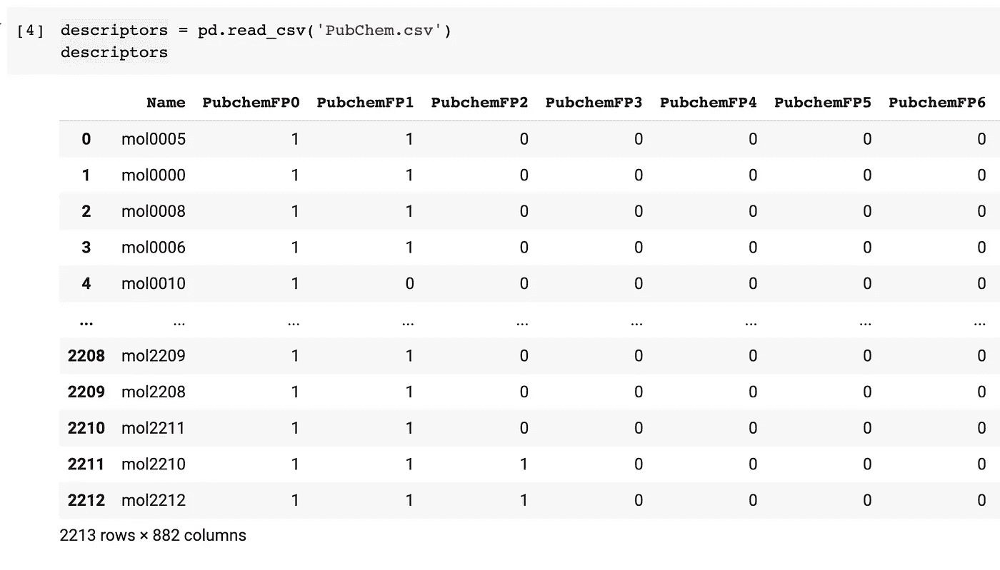

如何读入 CSV 数据的截图。

之后，可使用各种 Pandas 函数对数据帧进行数据处理，用于处理缺失数据(*即*删除缺失数据或用估算值填充缺失数据)、选择特定列或列范围、执行特征转换、数据的条件过滤等。

在下面的例子中，我们将数据帧分离为`X`和`y`变量，它们将很快用于模型构建。

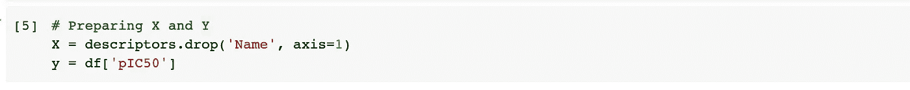

执行数据拆分的屏幕截图。

这产生了以下`X`数据矩阵:

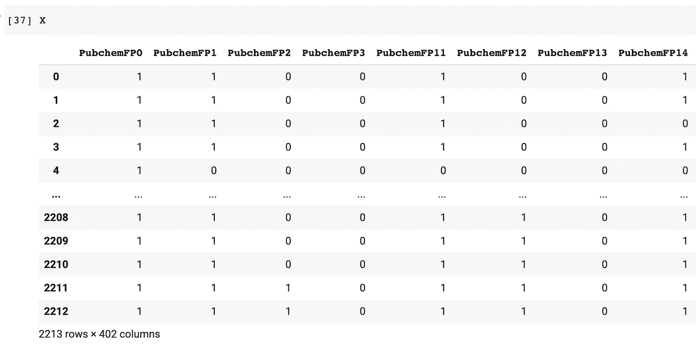

X 数据矩阵的屏幕截图。

和下面的`y` 变量:

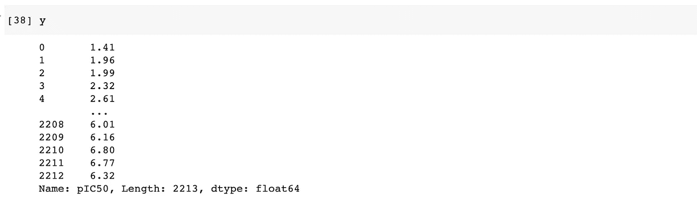

y 变量的屏幕截图。

对于如何掌握数据科学的熊猫的高层次概述，也可以查看我以前写的博客帖子。

[](/how-to-master-pandas-for-data-science-b8ab0a9b1042) [## 如何掌握熊猫进行数据科学

### 这是数据科学需要的基本熊猫

towardsdatascience.com](/how-to-master-pandas-for-data-science-b8ab0a9b1042) 

# 3.scikit-learn 中的实用函数

除了机器学习能力之外，`scikit-learn`的一大优点是它的效用函数。

## 3.1.创建人工数据集

例如，你可以*使用`scikit-learn`创建人工数据集*(如下所示)，这些数据集可以用来尝试你可能已经设计的不同的机器学习工作流程。

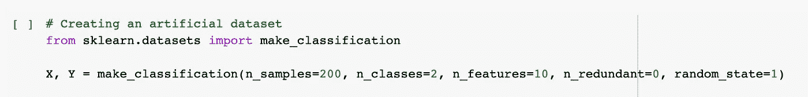

用于创建人工数据集的代码片段的屏幕截图。

## 3.2.特征缩放

由于特征可能是具有几个量级差异的异质尺度，因此执行特征缩放是必要的。

常见的方法包括归一化(将要素缩放到 0 和 1 的统一范围)和标准化(缩放要素，使其具有居中的平均值和单位方差，即所有 X 要素的平均值为 0，标准差为 1)。

在`scikit-learn`中，可以使用`normalize()`功能执行标准化，同时可以通过`StandardScaler()`功能执行标准化。

## 3.3.特征选择

我喜欢使用的一种常见特征选择方法是简单地丢弃具有低方差的特征，因为它们提供最小的信号(如果我们从信号和噪声的角度来考虑)。

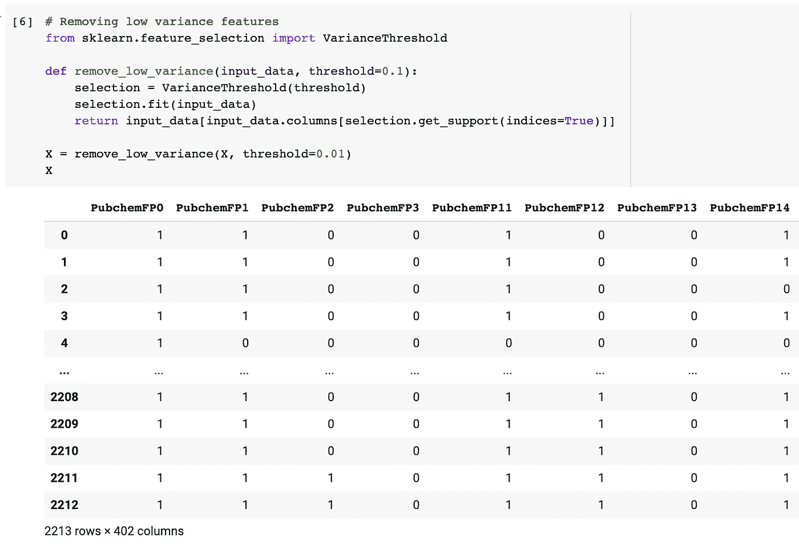

用于移除低方差特征的代码片段的屏幕截图。

## 3.4.特征工程

通常情况下，所提供的特征可能不容易适合于模型构建。例如，分类特征要求我们将这些特征编码成与`scikit-learn`中的机器学习算法兼容的形式(即从字符串到整数或二进制数字形式)。

两种常见的分类特征包括:

1.  ***名义特征*** —特征的分类值没有逻辑顺序，彼此独立。例如，洛杉矶、尔湾和曼谷等城市的分类值是名义值。
2.  ***序数特征*** —特征的类别值具有逻辑顺序，并且相互关联。例如，遵循诸如低、中、高等标度的分类值具有逻辑顺序和关系，使得低<中<高。

这种特征编码可以使用本地 Python(数字映射)、Pandas ( `get_dummies()`函数和`map()`方法)以及从`scikit-learn` ( `OneHotEncoder()`、`OrdinalEncoder()`、`LabelBinarizer()`、`LabelEncoder()`等内部执行。).

## 3.5.输入缺失数据

`Scikit-learn`还支持缺失值的插补，这是构建机器学习模型之前数据预处理的重要部分。用户可以通过`sklearn.impute`子模块的`SimpleImputer()`和`IterativeImputer()`功能使用单变量或多变量插补方法。

## 3.6.数据分割

一个常用的功能必须是数据分离，为此我们可以将给定的输入`X`和`y`变量分离为训练和测试子集(`X_train`、`y_train`、`X_test`和`y_test`)。

下面的代码片段利用`train_test_split()`来执行数据分割，其中它的输入参数是输入变量`X`和`y`，测试集的大小设置为 0.2(或 20%)，随机种子数设置为 42(这样，如果代码块运行多次，将产生相同的数据分割)。

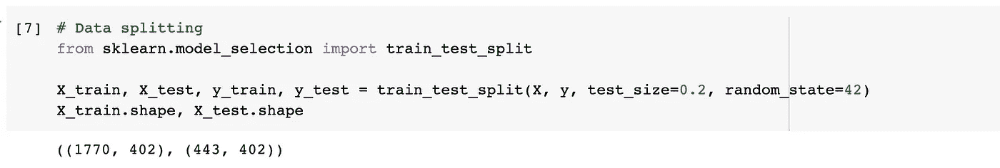

用于执行数据拆分的代码片段的屏幕截图。

## 3.7.使用管道创建工作流

顾名思义，我们可以利用`Pipeline()`函数来创建一个任务链或序列，这些任务链或序列涉及到机器学习模型的构建。例如，这可以是由特征插补、特征编码和模型训练组成的序列。

我们可以将管道视为一组模块化乐高积木的使用，用于构建机器学习工作流。

有关使用 scikit-learn 构建自己的机器学习管道的更多信息，来自 Machine Learning Mastery 的 Jason Brownlee 在以下教程中提供了详细的说明:

[](https://machinelearningmastery.com/modeling-pipeline-optimization-with-scikit-learn/) [## 通过 scikit-learn - Machine 学习掌握对管道优化建模

### 本教程介绍了数据科学和自动化学习中的两个基本概念。一个是机器学习…

machinelearningmastery.com](https://machinelearningmastery.com/modeling-pipeline-optimization-with-scikit-learn/) 

# 4.使用`scikit-learn`的高级概述

## 4.1.构建和评估模型的核心步骤

简而言之，如果我能在`scikit-learn`中总结使用学习算法的核心本质，它将由以下 5 个步骤组成:

```
from sklearn.modulename import EstimatorName      # 0\. Import
model = EstimatorName()                           # 1\. Instantiate
model.fit(X_train, y_train)                       # 2\. Fit
model.predict(X_test)                             # 3\. Predict
model.score(X_test, y_test)                       # 4\. Score
```

通过使用随机森林算法作为示例，将上述伪代码转换为实际模型(*例如*分类模型)的构造将产生以下代码块:

```
from sklearn.ensemble import RandomForestClassifier
rf = RandomForestClassifier(max_features=5, n_estimators=100)
rf.fit(X_train, y_train)
rf.predict(X_test)
rf.score(X_test, y_test)
```

下图显示了在`scikit-learn`中使用估算器(*即*学习算法功能)的核心基本步骤。

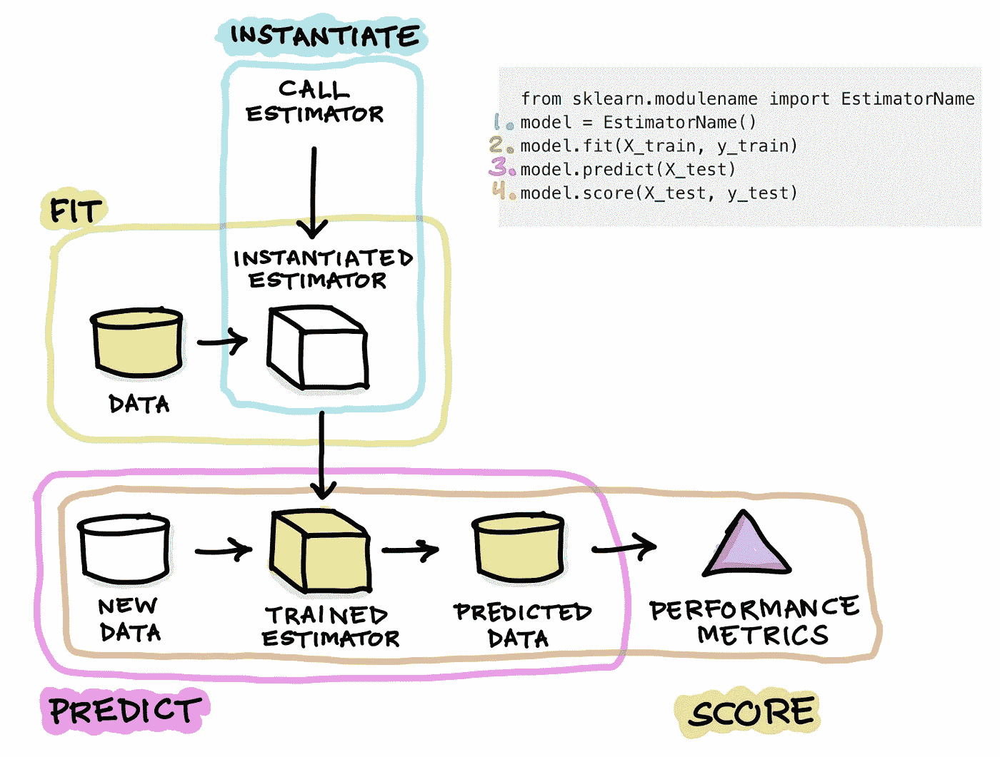

卡通插图总结了模型建立的评估者的创造，训练和应用。由作者绘制。

**步骤 0。**从`scikit-learn`的一个模块中导入估算函数。一个*估计器*用于参考学习算法，例如`RandomForestClassifier`，该学习算法用于在给定输入`X`值的情况下**估计**输出`y`值。

简而言之，这可以通过等式`y = f(X)`得到最好的总结，其中`y`可以通过已知的`X`值进行估计。

**步骤 1。**实例化估计器或模型。这是通过调用估计函数并简单地将它赋给一个变量来实现的。具体来说，我们可以将这个变量命名为`model`、`clf`或`rf` ( *即*所用学习算法的缩写，随机森林)。

实例化的模型可以被认为是一个没有来自数据的训练知识的空盒子，因为还没有发生训练。

**第二步。**现在将允许实例化的模型在被称为**模型构建**或**模型训练**的过程中从训练数据集学习。

训练是通过使用`fit()`函数启动的，其中训练数据被指定为`rf.fit(X_train)`中的`fit()`函数的输入参数，字面意思是允许实例化的`rf`估计器从`X_train`数据中学习。计算完成后，模型现在在训练集上进行训练。

**步骤三。**现在，通过使用`predict()`函数，训练好的模型将被应用于对新的和未知的数据(例如`X_test`)进行预测。

结果，生成预测的 y 值(`y_test`)(并且可以存储到变量中，例如`y_test_pred`，该变量稍后可以用于计算模型性能)。

**步骤四。**现在可以计算模型性能了。最简单快捷的方法是使用`model.score(X_test, y_test)`中的`score()`功能。

如果该函数用于分类模型，则`score()`函数产生精度值，而如果是回归模型，则`score()`函数计算 R2 值。

为了完整起见，我们可以扩展这个核心工作流，使其包含其他额外的步骤，进一步提高构建模型的健壮性和可用性。

我将在接下来的章节中分别讨论这些额外的步骤。

## 4.2.模型解释

一个模型只有在能够从中提取洞察力以推动决策过程时才有用。

在上面建立的随机森林模型的延续中，存储在实例化的`rf`模型中的重要特征可以提取如下:

```
# Model interpretationrf.feature_importances_
```

上述代码将为模型构建中使用的要素生成以下一组重要值:

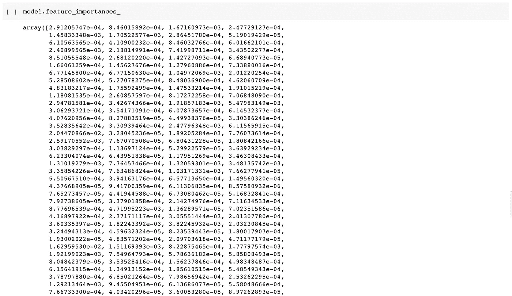

然后，我们可以通过将表示与特征名称结合起来整理表示，以产生一个清晰的数据帧，如下所示:

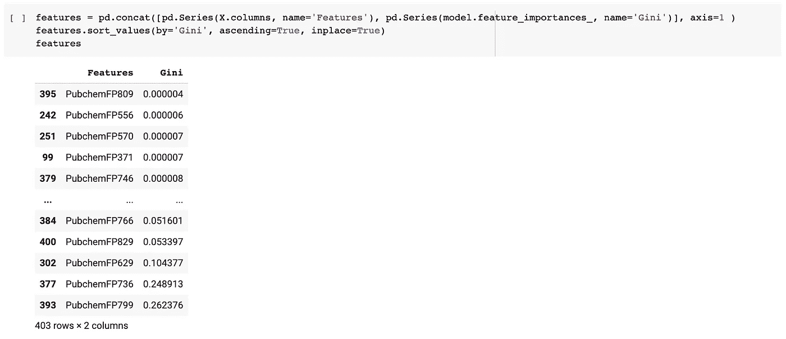

最后，可以使用这些值创建如下所示的要素重要性图:

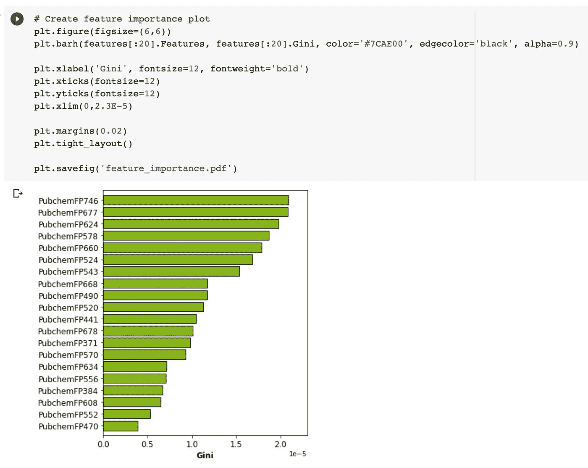

简而言之，顾名思义，要素重要性图提供了通过重要性值判断的要素的相对重要性，例如从随机森林模型产生的基尼系数中获得的重要性值。

## 4.3.超参数调谐

通常，在构建前几个模型时，我会使用默认的超参数。在最初的几次尝试中，目标是确保整个工作流同步工作，不会出现错误。

我的机器学习算法是随机森林，我用它作为基线模型。在许多情况下，它也被选为最终的学习算法，因为它提供了稳健性能和出色的模型可解释性之间的良好混合。

一旦工作流程就绪，下一个目标就是执行超参数调整，以实现最佳性能。

虽然随机森林可能开箱即用，但通过一些超参数调整，它可以实现略高的性能。对于支持向量机等学习算法，为了获得稳健的性能，进行超参数调整是必不可少的。

现在让我们通过使用`GridSearchCV()`功能来执行超参数调整。

1.  首先，我们将创建一个人工数据集并执行数据拆分，然后这些数据将作为构建后续模型的数据。

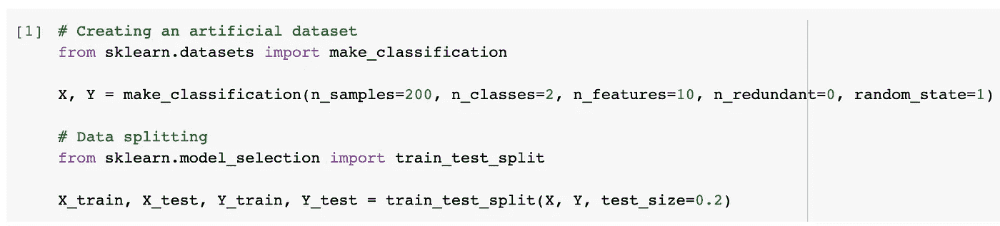

2.其次，我们现在将执行实际的超参数调整

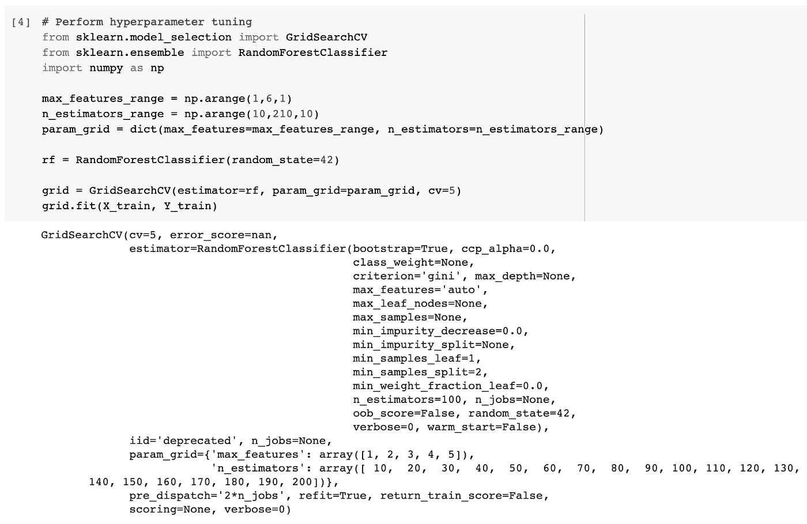

3.最后，我们可以以可视化的方式显示超参数调整的结果。

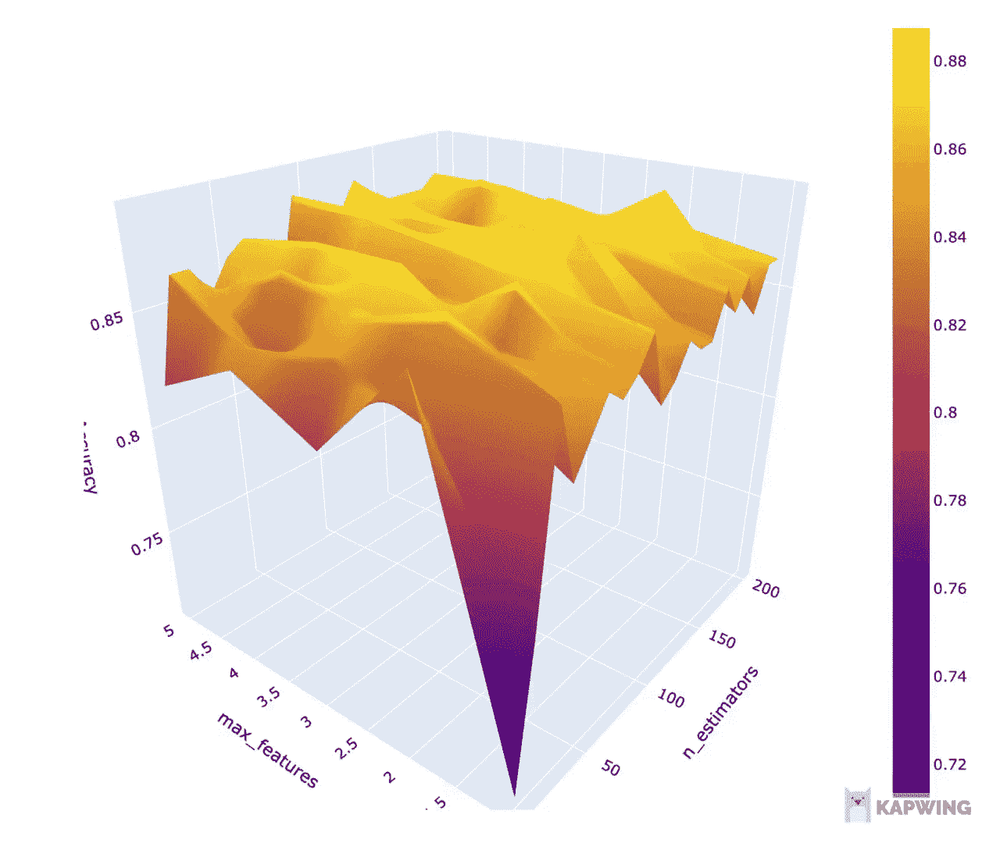

随机森林模型超参数空间的交互式 3D 等高线图。

你可以 [**下载完整的 Jupyter 笔记本**](https://github.com/dataprofessor/code/blob/027e657f961692e685aff038f73122e68dc9ad1c/python/hyperparameter_tuning.ipynb) ，上面的代码片段就是从这里摘录的。如果您喜欢视频，我还创建了一个 YouTube 视频，展示如何使用 scikit-learn 执行超参数调优。

Python 中机器学习模型的超参数调优@ [数据教授 YouTube 频道](https://www.youtube.com/channel/UCV8e2g4IWQqK71bbzGDEI4Q)

# **5。机器学习工作流程示例**

在这一节中，我将提供一个示例工作流，您可以将它作为一个通用指南，并将其应用到您自己的项目中。请随意试验和调整这里提到的程序。

可使用`Pandas`执行前 6 个步骤，而使用`scikit-learn`、`Pandas`(在数据帧中显示结果)和`matplotlib`(显示模型性能图或特性重要性图)执行后续步骤。

1.  以 Pandas DataFrame 的形式读入数据，并显示第一行和最后几行。
2.  显示数据集维度(行数和列数)。
3.  显示列的数据类型，并总结有多少列是分类数据类型和数字数据类型。
4.  处理丢失的数据。首先检查是否有缺失数据。如果有，决定是丢弃缺失的数据还是填充缺失的数据。此外，准备好提供一个理由来证明你的决定。
5.  执行探索性数据分析。将`Pandas` *groupby* 函数(针对分类变量)与 *aggregate* 函数一起使用，并创建图表来探索数据。
6.  将自变量分配给`X`变量，将因变量分配给`y`变量
7.  执行数据拆分(使用`scikit-learn`)以使用 80/20 拆分比将其分离为训练集和测试集(记得设置随机种子数)。
8.  使用训练集建立一个使用随机森林算法的机器学习模型(使用`scikit-learn`)。
9.  通过使用`GridSearchCV()`功能，执行超参数调整和交叉验证。
10.  通过`predict()`功能，应用训练好的模型对测试集进行预测。
11.  借助`Pandas`将获得的[模型性能指标](https://scikit-learn.org/stable/modules/model_evaluation.html#model-evaluation)解释为汇总表(我喜欢将合并后的模型性能显示为数据帧)或借助`matplotlib`以可视化方式显示。
12.  解释随机森林模型确定的[重要特征](https://scikit-learn.org/stable/auto_examples/ensemble/plot_forest_importances.html)。

# 6.S 的资源`cikit-learn`

所有有抱负的数据科学从业者通常会发现有必要偶尔浏览一下 API 文档甚至备忘单，以快速找到精确的函数或`scikit-learn`中无数可用函数的输入参数。

因此，本节提供了一些惊人的资源、备忘单和书籍，可能会对您的数据科学项目有所帮助。

## 6.1.证明文件

对，没错！最好的资源之一就是`scikit-learn`网站上提供的 [*API 文档*](https://scikit-learn.org/stable/modules/classes.html)[*用户指南*](https://scikit-learn.org/stable/user_guide.html) 和 [*示例*](https://scikit-learn.org/stable/auto_examples/index.html) 。

我发现跳到 [*API 文档*](https://scikit-learn.org/stable/modules/classes.html) 上获得关于可用的输入参数和每个参数的作用的详细描述是非常有用和快捷的。 [*示例*](https://scikit-learn.org/stable/auto_examples/index.html) 和 [*用户指南*](https://scikit-learn.org/stable/user_guide.html) 也有助于为我们自己的数据科学项目提供思路和灵感。

## 6.2.备忘单

## sci kit-学习

一个非常方便的备忘单是由`scikit-learn`提供的，通过回答几个关于你的数据的问题来帮助选择合适的机器学习算法。

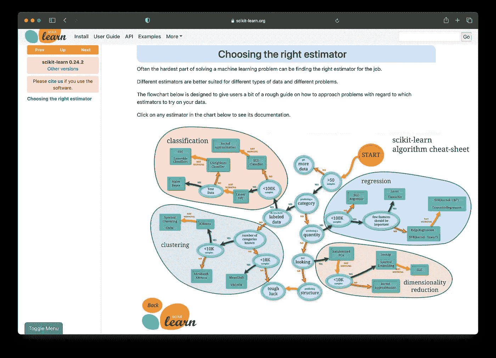

Scikit-learn 备忘单[选择正确的评估工具](https://scikit-learn.org/stable/tutorial/machine_learning_map/index.html)的屏幕截图。

需要注意的是，上图是 scikit-learn 算法备忘单的预览。要充分利用此备忘单(您可以单击算法查看感兴趣的算法的基础文档)，请转到下面的链接进入备忘单:

[](https://scikit-learn.org/stable/tutorial/machine_learning_map/index.html) [## 选择正确的评估工具-sci kit-了解 0.24.2 文档

### 通常，解决机器学习问题最困难的部分是找到合适的评估者。不同的…

scikit-learn.org](https://scikit-learn.org/stable/tutorial/machine_learning_map/index.html) 

## 数据营

另一个有用的备忘单是来自 DataCamp 的，它提供了一个 PDF 格式的单页表格和一个 HTML 版本。

这个备忘单的伟大之处在于它提供了可以由`scikit-learn`执行的各种机器学习任务的代码片段。

下面提供了备忘单的预览:

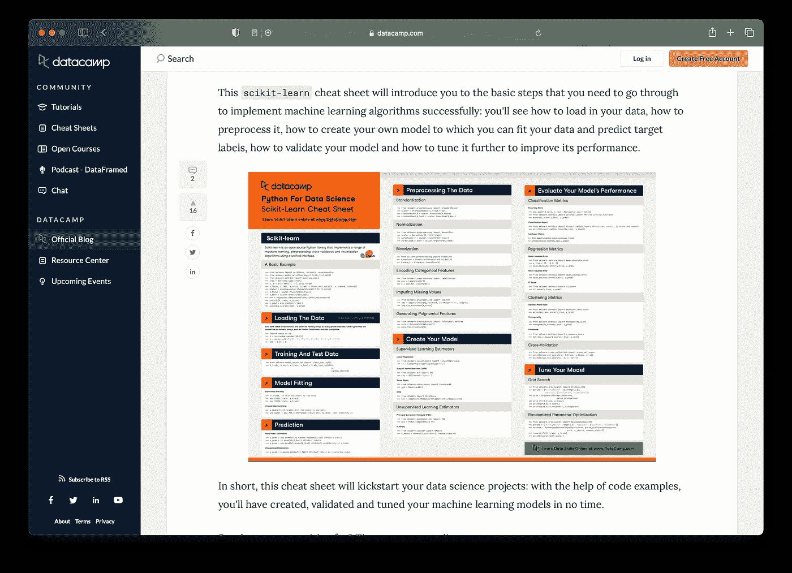

来自 DataCamp 的 [Scikit-learn cheat sheet](https://www.datacamp.com/community/blog/scikit-learn-cheat-sheet) 的截图。

以下链接提供了 PDF 和 HTML 版本的备忘单:

[https://www . data camp . com/community/blog/sci kit-learn-cheat-sheet](https://www.datacamp.com/community/blog/scikit-learn-cheat-sheet)

## 6.3.书

没有什么比你办公桌上的一些好书更好的了，你可以偶尔阅读或浏览一下，为你的项目寻找想法和灵感。有时，我会从书中提供的例子中找到一种处理事情的新方法。

这里有一些关于`scikit-learn`用法的好书，我个人也有，而且觉得非常有用。

[](https://amzn.to/3xOmM1A) [## 使用 Scikit-Learn、Keras 和 TensorFlow 进行机器实践学习:概念、工具和技术…

### 用 Scikit-Learn、Keras 和 TensorFlow 进行机器学习:概念、工具和技术来构建…

amzn.to](https://amzn.to/3xOmM1A) 

Aurélien Géron 的《机器学习实践》是经典书籍之一，它很好地涵盖了用 Python 实现机器学习和深度学习模型的概念和实践方面。还有一个附录部分提供了一些关于如何建立机器学习项目的实用建议，这些建议可能对有抱负的数据科学家也有帮助。

在这个[链接](https://github.com/ageron/handson-ml2)中，作者还分享了 GitHub 上的书中提到的代码的 Jupyter 笔记本。

[](https://amzn.to/2VVxkit) [## Python 数据科学手册:处理数据的基本工具

### Python 数据科学手册:处理 Amazon.com 数据的基本工具。

amzn.to](https://amzn.to/2VVxkit) 

Jake VanderPlas 的《Python 数据科学手册》也是一本很棒的书，它涵盖了一些用于实现数据科学项目的重要库。特别是，本书涵盖了如何使用 Jupyter 笔记本、`NumPy`、`Pandas`、`Matplotlib`和`Scikit-learn`。

这本书的免费在线版本也可以在[这里](https://jakevdp.github.io/PythonDataScienceHandbook/)获得。另一个亮点是书中提到的 Jupyter 笔记本，它在 GitHub [这里](https://github.com/jakevdp/PythonDataScienceHandbook)提供。

# 结论

祝贺您到达本文的结尾，这也标志着用`scikit-learn`探索数据科学的无数可能性的开始。

我希望这篇文章对您的数据科学之旅有所帮助，如果我在`scikit-learn`中遗漏了对您的数据科学之旅有帮助的任何方法或资源，请不吝赐教。

# 公开

*   作为一名亚马逊员工，我可能会从合格购买中获利，这将有助于未来内容的创作。

# 接下来读这些

*   [**数据科学如何掌握 Python**](/how-to-master-python-for-data-science-1fb8353718bf)
    *下面是数据科学需要的必备 Python*
*   [**如何掌握数据科学的熊猫**](/how-to-master-pandas-for-data-science-b8ab0a9b1042)
    *下面是数据科学需要的必备熊猫*
*   [**如何用 Python 构建 AutoML App**](/how-to-build-an-automl-app-in-python-e216763d10cd)
    *使用 Streamlit 库的分步教程*
*   [**学习数据科学的策略**](/strategies-for-learning-data-science-47053b58c19f)
    *打入数据科学的实用建议*
*   [**如何免费搭建一个简单的作品集网站**](/how-to-build-a-simple-portfolio-website-for-free-f49327675fd9)
    *不到 10 分钟从零开始的分步教程*

## ✉️ [订阅我的邮件列表，获取我在数据科学方面的最佳更新(偶尔还有免费赠品)!](http://newsletter.dataprofessor.org/)

# 关于我

我是泰国一所研究型大学的生物信息学副教授和数据挖掘和生物医学信息学负责人。在我下班后的时间里，我是一名 YouTuber(又名[数据教授](http://bit.ly/dataprofessor/))制作关于数据科学的在线视频。在我做的所有教程视频里，我也分享 GitHub 上的 Jupyter 笔记本([数据教授 GitHub page](https://github.com/dataprofessor/) )。

[](https://www.youtube.com/dataprofessor) [## 数据教授

### 数据科学、机器学习、生物信息学、研究和教学是我的激情所在。数据教授 YouTube…

www.youtube.com](https://www.youtube.com/dataprofessor) 

# 在社交网络上与我联系

YouTube:[【http://YouTube . com/data proper/](http://youtube.com/dataprofessor/)
网站:[【http://data proper . org/](https://www.youtube.com/redirect?redir_token=w4MajL6v6Oi_kOAZNbMprRRJrvJ8MTU5MjI5NjQzN0AxNTkyMjEwMDM3&q=http%3A%2F%2Fdataprofessor.org%2F&event=video_description&v=ZZ4B0QUHuNc)【正在建设】
LinkedIn:[【https://www . LinkedIn . com/company/data proper/](https://www.linkedin.com/company/dataprofessor/)